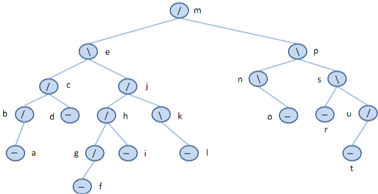

# AVL Δέντρα

- Θα παρουσιάσουμε τώρα τα **AVL δέντρα**, τα οποία έχουν την ιδιότητα να είναι *σχεδόν ισορροπημένα*, αλλά όχι πλήρως.  
- Αυτή η δομή εξασφαλίζει **χρονική πολυπλοκότητα 𝑂(log 𝑛)** για τις αναζητήσεις, καθώς και **𝑂(log 𝑛)** για εισαγωγές και διαγραφές στη χειρότερη περίπτωση.  
- Τα AVL δέντρα πήραν το όνομά τους από τους Ρώσους μαθηματικούς **Adelson-Velskii** και **Landis**.

---

## Ορισμοί - Υπενθύμιση

- Το **ύψος** ενός δυαδικού δέντρου αναζήτησης ορίζεται ως το μήκος της **μεγαλύτερης διαδρομής** από τη ρίζα έως κάποιο φύλλο.  
- Ένα δέντρο με μόνο έναν κόμβο έχει ύψος **0**.  
- Το ύψος του **κενoύ δέντρου** ορίζεται ως **−1**.

---

## Ορισμοί – AVL Δέντρα

- Αν ο `Ν` είναι ένας κόμβος σε ένα δυαδικό δέντρο αναζήτησης `Τ`, τότε λέμε ότι ο `Ν` ικανοποιεί την **ιδιότητα AVL** εφόσον τα ύψη των **αριστερού** και **δεξιού** υποδέντρων του διαφέρουν κατά **το πολύ 1**.
- Η ιδιότητα αυτή αναφέρεται επίσης και ως **ιδιότητα ισορροπίας ύψους** από ορισμένους συγγραφείς.
- Ένα **AVL δέντρο** είναι ένα δυαδικό δέντρο αναζήτησης στο οποίο **κάθε κόμβος** πληροί την ιδιότητα AVL.

---

Παραδείγματα δένδρων AVL


## Γεγονός

- Είναι εύκολο να δει κανείς ότι όλα τα **υποδέντρα** ενός AVL δέντρου είναι επίσης **AVL δέντρα**.

## Ποιοι κόμβοι παραβιάζουν την ιδιότητα AVL;

- Ποιοι είναι οι κόμβοι που **παραβιάζουν την ιδιότητα ισορροπίας ύψους** σε ένα AVL δέντρο;


## Επεκταμένα AVL Δέντρα

- Αν θεωρήσουμε τα δέντρα στην **επεκταμένη τους μορφή**, τότε αρκεί η **ιδιότητα AVL** να ισχύει μόνο για τους **εσωτερικούς κόμβους**, καθώς ισχύει προφανώς για τους **εξωτερικούς**.

- Στους αλγορίθμους **εισαγωγής** και **διαγραφής** που ακολουθούν, τα δέντρα **δεν θα παρουσιαστούν** στην επεκταμένη μορφή τους.  
  Είναι εύκολο να **τροποποιηθούν οι αλγόριθμοι** ώστε να ισχύουν και σε αυτή την περίπτωση.


## Ύψος AVL Δέντρων & Απόδειξη

Σε κάθε κόμβο, εμφανίζουμε επίσης το **ύψος** του υποδέντρου που ριζώνει σε αυτόν τον κόμβο.

---

### Πρόταση

- Το **ύψος** ενός AVL δέντρου που αποθηκεύει 𝑛 κλειδιά είναι **𝑂(log 𝑛)**.
- Με άλλα λόγια, η ιδιότητα AVL έχει ως σημαντική συνέπεια τη **διατήρηση μικρού ύψους** στο δέντρο.

---

### Απόδειξη

- Στην απόδειξη αυτή, θεωρούμε ότι το δέντρο είναι στην **επεκταμένη μορφή** του.
- Αντί να βρούμε άμεσα **άνω φράγμα** για το ύψος ενός AVL δέντρου, θα βρούμε **κάτω φράγμα** για τον **ελάχιστο αριθμό εσωτερικών κόμβων**, 𝑛(ℎ), σε AVL δέντρο με ύψος ℎ.
- Από αυτό, μπορούμε εύκολα να εξάγουμε το επιθυμητό αποτέλεσμα.

#### Βασικές Περιπτώσεις:

- Για 𝒉 = 1 → 𝒏(𝟏) = 1, επειδή ένα AVL δέντρο ύψους 1 πρέπει να έχει τουλάχιστον έναν εσωτερικό κόμβο.
- Για 𝒉 = 2 → 𝒏(𝟐) = 2, γιατί πρέπει να έχει τουλάχιστον δύο εσωτερικούς κόμβους.

---

- Ένα AVL δέντρο ύψους ℎ ≥ 3 με τον **ελάχιστο** αριθμό εσωτερικών κόμβων έχει τα υποδέντρα του επίσης ως AVL δέντρα με τον ελάχιστο αριθμό εσωτερικών κόμβων:
  - Ένα υποδέντρο με ύψος ℎ − 1
  - Ένα υποδέντρο με ύψος ℎ − 2
- Συμπεριλαμβάνοντας και τη ρίζα, παίρνουμε τον εξής τύπο:

𝒏(ℎ) = 1 + 𝒏(ℎ − 1) + 𝒏(ℎ − 2)

---


- Ο παραπάνω τύπος συνεπάγεται ότι το 𝒏(ℎ) είναι **αυστηρά αύξουσα** συνάρτηση του ℎ.
- Άρα ισχύει:  
𝒏(ℎ − 1) > 𝒏(ℎ − 2)

- Αντικαθιστώντας το 𝒏(ℎ − 1) με το 𝒏(ℎ − 2) στον αρχικό τύπο και παραλείποντας το 1, παίρνουμε ότι για ℎ ≥ 3:

𝒏(ℎ) > 2 × 𝒏(ℎ − 2)


---

- Ο προηγούμενος τύπος δείχνει ότι το 𝒏(ℎ) **διπλασιάζεται** τουλάχιστον κάθε φορά που το ℎ αυξάνεται κατά 2.
- Αυτό υποδηλώνει ότι η 𝒏(ℎ) **αυξάνεται εκθετικά**.

- Για να το δείξουμε αυτό πιο επίσημα, εφαρμόζουμε επανειλημμένα την παραπάνω ανισότητα, προκύπτοντας:

𝒏(ℎ) > 2 × 𝒏(ℎ − 2) > 4 × 𝒏(ℎ − 4) > 8 × 𝒏(ℎ − 6) ... > 2^i × 𝒏(ℎ − 2i)

- Δηλαδή, ισχύει: 𝒏(ℎ) > 2^𝒊 × 𝒏(ℎ − 2𝒊) 
για κάθε ακέραιο 𝑖 τέτοιο ώστε: ℎ − 2𝒊 ≥ 1

- Εφόσον γνωρίζουμε ήδη τις τιμές των 𝒏(1) και 𝒏(2), επιλέγουμε 𝒊 έτσι ώστε:

ℎ − 2𝒊 = 1 ή 2

- Δηλαδή επιλέγουμε:

𝒊 = ℎ / 2 − 1


- Αντικαθιστώντας την τιμή του 𝒊 στον προηγούμενο τύπο, παίρνουμε (για ℎ ≥ 3):


### Συμπέρασμα της Απόδειξης

- Λαμβάνοντας λογαρίθμους και στις δύο πλευρές της ανισότητας:

𝒏(ℎ) > 2^(ℎ / 2 − 1)

- Παίρνουμε:

log 𝒏(ℎ) > ℎ / 2 − 1

- Το οποίο ισοδυναμεί με:

ℎ < 2 × log 𝒏(ℎ) + 2

- Αυτό σημαίνει ότι ένα **AVL δέντρο** που αποθηκεύει **𝑛 κλειδιά** έχει **ύψος το πολύ**:

2 × log 𝑛 + 2
## Ορισμοί

- Θα λέμε ότι ένας κόμβος ενός AVL δέντρου είναι **αριστερά-υψηλότερος** αν το ύψος του αριστερού του υποδέντρου είναι 1 μονάδα μεγαλύτερο από το ύψος του δεξιού του υποδέντρου.
- Θα λέμε ότι ένας κόμβος ενός AVL δέντρου είναι **δεξιά-υψηλότερος** αν το ύψος του δεξιού του υποδέντρου είναι 1 μονάδα μεγαλύτερο από το ύψος του αριστερού του υποδέντρου.

---

## Συμβολισμός

- Στην απεικόνιση των δέντρων, θα δείχνουμε έναν **αριστερά-υψηλότερο** κόμβο με το σύμβολο **"/"**, έναν κόμβο του οποίου ο **παράγοντας ισοζύγισης** είναι μηδέν με το σύμβολο **"−"**, και έναν **δεξιά-υψηλότερο** κόμβο με το σύμβολο **"\"**.
  
- Θα χρησιμοποιούμε τη συμβολολογία **"//"** ή **"\\"** για τους κόμβους που δεν πληρούν την ιδιότητα AVL και έχουν μεγαλύτερες διαδρομές αριστερά ή δεξιά αντίστοιχα.

---
AVL TREE


NON AVL TREE


## Παρακολούθηση Παραγόντων Ισοζύγισης

- Προσθέτοντας ένα νέο μέλος σε κάθε κόμβο ενός AVL δέντρου, μπορούμε να παρακολουθούμε αν τα αριστερά και δεξιά υποδέντρα έχουν το ίδιο ύψος, ή αν το ένα είναι υψηλότερο από το άλλο.

```c
typedef enum { LeftHigh, Equal, RightHigh } BalanceFactor;
typedef struct AVLTreeNodeTag {
    BalanceFactor BF;
    KeyType Key;
    struct AVLTreeNodeTag *LLink;
    struct AVLTreeNodeTag *RLink;
} AVLTreeNode;
```

## Παρακολούθηση Παραγόντων Ισοζύγισης: Εναλλακτική Προσέγγιση

- Μια εναλλακτική προσέγγιση για την παρακολούθηση των παραγόντων ισοζύγισης στην υλοποίηση των AVL δέντρων είναι να κρατάμε το ύψος κάθε κόμβου στη δομή που αντιπροσωπεύει τον κόμβο.

---

## Επανακαθορισμός (Rebalancing) σε AVL Δέντρο

- Στους αλγόριθμους εισαγωγής και διαγραφής για τα AVL δέντρα που θα παρουσιάσουμε, είναι πιθανό ότι η ιδιότητα AVL να χαθεί σε κάποιο σημείο.
- Σε αυτή την περίπτωση, εφαρμόζουμε στο δέντρο κάποιες μετασχηματισμούς μορφής για να αποκαταστήσουμε την ιδιότητα AVL. Αυτοί οι μετασχηματισμοί είναι οι περιστροφές που έχουμε εισάγει στην προηγούμενη διάλεξη.

---

## Εισαγωγή σε AVL Δέντρο

- Αν ένας κόμβος N είναι "−" και εισάγουμε έναν νέο κόμβο στο αριστερό ή δεξιό του υποδέντρο, τότε η ιδιότητα του AVL δέντρου στον κόμβο N δεν χάνεται και ο N γίνεται “/” ή “\” αντίστοιχα.
- Αν ένας κόμβος Ν είναι “/” και εισάγουμε έναν κόμβο στο δεξιό του υποδέντρο (δηλαδή, στο πιο κοντό υποδέντρο του), τότε η ιδιότητα του AVL δέντρου στον κόμβο N δεν χάνεται και ο N γίνεται “−”.
- Αν ένας κόμβος Ν είναι “\” και εισάγουμε έναν κόμβο στο αριστερό του υποδέντρο (δηλαδή, στο πιο κοντό υποδέντρο του), τότε η ιδιότητα του AVL δέντρου στον κόμβο N δεν χάνεται και ο N γίνεται “−”.

---

- Ας εξετάσουμε την περίπτωση όταν εισάγουμε έναν νέο κόμβο στο πιο υψηλό υποδέντρο ενός κόμβου και το ύψος του αυξάνεται, έτσι ώστε τώρα το ένα υποδέντρο να έχει ύψος 2 περισσότερες μονάδες από το άλλο και ο κόμβος να μην ικανοποιεί πλέον την ιδιότητα AVL.
- Ας υποθέσουμε ότι εισάγουμε τον νέο κόμβο στο δεξιό υποδέντρο του κόμβου r, το ύψος του αυξάνεται και ο r ήταν προηγουμένως δεξιά-υψηλότερος (οπότε τώρα θα γίνει “\\”).
- Άρα, ο r είναι ο κόμβος όπου η ιδιότητα AVL χάθηκε και ας θεωρήσουμε ότι το x είναι η ρίζα του δεξιού υποδέντρου του. Τότε υπάρχουν τρεις περιπτώσεις να εξετάσουμε, ανάλογα με τον παράγοντα ισοζύγισης του x.

---
## Περίπτωση 1: Το x είναι δεξιά-υψηλότερο

- Επομένως, ο νέος κόμβος εισήχθη στο δεξιό υποδέντρο του x. Στη συνέχεια, μπορούμε να κάνουμε μία περιστροφή αριστερά που αποκαθιστά την ιδιότητα AVL, όπως φαίνεται στην επόμενη διαφάνεια.
  
- Έχουμε περιστραφεί τον κόμβο x προς τα πάνω στην ρίζα, κατεβάζοντας τον r στο αριστερό υποδέντρο του x. Το υποδέντρο T2 των κόμβων με κλειδιά μεταξύ αυτών του r και του x γίνεται τώρα το δεξιό υποδέντρο του r.
  
- Σημειώστε ότι στο πιο υψηλό υποδέντρο είχαμε ύψος h+2, έπειτα ύψος h+3 όταν εισήχθη ο νέος κόμβος, και στη συνέχεια ύψος h+2 ξανά όταν αποκαταστάθηκε η ιδιότητα AVL. Έτσι, δεν υπάρχουν περαιτέρω αυξήσεις ύψους στο δέντρο που θα μας ανάγκαζαν να εξετάσουμε άλλους κόμβους εκτός του r.

- Σημειώστε επίσης ότι ο r ήταν ο πιο κοντινός πρόγονος του εισαχθέντος κόμβου όπου χάθηκε η ιδιότητα AVL. Δεν χρειάζεται να εξετάσουμε άλλους κόμβους υψηλότερους από τον r.


### Περίπτωση 2: Το x είναι αριστερά-υψηλότερο

- Επομένως, ο νέος κόμβος εισήχθη στο αριστερό υποδέντρο του x. Σε αυτή την περίπτωση, πρέπει να κατέβουμε δύο επίπεδα μέχρι τον κόμβο w, ο οποίος είναι η ρίζα του αριστερού υποδέντρου του x. Ο w θα είναι η νέα ρίζα του τοπικού δέντρου που θα προκύψει μετά τις περιστροφές.

- Για να αποκαταστήσουμε την ιδιότητα AVL, θα πρέπει να κάνουμε:
  - μία δεξιά περιστροφή στον x (ώστε ο w να γίνει γονέας του x), και
  - μία αριστερή περιστροφή στον r (ώστε ο w να μετακινηθεί προς τα πάνω και να γίνει η νέα ρίζα του υποδέντρου).

- Αυτές τις δύο περιστροφές τις ονομάζουμε **διπλή δεξιά-αριστερή περιστροφή** στους κόμβους x και r.

- Σημειώστε ότι μετά τις περιστροφές, τα ύψη επανέρχονται στο h+2 όπως ήταν πριν την εισαγωγή, επομένως δεν χρειάζεται να εξετάσουμε άλλους κόμβους στο δέντρο.


- Σε αυτή την περίπτωση, οι νέοι παράγοντες ισοζύγισης (balance factors) των κόμβων **r** και **x** εξαρτώνται από τον παράγοντα ισοζύγισης του κόμβου **w** μετά την εισαγωγή του νέου κόμβου.
- Το διάγραμμα δείχνει ότι τα υποδέντρα του **w** έχουν ίσα ύψη, αλλά είναι πιθανό ο **w** να είναι είτε αριστερά-υψηλότερος είτε δεξιά-υψηλότερος.

- Οι αντίστοιχοι παράγοντες ισοζύγισης που προκύπτουν είναι οι εξής:


## Περίπτωση 3: Ίσα Ύψη — Αυτή η περίπτωση δεν μπορεί να συμβεί

- Θυμήσου ότι μόλις εισαγάγαμε έναν νέο κόμβο στο υποδέντρο με ρίζα τον **x**, και αυτό το υποδέντρο τώρα έχει ύψος **2 μονάδες μεγαλύτερο** από το αριστερό υποδέντρο της ρίζας **r**.
  
- Ο νέος κόμβος μπήκε είτε στο αριστερό είτε στο δεξί υποδέντρο του **x**. Άρα, η εισαγωγή του αύξησε το ύψος **μόνο ενός** υποδέντρου του **x**.
  
- Αν τα υποδέντρα του **x** είχαν ίσα ύψη **μετά** την εισαγωγή, τότε το συνολικό ύψος του υποδέντρου με ρίζα τον **x** **δεν θα είχε αλλάξει** από την εισαγωγή — κάτι που **αντιτίθεται** σε αυτό που ήδη γνωρίζουμε.
  
- Συνεπώς, αυτή η περίπτωση είναι **αδύνατη** και **δεν χρειάζεται να εξεταστεί**.

- Ας εξετάσουμε τώρα την **συμμετρική περίπτωση** σε αυτή που είδαμε μέχρι τώρα:  
  Ο κόμβος **r** ήταν **αριστερά-υψηλότερος** και εισαγάγαμε τον νέο κόμβο στο **αριστερό υποδέντρο** του **r**.

- Σε αυτή την περίπτωση, για να αποκαταστήσουμε την ιδιότητα AVL, θα χρησιμοποιήσουμε:
  - **Μία απλή δεξιά περιστροφή** (single right rotation), ή
  - **Μία διπλή αριστερά-δεξιά περιστροφή** (double left-right rotation).

> Η επιλογή του είδους περιστροφής εξαρτάται από τη σχετική ισορροπία του υποδέντρου στο οποίο έγινε η εισαγωγή.

## Απλή Δεξιά Περιστροφή στον r (Single Right Rotation at r)

- Η **απλή δεξιά περιστροφή** εφαρμόζεται όταν:
  - Ο κόμβος **r** είναι **αριστερά-υψηλότερος (LeftHigh)**, και
  - Ο νέος κόμβος έχει εισαχθεί στο **αριστερό υποδέντρο** του **αριστερού παιδιού** του **r**.

- Σε αυτή την περίπτωση, η ανισορροπία προκαλείται από υπερβολικό ύψος στο αριστερό υποδέντρο του **r**.

### Βήματα Περιστροφής:

1. Ο κόμβος **x = r.LLink** (το αριστερό παιδί του r) μετακινείται προς τα πάνω και γίνεται η νέα ρίζα του υποδέντρου.
2. Ο κόμβος **r** μετακινείται προς τα κάτω και γίνεται το **δεξί παιδί** του **x**.
3. Το δεξί υποδέντρο του **x** (T2) γίνεται το αριστερό υποδέντρο του **r**.


 

## Διπλή Αριστερά-Δεξιά Περιστροφή στους x και r (Double Left-Right Rotation at x and r)

- Η **διπλή αριστερά-δεξιά περιστροφή** χρησιμοποιείται όταν:
  - Ο κόμβος **r** είναι **αριστερά-υψηλότερος (LeftHigh)**, ΚΑΙ
  - Ο νέος κόμβος έχει εισαχθεί στο **δεξί υποδέντρο** του **αριστερού παιδιού** του **r**, δηλαδή στον **x.RLink**.

- Σε αυτή την περίπτωση, ούτε μία απλή περιστροφή δεν αρκεί για την αποκατάσταση της ισορροπίας,
  και απαιτούνται **δύο διαδοχικές περιστροφές**:

### Βήματα Περιστροφής:

1. **Αριστερή περιστροφή** στον κόμβο **x** → Ο κόμβος **w = x.RLink** μετακινείται προς τα πάνω και γίνεται πατέρας του **x**.
2. **Δεξιά περιστροφή** στον κόμβο **r** → Ο κόμβος **w** μετακινείται ξανά προς τα πάνω και γίνεται πατέρας του **r**.

### Οπτική Αναπαράσταση:


## Οι Περιστροφές Είναι Τοπικές (Rotations are Local)

- Οι **περιστροφές** πραγματοποιούνται **μόνο** όταν έχει αυξηθεί το ύψος ενός υποδέντρου.
- Μετά την εκτέλεση της περιστροφής (είτε απλής είτε διπλής), η **αύξηση του ύψους εξουδετερώνεται**.
- Κατά συνέπεια, **δεν απαιτούνται επιπλέον περιστροφές** ή αλλαγές στους παράγοντες ισορροπίας (balance factors) σε ανώτερα επίπεδα του δέντρου.

### Συμπέρασμα:

- Η **ιδιότητα AVL αποκαθίσταται** πλήρως με **μία μόνο περιστροφή** (μονή ή διπλή).
- Οι περιστροφές είναι **τοπικές**, δηλαδή επηρεάζουν μόνο **ένα μικρό υποδέντρο** και **όχι ολόκληρο το AVL δέντρο**.

## Παράδειγμα: Κατασκευή ενός AVL Δέντρου

Ας δούμε πώς χτίζεται ένα AVL δέντρο βήμα προς βήμα, με εισαγωγές κλειδιών που προκαλούν περιστροφές για τη διατήρηση της ισορροπίας.


Παραβίαση της Ιδιότητας AVL στον Κόμβο ORY

## Μονή Δεξιά Περιστροφή στον Κόμβο ORY


## Διαγραφή Κόμβου από το AVL Δέντρο

Η διαδικασία διαγραφής ενός κόμβου από το AVL δέντρο ακολουθεί παρόμοιες ιδέες με αυτές της εισαγωγής.

### Βήματα για τη Διαγραφή Κόμβου:

1. **Απλή Διαγραφή όταν ο Κόμβος έχει το πολύ Ένα Παιδί:**
    - Όπως και στα γενικά δυαδικά δέντρα αναζήτησης, μπορούμε να περιορίσουμε το πρόβλημα της διαγραφής στην περίπτωση που ο κόμβος προς διαγραφή (x) έχει το πολύ ένα παιδί.

2. **Αν ο Κόμβος x έχει Δύο Παιδιά:**
    - Θα βρούμε τον **άμεσο πρόδρομο** (predecessor) του κόμβου x στην ενδιάμεση διαδρομή (inorder traversal).
    - Πρώτα, θα πάρουμε το αριστερό παιδί του x και στη συνέχεια θα κινηθούμε όσο το δυνατόν πιο δεξιά για να βρούμε τον πρόδρομο y του x.
    - Ο κόμβος y εγγυημένα δεν έχει δεξί παιδί λόγω του τρόπου που τον βρήκαμε.
    - Ο κόμβος y τοποθετείται στη θέση του κόμβου x στο δέντρο.
    - Στη συνέχεια, διαγράφουμε τον y από την προηγούμενη θέση του.

3. **Διαγραφή του Κόμβου y:**
    - Αφού ο y έχει το πολύ ένα παιδί, τον διαγράφουμε συνδέοντας τον γονέα του y με το μοναδικό παιδί του y (ή με **NULL** αν δεν υπάρχει παιδί).
    
4. **Ενημέρωση Ύψους:**
    - Το ύψος του υποδέντρου που ριζώνεται στον y έχει μειωθεί κατά 1.
    - Επομένως, πρέπει να παρακολουθήσουμε τις επιπτώσεις αυτής της αλλαγής στο ύψος όλων των κόμβων από τον y μέχρι τη ρίζα του δέντρου.

5. **Χρήση της Μεταβλητής shorter:**
    - Η λογική μεταβλητή `shorter` χρησιμοποιείται για να δείξουμε αν το ύψος ενός υποδέντρου έχει μειωθεί.
    - Η μεταβλητή `shorter` αρχικά έχει την τιμή `TRUE`.
    - Για κάθε κόμβο p στη διαδρομή από τον γονέα του y μέχρι τη ρίζα του δέντρου, αν η τιμή του `shorter` παραμένει `TRUE`, πραγματοποιούνται οι κατάλληλες ενέργειες.
    - Αν η τιμή του `shorter` γίνει `FALSE`, τότε δεν απαιτούνται άλλες αλλαγές και ο αλγόριθμος τερματίζει.

---

### Συμπέρασμα:

Η διαγραφή ενός κόμβου από το AVL δέντρο απαιτεί την αποκατάσταση της ισορροπίας του δέντρου μετά τη μείωση του ύψους ενός υποδέντρου. Η διαδικασία παρακολούθησης της μεταβολής του ύψους μέσω της μεταβλητής `shorter` εξασφαλίζει ότι η ισορροπία του δέντρου διατηρείται σωστά με κάθε διαγραφή.

## Περίπτωση 1: Καμία Περιστροφή

- Ο τρέχων κόμβος **p** έχει παράγοντα ισοζυγίου ίσο με 0 (δηλαδή, "−").
- Ο παράγοντας ισοζυγίου του κόμβου p αλλάζει αναλόγως καθώς το αριστερό ή το δεξί υποδέντρο του έχει συντομευτεί, και η τιμή της μεταβλητής `shorter` γίνεται **FALSE**.
- Στην περίπτωση αυτή, **δεν χρειάζεται καμία περιστροφή** για να αποκατασταθεί η ισορροπία του δέντρου.


### Γραφική Παρουσίαση Περίπτωσης 1:


## Περίπτωση 2: Καμία Περιστροφή

- Ο παράγοντας ισοζυγίου του κόμβου **p** δεν είναι ίσος, και το ψηλότερο υποδέντρο του συντομεύθηκε.
- Ο παράγοντας ισοζυγίου του κόμβου **p** αλλάζει σε **ίσο (−)**, καθώς το ύψος του υποδέντρου του p δεν έχει πλέον διαφοροποιηθεί.
- Η μεταβλητή `shorter` παραμένει **TRUE** γιατί το ύψος του δέντρου που ριζώνει στον p έχει αλλάξει.

### Συμπέρασμα:
Σε αυτή την περίπτωση, **δεν απαιτείται περιστροφή**, καθώς η ισορροπία του δέντρου αποκαθίσταται απλά με την ενημέρωση του παράγοντα ισοζυγίου του κόμβου **p**. Η μεταβλητή `shorter` παραμένει **TRUE** για να υποδεικνύει ότι το ύψος του δέντρου έχει αλλάξει και ότι η αναδιάρθρωση της ισορροπίας πρέπει να συνεχιστεί.

### Γραφική Παρουσίαση Περίπτωσης 2:


## Περίπτωση 3: Περιστροφή

- Ο παράγοντας ισοζυγίου του κόμβου **p** δεν είναι ίσος και το συντομευμένο υποδέντρο έχει μειωθεί.
- Η απαίτηση ύψους για ένα AVL δέντρο έχει παραβιαστεί στον κόμβο **p**, οπότε εφαρμόζουμε μια περιστροφή για να αποκαταστήσουμε την ισορροπία.
- Ο κόμβος **q** είναι η ρίζα του πιο ψηλού υποδέντρου του **p** (του υποδέντρου που δεν έχει συντομευθεί).
- Υπάρχουν τρεις περιπτώσεις ανάλογα με τον παράγοντα ισοζυγίου του κόμβου **q**.

### Περίπτωση 3a: Μοναδική Περιστροφή Αριστερά

- Ο παράγοντας ισοζυγίου του κόμβου **q** είναι ίσος (δηλαδή, "−").
- Εφαρμόζουμε μια **μοναδική περιστροφή αριστερά** στον κόμβο **p** (με αλλαγές στους παράγοντες ισοζυγίου των κόμβων **p** και **q**) για να αποκαταστήσουμε την ισορροπία.
- Η μεταβλητή `shorter` γίνεται **FALSE** καθώς δεν υπάρχει πλέον ανάγκη για περαιτέρω αλλαγές.

### Γραφική Παρουσίαση Περίπτωσης 3a: Μοναδική Περιστροφή Αριστερά


## Περίπτωση 3b: Μοναδική Περιστροφή Αριστερά

- Ο παράγοντας ισοζυγίου του κόμβου **q** είναι ο ίδιος με τον παράγοντα ισοζυγίου του κόμβου **p**.
- Εφαρμόζουμε μια **μοναδική περιστροφή αριστερά** στον κόμβο **p**.
- Ο παράγοντας ισοζυγίου των κόμβων **p** και **q** ενημερώνεται σε **ίσο (−)**.
- Η μεταβλητή `shorter` παραμένει **TRUE**, καθώς το ύψος του δέντρου έχει αλλάξει και πρέπει να ελεγχθούν οι επόμενοι κόμβοι για πιθανές παραβιάσεις του AVL property.

### Γραφική Παρουσίαση Περίπτωσης 3b: Μοναδική Περιστροφή Αριστερά


## Περίπτωση 3c: Διπλή Περιστροφή Δεξιά-Αριστερά

- Οι παράγοντες ισοζυγίου των κόμβων **p** και **q** είναι αντίθετοι.
- Εφαρμόζουμε μια **διπλή περιστροφή δεξιά-αριστερά** στους κόμβους **q** και **p**.
- Ο παράγοντας ισοζυγίου του νέου ριζικού κόμβου τίθεται σε **ίσο (−)**, ενώ οι υπόλοιποι παράγοντες ισοζυγίου των κόμβων ενημερώνονται ανάλογα.
- Η μεταβλητή `shorter` παραμένει **TRUE** καθώς το ύψος του δέντρου έχει αλλάξει και πρέπει να ελεγχθούν οι επόμενοι κόμβοι για πιθανές παραβιάσεις του AVL property.

### Γραφική Παρουσίαση Περίπτωσης 3c: Διπλή Περιστροφή Δεξιά-Αριστερά


## Συμμετρικές Περίπτωσεις

- Παρατηρήστε ότι τα παραδείγματα μας δείχνουν μόνο μια περίπτωση του **μη ίδιου** παράγοντα ισοζυγίου.
- Η άλλη περίπτωση είναι συμμετρική και ακολουθεί παρόμοια διαδικασία, αλλά με αντιστραμμένα αριστερά και δεξιά υποδέντρα.

### Συμμετρική Περίπτωση:
- Αν η μια υποδέντρο είναι **πιο κοντό** από το άλλο, τότε η διαδικασία περιστροφής ή διπλής περιστροφής (δεξιά-αριστερά ή αριστερά-δεξιά) εφαρμόζεται με τον ίδιο τρόπο, μόνο που οι ρόλοι των αριστερών και δεξιών υποδέντρων είναι αντιστραμμένοι.

---

Αυτή η συμμετρική προσέγγιση μπορεί να χρησιμοποιηθεί για να κατανοήσουμε πώς οι περιστροφές ισχύουν ανεξάρτητα από το αν το πρόβλημα προέρχεται από το αριστερό ή το δεξί υποδέντρο. Αν θέλεις να εξετάσουμε κάποια συγκεκριμένη περίπτωση ή αν έχεις απορίες, ενημέρωσέ με!

## Παράδειγμα Διαγραφής σε AVL Δέντρο




## Αντικατάσταση του κόμβου p με τον κόμβο o και Διαγραφή του o


## Αποτέλεσμα


### Εφαρμογή του Αλγορίθμου Διαγραφής

• Πρέπει τώρα να παρακολουθήσουμε τις επιπτώσεις αυτής της αλλαγής στο ύψος μέσω όλων των κόμβων στην πορεία από τον κόμβο `n` μέχρι τη ρίζα του δέντρου.

• Όπως είπαμε, θα χρησιμοποιήσουμε μια λογική μεταβλητή `shorter` για να δείξουμε αν το ύψος ενός υποδέντρου έχει μειωθεί.

• Η λογική μεταβλητή `shorter` αρχικά έχει την τιμή `TRUE`.

### Εφαρμογή του Αλγορίθμου Διαγραφής (Συνέχεια)

• Ο παράγοντας ισοζυγίου του κόμβου `n` δεν είναι ίσος (είναι "`\`") και το υψηλότερο υποδέντρο έχει μειωθεί.

• Εδώ βρισκόμαστε στην **Περίπτωση 2** του αλγορίθμου, όπου **δεν απαιτείται περιστροφή**.

• Θα αλλάξουμε τον παράγοντα ισοζυγίου του `n` σε "ίσιο" (δηλαδή "`-`") και θα αφήσουμε τη μεταβλητή `shorter` ως `TRUE`, καθώς το ύψος του δέντρου που ρίζωσε στον `n` έχει αλλάξει.

## Αποτέλεσμα


### Εφαρμογή του Αλγορίθμου Διαγραφής

• Τώρα μετακινούμαστε στον κόμβο `o` και εξετάζουμε τον παράγοντα ισοζυγίου του: δεν είναι ίσος (είναι "`\`", πιο ακριβώς "`\\`", αλλά δεν χρειάζεται να το γνωρίζετε για να λειτουργήσει σωστά ο αλγόριθμος) και το συντομότερο υποδέντρο (το υποδέντρο που ρίζωσε στον `n`) έχει μειωθεί.

• Θα εφαρμόσουμε μια περιστροφή για να αποκαταστήσουμε την ισορροπία.

• Η ρίζα του υψηλότερου υποδέντρου του `o` (εκείνου που δεν μειώθηκε) είναι ο `s` και έχει παράγοντα ισοζυγίου "`\`" (όπως και το `o`). Επομένως, έχουμε την **Περίπτωση 3β** του αλγορίθμου.

• Θα εφαρμόσουμε μια απλή περιστροφή προς τα αριστερά στον `o`, θα ορίσουμε τους παράγοντες ισοζυγίου των κόμβων `o` και `s` ως ίσους και θα αφήσουμε τη μεταβλητή `shorter` ως `TRUE`.


### Εφαρμογή του Αλγορίθμου

• Τώρα μετακινούμαστε στον κόμβο `m` και εξετάζουμε τον παράγοντα ισοζυγίου του: δεν είναι ίσος (είναι "`//`") και το συντομότερο υποδέντρο έχει μειωθεί.

• Θα εφαρμόσουμε μια περιστροφή για να αποκαταστήσουμε την ισορροπία.

• Η ρίζα του υψηλότερου υποδέντρου του `m` (εκείνου που δεν μειώθηκε) είναι ο `e`, με παράγοντα ισοζυγίου "`\`" (αντίθετο από το `m`). Επομένως, έχουμε την **Περίπτωση 3γ** του αλγορίθμου.

• Θα εφαρμόσουμε μια διπλή περιστροφή αριστερά-δεξιά στους κόμβους `e` και `m`, θα ορίσουμε τους παράγοντες ισοζυγίου της νέας ρίζας `j` ως ίσους και τους παράγοντες ισοζυγίου των κόμβων `e` και `m` κατάλληλα, και θα αφήσουμε τη μεταβλητή `shorter` ως `TRUE`.

• Εφόσον έχουμε φτάσει στη ρίζα του δέντρου, ο αλγόριθμος τερματίζει.


### Εφαρμογή του Αλγορίθμου Διαγραφής

• Το μέρος του αλγορίθμου διαγραφής που αποκαθιστά την ιδιότητα AVL μπορεί να υλοποιηθεί με μια επανάληψη `while` που ελέγχει αν η μεταβλητή `shorter` είναι ακόμα `TRUE`. Εάν είναι, συνεχίζει μέχρι να φτάσει στη ρίζα του δέντρου.

• Σε κάθε επανάληψη, θα πρέπει να εφαρμόζεται μία από τις τρεις περιπτώσεις που παρουσιάσαμε.

---

### Αναζήτηση σε AVL Δέντρο

• Δεδομένου ότι ένα AVL δέντρο είναι ένα δυαδικό δέντρο αναζήτησης, ο αλγόριθμος αναζήτησης είναι όμοιος με αυτόν των δυαδικών δέντρων αναζήτησης.

---

### Πολυπλοκότητα των Ενεργειών σε AVL Δέντρα

• Οι ενέργειες αναζήτησης, εισαγωγής και διαγραφής σε ένα AVL δέντρο επισκέπτονται τους κόμβους κατά μήκος ενός μονοπατιού από τη ρίζα ως τα φύλλα του δέντρου, συν πιθανώς τους αδέλφους τους.

• Υπάρχει μια φάση "καθόδου" η οποία συνήθως περιλαμβάνει αναζήτηση, και μια φάση "ανόδου" η οποία περιλαμβάνει περιστροφές.

• Η πολυπλοκότητα της δουλειάς που γίνεται σε κάθε κόμβο είναι 𝑂(1).

• Έτσι, η πολυπλοκότητα του χειρότερου σεναρίου για την αναζήτηση, εισαγωγή και διαγραφή σε ένα AVL δέντρο με ύψος ℎ και 𝑛 κόμβους είναι 𝑂(ℎ) = 𝑂(𝑙𝑜𝑔 𝑛).
