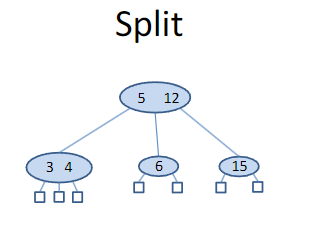
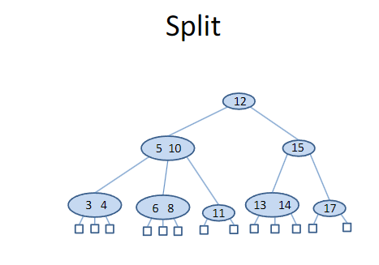
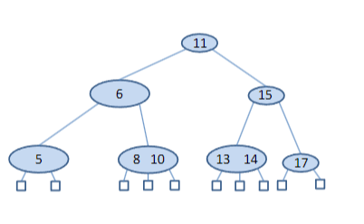

# Δένδρα Αναζήτησης Πολλών Δρόμων (Multi-Way Search Trees)

- Τα **δένδρα πολλών δρόμων** (multi-way trees) είναι δένδρα στα οποία κάθε εσωτερικός κόμβος μπορεί να αποθηκεύει περισσότερα από ένα κλειδιά και να έχει περισσότερα από δύο παιδιά.
- Όπως και στα δυαδικά δένδρα αναζήτησης, υποθέτουμε ότι τα στοιχεία που αποθηκεύουμε σε ένα δένδρο πολλών δρόμων είναι ζεύγη της μορφής **(𝑘, 𝑥)**, όπου **𝑘** είναι το κλειδί και **𝑥** η τιμή που σχετίζεται με το κλειδί.
- **Παράδειγμα**: Υποθέτουμε ότι αποθηκεύουμε πληροφορίες για φοιτητές. Το κλειδί μπορεί να είναι ο αριθμός μητρώου του φοιτητή, ενώ η τιμή μπορεί να είναι πληροφορίες όπως το όνομα, το έτος σπουδών κ.ά.

---

### Ορισμοί

- Ένα **δένδρο είναι διατεταγμένο** (ordered) όταν υπάρχει γραμμική διάταξη για τα παιδιά κάθε κόμβου· δηλαδή, μπορούμε να ταυτοποιήσουμε τα παιδιά ενός κόμβου ως πρώτο, δεύτερο, τρίτο, κ.ο.κ.
- Έστω **𝑣** ένας κόμβος σε ένα διατεταγμένο δένδρο. Λέμε ότι **𝑣 είναι d-κόμβος** αν έχει **𝑑 παιδιά**.

## Δένδρο Αναζήτησης Πολλών Δρόμων

Ένα **δένδρο αναζήτησης πολλών δρόμων** (multi-way search tree) είναι ένα **διατεταγμένο δένδρο** 𝑇 που ικανοποιεί τις παρακάτω ιδιότητες:

- Κάθε εσωτερικός κόμβος του 𝑇 έχει **τουλάχιστον 2 παιδιά**. Δηλαδή, κάθε εσωτερικός κόμβος είναι ένας **𝑑-κόμβος**, όπου **𝑑 ≥ 2**.

- Κάθε εσωτερικός 𝑑-κόμβος του 𝑇 με παιδιά **𝑣₁, ⋯, 𝑣𝑑** αποθηκεύει ένα **διατεταγμένο σύνολο από 𝑑 − 1 ζεύγη (κλειδί, τιμή)**:
  
  **(𝑘₁, 𝑥₁), (𝑘₂, 𝑥₂), ..., (𝑘𝑑₋₁, 𝑥𝑑₋₁)** με **𝑘₁ < 𝑘₂ < ⋯ < 𝑘𝑑₋₁**.

- Ορίζουμε για ευκολία:
  - **𝑘₀ = −∞**
  - **𝑘𝑑 = +∞**

- Για κάθε στοιχείο **(𝑘, 𝑥)** που είναι αποθηκευμένο σε κάποιον κόμβο στο υποδένδρο του 𝑇 που ριζώνεται στον **𝑣ᵢ**, για **𝑖 = 1, ⋯, 𝑑**, ισχύει ότι:

  **𝑘ᵢ₋₁ < 𝑘 < 𝑘ᵢ**

## Επιπλέον Ιδιότητες Δένδρων Αναζήτησης Πολλών Δρόμων

- Οι **εξωτερικοί κόμβοι** ενός δένδρου αναζήτησης πολλών δρόμων **δεν αποθηκεύουν καμία καταχώρηση** και είναι **"εικονικοί" (dummy) κόμβοι**, δηλαδή τα δένδρα που χρησιμοποιούμε είναι **επεκταμένα δένδρα** (extended trees).

- Όταν **𝑚 ≥ 2** είναι ο μέγιστος αριθμός παιδιών που επιτρέπεται να έχει ένας κόμβος, τότε έχουμε ένα **δένδρο αναζήτησης 𝑚 δρόμων** (*𝑚-way search tree*).

- Ένα **δυαδικό δένδρο αναζήτησης** (*binary search tree*) είναι μια **ειδική περίπτωση** δένδρου αναζήτησης πολλών δρόμων, όπου κάθε εσωτερικός κόμβος αποθηκεύει **μία καταχώρηση** και έχει **δύο παιδιά** (δηλαδή, **𝑚 = 2**).

- Εφόσον **δεν επιτρέπονται διπλότυπα κλειδιά** βάσει του προηγούμενου ορισμού, τα δένδρα αναζήτησης πολλών δρόμων είναι μια **κατάλληλη δομή δεδομένων για την υλοποίηση map (λεξικών)**.

## Πρόταση

Έστω **𝑇** ένα **𝑚-δένδρο αναζήτησης** με ύψος **ℎ**, **𝑛 καταχωρήσεις** (entries) και **𝑛𝐸 εξωτερικούς κόμβους**. Τότε ισχύουν οι παρακάτω ανισότητες:

1. **ℎ ≤ 𝑛 ≤ 𝑚^ℎ − 1**
2. **logₘ(𝑛 + 1) ≤ ℎ ≤ 𝑛**
3. **𝑛𝐸 = 𝑛 + 1**

---

## Απόδειξη

### 1. **ℎ ≤ 𝑛 ≤ 𝑚^ℎ − 1**

- Η ελάχιστη περίπτωση (ℎ ≤ 𝑛) προκύπτει όταν κάθε εσωτερικός κόμβος έχει ακριβώς 2 παιδιά και αποθηκεύει μία καταχώρηση (δηλαδή το δένδρο είναι "αραιό").
- Η μέγιστη περίπτωση (𝑛 ≤ 𝑚^ℎ − 1) συμβαίνει όταν κάθε εσωτερικός κόμβος έχει **το μέγιστο αριθμό παιδιών (𝑚)** και αποθηκεύει **𝑚 − 1 καταχωρήσεις**. Σε αυτήν την περίπτωση, το πλήθος των καταχωρήσεων αυξάνεται εκθετικά με το ύψος.

### 2. **logₘ(𝑛 + 1) ≤ ℎ ≤ 𝑛**

- Η αριστερή ανισότητα εκφράζει το ελάχιστο ύψος σε ένα "πλήρες" 𝑚-δένδρο με **𝑛** καταχωρήσεις, όπου κάθε κόμβος έχει το μέγιστο αριθμό παιδιών και καταχωρήσεων.
- Η δεξιά ανισότητα (ℎ ≤ 𝑛) είναι αυτονόητη, καθώς κάθε καταχώρηση απαιτεί τουλάχιστον έναν κόμβο για να αποθηκευτεί, οπότε το ύψος δεν μπορεί να ξεπεράσει τον αριθμό των καταχωρήσεων.

### 3. **𝑛𝐸 = 𝑛 + 1**

- Σε κάθε πολυδένδρο αναζήτησης, οι **εξωτερικοί κόμβοι** βρίσκονται ανάμεσα στις **καταχωρήσεις** και αντιστοιχούν σε **περιοχές αναζήτησης**.
- Για **𝑛** καταχωρήσεις, υπάρχουν **𝑛 + 1** περιοχές αναζήτησης → άρα **𝑛 + 1 εξωτερικοί κόμβοι**.

---

### Απόδειξη της Ανισότητας (1)

Θα αποδείξουμε πρώτα την ανισότητα **(1): ℎ ≤ 𝑛 ≤ 𝑚^ℎ − 1**

#### Κάτω Φράγμα (ℎ ≤ 𝑛)

Το κάτω φράγμα μπορεί να φανεί αν εξετάσουμε ένα **𝑚-δένδρο αναζήτησης** της εξής μορφής:

- Έχουμε **έναν εσωτερικό κόμβο ανά επίπεδο**, και
- **Κάθε κόμβος** (από το επίπεδο 0 έως και το επίπεδο ℎ − 1) περιέχει **μόνο μία καταχώρηση**,
- Το επίπεδο ℎ περιέχει **μόνο εξωτερικούς κόμβους**.

Σε αυτήν την περίπτωση, έχουμε **μία καταχώρηση ανά επίπεδο**, άρα το συνολικό πλήθος των καταχωρήσεων είναι τουλάχιστον **ℎ**.

➡️ **Άρα: ℎ ≤ 𝑛**

#### Άνω Φράγμα (𝑛 ≤ 𝑚^ℎ − 1)

Για το άνω φράγμα, θεωρούμε ένα **𝑚-δένδρο αναζήτησης ύψους ℎ** στο οποίο:

- Κάθε **εσωτερικός κόμβος** από τα επίπεδα **0 έως ℎ − 1** έχει **ακριβώς 𝑚 παιδιά**.
- Όλοι οι **εξωτερικοί κόμβοι** βρίσκονται στο επίπεδο **ℎ**.

Σε αυτή την περίπτωση:

- Ο συνολικός αριθμός των **εσωτερικών κόμβων** είναι:

 

- Επειδή κάθε εσωτερικός κόμβος περιέχει **𝑚 − 1 καταχωρήσεις**, το συνολικό πλήθος των καταχωρήσεων είναι:

 

➡️ **Άρα: 𝑛 ≤ m^ℎ − 1**

---

Συνοψίζοντας:

\[
ℎ ≤ 𝑛 ≤ m^ℎ − 1
\]

\[
\log_m(n + 1) ≤ ℎ ≤ n
\]

#### Κάτω Φράγμα: logₘ(𝑛 + 1) ≤ ℎ

Για να αποδείξουμε το κάτω φράγμα της ανισότητας (2), ξεκινάμε από την ανισότητα (1):

\[
n ≤ m^ℎ - 1
\]

Προσθέτοντας 1 και στις δύο πλευρές:

\[
n + 1 ≤ m^ℎ
\]

Παίρνοντας λογαρίθμους με βάση **𝑚**:

\[
\log_m(n + 1) ≤ ℎ
\]

#### Άνω Φράγμα: ℎ ≤ 𝑛

Αυτό είναι το ίδιο με το **κάτω φράγμα** της ανισότητας (1), το οποίο ήδη έχουμε αποδείξει.

---

### Απόδειξη της Ισότητας (3): 𝑛𝐸 = 𝑛 + 1

Θα χρησιμοποιήσουμε **μαθηματική επαγωγή** στο ύψος **ℎ** του δένδρου.

#### Βάση της επαγωγής (ℎ = 1)

- Το δένδρο έχει **μόνο τη ρίζα** ως εσωτερικό κόμβο.
- Υπάρχουν **𝑛 καταχωρήσεις** στη ρίζα.
- Άρα υπάρχουν **𝑛 + 1 εξωτερικοί κόμβοι** (μία "περιοχή" αναζήτησης ανάμεσα και γύρω από τις καταχωρήσεις).

➡️ Η πρόταση ισχύει για ℎ = 1.

#### Επαγωγικό Βήμα (ℎ > 1)

Έστω ότι το ύψος του δένδρου είναι ℎ > 1 και η ρίζα περιέχει **𝑚 καταχωρήσεις**. Τότε έχει **𝑚 + 1 υποδένδρα**. Σύμφωνα με την επαγωγική υπόθεση, ισχύει:

- Κάθε υποδένδρο **𝑖** περιέχει **𝑝ᵢ καταχωρήσεις** και έχει **𝑝ᵢ + 1 εξωτερικούς κόμβους**.

Τότε:

- Το συνολικό πλήθος καταχωρήσεων στο δένδρο είναι:

- Το συνολικό πλήθος εξωτερικών κόμβων είναι:

  
➡️ Άρα ισχύει: **𝑛𝐸 = 𝑛 + 1**

Η πρόταση αποδείχθηκε.

---

## Αναζήτηση σε Δένδρο Αναζήτησης Πολλών Δρόμων

Έστω **𝑇** ένα δένδρο αναζήτησης πολλών δρόμων και **𝑘** ένα κλειδί.

Η διαδικασία αναζήτησης μιας καταχώρησης με κλειδί **𝑘** είναι απλή:

1. Ξεκινάμε από τη **ρίζα** του δένδρου και ακολουθούμε μια διαδρομή προς τα κάτω.
2. Όταν βρισκόμαστε σε έναν **𝑑-κόμβο 𝑣**, συγκρίνουμε το **𝑘** με τα αποθηκευμένα κλειδιά:

   \[
   k_1, k_2, ..., k_{d-1}
   \]

3. Αν βρούμε ότι **𝑘 = 𝑘ᵢ** για κάποιο **𝑖**, τότε η αναζήτηση **ολοκληρώνεται επιτυχώς**.
4. Διαφορετικά, συνεχίζουμε την αναζήτηση στο παιδί **𝑣ᵢ** τέτοιο ώστε:

   \[
   k_{i-1} < k < k_i
   \]

5. Αν φτάσουμε σε **εξωτερικό κόμβο**, τότε το κλειδί **δεν υπάρχει** στο δένδρο **𝑇**.

## Εισαγωγή σε Δένδρο Αναζήτησης Πολλών Δρόμων

Για να εισάγουμε ένα νέο ζεύγος **(𝑘, 𝑥)** σε ένα δένδρο αναζήτησης πολλών δρόμων, ακολουθούμε την εξής διαδικασία:

1. Ξεκινάμε αναζητώντας την καταχώρηση με το κλειδί **𝑘** στο δένδρο.
2. Αν βρούμε την καταχώρηση, δεν χρειάζεται να την επανακαταχωρήσουμε, καθώς δεν επιτρέπονται οι διπλότυπες καταχωρήσεις.
3. Αν φτάσουμε σε **εξωτερικό κόμβο**, τότε γνωρίζουμε ότι η καταχώρηση δεν υπάρχει στο δένδρο. Σε αυτήν την περίπτωση:
   - Επιστρέφουμε στον γονικό κόμβο **𝑣** του εξωτερικού κόμβου και προσπαθούμε να εισάγουμε το κλειδί εκεί.
4. Αν ο κόμβος **𝑣** έχει χώρο για μία επιπλέον καταχώρηση, τότε εισάγουμε την καταχώρηση εκεί.
5. Αν ο κόμβος **𝑣** δεν έχει χώρο για άλλη καταχώρηση, δημιουργούμε ένα νέο κόμβο:
   - Εισάγουμε την καταχώρηση σε αυτόν τον νέο κόμβο.
   - Κάνουμε τον νέο κόμβο παιδί του **𝑣** στην κατάλληλη θέση.

## Διαγραφή από Δένδρο Αναζήτησης Πολλών Δρόμων

Ο αλγόριθμος για τη διαγραφή από ένα δένδρο αναζήτησης πολλών δρόμων αφήνεται ως άσκηση.

---

## Πολυπλοκότητα Λειτουργιών

Ας εξετάσουμε το χρόνο που απαιτείται για την αναζήτηση σε ένα **𝑚-way search tree** για ένα δεδομένο κλειδί.

- Ο χρόνος που ξοδεύεται σε έναν **𝑑-κόμβο** εξαρτάται από την υλοποίηση του κόμβου. 
  - Αν χρησιμοποιούμε **ταξινομημένο πίνακα**, τότε χρησιμοποιώντας **δυαδική αναζήτηση**, μπορούμε να αναζητήσουμε σε έναν κόμβο σε χρόνο **𝑂(log 𝑑)**.
- Επομένως, ο χρόνος για μία λειτουργία αναζήτησης στο δένδρο είναι:

**𝑂(log m)**.

- Η πολυπλοκότητα για την **εισαγωγή** και τη **διαγραφή** είναι επίσης:

**𝑂(log 𝑑)**.
 

---

## Σκέψεις για την Αποτελεσματικότητα

- Γνωρίζουμε ότι η διατήρηση τέλειας ισορροπίας στα δένδρα αναζήτησης δυαδικών δένδρων οδηγεί στους πιο σύντομους μέσους χρόνους αναζήτησης.
- Ωστόσο, η προσπάθεια για την **τέλεια ισορροπία** κατά την εισαγωγή ή διαγραφή κόμβων μπορεί να οδηγήσει σε **ακριβό ανασχηματισμό** (rebalancing), όπου κάθε κόμβος του δένδρου χρειάζεται να αναδιοργανωθεί.

### Λύση με Δένδρα AVL

- Τα **δένδρα AVL** μας έδειξαν έναν τρόπο για να λύσουμε αυτό το πρόβλημα, εγκαταλείποντας τον στόχο της τέλειας ισορροπίας και υιοθετώντας την προσέγγιση του να διατηρούμε τα δένδρα **"σχεδόν ισορροπημένα"**.

---

## Σκέψεις για την Αποτελεσματικότητα (συνέχεια)

Τα **δένδρα αναζήτησης πολλών δρόμων** μας παρέχουν έναν άλλο τρόπο για να λύσουμε αυτό το πρόβλημα.

- Ο κύριος στόχος αποτελεσματικότητας για ένα **δένδρο αναζήτησης πολλών δρόμων** είναι να διατηρηθεί το ύψος όσο το δυνατόν μικρότερο, επιτρέποντας ωστόσο να ποικίλει ο αριθμός των κλειδιών σε κάθε κόμβο.
- Θέλουμε το ύψος του δένδρου **ℎ** να είναι μία **λογαριθμική συνάρτηση** του **𝑛**, του συνολικού αριθμού των καταχωρήσεων που αποθηκεύονται στο δένδρο.
- Ένα δένδρο αναζήτησης με λογαριθμικό ύψος ονομάζεται **ισορροπημένο δένδρο αναζήτησης** (**balanced search tree**).

---

## Ισορροπημένα Δένδρα Αναζήτησης Πολλών Δρόμων

Θα μελετήσουμε τώρα τους εξής τύπους ισορροπημένων δένδρων αναζήτησης πολλών δρόμων:

- **(2,4) δένδρα** (σε αυτή τη διάλεξη)
- **Red-black δένδρα** (σε επόμενες διαλέξεις)
- **(a,b) δένδρα** (σε επόμενες διαλέξεις)
- **B-dένδρα** (σε επόμενες διαλέξεις)

## (2,4) Δένδρα

Ένα **(2,4) δένδρο** ή **2-3-4 δένδρο** είναι ένα δένδρο αναζήτησης πολλών δρόμων με τα εξής δύο χαρακτηριστικά:

### Ιδιότητα Μέγεθους:
- Κάθε **εσωτερικός κόμβος** περιέχει τουλάχιστον **ένα** και το πολύ **τρία** κλειδιά.
- Κάθε εσωτερικός κόμβος έχει τουλάχιστον **δύο** και το πολύ **τέσσερα** παιδιά.

### Ιδιότητα Βάθους:
- Όλοι οι **εξωτερικοί κόμβοι** είναι άδεια δένδρα που έχουν το ίδιο βάθος (βρίσκονται στο ίδιο κατώτερο επίπεδο).

## Αποτέλεσμα

### Πρόταση:
Το ύψος ενός **(2,4) δένδρου** που αποθηκεύει **𝑛** καταχωρήσεις είναι **𝑂(log 𝑛)**.

### Απόδειξη:
Έστω **ℎ** το ύψος ενός **(2,4) δένδρου** **𝑇** που αποθηκεύει **𝑛** καταχωρήσεις. Δικαιολογούμε την πρόταση αποδεικνύοντας ότι:

---

### Αποδείξεις για τον αριθμό των εξωτερικών κόμβων:

- Σημειώστε ότι, σύμφωνα με την ιδιότητα μεγέθους, έχουμε το πολύ **4** κόμβους στο βάθος 1, το πολύ **42** κόμβους στο βάθος 2, και ούτω καθεξής. Άρα, ο αριθμός των εξωτερικών κόμβων του **𝑇** είναι το πολύ **4ℎ**.
- Ομοίως, σύμφωνα με την ιδιότητα μεγέθους, έχουμε τουλάχιστον **2** κόμβους στο βάθος 1, τουλάχιστον **22** κόμβους στο βάθος 2, και ούτω καθεξής. Άρα, ο αριθμός των εξωτερικών κόμβων του **𝑇** είναι τουλάχιστον **2ℎ**.
- Επίσης, γνωρίζουμε ότι ο αριθμός των εξωτερικών κόμβων είναι **𝑛 + 1**.

## Αναζήτηση στα (2,4) Δένδρα

Ο αλγόριθμος για την αναζήτηση μιας καταχώρησης με κλειδί **𝑘** σε ένα **(2,4) δένδρο** είναι ο ίδιος με τον αλγόριθμο που παρουσιάσαμε για τα δένδρα πολλών δρόμων.

---

## Εισαγωγή στα (2,4) Δένδρα

Για να εισάγουμε μια νέα καταχώρηση **(𝑘, 𝑥)**, με κλειδί **𝑘**, σε ένα **(2,4) δένδρο** **𝑇**, ακολουθούμε τα εξής βήματα:

1. Εκτελούμε πρώτα μια αναζήτηση για το **𝑘**.
2. Υποθέτοντας ότι το **𝑇** δεν περιέχει καταχώρηση με το κλειδί **𝑘**, η αναζήτηση τερματίζει αποτυχημένα σε έναν εξωτερικό κόμβο **𝑧**.
3. Έστω **𝑣** ο γονέας του **𝑧**. Εισάγουμε τη νέα καταχώρηση στο κόμβο **𝑣** και προσθέτουμε ένα νέο παιδί (έναν εξωτερικό κόμβο) στο **𝑣** στην αριστερή πλευρά του **𝑧**.

Η μέθοδος εισαγωγής μας διατηρεί την ιδιότητα του βάθους, αφού προσθέτουμε έναν νέο εξωτερικό κόμβο στο ίδιο επίπεδο με τους υπάρχοντες εξωτερικούς κόμβους.

Ωστόσο, μπορεί να παραβιάσει την ιδιότητα μεγέθους. Εάν ένας κόμβος **𝑣** ήταν προηγουμένως 4-κόμβος, τότε μπορεί να γίνει 5-κόμβος μετά την εισαγωγή, κάτι που καθιστά το δένδρο μη **(2,4)** δένδρο.

Αυτή η παραβίαση της ιδιότητας μεγέθους ονομάζεται **υπερχείλιση (overflow)** κόμβος στον κόμβο **𝑣**, και πρέπει να επιλυθεί προκειμένου να αποκατασταθούν οι ιδιότητες του **(2,4)** δένδρου.

---

## Διαχείριση Υπερχείλισης Κόμβων

Έστω ότι **𝑣1, ⋯ , 𝑣5** είναι τα παιδιά του **𝑣**, και τα **𝑘1, ⋯ , 𝑘4** είναι τα κλειδιά που αποθηκεύονται στο **𝑣**. Για να επιλύσουμε την υπερχείλιση στον κόμβο **𝑣**, εκτελούμε μια λειτουργία διαίρεσης (split) στον **𝑣** ως εξής:

1. Αντικαθιστούμε τον **𝑣** με δύο κόμβους **𝑣′** και **𝑣′′**, όπου:
   - **𝑣′** είναι ένας 3-κόμβος με παιδιά **𝑣1, 𝑣2, 𝑣3** που αποθηκεύει τα κλειδιά **𝑘1** και **𝑘2**
   - **𝑣′′** είναι ένας 2-κόμβος με παιδιά **𝑣4, 𝑣5** που αποθηκεύει το κλειδί **𝑘4**.

2. Εάν ο **𝑣** ήταν η ρίζα του **𝑇**, δημιουργούμε έναν νέο κόμβο ρίζας **𝑢**. Διαφορετικά, ο **𝑢** είναι ο γονέας του **𝑣**.

3. Εισάγουμε το κλειδί **𝑘3** στο **𝑢** και κάνουμε τους **𝑣′** και **𝑣′′** παιδιά του **𝑢**, έτσι ώστε αν ο **𝑣** ήταν παιδί **𝑖** του **𝑢**, τότε οι **𝑣′** και **𝑣′′** να γίνουν τα παιδιά **𝑖** και **𝑖 + 1** του **𝑢**, αντίστοιχα.

## Το τρίτο κλειδί του κόμβου 𝑣 που εισάγεται στον γονικό κόμβο 𝑢

## Ο κόμβος 𝑣 αντικαθίσταται με έναν 3-κόμβο 𝑣′ και έναν 2-κόμβο 𝑣′′

## Παράδειγμα Εισαγωγών σε ένα Άδειο (2,4) Δένδρο

Ας δούμε τώρα ένα παράδειγμα με μερικές εισαγωγές σε ένα αρχικά άδειο **(2,4)** δένδρο

## Εισαγωγή (Συνέχεια)

Ας δούμε τώρα ένα πιο σύνθετο παράδειγμα εισαγωγής σε ένα **(2,4)** δένδρο

## Ανάλυση Πολυπλοκότητας της Εισαγωγής

Η αλγόριθμος εισαγωγής αποτελείται από μια κατηφορική φάση όπου εντοπίζουμε τον κόμβο του δένδρου όπου θα εισαχθεί η νέα εγγραφή και, ενδεχομένως, από μια ανηφορική φάση που περιλαμβάνει πράξεις διαίρεσης (split operations).

### Πολυπλοκότητα της Κατηφορικής Φάσης
Η κατηφορική φάση έχει πολυπλοκότητα χρόνου:

Ο(ℎ) = Ο(log n)

### Πολυπλοκότητα των Πράξεων Διαίρεσης
Μια πράξη διαίρεσης επηρεάζει έναν σταθερό αριθμό κόμβων του δένδρου και έναν σταθερό αριθμό εγγραφών στους κόμβους αυτούς. Έτσι, η πράξη διαίρεσης μπορεί να υλοποιηθεί σε χρόνο:

Ο(1)

### Πολυπλοκότητα του Ανοδικού Σταδίου
Ως συνέπεια μιας πράξης διαίρεσης σε έναν κόμβο **𝑣**, μπορεί να προκύψει νέος υπερχειλισμένος κόμβος στον γονικό κόμβο **𝑢** του **𝑣**. Μια πράξη διαίρεσης είτε εξαλείφει την υπερχειλίδα είτε τη μεταφέρει στον γονικό κόμβο του τρέχοντος κόμβου. Επομένως, ο αριθμός των πράξεων διαίρεσης είναι περιορισμένος από το ύψος του δένδρου, το οποίο είναι:

Ο(log n)

### Συνολική Πολυπλοκότητα
Κατά συνέπεια, η συνολική πολυπλοκότητα χρόνου για να πραγματοποιηθεί η εισαγωγή είναι:

Ο(log n)

---

## Αφαίρεση από (2,4) Δένδρα

Ας δούμε τώρα την αφαίρεση μιας εγγραφής με κλειδί **𝑘** από ένα **(2,4)** δένδρο **𝑇**.

### Βήμα 1: Αναζήτηση του Κλειδιού

Το πρώτο βήμα του αλγορίθμου είναι να αναζητήσουμε το κλειδί **𝑘** όπως κάναμε και για τα δένδρα αναζήτησης πολλών δρόμων.

### Βήμα 2: Αφαίρεση από τον Κόμβο

Αν η εγγραφή προς αφαίρεση βρεθεί και είναι η **𝑖-οστή** εγγραφή (**𝑘𝑖, 𝑥𝑖**) (όπου **𝑘𝑖 = 𝑘**) σε έναν κόμβο **𝑣** με μόνο παιδιά εξωτερικούς κόμβους, αφαιρούμε την εγγραφή από τον κόμβο **𝑣** και αφαιρούμε τον **𝑖-οστό** εξωτερικό κόμβο του **𝑣**.

Η αφαίρεση μιας εγγραφής από έναν κόμβο **𝑣** διατηρεί την ιδιότητα βάθους, επειδή πάντα αφαιρούμε έναν εξωτερικό κόμβο παιδί από έναν κόμβο **𝑣** με μόνο εξωτερικούς κόμβους παιδιών.

Ωστόσο, μπορεί να παραβιαστεί η ιδιότητα μεγέθους στον κόμβο **𝑣**.

• Εάν ο κόμβος **𝑣** ήταν προηγουμένως 2-κόμβος, τότε, μετά την αφαίρεση, γίνεται 1-κόμβος χωρίς εγγραφές.

• Αυτού του τύπου η παραβίαση της ιδιότητας μεγέθους ονομάζεται **υπορροή** (**underflow**) στον κόμβο **𝑣**.

### Διόρθωση Υπορροής
Για να διορθώσουμε μια υπορροή, ελέγχουμε εάν κάποιος άμεσος αδελφός του κόμβου **𝑣** είναι 3-κόμβος ή 4-κόμβος. Αν βρούμε τέτοιον αδελφό **𝑤**, εκτελούμε μια **μεταφορά** (**transfer**) όπου:

1. Μετακινούμε ένα παιδί του **𝑤** στον **𝑣**,
2. Μετακινούμε ένα κλειδί του **𝑤** στον γονέα **𝑢** των κόμβων **𝑣** και **𝑤**,
3. Μετακινούμε ένα κλειδί του γονέα **𝑢** στον **𝑣**.

### Αν οι Αδελφοί του **𝑣** είναι 2-κόμβοι
Εάν ο **𝑣** έχει μόνο έναν αδελφό και αυτός ο αδελφός είναι 2-κόμβος, ή αν και οι δύο άμεσοι αδελφοί του **𝑣** είναι 2-κόμβοι, τότε εκτελούμε μια **συγχώνευση** (**fusion**) όπου:

1. Συγχωνεύουμε τον **𝑣** με έναν αδελφό του, δημιουργώντας έναν νέο κόμβο **𝑣′**.
2. Μετακινούμε ένα κλειδί από τον γονέα **𝑢** του **𝑣** στον **𝑣′**.

### Αφαίρεση και Διαγραφή Ρίζας
Εάν μια υπορροή διαδοθεί μέχρι τη ρίζα του δένδρου, τότε η ρίζα διαγράφεται.

---

• Ας υποθέσουμε τώρα ότι η εγγραφή που θέλουμε να αφαιρέσουμε είναι αποθηκευμένη στην **𝑖-οστή** εγγραφή (**𝑘𝑖, 𝑥𝑖**) σε έναν κόμβο **𝑧** που έχει μόνο εσωτερικούς κόμβους ως παιδιά.

• Η αφαίρεση μιας τέτοιας εγγραφής μπορεί πάντα να μειωθεί στην περίπτωση όπου η εγγραφή που πρέπει να αφαιρεθεί είναι αποθηκευμένη σε έναν κόμβο **𝑣** με παιδιά εξωτερικούς κόμβους.

• Σε αυτήν την περίπτωση, ανταλλάσσουμε την εγγραφή (**𝑘𝑖, 𝑥𝑖**) με μια κατάλληλη εγγραφή που αποθηκεύεται σε έναν κόμβο **𝑣** με εξωτερικούς κόμβους ως παιδιά ως εξής:

  - Βρίσκουμε τον πιο δεξιό εσωτερικό κόμβο **𝑣** στο υποδένδρο που ριζώνει στο **𝑖-οστό** παιδί του **𝑧**, σημειώνοντας ότι τα παιδιά του κόμβου **𝑣** είναι όλοι εξωτερικοί κόμβοι.
  - Ανταλλάσσουμε την εγγραφή (**𝑘𝑖, 𝑥𝑖**) στον **𝑧** με την τελευταία εγγραφή του **𝑣**, η οποία διαγράφεται από τον **𝑣**. Το κλειδί αυτής της τελευταίας εγγραφής είναι ο **προηγούμενος** του **𝑘𝑖** στη φυσική διάταξη των κλειδιών του δένδρου.

• Στη συνέχεια, ο αλγόριθμος συνεχίζεται όπως στην προηγούμενη περίπτωση, εκτελώντας μεταφορές και συγχωνεύσεις εάν είναι αναγκαίο.

# Παράδειγμα Αφαίρεσης: Χρήση του Διάδοχου

Μπορούμε επίσης να χρησιμοποιήσουμε το 13 αντί για το 11 (δηλαδή, τον διάδοχο του 12 στην φυσική σειρά των κλειδιών).

## Παράδειγμα Αφαίρεσης από Δέντρο (2,4)

Ας δούμε τώρα μερικά παραδείγματα αφαίρεσης από ένα δέντρο (2,4):

1. Εάν θέλουμε να αφαιρέσουμε ένα κλειδί, επιλέγουμε τον διάδοχο ή τον προκάτοχο του κλειδιού που πρόκειται να αφαιρεθεί, ανάλογα με την περίπτωση.
2. Ο διάδοχος είναι το μικρότερο κλειδί του δεξιού υποδέντρου, ενώ ο προκάτοχος είναι το μεγαλύτερο κλειδί του αριστερού υποδέντρου.
3. Μετά την αντικατάσταση του κλειδιού που αφαιρούμε με τον διάδοχο ή προκάτοχο, ακολουθεί η αφαίρεση του κλειδιού από το υποδέντρο.

### Παράδειγμα:

Αρχικό Δέντρο (2,4):

# Συγχώνευση των Κόμβων 𝑤 και 𝑣

Η συγχώνευση των κόμβων 𝑤 και 𝑣 πραγματοποιείται όταν οι κόμβοι αυτοί δεν μπορούν να επιλύσουν το πρόβλημα του underflow με μεταφορά κλειδιών. Αν οι αδελφοί κόμβοι 𝑤 και 𝑣 είναι 2-κόμβοι, τότε οι δύο κόμβοι συγχωνεύονται σε έναν ενιαίο κόμβο.

### Διαδικασία Συγχώνευσης:

1. Αν οι κόμβοι 𝑤 και 𝑣 είναι 2-κόμβοι, τότε συγχωνεύονται σε έναν ενιαίο κόμβο.
2. Ο γονέας κόμβος 𝑢 μετακινεί ένα κλειδί προς τα κάτω για να εξασφαλίσει την ακεραιότητα της δομής του δέντρου.
3. Η συγχώνευση μειώνει τη συνολική ύψος του δέντρου και μπορεί να προκαλέσει υπολειμματικό underflow στον γονέα κόμβο, οπότε η διαδικασία συγχώνευσης προχωρά αναδρομικά προς τα επάνω.

μετα:

συγχωνευση

συγχωνευση

# Πολυπλοκότητα Αφαίρεσης (Removal)

Η αφαίρεση ενός στοιχείου περιλαμβάνει μια φάση προς τα κάτω (downward phase) για την εύρεση του στοιχείου προς αφαίρεση και, ενδεχομένως, μια φάση προς τα πάνω (upward phase) για τις λειτουργίες μεταφοράς (transfer) και/ή συγχώνευσης (fusion).

### Πολυπλοκότητα της Φάσης Προς τα Κάτω (Downward Phase):
- Η φάση προς τα κάτω έχει πολυπλοκότητα χρόνου \( O(h) = O(\log n) \), όπου \( h \) είναι το ύψος του δέντρου και \( n \) ο αριθμός των στοιχείων.

### Πολυπλοκότητα Λειτουργίας Μεταφοράς (Transfer Operation):
- Μια λειτουργία μεταφοράς είναι τοπική σε τρεις κόμβους, οπότε η πολυπλοκότητα αυτής της λειτουργίας είναι \( O(1) \).

### Πολυπλοκότητα Λειτουργίας Συγχώνευσης (Fusion Operation):
- Μια λειτουργία συγχώνευσης σε έναν κόμβο \( v \) μπορεί να προκαλέσει ένα νέο underflow στον γονέα κόμβο \( u \) του \( v \), το οποίο με τη σειρά του ενδέχεται να προκαλέσει μια λειτουργία μεταφοράς ή συγχώνευσης στον κόμβο \( u \).
- Συνεπώς, ο αριθμός των λειτουργιών συγχώνευσης είναι περιορισμένος από το ύψος του δέντρου, το οποίο είναι \( O(\log n) \).

### Συνολική Πολυπλοκότητα:
- Επομένως, η αφαίρεση ενός στοιχείου από το δέντρο μπορεί να έχει πολυπλοκότητα χρόνου \( O(log n) \) στην χειρότερη περίπτωση.
