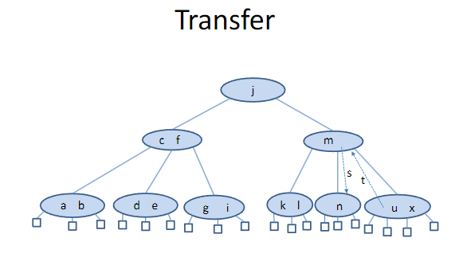

# B-Δέντρα (B-Trees)

Τα **B-Δέντρα** είναι ένας τύπος **ισορροπημένου πολυδρόμου (multi-way) δέντρου αναζήτησης**, που χρησιμοποιείται ευρέως σε βάσεις δεδομένων και συστήματα αρχείων λόγω της αποτελεσματικότητάς τους στην αποθήκευση και ανάκτηση μεγάλων ποσοτήτων δεδομένων.

## Βασικά Χαρακτηριστικά

- Κάθε κόμβος μπορεί να έχει **πολλαπλά κλειδιά** και **πολλούς απογόνους (παιδιά)**.
- Όλοι οι **φύλλοι** του δέντρου βρίσκονται **στο ίδιο επίπεδο** (ισότητα βάθους).
- Κάθε εσωτερικός κόμβος περιέχει μεταξύ **⌈m/2⌉ και m** παιδιών, όπου *m* είναι η μέγιστη επιτρεπτή βαθμίδα του δέντρου.

```
✔️ Ορισμός:
Το κλειδί (key) είναι μια τιμή (συνήθως αριθμός, string ή οτιδήποτε έχει "ταξινόμηση") που χρησιμοποιείται για να τοποθετηθούν τα στοιχεία σωστά μέσα στο δέντρο.

📚 Παράδειγμα:
Αν έχεις ένα δέντρο που αποθηκεύει μαθητές με βάση τον αριθμό μητρώου τους, τότε:

Το κλειδί είναι ο αριθμός μητρώου.

Το στοιχείο μπορεί να είναι π.χ. όνομα, ηλικία, τμήμα κ.λπ
```

## Ιδιότητες B-Δέντρων Βαθμού *m*

1. Κάθε κόμβος έχει το πολύ *m - 1* κλειδιά.
2. Κάθε εσωτερικός κόμβος (όχι φύλλο) έχει από ⌈m/2⌉ έως *m* παιδιά.
3. Όλα τα φύλλα εμφανίζονται στο **ίδιο επίπεδο**.
4. Τα κλειδιά σε κάθε κόμβο είναι **διατεταγμένα κατά αύξουσα σειρά**, και χωρίζουν το εύρος των τιμών για τα αντίστοιχα παιδιά.

## Πλεονεκτήματα

- Η πρόσβαση στα δεδομένα γίνεται σε **λογαριθμικό χρόνο**: `O(logₘ n)`, όπου *n* είναι ο αριθμός των καταχωρήσεων.
- Είναι **κατάλληλο για δευτερεύουσα μνήμη** (π.χ. δίσκοι), γιατί μειώνει τις αναγνώσεις/εγγραφές μπλοκ.

## Συνήθεις Χρήσεις

- Συστήματα βάσεων δεδομένων (DBMS).
- Συστήματα αρχείων (file systems).
- Ευρετήρια σε μεγάλες δομές δεδομένων.

## Παραλλαγές B-Δέντρων

- **(2,4) Δέντρα**: Ειδική περίπτωση B-δέντρου με βαθμό m = 4.
- **B+ Trees**: Όλες οι καταχωρήσεις δεδομένων βρίσκονται στα φύλλα.
- **B* Trees**: Παραλλαγή με πιο αποδοτική χρήση του χώρου.


# Εξωτερική Μνήμη (External Memory)

## Δομές Δεδομένων και Κύρια Μνήμη

- Μέχρι τώρα υποθέταμε ότι οι δομές δεδομένων μας αποθηκεύονται στην **κύρια μνήμη (RAM)**.
- Όμως, όταν το μέγεθος μιας δομής δεδομένων είναι πολύ μεγάλο, τότε αυτή αποθηκεύεται στην **εξωτερική μνήμη**, όπως σε έναν **σκληρό δίσκο**.

### Παραδείγματα:
- Βάση δεδομένων μιας τράπεζας.
- Βάση δεδομένων εικόνων ή βίντεο.
- Συστήματα αποθήκευσης αρχείων μεγάλης κλίμακας.

---

# Εξωτερική Αναζήτηση (External Searching)

- Όταν έχουμε πρόσβαση σε δεδομένα αποθηκευμένα σε **δίσκο ή άλλο εξωτερικό μέσο**, εκτελούμε **εξωτερική αναζήτηση**.
- Κάθε πρόσβαση σε δίσκο είναι **100.000 έως 1.000.000 φορές αργότερη** από μια πρόσβαση σε κύρια μνήμη.
- Άρα, σε δομές δεδομένων αποθηκευμένες σε δίσκο, **στόχος μας είναι να ελαχιστοποιήσουμε τις προσβάσεις στον δίσκο**.

---

# (a, b) Δέντρα

Ένα **(𝑎, 𝑏) δέντρο** είναι ένας τύπος **πολυσχιδούς δέντρου αναζήτησης** με επιπλέον περιορισμούς, ιδανικός για χρήση σε εξωτερική μνήμη.

## Ορισμός:

Ένα (𝑎, 𝑏) δέντρο είναι ένα πολυδρόμο δέντρο αναζήτησης που ικανοποιεί τις παρακάτω ιδιότητες:

- **Περιορισμός μεγέθους (Size property)**:
  - Κάθε εσωτερικός κόμβος έχει τουλάχιστον **𝑎 παιδιά**, εκτός αν είναι η ρίζα.
  - Κάθε κόμβος έχει το πολύ **𝑏 παιδιά**.
  - Η ρίζα μπορεί να έχει τουλάχιστον **2 παιδιά**.

- **Περιορισμός βάθους (Depth property)**:
  - Όλοι οι **εξωτερικοί κόμβοι** (φύλλα) βρίσκονται **στο ίδιο βάθος**.

## Παραδείγματα:

- Ένα **(2,4) δέντρο** είναι ένα ειδικό (𝑎, 𝑏) δέντρο με **𝑎 = 2** και **𝑏 = 4**.

---

## Πλεονεκτήματα (a, b) Δέντρων στην Εξωτερική Μνήμη

- Μπορούν να προσαρμοστούν ώστε κάθε κόμβος να αντιστοιχεί σε **ένα μπλοκ του δίσκου**.
- Ελαχιστοποιούν τις **προσβάσεις στο δίσκο**, εκτελώντας περισσότερη επεξεργασία ανά κόμβο.
- Είναι εξαιρετικά κατάλληλα για **βάσεις δεδομένων και αρχεία μεγάλου όγκου**.


## Πρόταση

Έστω \( T \) ένα (𝑎, 𝑏) δέντρο που αποθηκεύει \( n \) εγγραφές και έχει ύψος \( h \). Ισχύει ότι:

 
---

## Απόδειξη για το ύψος ενός (𝑎, 𝑏) δέντρου

Έστω 𝑇 ένα (𝑎, 𝑏) δέντρο που αποθηκεύει 𝑛 εγγραφές και έστω ℎ το ύψος του 𝑇.

Θα αποδείξουμε ότι:


---

## Ιδιότητες (𝑎, 𝑏) Δέντρων

- **Ιδιότητα μεγέθους**: Κάθε εσωτερικός κόμβος (εκτός της ρίζας) έχει τουλάχιστον 𝑎 και το πολύ 𝑏 παιδιά.
- **Ιδιότητα βάθους**: Όλοι οι εξωτερικοί κόμβοι βρίσκονται στο ίδιο βάθος.

---

## Πλήθος εξωτερικών κόμβων

Από τις παραπάνω ιδιότητες, το πλήθος των εξωτερικών κόμβων, 𝑛″, ικανοποιεί:


🔹 *Ανώτατο όριο:*  
1 κόμβος στο επίπεδο 0,  
έως 𝑏 κόμβοι στο επίπεδο 1,  
έως 𝑏² στο επίπεδο 2,  
…  
έως 𝑏^ℎ στο επίπεδο ℎ.

🔹 *Κατώτατο όριο:*  
1 κόμβος στο επίπεδο 0,  
τουλάχιστον 2 κόμβοι στο επίπεδο 1,  
τουλάχιστον 2𝑎 στο επίπεδο 2,  
τουλάχιστον 2𝑎² στο επίπεδο 3,  
…  
τουλάχιστον 2𝑎^ℎ⁻¹ στο επίπεδο ℎ.

---

## Από προηγούμενη πρόταση για multi-way trees:

n'' = n + 1
 

---

## Λαμβάνοντας λογαρίθμους (βάσης 2):


---

## Κατώτατο Όριο (Lower Bound):

Από τη δεξιά ανισότητα:


---

## Άνω Όριο (Upper Bound):

Από την αριστερή ανισότητα:


---

##  Τελικό Συμπέρασμα:

Το ύψος ενός (𝑎, 𝑏) δέντρου είναι:


# B-Trees

- Σε ένα (𝑎, 𝑏) δέντρο, μπορούμε να επιλέξουμε τις παραμέτρους 𝑎 και 𝑏 έτσι ώστε κάθε κόμβος του δέντρου να καταλαμβάνει ένα μόνο δίσκο ή σελίδα.

- Αυτό οδηγεί σε μια γνωστή δομή δεδομένων εξωτερικής μνήμης που ονομάζεται **B-tree** (B-δέντρο).

- Ένα **B-tree** τάξης 𝑚 είναι ένα (𝑎, 𝑏) δέντρο με 𝑎 = ⌈𝑚/2⌉ και 𝑏 = 𝑚.

- Τα B-trees χρησιμοποιούνται για την ευρετηρίαση δεδομένων που είναι αποθηκευμένα σε εξωτερική μνήμη.

- Όταν υλοποιούμε ένα B-tree, επιλέγουμε την τάξη 𝑚 έτσι ώστε οι (το πολύ) 𝑚 αναφορές παιδιών και τα (το πολύ) 𝑚 − 1 κλειδιά που αποθηκεύονται σε έναν κόμβο να μπορούν να χωρέσουν σε ένα μόνο μπλοκ.

- Οι κόμβοι είναι τουλάχιστον μισογεμάτοι συνεχώς λόγω της τιμής του 𝑎.


# Πρόταση

- Έστω \( T \) ένα B-δέντρο τάξης \( m \) και ύψους \( h \). 
- Έστω  d = ⌈𝑚/2⌉  και \( n \) ο αριθμός των εγγραφών στο δέντρο. Τότε, ισχύουν οι παρακάτω ανισότητες:


## Απόδειξη

- Η άνω όρια προκύπτει από το γεγονός ότι ένα B-δέντρο τάξης \( m \) είναι ένα πολυδιάστατο δέντρο και από την αντίστοιχη πρόταση που αποδείξαμε για τα πολυδιάστατα δέντρα.
- Η κάτω όρια προκύπτει από την ανισότητα   , την οποία χρησιμοποιήσαμε στην απόδειξη της προηγούμενης πρότασης για τα \( a, b \)-δέντρα.

- Για να αποδείξουμε την ανισότητα (2), επαναγράφουμε τις ανισότητες της (1) και στη συνέχεια παίρνουμε λογαρίθμους με βάση το \( m \) και το \( d \) για τους αντίστοιχους όρους.

## Αποτέλεσμα

- Από την ανισότητα της δεξιάς πλευράς της (2) στην προηγούμενη πρόταση, έχουμε ότι το ύψος ενός B-δέντρου είναι  , όπου  d = ⌈𝑚/2⌉ , όπως θα θέλαμε για ένα ισχυρά ισχυρό δέντρο αναζήτησης.

## Εισαγωγή σε ένα B-δέντρο

Η γενική μέθοδος για την εισαγωγή σε ένα B-δέντρο είναι η εξής:
1. Πρώτα, πραγματοποιείται μια αναζήτηση για να ελεγχθεί αν το νέο κλειδί υπάρχει ήδη στο δέντρο. Αν το δέντρο είναι πραγματικά καινούργιο, η αναζήτηση θα καταλήξει σε αποτυχία σε ένα φύλλο.
2. Στη συνέχεια, το νέο κλειδί προστίθεται στον γονέα του φύλλου. Αν ο κόμβος δεν ήταν ήδη γεμάτος, η εισαγωγή ολοκληρώνεται.
3. Όταν προστίθεται ένα κλειδί σε έναν γεμάτο κόμβο, τότε εμφανίζεται υπερχείλιση (overflow). Ο κόμβος τότε χωρίζεται σε δύο κόμβους στο ίδιο επίπεδο, εκτός από το ότι το μεσαίο κλειδί στη θέση  d = ⌈𝑚/2⌉ δεν τοποθετείται σε κανέναν από τους δύο νέους κόμβους, αλλά αντίθετα αποστέλλεται προς τα πάνω στο δέντρο για να εισαχθεί στον γονικό κόμβο.
4. Όταν αργότερα πραγματοποιείται αναζήτηση στο δέντρο, μια σύγκριση με το μεσαίο κλειδί θα κατευθύνει την αναζήτηση στο σωστό υποδέντρο.

## Παράδειγμα

Ας δούμε ένα παράδειγμα εισαγωγών σε ένα αρχικά κενό B-δέντρο τάξης 5.


 


 


## Διαγραφή από ένα B-δέντρο

Ας δούμε τώρα πώς διαγράφουμε ένα κλειδί από ένα B-δέντρο:

1. **Αν το κλειδί που πρέπει να διαγραφεί βρίσκεται σε έναν κόμβο με μόνο εξωτερικούς κόμβους ως παιδιά**, τότε μπορεί να διαγραφεί άμεσα.
   
2. **Αν το κλειδί που πρέπει να διαγραφεί βρίσκεται σε έναν εσωτερικό κόμβο με μόνο εσωτερικούς κόμβους ως παιδιά**, τότε ο άμεσος πρόγονος (ή διάδοχος) του κλειδιού σύμφωνα με τη φυσική διάταξη των κλειδιών εγγυάται ότι βρίσκεται σε έναν κόμβο με μόνο εξωτερικούς κόμβους ως παιδιά.
   - Επομένως, μπορούμε να προωθήσουμε τον άμεσο πρόγονο ή διάδοχο στη θέση του κλειδιού που πρέπει να διαγραφεί και να διαγράψουμε το κλειδί από τον κόμβο με μόνο εξωτερικούς κόμβους ως παιδιά.

3. **Αν ο κόμβος όπου πραγματοποιείται η διαγραφή περιέχει περισσότερα από τον ελάχιστο αριθμό κλειδιών**, τότε μπορεί να διαγραφεί ένα κλειδί χωρίς περαιτέρω ενέργειες.

4. **Αν ο κόμβος περιέχει τον ελάχιστο αριθμό κλειδιών**, τότε πρώτα εξετάζουμε τους δύο άμεσους αδελφούς του (ή στην περίπτωση ενός εξωτερικού κόμβου, έναν μόνο αδελφό).
   - **Αν ένας από αυτούς έχει περισσότερα από τον ελάχιστο αριθμό κλειδιών**, τότε μπορούμε να εκτελέσουμε μια **μεταφορά (transfer)**: ένα παιδί του αδελφού μεταφέρεται στον κόμβο όπου πραγματοποιείται η διαγραφή, ένα από τα κλειδιά του αδελφού μεταφέρεται στον γονικό κόμβο, και ένα κλειδί από τον γονικό κόμβο μεταφέρεται στον κόμβο όπου πραγματοποιείται η διαγραφή.

5. **Αν ο άμεσος αδελφός έχει μόνο τον ελάχιστο αριθμό κλειδιών**, τότε εκτελούμε μια **συγχώνευση (fusion)**: ο τρέχων κόμβος και ο αδελφός του συγχωνεύονται σε έναν νέο κόμβο και ένα κλειδί μεταφέρεται από τον γονέα στον νέο αυτό κόμβο.

6. **Αν αυτό το βήμα συγχώνευσης αφήσει τον γονέα με πολύ λίγα κλειδιά**, η διαδικασία προχωρά προς τα πάνω.




 


## Πολυπλοκότητα των Λειτουργιών σε ένα B-δέντρο

Όπως έχουμε δείξει για τα πολυδιάστατα δέντρα, η πολυπλοκότητα των λειτουργιών αναζήτησης, εισαγωγής και διαγραφής σε ένα B-δέντρο τάξης 𝑚 είναι:

- **𝑂(ℎ𝑡)**, όπου 𝑂(𝑡) είναι ο χρόνος που απαιτείται για την εκτέλεση των λειτουργιών διαίρεσης, μεταφοράς ή συγχώνευσης, χρησιμοποιώντας τη δομή δεδομένων που υλοποιεί κάθε κόμβο του δέντρου.

Αν υπολογίσουμε μόνο τις λειτουργίες μπλοκ δίσκου, τότε **𝑂(𝑡) = 𝑂(1)**. Επομένως, η πολυπλοκότητα κάθε λειτουργίας είναι:

- **𝑂(ℎ) = 𝑂(logₘ₂𝑛)**

---

## B+-δέντρα

Μια παραλλαγή των B-δέντρων, τα **B+-δέντρα**, είναι μία από τις πιο σημαντικές δομές ευρετηρίου που χρησιμοποιούνται σήμερα στα συστήματα αρχείων και τα συστήματα διαχείρισης βάσεων δεδομένων (RDBMS).


# B+-δέντρα (συνέχεια)

- Τα **B+-δέντρα** είναι παρόμοια με τα B-δέντρα, αλλά με μία σημαντική διαφορά: στα B+-δέντρα, οι εσωτερικοί κόμβοι αποθηκεύουν μόνο κλειδιά (είναι κόμβοι ευρετηρίου), ενώ οι εξωτερικοί κόμβοι στην κατώτερη στρώση αποθηκεύουν κλειδιά και δείκτες σε τιμές (οι δείκτες είναι τα βέλη και οι τιμές δεν εμφανίζονται).
- Οι εξωτερικοί κόμβοι στην κατώτερη στρώση είναι ταξινομημένοι και συνδεδεμένοι με τρόπο ώστε, όχι μόνο τα ερωτήματα ισότητας (π.χ., να βρούμε υπαλλήλους με μισθό 10.000), αλλά και τα ερωτήματα εύρους να μπορούν να απαντηθούν αποτελεσματικά (π.χ., να βρούμε υπαλλήλους με μισθό μεταξύ 10.000 και 20.000 ευρώ).
- Η σύνδεση των εξωτερικών κόμβων δεν εμφανίζεται στο προηγούμενο σχήμα.

---


- Σημειώστε μία ακόμα διαφορά σε σχέση με τα B-δέντρα: για κάθε διάστημα κλειδιών (𝑘, 𝑙) σε έναν εσωτερικό κόμβο ενός **B+-δέντρου**, αυτό το διάστημα συνδέεται με τον κόμβο στην επόμενη στρώση που περιέχει τα κλειδιά 𝑚, έτσι ώστε **𝑘 ≤ 𝑚 < 𝑙**.


## Εισαγωγή Κλειδιού 773 και Διαχωρισμός Ρίζας

- Η εισαγωγή του κλειδιού **773** προκαλεί έναν διαχωρισμό στην ρίζα.

### Σημειώσεις
- **Διαφορά με τα B-δέντρα**: Αντί να προωθηθεί το κλειδί **601** στον καινούριο κόμβο ρίζας, **ένα αντίγραφο του μεσαίου κλειδιού (601)** ανεβαίνει για να σχηματίσει τη νέα ρίζα. Το αρχικό κλειδί **601** παραμένει σε έναν από τους δύο κόμβους που προκύπτουν από τον διαχωρισμό (σε αυτόν που περιέχει τα μεγαλύτερα κλειδιά), έτσι ώστε να παραμείνει σε έναν εξωτερικό κόμβο και να συνδεθεί με την τιμή του.
- Το κλειδί **000** στην ρίζα είναι ένα **sentinel key** (ειδικό κλειδί μικρότερο από όλα τα άλλα), που χρησιμοποιείται για να βοηθήσει στη διαδικασία αναζήτησης και να καθορίσει τα όρια των κλειδιών στο δέντρο.


## Ορισμοί Τύπων για B+-tree

### Δομή Δεδομένων για Node (Κόμβο)
```c
typedef struct STnode* link;
typedef struct
{ 
    Key key; 
    union { 
        link next; 
        Item item; 
    } ref; 
} entry;

struct STnode { 
    entry b[M];  // Πίνακας με στοιχεία (όπως κλειδιά και αναφορές) μεγέθους M (η τάξη του δέντρου)
    int m;  // Αριθμός των ενεργών καταχωρίσεων στον κόμβο
};
```

## Ορισμοί για B+-tree (συνέχεια)

- **Κάθε κόμβος σε ένα B+-tree περιέχει έναν πίνακα** `b` μεγέθους `M` (η τάξη του δέντρου). Περιέχει επίσης έναν μετρητή `m`, που δείχνει τον αριθμό των ενεργών καταχωρίσεων στον πίνακα.

- **Στους εσωτερικούς κόμβους**, κάθε καταχώρηση του πίνακα αποτελείται από:
  - ένα κλειδί (key)
  - έναν σύνδεσμο (link) που δείχνει σε έναν άλλο κόμβο.

- **Στους εξωτερικούς κόμβους**, κάθε καταχώρηση του πίνακα αποτελείται από:
  - ένα κλειδί (key)
  - ένα στοιχείο (item), το οποίο είναι η πραγματική τιμή ή το αντικείμενο που συνδέεται με το κλειδί.

- Ο **C union construct** επιτρέπει τη δήλωση αυτών των δύο τύπων δεδομένων (σύνδεσμος προς κόμβο ή στοιχείο) σε μία μόνο δήλωση, επιτρέποντας την ευχρηστία και ευχέρεια στην υλοποίηση της δομής.

- **Δεν παρακολουθούμε τους συνδεδεμένους (ordered) συνδέσμους μεταξύ των εξωτερικών κόμβων**, που είναι μια πρόσθετη δυνατότητα που μπορεί να υλοποιηθεί για να επιτρέπει εύκολες επερωτήσεις εύρους (range queries).

## Αρχικοποίηση του B+-tree

### Ορισμοί και λειτουργίες

1. **Μεταβλητές**:
   - `head`: Ο δείκτης στον πρώτο κόμβο του B+-tree.
   - `H`: Το ύψος του δέντρου.
   - `N`: Ο συνολικός αριθμός των στοιχείων (καταχωρήσεων) στο δέντρο.

2. **Συνάρτηση `NEW()`**:
   - Δημιουργεί και επιστρέφει έναν νέο κόμβο για το B+-tree.
   - Ο νέος κόμβος έχει 0 καταχωρήσεις (`x->m = 0`), που σημαίνει ότι είναι αρχικά άδειος.

```c
static link head;
static int H, N;

link NEW()
{
    link x = malloc(sizeof *x);  // Δέσμευση μνήμης για έναν νέο κόμβο
    x->m = 0;  // Αρχικοποίηση με 0 καταχωρήσεις
    return x;   // Επιστροφή του δείκτη στον νέο κόμβο
}

void STinit(int maxN)
{
    head = NEW();  // Δημιουργία του πρώτου κόμβου (κεφαλής)
    H = 0;          // Αρχικοποίηση ύψους δέντρου σε 0
    N = 0;          // Αρχικοποίηση αριθμού στοιχείων σε 0
}
```


### Στοιχεία Αρχικοποίησης

1. **Αρχικοποίηση νέων κόμβων**:
   - Οι νέοι κόμβοι του B+-tree αρχικοποιούνται ως άδειοι, δηλαδή το πεδίο `m` (ο αριθμός των καταχωρήσεων) ορίζεται στο 0.
  
2. **Άδειο B+-tree**:
   - Ένα άδειο B+-tree αντιπροσωπεύεται ως ένας δείκτης σε έναν άδειο κόμβο.

3. **Παρακολούθηση αριθμού στοιχείων και ύψους**:
   - Η μεταβλητή `N` παρακολουθεί τον αριθμό των στοιχείων (καταχωρήσεων) που υπάρχουν στο δέντρο.
   - Η μεταβλητή `H` παρακολουθεί το ύψος του δέντρου.


## Αναζήτηση στο B+-tree

Η συνάρτηση `STsearch` υλοποιεί την αναζήτηση ενός στοιχείου σε ένα B+-tree. Η αναζήτηση εκτελείται αναδρομικά σε όλα τα επίπεδα του δέντρου. Ακολουθεί η περιγραφή των συναρτήσεων που την υλοποιούν.

### Λειτουργία της συνάρτησης `searchR`

Η συνάρτηση `searchR` αναζητά το στοιχείο με την κλειδί `v` στο δέντρο από έναν κόμβο `h` και σε ένα επίπεδο ύψους `H`.

```c
Item searchR(link h, Key v, int H)
{
    int j;
    
    // Αν το ύψος του δέντρου είναι 0 (εξωτερικός κόμβος)
    if (H == 0)
    {
        for (j = 0; j < h->m; j++)
            if (eq(v, h->b[j].key))  // Αν βρούμε το στοιχείο
                return h->b[j].ref.item;  // Επιστρέφουμε το στοιχείο που βρέθηκε
    }
    
    // Αν το ύψος του δέντρου είναι μεγαλύτερο από 0 (εσωτερικός κόμβος)
    if (H != 0)
    {
        for (j = 0; j < h->m; j++)
            // Εξετάζουμε ποιο παιδί να ακολουθήσουμε
            if ((j+1 == h->m) || less(v, h->b[j+1].key))
                return searchR(h->b[j].ref.next, v, H-1);  // Αναδρομική αναζήτηση στον κατάλληλο κόμβο
    }
    
    // Επιστρέφει NULL αν το στοιχείο δεν βρέθηκε
    return NULLitem;
}
```

**Λειτουργία της συνάρτησης STsearch**

Η συνάρτηση STsearch καλεί την αναδρομική συνάρτηση searchR για να ξεκινήσει την αναζήτηση από τον ριζικό κόμβο του B+-tree (head) και το ύψος του δέντρου (H).

```c
Item STsearch(Key v)
{
    return searchR(head, v, H);  // Κλήση της αναδρομικής συνάρτησης για αναζήτηση
}
```

## Συνεχιζόμενη Αναζήτηση στο B+-tree

Η υλοποίηση της αναζήτησης σε ένα B+-tree βασίζεται σε μια αναδρομική συνάρτηση, όπως συνήθως. Ακολουθούν οι λεπτομέρειες της διαδικασίας αναζήτησης για εσωτερικούς και εξωτερικούς κόμβους.

### Αναζήτηση στους Εσωτερικούς Κόμβους

1. **Σάρωση Εσωτερικών Κόμβων**: 
   - Στους εσωτερικούς κόμβους (όταν το ύψος είναι θετικό), κάνουμε σάρωση των κλειδιών του κόμβου για να βρούμε το πρώτο κλειδί που είναι μεγαλύτερο από το ζητούμενο κλειδί.
   - Μόλις βρούμε το κατάλληλο κλειδί, κάνουμε αναδρομική κλήση στον υποκόμβο (υποδέντρο) που αναφέρεται από το αντίστοιχο `link`.

2. **Περίπτωση τελευταίου κλειδιού**:
   - Ειδική περίπτωση προκύπτει όταν φτάσουμε στο τελευταίο κλειδί του κόμβου (όταν `j+1 == h->m`). Σε αυτήν την περίπτωση, το ζητούμενο κλειδί είναι μεγαλύτερο από το τελευταίο κλειδί του κόμβου, και επομένως η αναζήτηση συνεχίζεται με αναδρομική κλήση στον υποκόμβο που αναφέρεται από το `link` του τελευταίου κλειδιού (`b[j]`).

### Αναζήτηση στους Εξωτερικούς Κόμβους

- **Εξωτερικοί Κόμβοι (ύψος 0)**:
  - Στους εξωτερικούς κόμβους (όταν το ύψος είναι 0), κάνουμε σάρωση για να δούμε αν υπάρχει ένα στοιχείο με το κλειδί ίσο με το ζητούμενο κλειδί.
  - Εάν βρούμε το ζητούμενο κλειδί, επιστρέφουμε το αντίστοιχο στοιχείο από τον εξωτερικό κόμβο.

### Σύνοψη

- **Εσωτερικοί Κόμβοι**: Κάνουμε σάρωση για να βρούμε το πρώτο κλειδί μεγαλύτερο από το ζητούμενο και αναζητούμε αναδρομικά στον υποκόμβο που αντιστοιχεί σε αυτό το κλειδί. Ειδική περίπτωση για το τελευταίο κλειδί.
- **Εξωτερικοί Κόμβοι**: Κάνουμε σάρωση για να βρούμε το κλειδί στον εξωτερικό κόμβο.

Η αναδρομική διαδικασία εξασφαλίζει ότι μπορούμε να βρούμε το ζητούμενο στοιχείο γρήγορα, ακολουθώντας τη σωστή διαδρομή στον B+-tree.

## Εισαγωγή σε B+-tree

Η διαδικασία εισαγωγής σε ένα B+-tree περιλαμβάνει μια αναδρομική συνάρτηση για την εισαγωγή του στοιχείου και την ανανέωση των κόμβων κατά την ανάγκη. Εάν προκύψει υπερχείλιση κατά την εισαγωγή, δημιουργείται ένας νέος κόμβος και η δομή του δέντρου ανανεώνεται.

### Υλοποίηση Εισαγωγής

Η λειτουργία `STinsert` εκτελεί την εισαγωγή ενός στοιχείου στο B+-tree:

1. **Αναδρομική Εισαγωγή**:
   - Η συνάρτηση `insertR` καλείται για να προσπαθήσει να εισάγει το στοιχείο στον B+-tree. Αν η εισαγωγή ολοκληρωθεί χωρίς πρόβλημα, επιστρέφει τον τελικό κόμβο (ή NULL αν δεν υπάρχει υπερχείλιση).

2. **Δημιουργία Νέου Κόμβου**:
   - Αν επιστραφεί ένας μη-NULL κόμβος (`u`), αυτό σημαίνει ότι συνέβη υπερχείλιση και ο κόμβος πρέπει να διασπαστεί.
   - Δημιουργείται ένας νέος κόμβος `t` με δύο καταχωρήσεις:
     - Ο πρώτος καταχωρητής περιέχει το κλειδί του αρχικού κόμβου (`head->b[0].key`) και έναν δείκτη στον αρχικό κόμβο.
     - Ο δεύτερος καταχωρητής περιέχει το πρώτο κλειδί του νέου κόμβου `u` και έναν δείκτη στον νέο κόμβο.

3. **Ενημέρωση Ρίζας και Ύψους**:
   - Ο νέος κόμβος `t` γίνεται η νέα ρίζα του δέντρου (`head`), και το ύψος του δέντρου αυξάνεται κατά 1.


Η διαδικασία εισαγωγής στο B+-tree, όπως περιγράφεται στην προηγούμενη διαφάνεια, χρησιμοποιεί μια αναδρομική συνάρτηση `insertR` για την πραγματοποίηση της εισαγωγής του νέου κλειδιού.

### Βήματα της διαδικασίας εισαγωγής

1. **Κλήση της Συνάρτησης `insertR`**:
   - Η συνάρτηση `STinsert` καλεί την αναδρομική συνάρτηση `insertR` για να εισάγει το νέο κλειδί στο δέντρο.
   - Η συνάρτηση `insertR` αναλαμβάνει την τοποθέτηση του νέου κλειδιού στο σωστό υποδέντρο και επιστρέφει έναν κόμβο (ή NULL αν δεν υπάρχει υπερχείλιση).

2. **Επιτυχής Εισαγωγή**:
   - Αν η συνάρτηση `insertR` επιστρέψει `NULL`, η εισαγωγή πραγματοποιήθηκε με επιτυχία και δεν απαιτούνται περαιτέρω ενέργειες.
   
3. **Υπερχείλιση και Δημιουργία Νέας Ρίζας**:
   - Αν η συνάρτηση `insertR` επιστρέψει έναν κόμβο, αυτό σημαίνει ότι συνέβη υπερχείλιση στη ρίζα και πρέπει να δημιουργηθεί μια νέα ρίζα.
   - Η νέα ρίζα (`t`) περιέχει δύο παιδικούς κόμβους: τον παλιό κόμβο (`head`) και τον νέο κόμβο (`u`), που επιστράφηκε από την `insertR`.
   - Στην περίπτωση αυτή, ο κόμβος `t` θα έχει το ειδικό κλειδί "000" στην πρώτη θέση, το οποίο χρησιμοποιείται ως "sentinel" (ο ειδικός κόμβος που είναι μικρότερος από όλους τους άλλους).

### Παράδειγμα

Σε αυτό το παράδειγμα, ο ειδικός κόμβος `000` εισάγεται στο `t->b[0].key` για να δημιουργηθεί η νέα ρίζα, διατηρώντας τη σωστή δομή του B+-tree.

### Κώδικας Υλοποίησης

```c
void STinsert(Item item)
{ 
    link t, u = insertR(head, item, H);  // Αναδρομική εισαγωγή
    if (u == NULL) return;  // Αν δεν υπήρξε υπερχείλιση, η εισαγωγή ολοκληρώθηκε
    t = NEW();  // Δημιουργία νέας ρίζας
    t->m = 2;   // Νέος κόμβος με 2 καταχωρήσεις
    t->b[0].key = head->b[0].key;  // Αντιγραφή του κλειδιού από την παλιά ρίζα
    t->b[0].ref.next = head;  // Δείκτης στον παλιό κόμβο
    t->b[1].key = u->b[0].key;  // Αντιγραφή του κλειδιού από τον νέο κόμβο
    t->b[1].ref.next = u;  // Δείκτης στον νέο κόμβο
    head = t;  // Ενημέρωση της ρίζας
    H++;  // Αύξηση του ύψους του δέντρου
}
```

## Εισαγωγή Κλειδιού στο B+-tree - Λειτουργία `insertR`

Η συνάρτηση `insertR` είναι μια αναδρομική συνάρτηση που αναλαμβάνει την εισαγωγή ενός νέου στοιχείου (κλειδιού και αξίας) στο B+-tree. Η διαδικασία περιλαμβάνει την αναδρομική αναζήτηση για τον κατάλληλο υποκόμβο και την επεξεργασία υπερχείλισης.

### Εξήγηση της Λειτουργίας `insertR`

1. **Αρχικοποίηση και Αναζήτηση για τη Θέση Εισαγωγής**:
   - Ορίζουμε το νέο κλειδί `v` από το στοιχείο `item` και το αποθηκεύουμε στο `x.key`.
   - Αν το δέντρο βρίσκεται σε φύλλο (ύψος 0), γίνεται μια απλή αναζήτηση για το κατάλληλο σημείο στο φύλλο, ώστε να εισαχθεί το νέο κλειδί.
   - Εάν το δέντρο έχει ακόμα επίπεδα (ύψος > 0), κάνουμε μια αναδρομική κλήση στον κατάλληλο υποκόμβο, αναζητώντας το σωστό σημείο για την εισαγωγή.

2. **Αναδρομική Εισαγωγή**:
   - Αν το δέντρο δεν είναι φύλλο, ψάχνουμε για την πρώτη θέση στο εσωτερικό του κόμβου όπου το κλειδί `v` είναι μικρότερο από το επόμενο κλειδί.
   - Στη συνέχεια, καλούμε την `insertR` για να εισάγουμε το κλειδί στον αντίστοιχο υποκόμβο.
   - Αν επιστραφεί κάποιο αποτέλεσμα από την αναδρομή (υπερχείλιση), τότε το κλειδί του υπερχείλισης (από το νέο υποκόμβο) προωθείται στον τρέχοντα κόμβο και τοποθετείται στην κατάλληλη θέση.

3. **Εισαγωγή του Νέου Κλειδιού**:
   - Στη συνέχεια, το νέο κλειδί εισάγεται στην κατάλληλη θέση στο τρέχον επίπεδο.
   - Εάν ο κόμβος δεν έχει γεμίσει (δεν έχει φτάσει το μέγιστο αριθμό κλειδιών `M`), επιστρέφουμε `NULL` για να υποδείξουμε ότι η εισαγωγή ήταν επιτυχής.

4. **Υπερχείλιση (Split)**:
   - Αν ο κόμβος είναι γεμάτος (το πλήθος των κλειδιών φτάνει το μέγιστο `M`), καλούμε τη συνάρτηση `split` για να χωρίσουμε τον κόμβο και να δημιουργήσουμε δύο νέους κόμβους, επιστρέφοντας τον κόμβο που περιέχει το νέο κλειδί.
  
### Κώδικας Λειτουργίας `insertR`

```c
link insertR(link h, Item item, int H)
{ 
    int i, j; 
    Key v = key(item); 
    entry x; 
    link u;
    
    x.key = v; 
    x.ref.item = item;
    
    // Αν βρισκόμαστε σε φύλλο (H == 0)
    if (H == 0)
        for (j = 0; j < h->m; j++)
            if (less(v, h->b[j].key)) break;  // Βρες τη θέση για την εισαγωγή

    // Αν δεν είναι φύλλο (H != 0)
    if (H != 0)
        for (j = 0; j < h->m; j++)
            if ((j + 1 == h->m) || less(v, h->b[j + 1].key)) {
                // Κλήση αναδρομικά στο υποδέντρο
                u = insertR(h->b[j++].ref.next, v, H - 1);
                if (u == NULL) return NULL;
                // Προώθηση του κλειδιού στο τρέχον επίπεδο
                x.key = u->b[0].key; 
                x.ref.next = u;
                break;
            }

    // Εισαγωγή του νέου κλειδιού στο σωστό σημείο
    for (i = ++(h->m); (i > j) && (i != M); i--)  // Μετακίνηση των υπαρχόντων στοιχείων
        h->b[i] = h->b[i - 1];
    
    h->b[j] = x;  // Εισαγωγή του νέου κλειδιού
    
    // Αν ο κόμβος δεν είναι γεμάτος, η εισαγωγή είναι επιτυχής
    if (h->m < M) return NULL; 
    
    // Αν υπάρχει υπερχείλιση, καλούμε τη συνάρτηση split
    else return split(h);
}
```

### Εισαγωγή σε B+-δέντρο (συνέχεια)

- Εισάγουμε νέα στοιχεία μετακινώντας τα μεγαλύτερα στοιχεία μία θέση προς τα δεξιά, όπως στην εισαγωγή σε πίνακα (insertion sort). Αυτό γίνεται μέσω του τελευταίου βρόχου `for` στην λειτουργία.
- Αν η εισαγωγή υπερφορτώσει τον κόμβο, καλούμε τη λειτουργία `split` για να διαιρέσουμε τον κόμβο σε δύο μέρη και επιστρέφουμε το σύνδεσμο (link) προς τον νέο κόμβο.
- Στο επόμενο επίπεδο της αναδρομής, αυτός ο επιπλέον σύνδεσμος προκαλεί μία παρόμοια εισαγωγή στον γονικό εσωτερικό κόμβο, ο οποίος μπορεί να χωρίσει επίσης, προωθώντας ενδεχομένως την εισαγωγή μέχρι τη ρίζα του δέντρου.

### Εισαγωγή σε B+-δέντρο (συνέχεια)

```c
link split(link h)
{ 
    int j; 
    link t = NEW();
    
    // Αντιγραφή του δεύτερου μισού των στοιχείων από τον κόμβο h στον νέο κόμβο t
    for (j = 0; j < M/2; j++)
        t->b[j] = h->b[M/2 + j];
        
    // Ενημέρωση του πλήθους των στοιχείων στους κόμβους
    h->m = M/2; 
    t->m = M/2;
    
    // Επιστροφή του νέου κόμβου
    return t;
}
```
### Εισαγωγή σε B+-δέντρο (συνέχεια)

- Για να διαχωρίσουμε έναν κόμβο σε ένα B+-δέντρο, δημιουργούμε έναν νέο κόμβο, μεταφέρουμε το μεγαλύτερο μισό των κλειδιών στον νέο κόμβο και στη συνέχεια προσαρμόζουμε τους μετρητές στους δύο κόμβους.
- Ο κώδικας που παρουσιάστηκε στην προηγούμενη διαφάνεια υποθέτει ότι το M είναι άρτιος αριθμός. Δηλαδή, ο μέγιστος αριθμός των κλειδιών σε έναν κόμβο είναι `M-1`, και όταν ένας κόμβος φτάσει τα `M` κλειδιά, τον χωρίζουμε σε δύο κόμβους με `M/2` κλειδιά ο καθένας.

#### Άσκηση: • Γράψε μια συνάρτηση STdelete που διαγράφει ένα κλειδί από ένα B+-tree.

```c
// Define the function STdelete to delete a key from a B+-tree

link deleteR(link h, Key v, int H) {
    int j;
    // Search for the key in the external nodes (leaf nodes)
    if (H == 0) {
        for (j = 0; j < h->m; j++) {
            if (eq(v, h->b[j].key)) {
                // Found the key to delete, remove it
                for (; j < h->m - 1; j++) {
                    h->b[j] = h->b[j + 1];  // Shift remaining keys left
                }
                h->m--;  // Decrease the count of keys in the node
                return NULL;  // Return NULL, deletion was successful
            }
        }
    }
    // If we are in an internal node, search for the key recursively in the child nodes
    if (H != 0) {
        for (j = 0; j < h->m; j++) {
            if ((j + 1 == h->m) || less(v, h->b[j + 1].key)) {
                link u = deleteR(h->b[j].ref.next, v, H - 1);  // Recursive delete
                if (u == NULL) return NULL;  // Key not found in the subtree

                // If we need to adjust after deletion
                if (h->b[j].ref.next->m < M / 2) {
                    // Merge or transfer operations if node is underfilled
                    return adjustNode(h, j, u);  // Helper function for merge/transfer
                }
                break;
            }
        }
    }
    return NULL;
}

// Main STdelete function, starts the recursive deletion
void STdelete(Key v) {
    link u = deleteR(head, v, H);
    if (u != NULL) {
        // Handle the case when the root has become underfilled
        if (head->m == 0) {
            head = head->b[0].ref.next;
            H--;  // Decrease height as root is now reduced
        }
    }
}
```