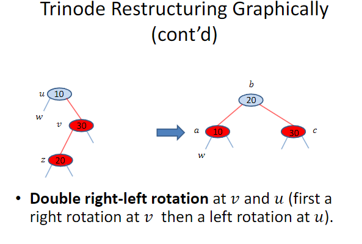
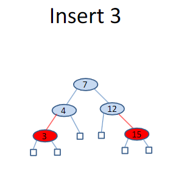
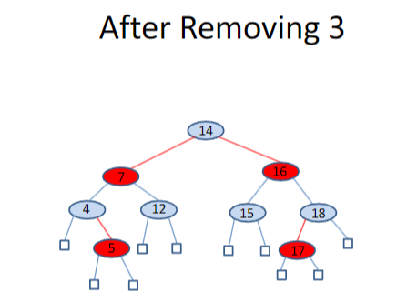
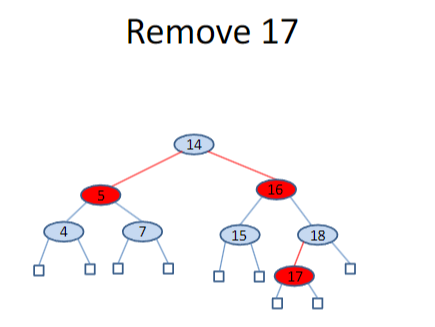

# Δέντρα Κόκκινο-Μαύρο (Red-Black Trees)

- Τα AVL δέντρα και τα δέντρα (2,4) έχουν πολύ καλές ιδιότητες, αλλά:
  - Τα AVL δέντρα μπορεί να χρειαστούν πολλές περιστροφές μετά από μια διαγραφή.
  - Τα δέντρα (2,4) μπορεί να απαιτήσουν πολλούς διαχωρισμούς ή συγχωνεύσεις μετά από μια ενημέρωση (εισαγωγή ή διαγραφή).

- Τα δέντρα κόκκινο-μαύρο (red-black trees) είναι μια δομή δεδομένων που απαιτεί μόνο **𝑶(1)** δομικές αλλαγές μετά από μια ενημέρωση ώστε να παραμείνει ισοζυγισμένη.

## Ορισμός

Ένα δέντρο κόκκινο-μαύρο είναι ένα δυαδικό δέντρο αναζήτησης (binary search tree) με κόμβους χρωματισμένους κόκκινους και μαύρους, με τρόπο που ικανοποιεί τις παρακάτω ιδιότητες:

- **Ιδιότητα Ρίζας (Root Property):** Η ρίζα είναι μαύρη.
- **Εξωτερική Ιδιότητα (External Property):** Κάθε εξωτερικός κόμβος είναι μαύρος.
- **Εσωτερική Ιδιότητα (Internal Property):** Τα παιδιά ενός κόκκινου κόμβου είναι μαύρα.
- **Ιδιότητα Βάθους (Depth Property):** Όλοι οι εξωτερικοί κόμβοι έχουν το ίδιο "μαύρο βάθος", το οποίο ορίζεται ως ο αριθμός των μαύρων προγόνων μείον ένα (θυμίζουμε ότι ένας κόμβος θεωρείται πρόγονος του εαυτού του).

* Τα δέντρα κόκκινο-μαύρο θα χρησιμοποιηθούν για την υλοποίηση δομών τύπου **map**, επομένως **δεν επιτρέπεται να έχουν διπλά κλειδιά**.

# Από τα Δέντρα (2,4) στα Δέντρα Κόκκινο-Μαύρο

Δεδομένου ενός δέντρου (2,4), μπορούμε να το μετατρέψουμε σε κόκκινο-μαύρο δέντρο εφαρμόζοντας τις παρακάτω μετατροπές για κάθε εσωτερικό κόμβο 𝑣:

- **Αν ο 𝑣 είναι 2-κόμβος**, τότε διατηρούμε τα (μαύρα) παιδιά του 𝑣 όπως είναι.
- **Αν ο 𝑣 είναι 3-κόμβος**, τότε δημιουργούμε έναν νέο κόκκινο κόμβο 𝑤, δίνουμε στον 𝑤 τα δύο πρώτα (μαύρα) παιδιά του 𝑣 και κάνουμε τον 𝑤 και το τρίτο παιδί του 𝑣 τα δύο παιδιά του 𝑣 (η συμμετρική μετατροπή είναι επίσης δυνατή — δες την επόμενη διαφάνεια).
- **Αν ο 𝑣 είναι 4-κόμβος**, τότε δημιουργούμε δύο νέους κόκκινους κόμβους 𝑤 και 𝑧, δίνουμε στον 𝑤 τα δύο πρώτα (μαύρα) παιδιά του 𝑣, δίνουμε στον 𝑧 τα δύο τελευταία (μαύρα) παιδιά του 𝑣, και κάνουμε τους 𝑤 και 𝑧 τα δύο παιδιά του 𝑣.

# Από Δέντρα Κόκκινο-Μαύρο σε Δέντρα (2,4)

Δεδομένου ενός δέντρου κόκκινο-μαύρο, μπορούμε να κατασκευάσουμε το αντίστοιχο δέντρο (2,4) εφαρμόζοντας την εξής διαδικασία:

- **Συγχώνευση Κόκκινου Κόμβου:** Κάθε κόκκινος κόμβος `𝑣` συγχωνεύεται με τον γονέα του. Το κλειδί που περιέχει ο `𝑣` αποθηκεύεται πλέον στον γονικό κόμβο, δημιουργώντας έτσι έναν κόμβο-3 ή κόμβο-4, ανάλογα με τον αριθμό των συνενώσεων.

- **Ανακατανομή Υποκόμβων:** Τα δύο παιδιά του `𝑣` γίνονται τα **αριστερό** και **δεξί παιδί** του `𝑣` στο νέο κόμβο (3-node ή 4-node).

---

## ✳️ Σχόλιο:

Αυτή η διαδικασία μετατροπής αντιστρέφει ουσιαστικά τη λογική της μετατροπής από δέντρο (2,4) σε κόκκινο-μαύρο. Οι κόκκινοι κόμβοι σε ένα δέντρο κόκκινο-μαύρο εκφράζουν τη συγχώνευση πολλών κλειδιών σε έναν πολυκόμβο (multi-node) στο δέντρο (2,4), επιτρέποντας έτσι πιο ευέλικτη αλλά ισοζυγισμένη αναπαράσταση της πληροφορίας.

Η μετατροπή αυτή είναι ιδιαίτερα χρήσιμη για ανάλυση και κατανόηση της εσωτερικής λειτουργίας των κόκκινο-μαύρων δέντρων, καθώς και για αποδοτική υλοποίηση λειτουργιών εισαγωγής και διαγραφής.

# Αναζήτηση σε Δέντρο Κόκκινο-Μαύρο

- Ο αλγόριθμος για την αναζήτηση μιας εγγραφής με κλειδί 𝑘 σε ένα δέντρο κόκκινο-μαύρο είναι **ακριβώς ίδιος** με τον αλγόριθμο αναζήτησης σε ένα δυαδικό δέντρο αναζήτησης.

- Η χειρότερη πολυπλοκότητα της αναζήτησης είναι:

𝑶(log 𝑛)

όπου 𝑛 είναι ο αριθμός των εγγραφών στο δέντρο.

---

# Ενημερώσεις (Updates)

- Οι λειτουργίες ενημέρωσης (εισαγωγές ή διαγραφές) σε δέντρο κόκκινο-μαύρο είναι **παρόμοιες** με εκείνες των δυαδικών δέντρων αναζήτησης, με την **επιπλέον προϋπόθεση** ότι δεν πρέπει να καταστραφούν οι ιδιότητες του χρωματισμού.

- Κατά την εκτέλεση μιας λειτουργίας ενημέρωσης σε ένα δέντρο κόκκινο-μαύρο 𝑇, είναι σημαντικό να έχουμε κατά νου την αντιστοιχία με ένα δέντρο (2,4) 𝑻′ και τους αντίστοιχους αλγόριθμους ενημέρωσης σε αυτό.

---

# Εισαγωγή (Insertion)

- Ας εξετάσουμε την εισαγωγή μιας νέας εγγραφής με κλειδί 𝑘 σε ένα δέντρο κόκκινο-μαύρο 𝑇.

- Θα ξεκινήσουμε με μερικά παραδείγματα εισαγών σε ένα αρχικά **κενό** δέντρο.

Σε αυτήν την περίπτωση, το προκύπτον δέντρο **παραβιάζει την εσωτερική ιδιότητα** των κόκκινο-μαύρων δέντρων. Αυτό το πρόβλημα πρέπει να διορθωθεί και θα δούμε τις λεπτομέρειες παρακάτω.

---

## 📌 Βήματα του Αλγορίθμου Εισαγωγής

- Εξετάζουμε την εισαγωγή μιας νέας εγγραφής με κλειδί 𝑘 σε ένα δέντρο κόκκινο-μαύρο 𝑇.
- Πραγματοποιούμε αναζήτηση για το 𝑘 στο 𝑇 μέχρι να φτάσουμε σε έναν **εξωτερικό κόμβο** του 𝑇.
- Αντικαθιστούμε αυτόν τον εξωτερικό κόμβο με έναν νέο **εσωτερικό κόμβο 𝑧**, ο οποίος αποθηκεύει το ζεύγος (𝑘, 𝑖) και έχει δύο παιδιά που είναι εξωτερικοί κόμβοι.

- Αν ο 𝑧 είναι η **ρίζα** του 𝑇, τον χρωματίζουμε **μαύρο**. Αλλιώς, τον χρωματίζουμε **κόκκινο**. Τα παιδιά του 𝑧 χρωματίζονται **μαύρα**.

- Αυτή η λειτουργία αντιστοιχεί στην εισαγωγή του (𝑘, 𝑖) σε κόμβο του αντίστοιχου δέντρου (2,4) 𝑇′ με εξωτερικά παιδιά.

- Η λειτουργία **διατηρεί** τις ιδιότητες της ρίζας, των εξωτερικών κόμβων και του βάθους, **αλλά ενδέχεται να παραβιάσει την εσωτερική ιδιότητα**.

---

## 🔴 Double Red (Διπλό Κόκκινο)

- Αν ο 𝑧 **δεν είναι η ρίζα** του 𝑇 και ο γονέας 𝑣 του 𝑧 είναι **κόκκινος**, τότε έχουμε γονέα και παιδί που είναι και οι δύο κόκκινοι — παραβίαση της εσωτερικής ιδιότητας.

- Λόγω της ιδιότητας της ρίζας, ο 𝑣 **δεν μπορεί** να είναι η ρίζα.

- Από τη στιγμή που η εσωτερική ιδιότητα **ίσχυε πριν**, ο παππούς 𝑢 του 𝑧 (δηλαδή ο γονέας του 𝑣) πρέπει να είναι **μαύρος**.

- Αυτή η κατάσταση ονομάζεται **double red** στον κόμβο 𝑧.

---

## 🛠 Αντιμετώπιση Double Red

Για να διορθώσουμε ένα **double red**, εξετάζουμε δύο περιπτώσεις:

### ▶️ Περίπτωση 1: Ο αδελφός 𝑤 του 𝑣 είναι **μαύρος**

- Το double red δηλώνει ότι δημιουργήσαμε στο κόκκινο-μαύρο δέντρο 𝑇 **λανθασμένη αναπαράσταση** ενός κόμβου-4 στο δέντρο (2,4) 𝑇′, ο οποίος έχει ως παιδιά τους τέσσερις μαύρους κόμβους: 𝑢, 𝑣 και 𝑧.

- Η λανθασμένη αναπαράσταση περιέχει έναν κόκκινο κόμβο (𝑣) που είναι γονέας ενός άλλου κόκκινου κόμβου (𝑧), ενώ θα έπρεπε να είναι **δύο κόκκινοι αδελφοί κόμβοι**.

- Για να διορθώσουμε αυτό το πρόβλημα, εφαρμόζουμε **αναδόμηση τριών κόμβων (trinode restructuring)** στο 𝑇.

---
# 🔁 Αναδόμηση Τριών Κόμβων (Trinode Restructuring)

- Παίρνουμε τον κόμβο 𝑧, τον γονέα του 𝑣 και τον παππού του 𝑢, και τους **ανα-label-άρουμε προσωρινά** ως 𝑎, 𝑏 και 𝑐, **με σειρά από αριστερά προς δεξιά**, έτσι ώστε να επισκέπτονται με αυτή τη σειρά σε **διάσχιση inorder** του δέντρου.

- Αντικαθιστούμε τον παππού 𝑢 με τον κόμβο που φέρει την ετικέτα 𝑏 και κάνουμε τους 𝑎 και 𝑐 παιδιά του 𝑏, **διατηρώντας τη σειρά inorder**.

- Μετά την αναδόμηση:
  - Ο 𝑏 γίνεται **μαύρος**
  - Οι 𝑎 και 𝑐 γίνονται **κόκκινοι**

✅ Έτσι, το πρόβλημα του **double red** αποκαθίσταται.

---

## 🔄 Αναδόμηση Τριών Κόμβων και Περιστροφές

- Η αναδόμηση τριών κόμβων που μόλις περιγράψαμε **αντιστοιχεί ακριβώς** στις τέσσερις περιπτώσεις **περιστροφών** που είχαμε συζητήσει για τα AVL δέντρα.

- Στο παρακάτω σχήμα (εφόσον υπάρχει), παρουσιάζονται γραφικά οι **τέσσερις υποπεριπτώσεις** της Περίπτωσης 1 για τους κόμβους 𝑣, 𝑢, 𝑧 και 𝑤, καθώς και οι αντίστοιχες περιστροφές που αποκαθιστούν την **εσωτερική ιδιότητα**.

---

📌 **Συνοψίζοντας:**
Η αναδόμηση τριών κόμβων είναι μια κομψή και γενική τεχνική που:
- Λειτουργεί και για κόκκινο-μαύρα και για AVL δέντρα.
- Αντιμετωπίζει καταστάσεις όπου δημιουργούνται ανισορροπίες ή παραβιάζονται ιδιότητες δομής.

# ➕ Εισαγωγή (συνέχεια)

## 🔴 Περίπτωση 2: Ο αδελφός 𝑤 του 𝑣 είναι κόκκινος

- Σε αυτή την περίπτωση, το **double red** υποδηλώνει **overflow** στον αντίστοιχο κόμβο του δέντρου (2,4) 𝑇′.

---

## 🔧 Επίλυση του προβλήματος (Αναχρωματισμός)

- Για να διορθώσουμε αυτό το πρόβλημα, εκτελούμε το αντίστοιχο μιας **λειτουργίας split** στο (2,4) δέντρο.

- Δηλαδή, κάνουμε **αναχρωματισμό** των κόμβων:

  - Ο 𝑣 και ο 𝑤 (τα δύο κόκκινα παιδιά) γίνονται **μαύροι**
  - Ο γονέας τους, 𝑢, γίνεται **κόκκινος**
    - **Εξαίρεση:** Αν ο 𝑢 είναι η **ρίζα**, τότε παραμένει **μαύρος**.

---

✅ Με αυτόν τον αναχρωματισμό, αποκαθίστανται οι ιδιότητες των κόκκινο-μαύρων δέντρων και το πρόβλημα του **double red** μεταφέρεται ενδεχομένως προς τα πάνω, αλλά δεν επιδεινώνεται.

# 🎨 Αναχρωματισμός vs. 🔁 Αναδόμηση Τριών Κόμβων

## 🔁 Αναδόμηση Τριών Κόμβων (Trinode Restructuring)
- Περιλαμβάνει **τοπική αναδιάρθρωση** του δέντρου.
- Υλοποιείται με **τροποποίηση των δεικτών (pointers)**.
- Περιλαμβάνει και **αλλαγές χρώματος**.
- Χρησιμοποιείται όταν έχουμε **κόκκινο γονέα και μαύρο θείο** ➝ Περίπτωση 1.

## 🎨 Αναχρωματισμός (Recoloring)
- Περιλαμβάνει **μόνο αλλαγές χρωμάτων**.
- Η **δομή του δέντρου παραμένει αμετάβλητη**.
- Χρησιμοποιείται όταν έχουμε **κόκκινο γονέα και κόκκινο θείο** ➝ Περίπτωση 2.

> ⚠️ Ο όρος **"αναχρωματισμός"** δεν πρέπει να χρησιμοποιείται στην περίπτωση της **αναδόμησης**, ακόμα κι αν αλλάζουν χρώματα!

---

# ➕ Εισαγωγή (συνέχεια)

## 🔁 Επαναλαμβανόμενο Double Red
- Μετά από έναν **αναχρωματισμό**, το πρόβλημα του **double red** μπορεί να **εμφανιστεί ξανά** στον παππού 𝑢 του κόμβου 𝑧, **αν ο 𝑢 έχει κόκκινο γονέα**.

- Σε αυτή την περίπτωση, **επαναλαμβάνουμε** τις δύο περιπτώσεις (αναχρωματισμός ή αναδόμηση).

---

## 🔁➡️⛔️ Τερματισμός Εισαγωγής

- Συνεχίζουμε **προς τα πάνω στο δέντρο** κάνοντας αναχρωματισμούς μέχρι να λυθεί πλήρως το πρόβλημα του double red:
  - είτε με **τελικό αναχρωματισμό**
  - είτε με **αναδόμηση τριών κόμβων**

---

### ⏱️ Πολυπλοκότητα Αναχρωματισμών
- Ο μέγιστος αριθμός αναχρωματισμών μετά από εισαγωγή είναι:
  - το πολύ **το μισό του ύψους** του δέντρου 𝑇
  - δηλαδή, το πολύ **log(𝑛 + 1)** σύμφωνα με το θεώρημα για το ύψος κόκκινο-μαύρου δέντρου.

---

## 🧪 Παράδειγμα
> Στη συνέχεια παρουσιάζονται παραδείγματα εισαγωγών σε ένα αρχικά κενό κόκκινο-μαύρο δέντρο.

Βρισκόμαστε στην Περίπτωση 1
Θα πραγματοποιήσουμε αναδιάρθρωση τριών κόμβων, δηλαδή αριστερή περιστροφή στον κόμβο 4.

Βρισκόμαστε στην Περίπτωση 2
Θα πραγματοποιήσουμε επαναχρωματισμό των κόμβων.

Βρισκόμαστε στην Περίπτωση 1
Θα κάνουμε αναδιάρθρωση τριών κόμβων (trinode restructuring) με διπλή περιστροφή δεξιά-αριστερά (right-left) στους κόμβους 15 και 12

Βρισκόμαστε στην Περίπτωση 2
Θα πραγματοποιήσουμε επαναχρωματισμό των κόμβων.

Βρισκόμαστε στην Περίπτωση 1
Θα πραγματοποιήσουμε αναδιάρθρωση τριών κόμβων (trinode restructuring) με διπλή περιστροφή δεξιά-αριστερά (right-left rotation) στους κόμβους 18 και 15.

Βρισκόμαστε στην Περίπτωση 2
Θα πραγματοποιήσουμε επαναχρωματισμό των κόμβων.

Βρισκόμαστε στην Περίπτωση 1
Θα κάνουμε αναδιάρθρωση τριών κόμβων (trinode restructuring) με αριστερή περιστροφή στον κόμβο 7

# 📌 Πρόταση

> Η εισαγωγή ενός ζεύγους (κλειδί-τιμή) σε ένα κόκκινο-μαύρο δέντρο που περιέχει 𝑛 καταχωρίσεις:

- Μπορεί να υλοποιηθεί σε χρόνο **𝑂(log 𝑛)**
- Απαιτεί **𝑂(log 𝑛) αναχρωματισμούς**
- Και το πολύ **μία αναδόμηση τριών κόμβων (trinode restructuring)**

---

# ❌ Διαγραφή (Removal)

Ας δούμε τώρα πώς γίνεται η διαγραφή μιας καταχώρισης με κλειδί 𝑘 από ένα κόκκινο-μαύρο δέντρο 𝑇.

📌 Πριν παρουσιάσουμε τον αλγόριθμο, θα δούμε μερικά **παραδείγματα διαγραφής** από ένα υπάρχον κόκκινο-μαύρο δέντρο.

Για να διαγράψουμε τον κόμβο 14:
Βρίσκουμε το κλειδί που έρχεται αμέσως μετά το 14 στη φυσική αύξουσα σειρά των κλειδιών, δηλαδή το 15.

Μετακινούμε το 15 στη θέση του 14,

Και στη συνέχεια διαγράφουμε τον 15 από το δέντρο.

# ❌ Διαγραφή (συνέχεια)

> Το παραγόμενο δέντρο **δεν είναι πλέον κόκκινο-μαύρο** γιατί έχει παραβιαστεί η **ιδιότητα του βάθους** (depth property) για τον εξωτερικό κόμβο-παιδί του κόμβου με κλειδί `16`.

---

## 🔍 Βήματα Αλγορίθμου Διαγραφής

1. **Αναζήτηση του κλειδιού 𝑘**:
   - Όπως και σε δυαδικό δέντρο αναζήτησης, εντοπίζουμε τον κόμβο 𝑢 που περιέχει το κλειδί 𝑘.

2. **Αν ο 𝑢 δεν έχει εξωτερικό παιδί**:
   - Εντοπίζουμε τον **επόμενο κόμβο 𝑣** στην ενδοδιάταξη (inorder) του δέντρου.
   - Ο κόμβος αυτός έχει εξωτερικό παιδί.
   - **Αντιγράφουμε** την καταχώριση του 𝑣 στον 𝑢 και συνεχίζουμε τη **διαγραφή από τον 𝑣**.

3. ➤ Συνεπώς, αρκεί να μελετήσουμε την **περίπτωση διαγραφής από κόμβο 𝑣 με εξωτερικό παιδί 𝑤**.

---

## 🔧 Διαγραφή από Κόμβο με Εξωτερικό Παιδί

- Έστω:
  - `𝑣` ο κόμβος που περιέχει το κλειδί 𝑘
  - `𝑤` το εξωτερικό παιδί του 𝑣
  - `𝑟` ο αδελφός του 𝑤
  - `𝑥` ο γονέας του 𝑣

### Βήματα:

1. **Διαγράφουμε τους κόμβους 𝑣 και 𝑤**.
2. **Κάνουμε τον 𝑟 παιδί του 𝑥**.

---

## ✅ Περίπτωση 1:
- Αν ο 𝑣 ήταν **κόκκινος**, τότε ο 𝑟 είναι **μαύρος**:
  - **Καμία ιδιότητα** δεν παραβιάζεται. ✅ Τέλος.

## 🔄 Περίπτωση 2:
- Αν ο 𝑟 είναι **κόκκινος** (άρα ο 𝑣 ήταν μαύρος):
  - Παραβιάζεται η **ιδιότητα βάθους**.
  - ➤ Χρωματίζουμε τον 𝑟 **μαύρο** για **επαναφορά της ιδιότητας**.

> Υπάρχουν και οι **συμμετρικές περιπτώσεις**, όταν ο 𝑣 είναι **αριστερό παιδί** του 𝑥 (και αντίστοιχα για τους 𝑟 και 𝑤).

---

📌 Οι παραπάνω δύο περιπτώσεις παρουσιάζονται γραφικά στην επόμενη διαφάνεια της διάλεξης.

# ❌ Διαγραφή (συνέχεια)

## ⚠️ Περίπτωση: Και οι 𝑟 και 𝑣 είναι μαύροι

- Αν και ο 𝒓 **και ο 𝒗 είναι μαύροι**, τότε παραβιάζεται η **ιδιότητα βάθους** (depth property).
- Για να τη διατηρήσουμε, θεωρούμε ότι ο 𝑟 παίρνει ένα **φανταστικό χρώμα: διπλό μαύρο (double black)**.

> Αυτή η κατάσταση αποτελεί **παραβίαση χρώματος** και ονομάζεται **double black problem**.

- Το διπλό μαύρο στο κόμβο 𝑟 αντιστοιχεί σε **υπερχείλιση (underflow)** στο αντίστοιχο δέντρο (2,4) 𝑇′.

---

## 🛠️ Επίλυση του Double Black

Για την επίλυση της παραβίασης, εξετάζουμε **3 περιπτώσεις**, ανάλογα με:

1. Το **χρώμα του αδελφού** 𝑦 του 𝑟, και
2. Το **χρώμα των παιδιών** του 𝑦.

---

## 🧩 Περίπτωση 1: Ο 𝒚 είναι μαύρος και έχει κόκκινο παιδί 𝒛

- Αυτή η περίπτωση αντιστοιχεί σε **μεταφορά (transfer)** στο δέντρο (2,4) 𝑇′.
- Για την επίλυση εφαρμόζουμε **αναδόμηση τριών κόμβων (trinode restructuring)**.

### 🔄 Βήματα:

1. Παίρνουμε τους κόμβους:
   - `𝑧` (κόκκινο παιδί του 𝑦),
   - `𝑦` (γονέας του 𝑧),
   - `𝑥` (παππούς του 𝑧 / γονέας του 𝑦).

2. Τους ανακαλούμε προσωρινά ως `𝑎`, `𝑏`, `𝑐` **από αριστερά προς δεξιά** (inorder).

3. **Αντικαθιστούμε τον 𝑥** με τον κόμβο `𝑏`, και κάνουμε τους `𝑎` και `𝑐` παιδιά του.

4. Επαναχρωματίζουμε:
   - `𝑎` και `𝑐` γίνονται **μαύροι**,
   - `𝑏` παίρνει το **πρώην χρώμα του 𝑥**,
   - ο **διπλά μαύρος 𝑟 γίνεται απλώς μαύρος**.

### ✅ Αποτέλεσμα:

- Το μονοπάτι `𝑏 − 𝑐 − 𝑟` περιέχει τώρα **δύο μαύρους κόμβους**, άρα η παραβίαση διορθώνεται.

---

📌 Οι άλλες δύο περιπτώσεις (όπου ο αδελφός είναι κόκκινος ή μαύρος χωρίς κόκκινα παιδιά) θα παρουσιαστούν στις επόμενες διαφάνειες.

# ❌ Διαγραφή (συνέχεια)

## ⚠️ Double Black — Περίπτωση 2

### 🧩 Περίπτωση 2:
Ο **αδελφός 𝑦** του διπλά μαύρου κόμβου 𝑟 είναι **μαύρος** και **τα παιδιά του 𝑦 είναι και αυτά μαύρα**.

> Η περίπτωση αυτή αντιστοιχεί σε **συγχώνευση (fusion)** στο αντίστοιχο δέντρο (2,4) 𝑇′.

---

## 🛠️ Επίλυση με Αναχρωματισμό (Recoloring)

1. Ο 𝑟 γίνεται **απλά μαύρος** (παύει να είναι διπλά μαύρος).
2. Ο αδελφός 𝑦 γίνεται **κόκκινος**.
3. Αν ο πατέρας 𝑥 του 𝑟 ήταν **κόκκινος**, τον κάνουμε **μαύρο**.
4. Αλλιώς (αν ήταν ήδη μαύρος), τον κάνουμε **διπλά μαύρο**.

---

## 🔁 Επανάληψη Αναχρωματισμού

- Αν ο 𝑥 έγινε διπλά μαύρος, τότε το **πρόβλημα διπλού μαύρου "ανεβαίνει" στον πατέρα**.
- Επαναλαμβάνουμε τη διαδικασία, εξετάζοντας ξανά τις τρεις περιπτώσεις για τον νέο διπλά μαύρο κόμβο.

---

## 📌 Παρατηρήσεις

- Η συγχώνευση σε κόκκινο-μαύρο δέντρο ισοδυναμεί με το **σπάσιμο (split)** ενός 3-κόμβου ή 4-κόμβου στο (2,4) δέντρο.
- Αν χρειαστεί, μπορεί να φτάσουμε μέχρι τη ρίζα για να λυθεί το πρόβλημα.

Επαναχρωματισμός (Recoloring) σε Red-Black Δέντρο που Προκαλεί/Μεταδίδει το Πρόβλημα της Διπλής Μαυρίλας (Double Black)

# ❌ Διαγραφή (συνέχεια)

## ⚠️ Double Black — Περίπτωση 3

### 🧩 Περίπτωση 3:
Ο **αδελφός 𝑦** του διπλά μαύρου κόμβου 𝑟 είναι **κόκκινος**.

> Αυτή η περίπτωση αντιστοιχεί σε **πράξη προσαρμογής (adjustment operation)** στο κόκκινο-μαύρο δέντρο.

---

## 🛠️ Επίλυση με Προσαρμογή

1. Αν 𝑦 είναι **δεξί παιδί** του 𝑥, τότε θέτουμε 𝑧 = δεξί παιδί του 𝑦.
2. Αν 𝑦 είναι **αριστερό παιδί** του 𝑥, τότε θέτουμε 𝑧 = αριστερό παιδί του 𝑦.
3. Εκτελούμε **αναδόμηση τριών κόμβων (trinode restructuring)** στα 𝑥, 𝑦, 𝑧.
4. Κάνουμε:
   - **Το 𝑦 πατέρα του 𝑥**
   - **Χρωματίζουμε 𝑦 μαύρο**
   - **Χρωματίζουμε 𝑥 κόκκινο**

---

## 🔁 Μετά την Προσαρμογή:

- Ο αδελφός του 𝑟 είναι πλέον **μαύρος**.
- Η κατάσταση έχει **μετατραπεί σε Περίπτωση 1 ή Περίπτωση 2**.
- Αν είναι Περίπτωση 2, **το πρόβλημα διπλού μαύρου δεν μπορεί να επανεμφανιστεί** γιατί ο γονέας είναι τώρα κόκκινος.

---

## ✅ Συμπέρασμα:

- Χρειάζεται **το πολύ μία πράξη προσαρμογής** σε κάθε διαγραφή.
- Μετά την προσαρμογή, μπορούμε να επιλύσουμε το πρόβλημα με μία από τις προηγούμενες περιπτώσεις.

# 🗑️ Διαγραφή σε Red-Black Tree

## 🕒 Πολυπλοκότητα
- **Χρόνος εκτέλεσης**: 𝑶(log 𝒏)
- **Αναχρωματισμοί**: 𝑶(log 𝒏)
- **Αναδομήσεις**: το πολύ **μία προσαρμογή (adjustment)** + **μία αναδόμηση τριών κόμβων (trinode restructuring)**

---

## 🛠️ Διαδικασία Διαγραφής

1. **Εύρεση κόμβου** 𝑣 με κλειδί 𝑘 (όπως σε Binary Search Tree).
2. Αν 𝑣 δεν έχει εξωτερικό παιδί, βρες τον **inorder διάδοχο** και αντάλλαξε.
3. Αφαίρεσε κόμβο 𝑣 με **εξωτερικό παιδί 𝑤**:
   - Αν 𝑣 είναι **κόκκινο** → απλά διαγράφεται.
   - Αν 𝑟 είναι **κόκκινο** → χρωμάτισε το **𝑟 μαύρο**.
   - Αν και 𝑣 και 𝑟 είναι **μαύροι** → προκύπτει **double black**.

---

## ⚠️ Double Black — Περιπτώσεις

### 🔲 Περίπτωση 1:
- Αδελφός 𝑦 είναι **μαύρος** με **τουλάχιστον ένα κόκκινο παιδί** → κάνε **αναδόμηση 3 κόμβων**.

### ⚫ Περίπτωση 2:
- Αδελφός 𝑦 είναι **μαύρος** με **μαύρα παιδιά** → **αναχρωματισμός**:
  - 𝑟 → μαύρο
  - 𝑦 → κόκκινο
  - Αν 𝑥 είναι κόκκινο → μαύρο, αλλιώς → διπλό μαύρο και συνέχιση αναδρομικά.

### 🔴 Περίπτωση 3:
- Αδελφός 𝑦 είναι **κόκκινος**:
  - Κάνε **adjustment**: κάνε τον 𝑦 πατέρα του 𝑥 (μέσω αναδόμησης), και χρωμάτισέ τον μαύρο.
  - Μετατρέπεται σε Περίπτωση 1 ή 2 και συνεχίζουμε.

---

## ✅ Τελικό Συμπέρασμα
- Η διαγραφή σε Red-Black Tree διατηρεί όλα τα **πέντε ιδιότητες** με:
  - Το πολύ **𝑶(log 𝒏)** κόστη για αναχρωματισμούς,
  - Και **1 adjustment + 1 αναδόμηση 3 κόμβων**.

φαίρεση από ένα Red-Black Tree

Ας δούμε μερικά παραδείγματα διαγραφών από ένα δεδομένο Red-Black Tree.

• Ένας μαύρος κόμβος διαγράφεται, οπότε θα δημιουργηθεί μια διπλή μαυρίλα (double black).

Βρισκόμαστε στην Περίπτωση 1
Χρειαζόμαστε αναδιάρθρωση τριών κόμβων (trinode restructuring) με διπλή περιστροφή αριστερά-δεξιά (left-right) στους κόμβους 4 και 7.

Ένας μαύρος κόμβος διαγράφεται, οπότε δημιουργείται μια διπλή μαυρίλα (double black).

## Σύνοψη

* Η δομή δεδομένων του Red-Black Tree είναι ελαφρώς πιο πολύπλοκη από το αντίστοιχο (2,4) δέντρο.

* Παρ' όλα αυτά, το Red-Black Tree έχει το εννοιολογικό πλεονέκτημα ότι απαιτεί μόνο έναν σταθερό αριθμό τριπλών αναδομήσεων (trinode restructurings) για την αποκατάσταση της ισορροπίας μετά από μία ενημέρωση (update).