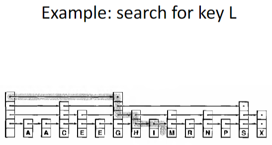

# Λίστες Παράλειψης (Skip Lists)

- **Θα εξετάσουμε τώρα μία προσέγγιση για την ανάπτυξη μιας ταχείας υλοποίησης των λειτουργιών πίνακα συμβόλων**, η οποία αρχικά φαίνεται να είναι εντελώς διαφορετική από τις μεθόδους που βασίζονται σε δέντρα, τις οποίες έχουμε εξετάσει μέχρι τώρα. Ωστόσο, στην πραγματικότητα σχετίζεται στενά με αυτές.

- **Η προσέγγιση βασίζεται σε μια τυχαιοκρατική ή πιθανοτική δομή δεδομένων** και είναι σχεδόν βέβαιο ότι παρέχει σχεδόν βέλτιστη απόδοση για τις βασικές λειτουργίες του αφηρημένου τύπου δεδομένων (ADT) πίνακας συμβόλων.

- **Η δομή δεδομένων ονομάζεται λίστα παράλειψης (skip list).** Χρησιμοποιεί επιπλέον συνδέσμους στους κόμβους μιας συνδεδεμένης λίστας για να παραλείπει μεγάλα τμήματα της λίστας κατά την αναζήτηση.


# Σημειώσεις

- **Η προηγούμενη διαφάνεια δείχνει ένα παράδειγμα λίστας παράλειψης**, όπου κάθε τρίτος κόμβος σε μια ταξινομημένη συνδεδεμένη λίστα περιέχει έναν επιπλέον σύνδεσμο, ο οποίος μας επιτρέπει να παραλείπουμε τρεις κόμβους στη λίστα. Αυτοί οι σύνδεσμοι ονομάζονται "προωθητικοί σύνδεσμοι" ή "δείκτες προώθησης".

- **Μπορούμε να χρησιμοποιήσουμε αυτούς τους επιπλέον συνδέσμους για να επιταχύνουμε την αναζήτηση** ως εξής:
  - Σαρώνουμε την ανώτερη λίστα μέχρι να βρούμε το κλειδί ή έναν κόμβο με μικρότερο κλειδί, ο οποίος έχει σύνδεσμο προς έναν κόμβο με μεγαλύτερο κλειδί από αυτό που αναζητούμε.
  - Στη συνέχεια, χρησιμοποιούμε τους συνδέσμους στο κάτω επίπεδο για να ελέγξουμε τους δύο ενδιάμεσους κόμβους.

- **Αυτή η μέθοδος επιταχύνει την αναζήτηση κατά έναν παράγοντα 3**, επειδή εξετάζουμε μόνο *k/3* κόμβους σε μια επιτυχημένη αναζήτηση για τον *k*-οστό κόμβο της λίστας.
---

# Σημειώσεις (συνέχεια)

- **Μπορούμε να επαναλάβουμε αυτή την κατασκευή**, προσθέτοντας και δεύτερο επιπλέον σύνδεσμο ώστε να μπορούμε να σαρώνουμε ακόμη πιο γρήγορα μέσω των κόμβων με έξτρα συνδέσμους, και ούτω καθεξής.

- **Μπορούμε επίσης να γενικεύσουμε την κατασκευή**, παραλείποντας μεταβλητό αριθμό κόμβων με κάθε σύνδεσμο. Δες το παράδειγμα στην επόμενη διαφάνεια.

*Δομές Δεδομένων και Προγραμματισμός*


# Ορισμός

- **Μια λίστα παράλειψης είναι μια ταξινομημένη συνδεδεμένη λίστα**, όπου κάθε κόμβος περιέχει μεταβλητό αριθμό από συνδέσμους (προωθητικούς δείκτες). Οι *i*-στοι δείκτες στους κόμβους υλοποιούν απλές (μονές) συνδεδεμένες λίστες, οι οποίες παραλείπουν κόμβους που έχουν λιγότερους από *i* συνδέσμους.

*Δομές Δεδομένων και Τεχνικές Προγραμματισμού – Διαφάνεια 7*

---

# Ορισμός λίστας παράλειψης – Skip List Definition

```c
typedef struct STnode* link;

struct STnode {
    Item item;
    link* next;
    int sz;
};

static link head, z;
static int N, lgN;
```

# Σημειώσεις

- **Το στοιχείο `next` σε έναν κόμβο λίστας παράλειψης είναι ένας πίνακας από συνδέσμους** (προωθητικούς δείκτες). Με άλλα λόγια, κάθε κόμβος σε μια λίστα παράλειψης έχει έναν πίνακα από δείκτες τύπου `next`—`next[0]`, `next[1]`, ..., `next[k]`. Κάθε `next[i]` αντιπροσωπεύει έναν προωθητικό σύνδεσμο στο επίπεδο *i*.

- **Το στοιχείο `sz` ενός κόμβου λίστας παράλειψης είναι ο αριθμός των συνδέσμων στον κόμβο** (απεικονίζονται ως βέλη ή κουκκίδες στα διαγράμματα). Αυτό ονομάζεται *αριθμός επιπέδων προώθησης*.

- **Το πεδίο `item` αποθηκεύει το αντικείμενο του κόμβου της λίστας.**

- **Η μεταβλητή `N` διατηρεί τον αριθμό των στοιχείων στη λίστα.**

- **Η μεταβλητή `lgN` είναι ο τρέχων μέγιστος αριθμός επιπέδων προώθησης σε έναν κόμβο της λίστας παράλειψης.**

- **Το `z` είναι ένας κόμβος φρουρός (sentinel)** – θα δούμε παρακάτω πώς χρησιμοποιείται. Το `z` δεν εμφανίζεται στα διαγράμματα· αντί για αυτό εμφανίζεται ένας δείκτης `NULL` (μια κουκκίδα).


---

# Αρχικοποίηση λίστας παράλειψης

```c
void STinit(int max)
{
    N = 0;
    lgN = 0;
    z = NEW(maxKey, 0);
    head = NEW(maxKey, max);
}

```
# Συνάρτηση NEW – Δημιουργία νέου κόμβου λίστας παράλειψης

```c
link NEW(Item item, int k)
{
    int i;
    link x = malloc(sizeof *x);
    x->next = malloc(k * sizeof(link));
    x->item = item;
    x->sz = k;
    for (i = 0; i < k; i++)
        x->next[i] = z;
    return x;
}
```


# Σημειώσεις

- **Οι κόμβοι σε λίστες παράλειψης έχουν έναν πίνακα από συνδέσμους**, επομένως η συνάρτηση `NEW` πρέπει να δεσμεύσει χώρο για τον πίνακα και να αρχικοποιήσει τους συνδέσμους στον κόμβο φρουρό `z`.

- **Η σταθερά `lgNmax` είναι ο μέγιστος αριθμός επιπέδων προώθησης** που επιτρέπουμε στη λίστα. Μπορεί να οριστεί στο 5 για πολύ μικρές λίστες ή στο 30 για πολύ μεγάλες λίστες.

- **Μια κενή λίστα παράλειψης είναι ένας αρχικός (header) κόμβος με `lgNmax` συνδέσμους**, όλοι αρχικοποιημένοι να δείχνουν στον φρουρό `z`, ενώ οι μεταβλητές `N` και `lgN` είναι 0.

- **Με άλλα λόγια, για να αρχικοποιήσουμε μια λίστα παράλειψης**, δημιουργούμε έναν αρχικό κόμβο με τον μέγιστο επιτρεπτό αριθμό επιπέδων και δείκτες σε όλα τα επίπεδα προς τον κόμβο φρουρό `z`.

- **Για λόγους απλότητας, θεωρούμε ότι τα στοιχεία και τα κλειδιά είναι το ίδιο πράγμα**, και ότι είναι ακέραιοι αριθμοί (`int`).

- **Ο κόμβος φρουρός `z` περιέχει στοιχείο/κλειδί `maxKey`**, το οποίο είναι μεγαλύτερο από όλα τα κλειδιά της λίστας (θα δούμε παρακάτω πώς χρησιμοποιείται στην αναζήτηση).

- **Σημαντικό**: Η συνάρτηση `NEW` δεσμεύει **δύο διαφορετικά μπλοκ μνήμης**:
  - Ένα για τη δομή `STnode` μέσω της εντολής:
    ```c
    link x = malloc(sizeof *x);
    ```
  - Ένα για τον δυναμικό πίνακα `next` μέσω της εντολής:
    ```c
    x->next = malloc(k * sizeof(link));
    ```

- **Γι' αυτό πρέπει να είμαστε προσεκτικοί όταν διαγράφουμε έναν κόμβο**, ώστε να αποδεσμεύουμε σωστά και πλήρως τον χώρο μνήμης που χρησιμοποιεί.




# Αναζήτηση σε λίστες παράλειψης (Skip Lists)

- Για να αναζητήσουμε ένα συγκεκριμένο κλειδί σε μια λίστα παράλειψης:
  - Ξεκινάμε από την κορυφαία λίστα, από τον αρχικό (header) κόμβο, και σαρώνουμε μέχρι να βρούμε το κλειδί ή έναν κόμβο που έχει σύνδεσμο σε επόμενο κόμβο με μεγαλύτερο κλειδί.
  - Έπειτα, κατεβαίνουμε στο επόμενο (χαμηλότερο) επίπεδο από τον ίδιο κόμβο και επαναλαμβάνουμε τη διαδικασία.
  - Αν ο επόμενος κόμβος έχει κλειδί μικρότερο από το ζητούμενο, συνεχίζουμε από αυτόν στο ίδιο επίπεδο.
  - Συνεχίζουμε με αυτόν τον τρόπο μέχρι να βρούμε το κλειδί ή να αποτύχει η αναζήτηση στο κατώτερο επίπεδο.

---

# Κώδικας Αναζήτησης σε Skip List

```c
Item searchR(link t, Key v, int k)
{
    if (eq(v, key(t->item))) return t->item;
    if (less(v, key(t->next[k]->item))) {
        if (k == 0) return NULLitem;
        return searchR(t, v, k - 1);
    }
    return searchR(t->next[k], v, k);
}

Item STsearch(Key v)
{
    return searchR(head, v, lgN);
}
```

# Σημειώσεις για την Αναζήτηση

- Όταν `k = 0`, ο κώδικας είναι ισοδύναμος με την αναζήτηση σε **απλές (singly) συνδεδεμένες λίστες**.
- Γενικά:
  - Αν το κλειδί στον **επόμενο κόμβο στο επίπεδο `k`** είναι **μικρότερο** από το ζητούμενο κλειδί, μετακινούμαστε εκεί.
  - Διαφορετικά, **κατεβαίνουμε στο επίπεδο `k - 1`**.
- Για απλότητα, θεωρούμε ότι **όλες οι λίστες καταλήγουν** στον φρουρό `z`, ο οποίος έχει:
  - `item = NULLitem`
  - `key = maxKey`, που είναι μεγαλύτερο από όλα τα κλειδιά στη λίστα.
---

# Πρόσθετες Παρατηρήσεις

- Ο παραπάνω κώδικας μοιάζει πολύ με:
  - **Δυαδική αναζήτηση** ή
  - **Αναζήτηση σε δυαδικά δέντρα αναζήτησης**.
- Βήματα:
  1. Ελέγχεται αν ο τρέχων κόμβος έχει το ζητούμενο κλειδί.
  2. Αν όχι, γίνεται σύγκριση του κλειδιού του κόμβου με αυτό που αναζητάμε.
  3. Ανάλογα με το αποτέλεσμα, γίνεται διαφορετική **αναδρομική κλήση**.


---

# Εισαγωγή σε Λίστα Παράλειψης

- Το πρώτο βήμα κατά την εισαγωγή νέου κόμβου σε skip list είναι να **καθορίσουμε τον αριθμό συνδέσμων (επίπεδα προώθησης)** του κόμβου.
- Όλοι οι κόμβοι έχουν **τουλάχιστον έναν σύνδεσμο**.
- Στο **δεύτερο επίπεδο**, μπορούμε να παραλείψουμε *t* κόμβους κάθε φορά αν **ένας στους *t* κόμβους έχει δύο συνδέσμους**.
- Επαναλαμβάνοντας αυτή τη λογική:
  - Θέλουμε **ένας στους *tʲ* κόμβους να έχει τουλάχιστον *j + 1* συνδέσμους**.
  - Αυτό επιτυγχάνει **λογαριθμική ισορροπία** στο ύψος των επιπέδων.

- Για να δημιουργήσουμε κόμβους με αυτήν την ιδιότητα (στατιστική κατανομή επιπέδων), χρησιμοποιούμε τυχαιοποίηση με μια συνάρτηση `randX` που επιστρέφει *i* με πιθανότητα `1 / 2^i`.
- Όταν καθοριστεί η τιμή *i*, δημιουργούμε νέο κόμβο με *i* συνδέσμους και τον εισάγουμε στη λίστα παράλειψης με την ίδια **αναδρομική διαδικασία** όπως και στην αναζήτηση.
- Αφού φτάσουμε στο επίπεδο `i - 1`, εισάγουμε τον νέο κόμβο σε κάθε επίπεδο, καθώς κατεβαίνουμε προς τα κάτω.
- Σε αυτό το σημείο, έχουμε διασφαλίσει ότι το στοιχείο του τρέχοντος κόμβου είναι μικρότερο από το κλειδί προς εισαγωγή και ότι οι σύνδεσμοι στο επίπεδο `i - 1` οδηγούν σε κόμβο με κλειδί όχι μικρότερο από αυτό.

# Κώδικας Εισαγωγής σε Skip List

```c
void insertR(link t, link x, int k)
{
    Key v = key(x->item);
    if (less(v, key(t->next[k]->item)))
    {
        if (k < x->sz)
        {
            x->next[k] = t->next[k];
            t->next[k] = x;
        }
        if (k == 0) return;
        insertR(t, x, k - 1);
        return;
    }
    insertR(t->next[k], x, k);
}

void STinsert(Key v)
{
    insertR(head, NEW(v, randX()), lgN);
    N++;
}
```

# Επεξηγήσεις: Εισαγωγή σε Skip List

Η `insertR` είναι μια **αναδρομική συνάρτηση** που εισάγει τον κόμβο `x` σε κατάλληλες θέσεις σε όλα τα **επιτρεπτά επίπεδα** (μέχρι το `sz` του κόμβου).

## 🔁 Βήματα Αναδρομής

1. Αν το κλειδί του νέου κόμβου `v` είναι **μικρότερο** από το κλειδί του επόμενου κόμβου στο επίπεδο `k`, τότε:
   - Αν ισχύει `k < x->sz`, τότε **εισάγουμε** τον κόμβο `x` στο επίπεδο `k`:
     ```c
     x->next[k] = t->next[k];
     t->next[k] = x;
     ```
   - Αν `k == 0`, η αναδρομή **τερματίζεται** (φτάσαμε στο χαμηλότερο επίπεδο).
   - Διαφορετικά, η συνάρτηση **συνεχίζει προς τα κάτω**:
     ```c
     insertR(t, x, k - 1);
     ```

2. Αν το κλειδί του `x` **δεν είναι μικρότερο**, μετακινούμαστε δεξιά:
```c
   insertR(t->next[k], x, k);
```
# Αναλυτικές Σημειώσεις για την Εισαγωγή και την randX

## insertR – Αναδρομική Εισαγωγή

- Στον κώδικα της προηγούμενης διαφάνειας, η `insertR` καλείται ως εξής:

```c
  insertR(head, NEW(v, randX()), lgN);
```

Δηλαδή, με κόμβο που δημιουργείται με τη NEW και έχει τυχαίο αριθμό επιπέδων, όπως ορίζεται από τη randX.

Η insertR λειτουργεί παρόμοια με τη searchR:

Όταν φτάσουμε στο επίπεδο k = (x->sz) - 1, τότε ενσωματώνουμε τον νέο κόμβο στη λίστα κάθε φορά που κατεβαίνουμε επίπεδο.

Η ενσωμάτωση γίνεται μέσω:

```c
x->next[k] = t->next[k];
t->next[k] = x;
```
Η κάθοδος σε χαμηλότερο επίπεδο γίνεται με αναδρομική κλήση:

```c
insertR(t, x, k - 1);
``` 
## Η συνάρτηση randX

Η randX ορίζεται έτσι ώστε να παράγει έναν θετικό ακέραιο i με πιθανότητα 1/2ⁱ.

Εισάγει τυχαιότητα στη δομή των skip list, που διασφαλίζει καλή μέση απόδοση για όλες τις βασικές πράξεις.

```c
int randX()
{
    int i, j, t = rand();
    for (i = 1, j = 2; i < lgNmax; i++, j += j)
        if (t > RAND_MAX/j) break;

    if (i > lgN) lgN = i;
    return i;
}
```
## Επεξηγήσεις:

 * lgNmax: Μέγιστος αριθμός επιπέδων που επιτρέπουμε στη λίστα.

* lgN: Τρέχον μέγιστο επίπεδο μεταξύ όλων των κόμβων της λίστας.

* Η μεταβλητή t παίρνει τυχαία τιμή μέσω rand() και ελέγχεται για να διακοπεί η επανάληψη με πιθανότητα 1/2ⁱ.

* Η lgN ενημερώνεται δυναμικά όταν δημιουργηθεί κόμβος με περισσότερα επίπεδα από το τρέχον lgN.


# 🎲 Η Συνάρτηση `randX` και Ψευδοτυχαίοι Αριθμοί

## 🔍 Λεπτομέρειες για τη Συνάρτηση `randX`

Η συνάρτηση `randX` χρησιμοποιείται σε Skip Lists για να καθορίσει **πόσα επίπεδα (links)** θα έχει ένας νέος κόμβος.

### ➤ Τι κάνει βήμα προς βήμα:

1. Ορίζονται οι μεταβλητές `i`, `j` και `t`.
2. Η `t` παίρνει μια ψευδοτυχαία ακέραια τιμή στο διάστημα `[0, RAND_MAX]` μέσω της `rand()`:
```c
   int t = rand();
```
Η τιμή t έχει ομοιόμορφη κατανομή (κάθε τιμή έχει ίση πιθανότητα να εμφανιστεί).

Στη συνέχεια εκτελείται το παρακάτω loop:

```c

for (i = 1, j = 2; i < lgNmax; i++, j += j)
    if (t > RAND_MAX / j) break;
```
Αυξάνεται το i όσο η t παραμένει μικρή.

Η τελική τιμή του i ακολουθεί πιθανότητα περίπου 1 / 2ᶦ.

📌 Έτσι, η randX επιστρέφει έναν ακέραιο i, με πιθανότητα 1 / 2ᶦ για κάθε i.

## 🤖 Τι Είναι οι Ψευδοτυχαίοι Αριθμοί (Pseudo-Random Numbers);
Οι ψευδοτυχαίοι αριθμοί μοιάζουν με τυχαίους, αλλά παράγονται από καθορισμένο αλγόριθμο.

📎 Ιδιότητες:
📐 Γεννιούνται από μαθηματικό τύπο ή αλγόριθμο (Pseudo-Random Number Generator - PRNG).

🧠 Ντετερμινιστικοί: Ξεκινώντας από την ίδια αρχική τιμή (seed), παράγουν την ίδια σειρά αριθμών κάθε φορά.

🔒 Όχι πραγματικά τυχαίοι:

Αν γνωρίζεις τον seed και τον αλγόριθμο, μπορείς να προβλέψεις την ακολουθία.

Δεν βασίζονται σε φυσικά φαινόμενα (π.χ. ραδιενεργή αποσύνθεση ή ατμοσφαιρικό θόρυβο), σε αντίθεση με αληθινά τυχαίους αριθμούς.

🧠 Γιατί είναι Σημαντική η randX στις Skip Lists;
Εξασφαλίζει τυχαία κατανομή ύψους κόμβων.

Δημιουργεί λογαριθμικά ισορροπημένες Skip Lists.

Ενισχύει την αποδοτικότητα της αναζήτησης, εισαγωγής και διαγραφής (κατά μέσο όρο O(log N)).

# 🎲 Λειτουργία της Συνάρτησης `randX` (συνέχεια)

## 🧪 Σκοπός

Η συνάρτηση `randX` χρησιμοποιείται για να **καθορίσει τυχαία** το επίπεδο (`level`) ενός νέου κόμβου σε μια Skip List. Ο στόχος είναι να ανατεθεί επίπεδο `i` με πιθανότητα:

P(i) = 1 / 2ⁱ

Αυτό αντιστοιχεί σε **γεωμετρική κατανομή** με πιθανότητα επιτυχίας `p = 1/2`.

---

## 🧾 Κώδικας της `randX`

```c
for (i = 1, j = 2; i < lgNmax; i++, j += j)
    if (t > RAND_MAX / j) break;
```
- t είναι ένας ψευδοτυχαίος ακέραιος στο διάστημα [0, RAND_MAX].

- i είναι το επίπεδο που τελικά θα ανατεθεί στον κόμβο.

- j είναι ίσο με 2ⁱ σε κάθε επανάληψη.

## 🔍 Ανάλυση Εκτέλεσης του Βρόχου
``Επίπεδο 1:``

j = 2, οπότε RAND_MAX / j = RAND_MAX / 2

Αν t > RAND_MAX / 2, ο βρόχος διακόπτεται.

Πιθανότητα διακοπής: 1/2

``Επίπεδο 2:``

j = 4, άρα RAND_MAX / 4

t > RAND_MAX / 4 συμβαίνει το 75% των φορών.

Άρα, πιθανότητα διακοπής στο επίπεδο 2: 3/4

Όμως, για να φτάσουμε εδώ, έπρεπε να μην διακοπεί στο επίπεδο 1 (1/2) και να διακοπεί εδώ (3/4):

P(επίπεδο 2) = (1/2) × (3/4) = 3/8
Γενικά:

Για κάθε επίπεδο i, η πιθανότητα να διακοπεί το loop εκεί είναι:

P(i) = (1 / 2) × (1 / 2) × ... × (1 / 2) = 1 / 2ⁱ

## 📊 Συμπέρασμα
Η randX δημιουργεί επίπεδα με γεωμετρική κατανομή:

- Τα χαμηλότερα επίπεδα (π.χ. 1, 2) έχουν μεγαλύτερη πιθανότητα εμφάνισης.

- Τα υψηλότερα επίπεδα είναι σπάνια.

Αυτή η κατανομή διατηρεί λογαριθμική ισορροπία στη Skip List και εγγυάται αποτελεσματικότητα (αναζήτηση, εισαγωγή, διαγραφή σε O(log N) κατά μέσο όρο).

# 🤔 Γιατί Λειτουργεί η `randX`

## ⚖️ Τυχαία Κατανομή με Ισορροπία

Η γεωμετρική κατανομή που δημιουργεί η `randX` έχει τα εξής χαρακτηριστικά:

- ✅ Οι **περισσότεροι κόμβοι** αποκτούν **1 ή 2 επίπεδα**.
- 🍀 Μερικοί "τυχεροί" κόμβοι αποκτούν **περισσότερα επίπεδα** (π.χ. 3, 4, 5...).
- 🚄 Αυτοί οι κόμβοι με πολλά επίπεδα λειτουργούν σαν **"ταχείες λωρίδες"** που επιταχύνουν την αναζήτηση.
- 📈 Η λίστα παράλειψης ισορροπείται **πιθανοκρατικά**, χωρίς να απαιτεί **αναδιατάξεις** ή **περιστροφές**, όπως σε AVL ή Red-Black δέντρα.

## 🧠 Πλεονεκτήματα

- Η τυχαιότητα **αποφεύγει τη χειρότερη περίπτωση** (worst-case scenarios) που μπορεί να προκύψει σε απλές λίστες ή δυαδικά δέντρα.
- Η απουσία περίπλοκης λογικής ισορροπίας (όπως περιστροφές) καθιστά τη Skip List **πιο απλή στην υλοποίηση**.

---

# 📌 Παράδειγμα: Κατασκευή Skip List

## 📥 Διαδικασία Εισαγωγής

Έστω ότι έχουμε ένα **σύνολο κλειδιών** (π.χ. `5, 2, 8, 1, 3`) και τα εισάγουμε **με τυχαία σειρά**.

Για κάθε κλειδί:
1. Χρησιμοποιείται η `randX` για να καθοριστεί το επίπεδο του κόμβου.
2. Ο κόμβος εισάγεται στην Skip List με βάση το επίπεδο που προέκυψε.
3. Όσο ανεβαίνουμε επίπεδα, **λιγότεροι κόμβοι υπάρχουν**.
4. Δημιουργείται μια "πυραμιδική" δομή, όπου οι **ψηλότεροι κόμβοι λειτουργούν σαν shortcuts**.

## 🔁 Παράδειγμα Οπτικά (σε επόμενες διαφάνειες)

- Θα εμφανιστεί η Skip List σε κάθε βήμα εισαγωγής.
- Μπορείς να δεις:
  - Πώς διαμορφώνονται τα επίπεδα.
  - Πώς χτίζεται σταδιακά η ισορροπημένη δομή.


---

📚 **Θυμήσου**: Η ισορροπία στις Skip Lists επιτυγχάνεται μέσω πιθανότητας — όχι με κανόνες επαναδιάταξης. Αυτό κάνει τις Skip Lists κομψές και εύχρηστες για δυναμικά σύνολα δεδομένων.


1. Αυτό το πρώτο βήμα μπορεί να είναι  
λίγο παραπλανητικό. Στο  
παράδειγμα, το `lgNmax` είναι 3,  
αλλά στην πρώτη λίστα,  
ο κόμβος επικεφαλίδας εμφανίζεται  
με έναν μόνο δείκτη προς τα εμπρός.  
Θα έπρεπε να είχε σχεδιαστεί με  
τρεις δείκτες προς τα εμπρός, όπως  
φαίνεται στο δεύτερο και στα επόμενα βήματα.

2. Υποθέτουμε εδώ ότι στην
περίπτωση εισαγωγής του κλειδιού `E`,
η `randX()` επέστρεψε 2.
Επομένως, το `x->sz` είναι 2. Άρα,
όταν φτάνουμε στο επίπεδο
`(x->sz)-1` (δηλαδή 1),
συνδέουμε τον νέο κόμβο με τον
επόμενο και ξανά όταν το `k`
φτάσει στο 0.
Οι υπόλοιπες εισαγωγές είναι
παρόμοιες.


## Διαγραφή σε Skip Lists

- Η επόμενη διαφάνεια παρουσιάζει μια υλοποίηση της συνάρτησης `delete`, χρησιμοποιώντας το ίδιο αναδρομικό σχήμα που χρησιμοποιήσαμε για την `insert`.
- Αυτή η διαδικασία περιλαμβάνει:
  - Την αποσύνδεση του κόμβου από τις λίστες σε κάθε επίπεδο όπου τον είχαμε συνδέσει κατά την εισαγωγή.
  - Την αποδέσμευση του κόμβου αφού αποσυνδεθεί από τη χαμηλότερη λίστα (σε αντίθεση με τη δημιουργία του με `NEW` πριν τη διάσχιση του συνδέσμου για εισαγωγή).

---

### Διαγραφή σε Skip Lists (συνέχεια)

```c
void deleteR(link t, Key v, int k)
{
    link x = t->next[k];
    if (!less(key(x->item), v))
    {
        if (eq(v, key(x->item)))
        {
            t->next[k] = x->next[k];
        }
        if (k == 0)
        {
            free(x->next);
            free(x);
            return;
        }
        deleteR(t, v, k-1);
        return;
    }
    deleteR(t->next[k], v, k);
}

void STdelete(Key v)
{
    deleteR(head, v, lgN);
    N--;
}
```

## Διαγραφή σε Skip Lists (συνέχεια)

- Η αποσύνδεση σε κάθε επίπεδο γίνεται με τη δήλωση:
  ```c
  t->next[k] = x->next[k];
  ```

Η αποδέσμευση του χώρου που καταλαμβάνει ο κόμβος απαιτεί δύο εντολές free:

Μία για τον δυναμικό πίνακα των δεικτών προς τα εμπρός:

c
Αντιγραφή
Επεξεργασία
free(x->next);
Μία για τη δομή STNode:

c
Αντιγραφή
Επεξεργασία
free(x);
Διαγραφή σε Skip Lists (συνέχεια)
Σημειώστε επίσης τη χρήση του !less(...) στη delete. Εξασφαλίζει ότι:

Δεν συνεχίζουμε να προσπερνάμε τον κόμβο που θέλουμε να διαγράψουμε.

Σταματάμε αν ο επόμενος κόμβος έχει κλειδί ίσο ή μεγαλύτερο από το προς διαγραφή.

Μόνο αν είναι ακριβώς ίσο, προχωράμε στη διαγραφή.

Διαγραφή σε Skip Lists (συνέχεια)
Τέλος, παρατηρήστε ότι η έκδοση της διαγραφής που παρουσιάσαμε δεν ελέγχει αν το κλειδί προς διαγραφή υπάρχει στη λίστα.

Η συνάρτηση στην επόμενη διαφάνεια λύνει αυτό το πρόβλημα.

Διαγραφή σε Skip Lists (συνέχεια)
Δημόσια διεπαφή που προσαρμόζει το N μόνο αν η διαγραφή ήταν επιτυχής
c
Αντιγραφή
Επεξεργασία
void STdelete(Key v) {
    if (deleteR(head, v, lgN)) {
        N--;
        printf("Key %d deleted successfully.\n", v);
    } else {
        printf("Key %d not found. No deletion performed.\n", v);
    }
}

## Διαγραφή σε Skip Lists (συνέχεια)

### Η αναδρομική `delete` τώρα επιστρέφει `1` αν η διαγραφή έγινε, αλλιώς `0`

```c
int deleteR(link t, Key v, int k) {
    link x = t->next[k];
    if (!less(key(x->item), v)) { // δηλαδή αν key(x) >= v
        if (eq(v, key(x->item))) {
            t->next[k] = x->next[k]; // αποσύνδεση σε αυτό το επίπεδο
            if (k == 0) {
                free(x->next); // αποδέσμευση μνήμης
                free(x);
                return 1; // επιτυχής διαγραφή
            }
        }
        return deleteR(t, v, k - 1); // κατεβαίνουμε επίπεδο
    }
    return deleteR(t->next[k], v, k); // προχωράμε προς τα εμπρός
}
```

Παρακαλώ αγνοήστε τη γκρι
σκίαση μετά τον κόμβο `H`.
Έχουμε ήδη βρει τον `H`, οπότε
δεν χρειάζεται να
προχωρήσουμε παραπέρα.


## Πλήρες Πρόγραμμα

- Ας γράψουμε τώρα ένα πλήρες πρόγραμμα σε C που υλοποιεί συνδεδεμένες λίστες και περιέχει ένα `main` το οποίο:
  - Εισάγει τα κλειδιά `10`, `12`, `7`, `8` και `9` στη λίστα
  - Αναζητά τα κλειδιά `7` και `8` (**το 8 δεν υπάρχει**)
  - Διαγράφει τα κλειδιά `7` και `8` (**δεν υπάρχουν!**) από τη λίστα
  - Εμφανίζει κατάλληλα μηνύματα σε κάθε περίπτωση

---

## Πλήρες Πρόγραμμα (αρχικό μέρος)

```c
#include <stdio.h>
#include <stdlib.h>
#include <time.h>

#define lgNmax 10
#define NULLitem -1
#define maxKey 9999

typedef int Item;
typedef int Key;

typedef struct STnode *link;
struct STnode {
    Item item;
    link* next;
    int sz;
};

static link head, z;
static int N, lgN;

Item searchR(link t, Key v, int k) {
    if (eq(v, key(t->item))) return t->item;
    if (less(v, key(t->next[k]->item))) {
        if (k == 0) return NULLitem;
        return searchR(t, v, k - 1);
    }
    return searchR(t->next[k], v, k);
}

Item STsearch(Key v) {
    return searchR(head, v, lgN);
}
void insertR(link t, link x, int k) {
    Key v = key(x->item);
    if (less(v, key(t->next[k]->item))) {
        if (k < x->sz) {
            x->next[k] = t->next[k];
            t->next[k] = x;
        }
        if (k == 0) return;
        insertR(t, x, k - 1);
        return;
    }
    insertR(t->next[k], x, k);
}

void STinsert(Key v) {
    insertR(head, NEW(v, randX()), lgN);
    N++;
}
int deleteR(link t, Key v, int k) {
    link x = t->next[k];
    if (!less(key(x->item), v)) {
        if (eq(v, key(x->item))) {
            t->next[k] = x->next[k];
            if (k == 0) {
                free(x->next);
                free(x);
                return 1; // επιτυχής διαγραφή
            }
        }
        return deleteR(t, v, k - 1);
    }
    return deleteR(t->next[k], v, k);
}

void STdelete(Key v) {
    if (deleteR(head, v, lgN)) {
        N--;
        printf("Το κλειδί %d διαγράφηκε επιτυχώς.\n", v);
    } else {
        printf("Το κλειδί %d δεν βρέθηκε. Δεν έγινε διαγραφή.\n", v);
    }
}
int main() {
    srand(time(NULL));
    STinit(lgNmax);
    int keys[] = {10, 12, 7, 8, 9};

    printf("Εισαγωγή κλειδιών:\n");
    for (int i = 0; i < 5; i++) {
        printf("- %d\n", keys[i]);
        STinsert(keys[i]);
    }

    printf("\nΑναζήτηση για το κλειδί 7:\n");
    if (STsearch(7) != NULLitem)
        printf("Το κλειδί 7 βρέθηκε στη skip list.\n");
    else
        printf("Το κλειδί 7 **δεν** βρέθηκε στη skip list.\n");

    printf("\nΑναζήτηση για το κλειδί 8:\n");
    if (STsearch(8) != NULLitem)
        printf("Το κλειδί 8 βρέθηκε στη skip list.\n");
    else
        printf("Το κλειδί 8 **δεν** βρέθηκε στη skip list.\n");

    printf("\nΔιαγραφή του κλειδιού 7:\n");
    STdelete(7);
    
    printf("Διαγραφή του κλειδιού 8:\n");
    STdelete(8);

    return 0;
}
```
## srand(time(NULL));

- Παρατηρήστε την παραπάνω εντολή μέσα στη συνάρτηση `main`.
- Τι κάνει;

---

## rand() και Αναπαραγωγιμότητα

- Στη γλώσσα C, η `rand()` παράγει **ψευδο-τυχαίους αριθμούς**.
- Από προεπιλογή, αν καλέσετε τη `rand()` χωρίς να κάνετε κάτι άλλο,
  θα πάρετε **την ίδια ακολουθία αριθμών** κάθε φορά που τρέχετε το πρόγραμμά σας.
- Αυτό συμβαίνει γιατί η `rand()` χρησιμοποιεί εσωτερικά μία **τιμή seed**
  για να ξεκινήσει τη δημιουργία της ακολουθίας — και αν **δεν την ορίσετε**, χρησιμοποιείται
  πάντα η **ίδια προεπιλεγμένη τιμή seed**.

---

## Τι κάνει η srand();

- Η `srand()` ορίζει την τιμή seed για τη συνάρτηση `rand()`.
- Σκεφτείτε το seed σαν **σημείο εκκίνησης** της τυχαίας ακολουθίας αριθμών.
- Αν ορίσετε **το ίδιο seed**, θα πάρετε **την ίδια ακριβώς ακολουθία** κάθε φορά.
- Η χρήση `srand(time(NULL))` εγγυάται ότι κάθε εκτέλεση θα ξεκινά με **διαφορετικό seed**,
  βασισμένο στο τρέχον χρονικό στιγμιότυπο του συστήματος.

---

📌 **Παράδειγμα:**

```c
srand(42);     // Πάντα η ίδια σειρά αριθμών
srand(time(NULL)); // Διαφορετική σειρά κάθε φορά
```

## Γιατί χρησιμοποιούμε time(NULL);

- Η `time(NULL)` επιστρέφει την **τρέχουσα ώρα** σε δευτερόλεπτα από την **Εποχή Unix** (1η Ιανουαρίου 1970).
- Αυτή η τιμή είναι (σχεδόν) **πάντα διαφορετική** κάθε φορά που τρέχετε το πρόγραμμα.
- Έτσι, οι εισαγωγές στη skip list (και τα τυχαία επίπεδα) γίνονται **απρόβλεπτες και διαφορετικές** σε κάθε εκτέλεση,
  κάτι που είναι **ιδανικό για την προσομοίωση πραγματικής συμπεριφοράς**.

---

## Skip Lists vs. (2,4) Δέντρα

- Αν και οι skip lists είναι εύκολο να νοηθούν ως **συστηματικός τρόπος γρήγορης κίνησης μέσα σε μια συνδεδεμένη λίστα**,
  είναι σημαντικό να καταλάβουμε ότι η βασική δομή δεδομένων δεν είναι τίποτε άλλο από μία
  **εναλλακτική αναπαράσταση ενός ισορροπημένου δέντρου**.
  
- Για παράδειγμα, οι επόμενες δύο διαφάνειες δείχνουν:
  - Ένα δέντρο τύπου (2,4)
  - Μία ισοδύναμη αναπαράσταση μέσω skip list

---


