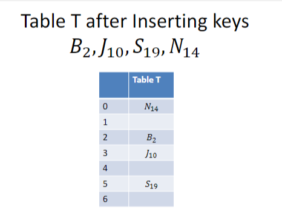
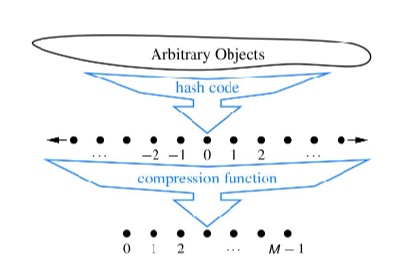

# Κατακερματισμός (Hashing)

#### Ο Αφηρημένος Τύπος Δεδομένων: Πίνακας Συμβόλων (Υπενθύμιση)

- Ένας πίνακας συμβόλων `T` είναι μια αφηρημένη αποθήκη που περιέχει καταχωρήσεις πίνακα οι οποίες είναι είτε κενές είτε ζεύγη της μορφής `(K, I)`, όπου:
  - `K` είναι ένα κλειδί (key)
  - `I` είναι κάποια πληροφορία σχετιζόμενη με το κλειδί, την οποία ονομάζουμε τιμή (value)
- Υποθέτουμε ότι κάθε διαφορετική καταχώρηση έχει διαφορετικό κλειδί.
- Άρα, οι πίνακες συμβόλων που μελετώνται εδώ είναι ουσιαστικά **maps** (αντιστοιχίσεις).

---

#### Λειτουργίες για τον Πίνακα Συμβόλων (Symbol Table ADT)

- **Αρχικοποίηση** του πίνακα `T` ως τον κενό πίνακα.
  - Ο κενός πίνακας περιέχει μόνο κενές καταχωρήσεις `(K₀, I₀)`, όπου `K₀` είναι ειδικό κενό κλειδί, διακριτό από όλα τα άλλα μη κενά κλειδιά.
- **Έλεγχος** αν ο πίνακας `T` είναι πλήρης.
- **Εισαγωγή** νέας καταχώρησης `(K, I)` στον πίνακα, εφόσον δεν είναι ήδη πλήρης.
- **Διαγραφή** της καταχώρησης `(K, I)` από τον πίνακα `T`.
- **Ανάκτηση** της πληροφορίας `I` με βάση το κλειδί αναζήτησης `K`, από την καταχώρηση `(K, I)` στον πίνακα `T`.
- **Ενημέρωση** της καταχώρησης `(K, I)` στον πίνακα `T`, αντικαθιστώντας την με μια νέα καταχώρηση `(K, I′)`.
- **Απαρίθμηση** των καταχωρήσεων `(K, I)` του πίνακα `T` με αύξουσα σειρά κλειδιών.


## Πιθανές Αναπαραστάσεις για τον Πίνακα Συμβόλων (Symbol Table ADT)

- Έχουμε ήδη συζητήσει τις παρακάτω δομές δεδομένων για πίνακες συμβόλων:
  - Πίνακες από δομές (structs) ταξινομημένους σε αύξουσα σειρά με βάση τα κλειδιά
  - Συνδεδεμένες λίστες από δομές
  - Δυαδικά δέντρα αναζήτησης (Binary Search Trees)
  - Δέντρα AVL
  - Δέντρα (2,4)
  - Δέντρα red-black
  - Λίστες skip (Skip Lists)

---

## Κατακερματισμός (Hashing)

- Θα εισαγάγουμε μια νέα μέθοδο για την υλοποίηση του πίνακα συμβόλων, που ονομάζεται **κατακερματισμός (hashing)**.
- Ο κατακερματισμός διαφέρει από τις προηγούμενες αναπαραστάσεις που βασίζονται σε συγκρίσεις κλειδιών,
  επειδή προσπαθούμε να αναφερθούμε **άμεσα** σε στοιχεία του πίνακα,
  μετατρέποντας τα κλειδιά σε **διευθύνσεις** στον πίνακα.

---


#### Εισαγωγή στον Κατακερματισμό με Παράδειγμα

- Θα χρησιμοποιήσουμε ως κλειδιά γράμματα του αλφαβήτου με δείκτες που δείχνουν τη σειρά τους στο αλφάβητο.
  - Π.χ., `A₁`, `C₃`, `R₁₈`
- Θα χρησιμοποιήσουμε έναν μικρό πίνακα `T` με 7 θέσεις ως αποθηκευτικό χώρο.
  - Ο πίνακας αυτός ονομάζεται **πίνακας κατακερματισμού (hash table)**.
- Θα βρούμε τη θέση για να αποθηκεύσουμε ένα κλειδί `Lₙ` χρησιμοποιώντας την εξής **συνάρτηση κατακερματισμού**:
  ```math
  h(Lₙ) = n % 7
Η έκφραση x % y υπολογίζει το υπόλοιπο της ακέραιας διαίρεσης του x με το y.


### Αποθήκευση Κλειδιών στον Πίνακα Κατακερματισμού

- Τα **κλειδιά** αποθηκεύονται στις **διευθύνσεις κατακερματισμού** τους.
- Τα κελιά του πίνακα συχνά ονομάζονται **buckets (κάδοι)**.




### Σύγκρουση (Collision) στον Πίνακα Κατακερματισμού

- Τώρα έχουμε μια **σύγκρουση (collision)**.
- Θα χρησιμοποιήσουμε μια **πολιτική επίλυσης συγκρούσεων (collision resolution policy)**:
  - Θα αναζητήσουμε **χαμηλότερες θέσεις** στον πίνακα για να βρούμε μια διαθέσιμη θέση για το κλειδί.


## Ανοικτή Διευθυνσιοδότηση (Open Addressing)

- Η μέθοδος εισαγωγής κλειδιών που συγκρούονται σε κενές θέσεις του πίνακα ονομάζεται **ανοικτή διευθυνσιοδότηση (open addressing)**.
- Η εξέταση κάθε θέσης ονομάζεται **διερεύνηση (probe)**.
- Οι θέσεις που εξετάζουμε αποτελούν τη **σειρά διερεύνησης (probe sequence)**.
- Η διαδικασία διερεύνησης που ακολουθήσαμε ονομάζεται **γραμμική διερεύνηση (linear probing)**.
- Άρα, η τεχνική κατακερματισμού που χρησιμοποιούμε εδώ είναι:
  **ανοικτή διευθυνσιοδότηση με γραμμική διερεύνηση (open addressing with linear probing)**.

---

## Διπλός Κατακερματισμός (Double Hashing)

- Ο **διπλός κατακερματισμός (double hashing)** είναι μια άλλη τεχνική ανοικτής διευθυνσιοδότησης.
- Χρησιμοποιεί **μη γραμμική διερεύνηση** υπολογίζοντας διαφορετικές τιμές μείωσης (decrements) στη διερεύνηση για διαφορετικά κλειδιά, με χρήση μιας **δεύτερης συνάρτησης κατακερματισμού** `p(Lₙ)`.

### Ορισμός της Συνάρτησης Μείωσης Διερεύνησης:

```math
p(Lₙ) = max(1, ⌊n / 7⌋)
```
Στην παραπάνω εξίσωση:

Ο όρος n / 7 είναι το πηλίκο της ακέραιας διαίρεσης του n με το 7.

Ο τελεστής max(a, b) επιστρέφει το μέγιστο μεταξύ των a και b.


Όταν προκύψει σύγκρουση, και ξεκινάμε probing (αναζήτηση άλλης θέσης), μετακινούμαστε προς τα πίσω κατά 3 θέσεις κάθε φορά (ή modulo το μέγεθος του πίνακα).


## Παράδειγμα Διερεύνησης με Διπλό Κατακερματισμό

- Χρησιμοποιούμε μια **μείωση διερεύνησης** (probe decrement) της μορφής:

```math
p(W₂₃) = 3
```

Γενικά, οι τιμές μείωσης διερεύνησης (probe decrements) θα είναι διαφορετικές για διαφορετικά κλειδιά.

Δοκίμασε να εισάγεις μόνος/η σου το κλειδί P₁₆.

## Επίλυση Συγκρούσεων με Χωριστή Αλυσίδωση (Separate Chaining)

- Η μέθοδος επίλυσης συγκρούσεων με χωριστή αλυσίδωση (separate chaining) χρησιμοποιεί μια συνδεδεμένη λίστα για να αποθηκεύσει τα κλειδιά σε κάθε θέση του πίνακα.

- Δηλαδή, κάθε θέση του πίνακα κατακερματισμού δείχνει σε μια λίστα με όλα τα κλειδιά που κατακερματίστηκαν σε αυτήν τη θέση.

- Αυτή η μέθοδος δεν είναι κατάλληλη όταν η μνήμη είναι περιορισμένη, π.χ. όταν υλοποιούμε έναν πίνακα κατακερματισμού για φορητές συσκευές.


## Καλές Συναρτήσεις Κατακερματισμού (Good Hash Functions)

- Έστω ότι `T` είναι ένας πίνακας κατακερματισμού με `M` θέσεις, με διευθύνσεις από `0` έως `M − 1`.
- Μια **ιδανική συνάρτηση κατακερματισμού** `h(K)` χαρτογραφεί τα κλειδιά σε διευθύνσεις πίνακα **ομοιόμορφα και τυχαία**.
- Δηλαδή, για οποιοδήποτε κλειδί, κάθε πιθανή διεύθυνση του πίνακα είναι **εξίσου πιθανή** (πιθανότητα επιλογής = `1 / M`).
- Επιπλέον, ο **υπολογισμός** της συνάρτησης κατακερματισμού θα πρέπει να είναι **πολύ γρήγορος**.

---

## Συγκρούσεις (Collisions)

- Μια **σύγκρουση** ανάμεσα σε δύο κλειδιά `K` και `K′` συμβαίνει όταν και τα δύο δίνουν την **ίδια** διεύθυνση κατακερματισμού:
  
  ```math
  h(K) = h(K′)
  ```

- Συγκρούσεις είναι σχετικά συχνές, ακόμα και σε αραιά γεμάτους πίνακες κατακερματισμού.

- Το παράδοξο von Mises: Αν υπάρχουν πάνω από 23 άτομα σε ένα δωμάτιο, υπάρχει πάνω από 50% πιθανότητα ότι δύο από αυτούς έχουν την ίδια ημέρα γενεθλίων (M = 365).

Δες την απόδειξη στο βιβλίο του Standish.

- Μια καλή συνάρτηση κατακερματισμού πρέπει να ελαχιστοποιεί τις συγκρούσεις.

## Πρωταρχική Συσταδοποίηση (Primary Clustering)

- Η γραμμική διερεύνηση (linear probing) υποφέρει από το φαινόμενο της πρωταρχικής συσταδοποίησης (primary clustering).

- Μια συστάδα (cluster) είναι μια ακολουθία συνεχόμενων κατειλημμένων θέσεων στον πίνακα κατακερματισμού.

- Στην ανοικτή διευθυνσιοδότηση με γραμμική διερεύνηση, τέτοιες συστάδες σχηματίζονται και στη συνέχεια μεγαλώνουν.

- Αυτό συμβαίνει γιατί όλα τα κλειδιά που συγκρούονται στην ίδια αρχική θέση ακολουθούν παρόμοιες διαδρομές διερεύνησης για να βρουν κενή θέση.

- Ο διπλός κατακερματισμός (double hashing) δεν υποφέρει από πρωταρχική συσταδοποίηση, γιατί τα συγκρουόμενα κλειδιά ακολουθούν διαφορετικές διαδρομές διερεύνησης.

## Εξασφάλιση ότι οι Σειρές Διερεύνησης Καλύπτουν τον Πίνακα

- Για να λειτουργούν σωστά οι **αλγόριθμοι εισαγωγής** και **αναζήτησης** σε πίνακα κατακερματισμού με **ανοικτή διευθυνσιοδότηση**, πρέπει να εξασφαλίζεται ότι **κάθε σειρά διερεύνησης** μπορεί να καλύψει **όλες τις θέσεις** του πίνακα.
- Αυτό είναι **προφανές** για τη **γραμμική διερεύνηση** (linear probing), αφού πηγαίνουμε απλά από τη μια θέση στην επόμενη κυκλικά.
- Ισχύει το ίδιο και για τον **διπλό κατακερματισμό (double hashing);**
  - Για να είναι εγγυημένο ότι κάθε θέση μπορεί να ερευνηθεί, η δεύτερη συνάρτηση κατακερματισμού (δηλ. η μείωση `p(K)`) πρέπει να είναι **συνεπίμηκη** (coprime) με το μέγεθος του πίνακα `M`.


## Καλές Επιλογές για Διπλό Κατακερματισμό (Good Double Hashing Choices)

- **Επιλογή 1:** Ορίστε το μέγεθος του πίνακα `M` να είναι **πρώτος αριθμός**, και επιλέξτε **τιμές μείωσης διερεύνησης** (probe decrements) ως **οποιονδήποτε ακέραιο από 1 έως M − 1**.
- **Επιλογή 2:** Ορίστε το `M` ως **δύναμη του 2**, και επιλέξτε τις μειώσεις διερεύνησης ως **μονούς αριθμούς** από 1 έως M − 1.
- Με άλλα λόγια: είναι καλό οι τιμές των μειώσεων διερεύνησης να είναι **σχετικά πρώτοι (relatively prime)** με το `M`.

---

## Υλοποίηση Ανοικτής Διευθυνσιοδότησης με Διπλό Κατακερματισμό σε C

```c
#define M 997            // 997 είναι πρώτος αριθμός
#define EmptyKey 0       // Ειδική τιμή για κενή θέση

typedef int KeyType;

typedef struct {
    // Μέλη διαφόρων τύπων με πληροφορίες που σχετίζονται με τα κλειδιά
} InfoType;

typedef struct {
    KeyType Key;
    InfoType Info;
} TableEntry;

typedef TableEntry Table[M];

// Παγκόσμια μεταβλητή πίνακας κατακερματισμού
Table T;

// Αρχικοποίηση πίνακα
void Initialize(void) {
    int i;
    for (i = 0; i < M; i++)
        T[i].Key = EmptyKey;
}

// Συνάρτηση εισαγωγής
void HashInsert(KeyType K, InfoType I) {
    int i;
    int ProbeDecrement;

    i = h(K);
    ProbeDecrement = p(K);

    while (T[i].Key != EmptyKey) {
        i -= ProbeDecrement;
        if (i < 0)
            i += M;
    }

    T[i].Key = K;
    T[i].Info = I;
}

// Συνάρτηση αναζήτησης
int HashSearch(KeyType K) {
    int i;
    int ProbeDecrement;
    KeyType ProbeKey;

    i = h(K);
    ProbeDecrement = p(K);
    ProbeKey = T[i].Key;

    while ((K != ProbeKey) && (ProbeKey != EmptyKey)) {
        i -= ProbeDecrement;
        if (i < 0)
            i += M;
        ProbeKey = T[i].Key;
    }

    if (ProbeKey == EmptyKey)
        return -1;   // Αποτυχία
    else
        return i;    // Επιτυχία, επιστρέφει το index
}
```

## Διαγραφή από Πίνακα Κατακερματισμού (Deletion)

- Η συνάρτηση για **διαγραφή** από έναν πίνακα κατακερματισμού **αφήνεται ως άσκηση**.
- Όμως, η διαγραφή **δημιουργεί προβλήματα**:
  - Αν διαγράψουμε μια καταχώρηση και **αφήσουμε κενή θέση** (`EmptyKey`), τότε **καταστρέφεται η εγκυρότητα** της αναζήτησης, επειδή η αναζήτηση σταματά μόλις βρει κενό κλειδί.
- **Λύση**:
  - Αντί να αφήσουμε κενό, μπορούμε να **σημειώσουμε την καταχώρηση ως διαγραμμένη** (π.χ. με ειδική τιμή “διαθέσιμο” ή “deleted”).
  - Έτσι, οι **συναρτήσεις αναζήτησης** θα συνεχίσουν να διερευνούν τις διαγραμμένες θέσεις.
  - Οι **συναρτήσεις εισαγωγής** μπορούν να τις επαναχρησιμοποιούν.
- **Πρόβλημα**:
  - Αν γίνουν πολλές διαγραφές, ο πίνακας γεμίζει με “deleted” και **μειώνεται η απόδοση**.

---

## Κώδικας για Χωριστή Αλυσίδωση (Separate Chaining)

```c
typedef struct STnode* link;

struct STnode {
    Item item;
    link next;
};

static link *heads, z;
static int N, M;

// Δημιουργία νέου κόμβου
static link NEW(Item item, link next) {
    link x = malloc(sizeof *x);
    x->item = item;
    x->next = next;
    return x;
}

// Αρχικοποίηση πίνακα κατακερματισμού
void STinit(int max) {
    int i;
    N = 0;
    M = max / 5; // Μείωση μεγέθους για λόγους κατακερματισμού
    heads = malloc(M * sizeof(link));
    z = NEW(NULLitem, NULL);
    for (i = 0; i < M; i++)
        heads[i] = z;
}
```
## Σημειώσεις για Χωριστή Αλυσίδωση (Separate Chaining)

- `N`: Πλήθος των στοιχείων (κλειδιών) στον πίνακα κατακερματισμού.
- `M`: Μέγεθος του πίνακα (αριθμός κάδων).
- Διατηρούμε `M` λίστες με δείκτες κεφαλών αποθηκευμένους στον πίνακα `heads`.
- Χρησιμοποιούμε **συνάρτηση κατακερματισμού** για να επιλέξουμε σε ποια λίστα θα μπει το κάθε στοιχείο.
- Η συνάρτηση `STinit` ορίζει το `M` έτσι ώστε κάθε λίστα να έχει κατά μέσο όρο ~5 στοιχεία, άρα οι πράξεις απαιτούν λίγες διερευνήσεις.

---

## Αναδρομική Αναζήτηση (Recursive Search)

```c
Item searchR(link t, Key v) {
    if (t == z) return NULLitem;                          // Τέλος λίστας, δεν βρέθηκε
    if (eq(key(t->item), v)) return t->item;              // Αντιστοιχία κλειδιού
    return searchR(t->next, v);                           // Συνέχισε στην επόμενη θέση
}

Item STsearch(Key v) {
    return searchR(heads[hash(v, M)], v);                 // Ξεκίνημα από τη σωστή λίστα
}

void STinsert(Item item) {
    int i = hash(key(item), M);                           // Καθορισμός κάδου
    heads[i] = NEW(item, heads[i]);                       // Νέα καταχώρηση στο κεφάλι της λίστας
    N++;                                                  // Ενημέρωση πλήθους στοιχείων
}
void STdelete(Item item) {
    int i = hash(key(item), M);                           // Εύρεση σωστής λίστας
    heads[i] = deleteR(heads[i], item);                   // Διαγραφή από τη λίστα
}
```
⚠️ Η deleteR δεν δίνεται, αλλά υποθέτουμε ότι είναι αναδρομική συνάρτηση που διαγράφει ένα στοιχείο από μια λίστα.

## Συνάρτηση Κατακερματισμού (Hash Function)

- Ο προηγούμενος κώδικας **υποθέτει** ότι έχουμε ορίσει μια κατάλληλη **συνάρτηση κατακερματισμού**.
- Για παράδειγμα, για **ακέραια κλειδιά**, θα μπορούσαμε να έχουμε:

```c
#define hash(v, M) (v % M)
```


## 🔍 Σημαντικό

- Σημείωσε ότι οι προηγούμενοι τύποι δείχνουν πως η **απόδοση** ενός πίνακα κατακερματισμού **εξαρτάται μόνο από τον συντελεστή φόρτωσης (load factor)** και **όχι από άλλες παραμέτρους**.

---

## 📊 Θεωρητικά Αποτελέσματα: Εφαρμογή Τύπων

- Ας συγκρίνουμε τώρα την **απόδοση** των τεχνικών που μελετήσαμε για διάφορους **συντελεστές φόρτωσης**, χρησιμοποιώντας τους τύπους που παρουσιάστηκαν.
- Οι τύποι εφαρμόζονται σε πίνακα μεγέθους **997**.
- Τα **πειραματικά αποτελέσματα**, που προέκυψαν μετά την υλοποίηση των αλγορίθμων, είναι **παρόμοια** με τα θεωρητικά.

---

📌 **Συντελεστής φόρτωσης (Load Factor)**:
Ορίζεται ως:

```math
α = Ν / Μ
```
Όπου:

𝛼
α: Ο συντελεστής πλήρωσης (load factor).

𝑁
N: Ο αριθμός των στοιχείων (κελιών) που είναι κατειλημμένα στον πίνακα.

𝑀
M: Το συνολικό μέγεθος του πίνακα (πόσες θέσεις έχει συνολικά ο πίνακας).


## 📈 Μέσος Αριθμός Διευθύνσεων Ελέγχου (Probes)

- Τα κελιά του πίνακα δίνουν την τιμή **𝐶ₙ**, δηλαδή τον **μέσο αριθμό διερευνήσεων (probe addresses)** για κάθε μία από τις τεχνικές κατακερματισμού.

---

## 📌 Παρατηρήσεις

- Η τιμή του **𝐶ₙ αυξάνεται** καθώς αυξάνεται ο **συντελεστής φόρτωσης (load factor)** `α`.
- Η **ανοιχτή διευθυνσιοδότηση με γραμμική διερεύνηση (linear probing)** παρουσιάζει **χειρότερη απόδοση** από τις άλλες δύο τεχνικές όταν ο `α` είναι μεγάλος.
- Η τεχνική με την **καλύτερη απόδοση** είναι η **χωριστή αλυσίδωση (separate chaining)**.

---

## 🧪 Συμπέρασμα

Για εφαρμογές με μεγάλο αριθμό στοιχείων και υψηλό φορτίο στον πίνακα:

- ➕ **Προτίμησε** χωριστή αλυσίδωση για καλύτερη επίδοση.
- ➖ Απόφυγε γραμμική διερεύνηση όταν ο πίνακας είναι σχεδόν γεμάτος.

---


## 📊 Μέσος Αριθμός Διευθύνσεων Ελέγχου (C′ₙ)

- Τα κελιά του πίνακα παρουσιάζουν την τιμή **𝐶′ₙ**, δηλαδή τον **μέσο αριθμό διευθύνσεων που ελέγχονται (probe addresses)** για κάθε τεχνική κατακερματισμού.

---

## 📌 Παρατηρήσεις

- Η τιμή του **𝐶′ₙ αυξάνεται** καθώς αυξάνεται ο **συντελεστής φόρτωσης (load factor)** `α`.
- Η **ανοιχτή διευθυνσιοδότηση με γραμμική διερεύνηση (open addressing with linear probing)** έχει **χειρότερη επίδοση** από τις άλλες τεχνικές όταν ο `α` είναι μεγάλος.
- Η τεχνική με την **καλύτερη απόδοση** είναι η **χωριστή αλυσίδωση (separate chaining)**.

---

## ✅ Συμπέρασμα

- Για υψηλές τιμές `α`, η **χωριστή αλυσίδωση** προσφέρει σταθερά καλύτερη απόδοση.
- Η **γραμμική διερεύνηση** οδηγεί σε συμφόρηση (clustering) και αυξημένο αριθμό ελέγχων.

---

## 🧮 Πολυπλοκότητα του Κατακερματισμού (Hashing)

### 💡 Βασικές Παραδοχές

- Υποθέτουμε ότι χρησιμοποιούμε πίνακα κατακερματισμού που **δεν γεμίζει ποτέ πάνω από 50%** (𝛼 ≤ 0.50).
- Όταν ο πίνακας γίνει πιο γεμάτος, τον **επεκτείνουμε** διπλασιάζοντας το μέγεθός του και **επανακατακερματίζουμε (rehash)** τα στοιχεία.

---

### 🔍 Αναζήτηση

- Σύμφωνα με τους πίνακες που παρουσιάστηκαν:
  - **Επιτυχής αναζήτηση**: το πολύ **1.50** συγκρίσεις κλειδιών.
  - **Ανεπιτυχής αναζήτηση**: το πολύ **2.50** συγκρίσεις κλειδιών.
- Άρα η **αναζήτηση** έχει **χρονική πολυπλοκότητα**:  
  \[
  \mathcal{O}(1)
  \]

---

### ➕ Εισαγωγή, 🔄 Ενημέρωση & ➖ Διαγραφή

- **Εισαγωγή** στοιχείου απαιτεί ίδιο αριθμό συγκρίσεων με ανεπιτυχή αναζήτηση ⇒ **𝑶(1)**.
- **Ανάκτηση** και **ενημέρωση** στοιχείων έχουν επίσης **𝑶(1)**.
- **Διαγραφή** στοιχείου έχει επίσης **𝑶(1)**.

---

### 📜 Καταγραφή Όλων των Στοιχείων (Enumeration)

- Για να καταγράψουμε όλα τα στοιχεία σε **αύξουσα σειρά κλειδιών**, απαιτείται **ταξινόμηση**.
- Καλή ταξινόμηση (π.χ. QuickSort) έχει χρόνο:
  \[
  \mathcal{O}(n \log n)
  \]

---

## 📉 Συντελεστής Φόρτωσης & Rehashing

- Σε **όλες** τις τεχνικές κατακερματισμού, πρέπει να διατηρούμε τον **συντελεστή φόρτωσης (α)**:
  - **< 0.5** για **open addressing**
  - **< 0.9** για **separate chaining**
- Με **open addressing**, όταν το `α` > 0.5:
  - Οι **συστάδες (clusters)** μεγαλώνουν.
  - Όταν `α ≈ 1`, οι λειτουργίες έχουν **γραμμική πολυπλοκότητα** `𝑶(n)`.

---

✅ **Συμπέρασμα**: Ο κατακερματισμός προσφέρει **σταθερή πολυπλοκότητα** για βασικές λειτουργίες όταν εφαρμόζεται σωστά, αλλά απαιτεί προσοχή στον έλεγχο του `α` και χρήση **rehashing** όταν χρειάζεται.
## 📊 Συντελεστής Φόρτωσης & Rehashing (συνέχεια)

- Αν ο **συντελεστής φόρτωσης** (load factor) ενός πίνακα κατακερματισμού υπερβεί σημαντικά ένα προκαθορισμένο όριο, τότε **είναι συνηθισμένο να απαιτείται αλλαγή μεγέθους του πίνακα** ώστε να επανέλθει σε αποδεκτό επίπεδο.
- Αυτή η διαδικασία ονομάζεται **rehashing (ανακατακερματισμός)** ή **dynamic hashing (δυναμικός κατακερματισμός)**.
- Κατά τον rehashing:
  - Καλή πρακτική είναι το νέο μέγεθος του πίνακα να είναι τουλάχιστον **διπλάσιο** από το προηγούμενο.

---

## ❓ Open Addressing ή Separate Chaining;

### 🔹 Open Addressing
- **Πλεονέκτημα**: Εξοικονόμηση μνήμης.
- **Μειονέκτημα**: Δεν είναι απαραίτητα ταχύτερο.

### 🔹 Separate Chaining
- Σύμφωνα με θεωρητικά και πειραματικά αποτελέσματα:
  - Είναι **ανταγωνιστικό** ή ακόμα και **ταχύτερο** από άλλες μεθόδους, ειδικά όταν ο πίνακας είναι φορτωμένος.
- **Συμπέρασμα**: Αν η μνήμη **δεν αποτελεί περιοριστικό παράγοντα**, τότε η καλύτερη πολιτική **επίλυσης συγκρούσεων** είναι η **χωριστή αλυσίδωση (separate chaining)**.


## 🧮 Επιλογή Καλής Συνάρτησης Κατακερματισμού (Hash Function)

- Ιδανικά, μια **συνάρτηση κατακερματισμού (hash function)** θα πρέπει να **κατανέμει ομοιόμορφα και τυχαία** τα κλειδιά σε όλο το εύρος των θέσεων του πίνακα κατακερματισμού.
- Κάθε θέση στον πίνακα πρέπει να έχει **ίση πιθανότητα** να είναι ο "προορισμός" της συνάρτησης, όταν επιλέγεται τυχαία ένα κλειδί.


## 🧠 Σχεδίαση Συναρτήσεων Κατακερματισμού (Hash Functions)

- Έστω 𝑀 το μέγεθος του πίνακα κατακερματισμού (hash table).
- Η **αξιολόγηση μιας συνάρτησης κατακερματισμού ℎ(𝐾)** μπορεί να ιδωθεί ως αποτελούμενη από δύο βήματα:

### 1️⃣ Μετατροπή του κλειδιού 𝐾 σε έναν ακέραιο
- Ο αριθμός αυτός λέγεται **κωδικός κατακερματισμού (hash code)**.

### 2️⃣ Συμπίεση του hash code σε τιμή εντός του εύρους [0, 𝑀−1]
- Αυτή η διαδικασία ονομάζεται **συνάρτηση συμπίεσης (compression function)**.




## 🔢 Κωδικοί Κατακερματισμού (Hash Codes)

### 🧩 Τι είναι ένας Hash Code;
- Η **πρώτη ενέργεια** που εκτελεί μια συνάρτηση κατακερματισμού είναι να μετατρέψει ένα **αυθαίρετο κλειδί 𝐾** σε έναν **ακέραιο αριθμό**.
- Αυτός ο αριθμός λέγεται **κωδικός κατακερματισμού (hash code)**.

### ℹ️ Ιδιότητες του Hash Code
- Ο hash code **δεν χρειάζεται** να βρίσκεται στο εύρος [0, 𝑀−1] και μπορεί ακόμα και να είναι **αρνητικός**.
- Ωστόσο, επιθυμούμε οι hash codes:
  - Να είναι **μοναδικοί** για διαφορετικά κλειδιά, ώστε να **αποφεύγονται συγκρούσεις (collisions)**.
  - Αν υπάρχουν συγκρούσεις σε αυτό το στάδιο, **καμία συνάρτηση συμπίεσης (compression function)** δεν μπορεί να τις διορθώσει.

---

## 🧬 Hash Codes για Τύπους Δεδομένων της C

- Οι hash codes για **στοιχεία τύπων της γλώσσας C** βασίζονται στην υπόθεση ότι **ο αριθμός bit κάθε τύπου δεδομένων είναι γνωστός**.

📌 Αυτό είναι κρίσιμο για να σχεδιάσουμε αποδοτικούς και συμβατούς hash functions για struct, int, char, κ.λπ.

## 🔁 Μετατροπή σε Ακέραιο (Converting to an Integer)

### 🔣 Βασική Ιδέα
- Για κάθε τύπο δεδομένων **𝐷** που αναπαρίσταται με **λιγότερα ή ίσα bits** από όσα έχει ένας ακέραιος (int), μπορούμε:
  - Να θεωρήσουμε **την δυαδική του αναπαράσταση** ως έναν ακέραιο.
  - Να χρησιμοποιήσουμε απλά ένα cast σε `int` ως **hash code**.

### ✅ Εφαρμογή σε βασικούς τύπους C
- Για τύπους όπως `char`, `short int` και `int`, ένας καλός hash code μπορεί να προκύψει με:
  ```c
  (int)x


## ➕ Hash Codes με Άθροισμα (Summation Hash Codes)

### ⚠️ Όχι Καλή Επιλογή για Strings
- Ο hash κώδικας που βασίζεται στο **άθροισμα** των στοιχείων (π.χ. χαρακτήρες) **δεν είναι κατάλληλος** για μεταβλητού μήκους αντικείμενα, όπως οι συμβολοσειρές.

### 🧠 Γιατί;
- Τα strings μπορούν να θεωρηθούν ως πλειάδες:
  \[
  x = (x_0, x_1, ..., x_{k-1})
  \]
  όπου η **σειρά των στοιχείων** έχει σημασία.

---

### 📌 Παράδειγμα Προβλήματος

Έστω hash function:
```c
int hash = sum(ASCII(s[i]));
```

τότε:

Τα strings temp01 και temp10 θα έχουν τον ίδιο hash code, παρόλο που είναι διαφορετικά.

✅ Συμπέρασμα
Χρειαζόμαστε καλύτερες τεχνικές για strings και παρόμοια αντικείμενα που λαμβάνουν υπόψη τη σειρά των στοιχείων.

Οι απλές αθροίσεις προκαλούν συχνές συγκρούσεις (collisions) σε κοινές κατηγορίες strings.


## 🧮 Πολυωνυμικοί Hash Κώδικες (Polynomial Hash Codes)

### 📌 Ιδέα
- Ένας **πολυωνυμικός hash κώδικας** χρησιμοποιεί **πολλαπλασιασμό με διαφορετικές δυνάμεις** ώστε κάθε στοιχείο να επηρεάζει με μοναδικό τρόπο το τελικό αποτέλεσμα.
- Βοηθά να **κατανεμηθούν τα κλειδιά πιο ομοιόμορφα** στον πίνακα.

---

### ⚙️ Υλοποίηση και Υπερχείλιση

- Ο υπολογισμός γίνεται με ακέραιους, οπότε φυσικά θα προκύψουν **υπερχειλίσεις (overflow)**.
- Αυτό **δεν μας απασχολεί πολύ**, γιατί θέλουμε απλώς **καλή κατανομή (spread)**, όχι αριθμητική ακρίβεια.
- Παρόλα αυτά, πρέπει να επιλέξουμε τη σταθερά `a` με τρόπο ώστε να έχει **μη μηδενικά χαμηλόβαθμα bits**, για να διατηρεί όσο το δυνατόν περισσότερη πληροφορία ακόμη και μετά από overflow.

---

### 🧪 Πειραματικά Αποτελέσματα

- Σε ένα λεξικό με **πάνω από 50.000 αγγλικές λέξεις**, χρησιμοποιώντας τις τιμές:
  - `a = 33, 37, 39, 41`
  - Παρατηρήθηκαν **λιγότερες από 7 συγκρούσεις** σε κάθε περίπτωση!

---

### ⚡ Επιτάχυνση

- Για πολύ μεγάλες συμβολοσειρές, μπορεί να υπολογίζεται ο hash μόνο σε **υποσύνολο χαρακτήρων** για μεγαλύτερη ταχύτητα χωρίς σημαντική απώλεια απόδοσης.

---

### 💡 Παράδειγμα (σε ψευδοκώδικα)

```c
int hash(char *s) {
    int h = 0;
    int a = 33; // ή 37, 39, 41
    for (int i = 0; s[i] != '\0'; i++)
        h = a * h + s[i]; // overflow OK
    return h;
}
```
✅ Συμπέρασμα
Οι πολυωνυμικοί hash κώδικες είναι απλοί, αποδοτικοί και πρακτικά πολύ αποτελεσματικοί, ειδικά για strings.

## 🔄 Πλήρης Συνάρτηση Κατακερματισμού (Polynomial Hash Function)

Η παρακάτω συνάρτηση είναι μια **πλήρης hash function**, όχι απλώς ένας hash κώδικας. Δηλαδή, **επιστρέφει τη θέση** στον πίνακα hash (`0` έως `M-1`), όχι απλώς έναν αυθαίρετο ακέραιο.

---

### 🧾 Κώδικας σε C

```c
int hash(char *K)
{
    int h = 0, a = 33;
    for (; *K != '\0'; K++)
        h = (a * h + *K) % M; // M: μέγεθος πίνακα
    return h;
}

```
🔍 Επεξήγηση

- h: η μεταβλητή που συσσωρεύει την τιμή του hash.

- a = 33: η βάση του πολυωνύμου, επιλεγμένη επειδή δίνει καλό "σπάσιμο" τιμών για αγγλικές λέξεις.

* K: κάθε χαρακτήρας της συμβολοσειράς.

- M: το μέγεθος του πίνακα hash (π.χ., 997).

📌 Παρατηρήσεις
Η χρήση του % M στο τέλος κάθε βήματος εξασφαλίζει ότι η τιμή παραμένει μέσα στα όρια του πίνακα.

Το a = 33 είναι μια κοινή και αποδεδειγμένα αποδοτική τιμή για strings.

Η συνάρτηση λειτουργεί καλά για αλφαριθμητικά κλειδιά (π.χ., ονόματα, usernames, κτλ).

## 💬 Σχόλια για την Πολυωνυμική Συνάρτηση Κατακερματισμού

- Η προηγούμενη συνάρτηση παίρνει ως είσοδο έναν **δείκτη σε πίνακα χαρακτήρων**, δηλαδή μια **null-τερματισμένη συμβολοσειρά** `K`, και υπολογίζει τη συνάρτηση κατακερματισμού για αυτή.
- Η εντολή:
  ```c
  h = (a * h + *K) % M;
  ```

  ενημερώνει την τιμή του h χρησιμοποιώντας:

την προηγούμενη τιμή του h,

τη βάση a (συνήθως 33), και

την ASCII τιμή του τρέχοντος χαρακτήρα *K.

## 💬 Σχόλια για τη Συνάρτηση Κατακερματισμού

- Η παραπάνω συνάρτηση παίρνει ως είσοδο έναν **δείκτη σε πίνακα χαρακτήρων**.
- Ο δείκτης αυτός δείχνει σε μια **null-τερματισμένη συμβολοσειρά** `K`.
- Η συνάρτηση υπολογίζει μια **συνάρτηση κατακερματισμού (hash function)** για τη συμβολοσειρά αυτή.

### 📌 Κεντρική Εντολή:

```c
h = (a * h + *K) % M;
```
Ενημερώνει την τιμή του h με βάση:

την προηγούμενη τιμή του h,

τη βάση a (συνήθως 33 ή 37),

και την ASCII τιμή του τρέχοντος χαρακτήρα *K.

🔁 Αυτό γίνεται για κάθε χαρακτήρα της συμβολοσειράς, δημιουργώντας έναν πολυωνυμικό κώδικα κατακερματισμού με βάση τις τιμές των χαρακτήρων και τη σειρά τους.

✅ Η χρήση του % M (modulo) περιορίζει την τελική τιμή του hash μέσα στο εύρος [0, M-1], που αντιστοιχεί στα έγκυρα indices του πίνακα hash.

## 🔢 Πολυωνυμικοί Κώδικες Κατακερματισμού (συνέχεια)

### 🧠 Θεωρητικά:
- Πρώτα υπολογίζουμε έναν **πολυωνυμικό κώδικα κατακερματισμού**.
- Έπειτα εφαρμόζουμε τη **συνάρτηση συμπίεσης** μέσω του **modulo M** (δηλαδή το υπόλοιπο της ακέραιας διαίρεσης με το M).

### 👨‍💻 Πρακτικά (στην υλοποίηση που είδαμε):
- Το `% M` εφαρμόζεται **σε κάθε βήμα** του υπολογισμού, **όχι μόνο στο τέλος**.

### 🧮 Γιατί είναι το ίδιο;
Για όλους τους μη αρνητικούς ακεραίους `a`, `b`, `x`, `M` ισχύει:

(a * x % M + b % M) % M = (a * x + b) % M


🔁 Δηλαδή, μπορούμε να εφαρμόζουμε `mod M` σε κάθε ενδιάμεσο βήμα **χωρίς να αλλάζει το τελικό αποτέλεσμα**.

---

### ✅ Πλεονεκτήματα της ενδιάμεσης χρήσης `% M`
- Αποφεύγονται **προβλήματα υπερχείλισης** (overflow), ιδιαίτερα όταν έχουμε **μεγάλες συμβολοσειρές**.
- Αν υπολογίσουμε πρώτα το πολυώνυμο και κάνουμε `% M` **μόνο στο τέλος**, μπορεί το αποτέλεσμα να υπερβεί τα όρια της αναπαράστασης ενός ακέραιου στη C.

🧪 **Δοκίμασε** να χρησιμοποιήσεις τη δεύτερη προσέγγιση με μια πολύ μεγάλη συμβολοσειρά — θα δεις ότι μπορεί να προκύψουν λάθη λόγω υπερχείλισης!

## 🔁 Κώδικες Κατακερματισμού με Κυκλική Ολίσθηση (Cyclic Shift Hash Codes)

### 🧬 Τι είναι;
Μια **παραλλαγή** του πολυωνυμικού κώδικα κατακερματισμού, όπου **αντικαθιστούμε** τον πολλαπλασιασμό με μια **κυκλική ολίσθηση** (cyclic shift) ενός ενδιάμεσου αθροίσματος κατά συγκεκριμένο αριθμό bit.

### 🔍 Σημεία-κλειδιά:
- Δεν έχει ιδιαίτερη **αριθμητική σημασία**, δηλαδή δεν αντιστοιχεί σε γνωστή μαθηματική πράξη.
- **Σκοπός** της είναι να **ποικίλει τα bits** του υπολογισμού του κώδικα κατακερματισμού.

### 🎯 Γιατί το κάνουμε;
Η κυκλική ολίσθηση είναι:
- **Γρήγορη** (bitwise operation)
- **Απλή** στην υλοποίηση
- Πολύ **αποτελεσματική** στο να δημιουργεί μια καλή κατανομή (spread) των hash values

---

✅ Με άλλα λόγια, χρησιμοποιείται για να αυξήσει τη **μοναδικότητα** των κωδικών κατακερματισμού — ακόμα και μικρές αλλαγές στην είσοδο να οδηγούν σε σημαντικά διαφορετικά hash codes.


## 🔁 Κώδικες Κατακερματισμού με Κυκλική Ολίσθηση (συνέχεια)

### 🛠 Πώς γίνεται στην C;

Στην C, μια **κυκλική ολίσθηση bit** (cyclic bit shift) μπορεί να υλοποιηθεί με έξυπνη χρήση των τελεστών bitwise `<<` (αριστερή ολίσθηση) και `>>` (δεξιά ολίσθηση).

### 📌 Παράδειγμα (5-bit κυκλική ολίσθηση):

```c
unsigned int cyclicShift(unsigned int h) {
    return (h << 5) | (h >> (32 - 5));
}
```
🧠 Τι κάνει αυτός ο κώδικας;

Το h << 5 μετακινεί τα bits 5 θέσεις αριστερά.

Το h >> (32 - 5) μετακινεί τα bits 27 θέσεις δεξιά.

Το bitwise OR (|) ενώνει αυτά τα δύο αποτελέσματα για να προσομοιώσει μια κυκλική μετατόπιση 5-bit.

ℹ️ Σημειώσεις:
Λειτουργεί σωστά για 32-bit ακεραίους.

Είναι ένας γρήγορος τρόπος για να διασπείρει τα bits και να παράγει καλύτερους hash codes.
✅ Χρησιμοποιείται συχνά σε συνδυασμό με επαναληπτική επεξεργασία χαρακτήρων για την κατασκευή hash functions που διαχειρίζονται strings και άλλα σύνθετα αντικείμενα.

## 🔁 Κώδικες Κατακερματισμού με Κυκλική Ολίσθηση (συνέχεια)

### ✅ Παράδειγμα σε C:

```c
int hashCode(const char *p, int len) {
    unsigned int h = 0;
    int i;
    for (i = 0; i < len; i++) {
        h = (h << 5) | (h >> 27); // Κυκλική ολίσθηση 5-bit
        h += (unsigned int) p[i]; // Προσθήκη επόμενου χαρακτήρα
    }
    return h;
}
```


## 📝 Σχόλια για την Κυκλική Ολίσθηση στον Hash Code

Η γραμμή:

```c
h = (h << 5) | (h >> 27);
```

εκτελεί έναν 5-bit κυκλικό μετασχηματισμό (cyclic shift) του ενδιάμεσου αποτελέσματος h.

🔧 Αναλυτικά:

``h << 5:``

Ολισθαίνει το h αριστερά κατά 5 bits.

Αυτό μετακινεί τα υψηλότερα bits προς τα πιο σημαντικά bits και "ανοίγει χώρο" στα δεξιά.

``h >> 27:``

Ολισθαίνει το h δεξιά κατά 27 bits (32 - 5, καθώς unsigned int είναι 32 bits).

Αυτό μετακινεί τα υψηλότερα bits πίσω στο χαμηλότερο άκρο.

| (bitwise OR):

Συνδυάζει τα αποτελέσματα της αριστερής και δεξιάς ολίσθησης.

Εξασφαλίζει ότι τα bits που "χάθηκαν" με την αριστερή ολίσθηση επανεισάγονται από την δεξιά πλευρά — κυκλική ροή των bits.

### ✅ Τελικό αποτέλεσμα:

Έχουμε μια κυκλική ολίσθηση 5 θέσεων, η οποία:

- Συμβάλλει στην καλύτερη κατανομή των bits του hash code.

- Ελαχιστοποιεί πιθανότητες συγκρούσεων (collisions).

- Προστατεύει την πληροφορία από απώλειες λόγω απλών ολισθήσεων.

📌 Σημείωση: Αυτή η τεχνική είναι πολύ χρήσιμη όταν δουλεύουμε με συμβολοσειρές και θέλουμε να δίνουμε βάρος στη σειρά των χαρακτήρων αλλά και στη θέση κάθε χαρακτήρα.


# 🧮 Compression Functions: The Division Method

Η **μέθοδος διαίρεσης (division method)** είναι μια διαδεδομένη τεχνική για την κατασκευή συναρτήσεων συμπίεσης σε πίνακες κατακερματισμού.

---

## 🔢 Division Method

Μια καλή επιλογή συμπίεσης είναι η εξής:

- Επιλέγουμε το μέγεθος του πίνακα κατακερματισμού `M` ως **πρώτο αριθμό** (πολύ σημαντικό!)
- Ορίζουμε:
  ```math
  h(K) = K % M


## ⚠️ Προφυλάξεις (συνέχεια)

- Αν `r` είναι η **βάση (radix)** του χαρακτήρα για τα κλειδιά (π.χ., 256 για ASCII),
- και `k`, `a` είναι **μικροί ακέραιοι αριθμοί**,

### Τότε:
**Δεν** θα πρέπει να επιλέξουμε έναν πρώτο αριθμό `M` της μορφής:

```math
M = r^k ± a
```

Γιατί;

Οι τιμές hash που παράγονται από τέτοια M μπορεί να συγχρονιστούν με μοτίβα στα ίδια τα κλειδιά (ιδιαίτερα όταν αυτά προέρχονται από αλφαριθμητικά), οδηγώντας σε συχνές συγκρούσεις.

🧠 Η επιλογή του M είναι κρίσιμη για την αποτελεσματικότητα του hash table. Αποφύγετε τιμές που σχετίζονται στενά με τη δομή των ίδιων των κλειδιών.


