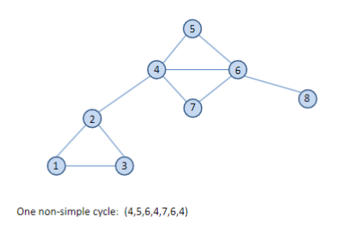
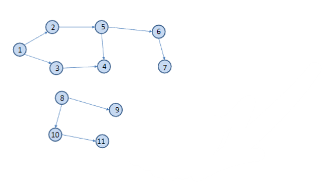
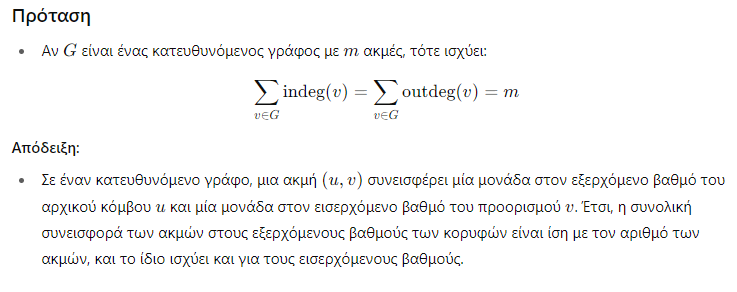
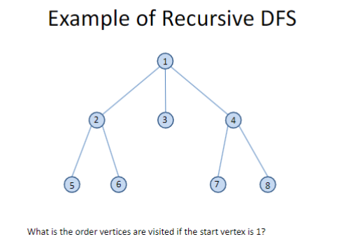

## Γράφοι

- Οι γράφοι είναι συλλογές από κόμβους στις οποίες διάφορα ζεύγη συνδέονται με ευθύγραμμα τμήματα. Οι κόμβοι συνήθως ονομάζονται **κορυφές** και τα ευθύγραμμα τμήματα **ακμές**.
- Οι γράφοι είναι πιο γενική δομή από τα δέντρα. Επιτρέπεται να έχουν **κύκλους** και μπορούν να έχουν **περισσότερα του ενός συνεκτικά συστατικά**.
- Ορισμένοι συγγραφείς χρησιμοποιούν τους όρους **κόμβοι** και **τόξα** αντί για κορυφές και ακμές.
- Οι γράφοι μπορεί να είναι είτε **μη κατευθυνόμενοι** είτε **κατευθυνόμενοι**.

*Δομές Δεδομένων και Προγραμματισμός*


## Παραδείγματα Γράφων

- Δίκτυα μεταφορών

- Ενδιαφέρον πρόβλημα: Ποια είναι η διαδρομή με μία ή περισσότερες στάσεις και τη **μικρότερη συνολική απόσταση** που συνδέει μια **αφετηρία** με μια **πόλη προορισμού**;


*Δομές Δεδομένων και Προγραμματισμός*
## Δίκτυο αγωγών πετρελαίου


- Ενδιαφέρον πρόβλημα: Ποια είναι η **μέγιστη δυνατή συνολική ροή πετρελαίου** από την **πηγή** προς τον **προορισμό**;

## Παραδείγματα (συνέχεια)

- Το Διαδίκτυο

- Ενδιαφέρον πρόβλημα: Πώς θα παραδοθεί ένα **ηλεκτρονικό μήνυμα** από τον **χρήστη A** στον **χρήστη B**;

## Παραδείγματα (συνέχεια)

- Ο Ιστός

- Ενδιαφέρον πρόβλημα: Ποιο είναι το **PageRank** μιας ιστοσελίδας;

## Παραδείγματα (συνέχεια)

- Το κοινωνικό δίκτυο Facebook

- Ενδιαφέρον πρόβλημα: Είναι ο **John** και η **Mary** συνδεδεμένοι; Ποια ενδιαφέροντα **σύνολα** υπάρχουν;

*Δομές Δεδομένων και Προγραμματισμός*

## Τυπικοί Ορισμοί

- Ένας γράφος \( G = (V, E) \) αποτελείται από ένα σύνολο κορυφών \( V \) και ένα σύνολο ακμών \( E \), όπου οι ακμές στο \( E \) σχηματίζονται από ζεύγη διακριτών κορυφών του \( V \).
  
- Αν οι ακμές έχουν κατευθύνσεις, τότε έχουμε έναν **κατευθυνόμενο γράφο** (digraph). Σε αυτή την περίπτωση, οι ακμές είναι ταξινομημένα ζεύγη κορυφών, π.χ. \( u, v \), και λέγονται **κατευθυνόμενες**. Αν \( u, v \) είναι μια κατευθυνόμενη ακμή, τότε το \( u \) ονομάζεται η **προέλευση** και το \( v \) ονομάζεται ο **προορισμός** της.

- Αν οι ακμές δεν έχουν κατευθύνσεις, τότε έχουμε έναν **μη-κατευθυνόμενο γράφο**. Σε αυτή την περίπτωση, οι ακμές είναι μη ταξινομημένα ζεύγη κορυφών, π.χ. \( v, u \), και λέγονται **μη κατευθυνόμενες**.

- Για λόγους απλότητας, θα χρησιμοποιούμε τη σημειογραφία των κατευθυνόμενων ζευγών, σημειώνοντας ότι στην περίπτωση των μη κατευθυνόμενων γράφων το \( u, v \) είναι το ίδιο με το \( v, u \).


## Σημείωση

- Στις επόμενες διαφάνειες, όταν αναφερόμαστε απλώς σε "γράφους" σε έναν ορισμό, ο ορισμός θα ισχύει τόσο για κατευθυνόμενους όσο και για μη κατευθυνόμενους γράφους.

*Δομές Δεδομένων και Προγραμματισμός*

## Ορισμοί (συνέχεια)

- Δύο διαφορετικές κορυφές \( v_i \) και \( v_j \) σε έναν γράφο \( G = (V, E) \) λέγονται **γειτονικές** αν υπάρχει μια ακμή \( e \in E \) τέτοια ώστε \( e = v_i, v_j \).
  
- Όταν ο γράφος είναι μη κατευθυνόμενος, η σχέση γειτνίασης είναι **συμμετρική**.

- Σε έναν μη κατευθυνόμενο γράφο, λέμε ότι μια ακμή είναι **προσπίπτουσα** σε μια κορυφή αν η κορυφή είναι ένα από τα άκρα της ακμής.

- Αν \( (u, v) \) είναι μια ακμή σε έναν κατευθυνόμενο γράφο \( G = (V, E) \), λέμε ότι η ακμή \( (u, v) \) **προσπίπτει από** ή **φεύγει από** την κορυφή \( u \) και **προσπίπτει σε** ή **εισέρχεται** στην κορυφή \( v \).


## Παράδειγμα

Οι κορυφές 1 και 2 είναι **γειτονικές**. Η ακμή \( (1, 2) \) είναι **προσπίπτουσα** στις κορυφές 1 και 2.


## Παράδειγμα

Οι κορυφές 1 και 2 είναι **γειτονικές**. Η ακμή \( (1, 2) \) είναι **προσπίπτουσα από** (ή **φεύγει από**) την κορυφή 1 και είναι **προσπίπτουσα σε** (ή **εισέρχεται σε**) την κορυφή 2.

## Ορισμοί (συνέχεια)

- Ένα **μονοπάτι** \( p \) σε έναν γράφο \( G = (V, E) \) είναι μια ακολουθία κορυφών του \( V \) της μορφής \( p = v_1 v_2 \dots v_n \), με \( n \geq 2 \), στην οποία κάθε κορυφή \( v_i \) είναι **γειτονική** με την επόμενη κορυφή \( v_{i+1} \) (για \( 1 \leq i \leq n - 1 \)).

- Στην παραπάνω περίπτωση, λέμε ότι το μονοπάτι \( p \) περιλαμβάνει τις κορυφές \( v_1, v_2, \dots, v_n \) και τις ακμές \( (v_i, v_{i+1}) \) για \( 1 \leq i \leq n - 1 \).

- Το μήκος ενός μονοπατιού είναι ο αριθμός των ακμών του.

- Ένα μονοπάτι είναι **απλό** αν κάθε κορυφή στο μονοπάτι είναι διακριτή.

- Ένα υπομονοπάτι ενός μονοπατιού είναι μια συνεχής υποακολουθία των κορυφών του.

- Σε έναν κατευθυνόμενο γράφο, συχνά χρησιμοποιούμε τον όρο **κατευθυνόμενο μονοπάτι** για προφανείς λόγους.

*Δομές Δεδομένων και Προγραμματισμός*

## Παράδειγμα

Η ακολουθία κορυφών \( 1, 2, 5, 6 \) είναι ένα **απλό μονοπάτι** μήκους 3.

Το μονοπάτι \( 1, 2, 5, 6, 5 \) δεν είναι **απλό**.

Το μονοπάτι \( 2, 5, 6 \) είναι ένα **υπομονοπάτι** του μονοπατιού \( 1, 2, 5, 6, 7 \).





## Παράδειγμα

- Η ακολουθία των κορυφών 1, 2, 5, 6 είναι ένα **απλό (κατευθυνόμενο) μονοπάτι** μήκους 3.
- Η ακολουθία 2, 5, 4 δεν είναι μονοπάτι γιατί δεν υπάρχει κατευθυνόμενη ακμή \( (5, 4) \).
- Το μονοπάτι 5, 6, 7, 4, 5 είναι ένας **απλός κύκλος**.

## Προσβασιμότητα

- Έστω \( G \) ένας γράφος. Αν υπάρχει ένα μονοπάτι \( p \) από την κορυφή \( v \) στην κορυφή \( u \) στον γράφο \( G \), τότε λέμε ότι η \( u \) είναι **προσβάσιμη** από την \( v \) μέσω του \( p \).

## Παράδειγμα


- Οι κορυφές 1 και 6 είναι **προσβάσιμες** η μία από την άλλη.
- Η κορυφή 1 δεν είναι προσβάσιμη από την κορυφή 8 (ή 9, 10, 11).


## Παράδειγμα

- Η κορυφή 6 είναι **προσβάσιμη** από την κορυφή 1.
- Η κορυφή 1 δεν είναι προσβάσιμη από την κορυφή 6.
- Η κορυφή 1 δεν είναι προσβάσιμη από την κορυφή 8 (ή 9, 10, 11).

## Συνδεδεμένοι Μη Κατευθυνόμενοι Γράφοι

- Ένας μη κατευθυνόμενος γράφος \( G \) είναι **συνεκτικός** αν κάθε κορυφή είναι προσβάσιμη από κάθε άλλη κορυφή στον γράφο (δηλαδή, αν υπάρχει μονοπάτι από κάθε κορυφή προς κάθε άλλη κορυφή).

*Δομές Δεδομένων και Προγραμματισμός*


## Συνεκτικές Συνιστώσες Μη Κατευθυνόμενων Γράφων

- Στον μη κατευθυνόμενο γράφο \( G = (V, E) \), μια **συνεκτική συνιστώσα** είναι ένα μέγιστο υποσύνολο \( S \) των κορυφών \( V \) που είναι όλες προσβάσιμες η μία από την άλλη.

- Με "μέγιστο" εννοούμε ότι δεν υπάρχει μεγαλύτερο υποσύνολο \( T \) κορυφών στο \( V \) τέτοιο που το \( T \) να περιέχει το \( S \) και να έχει την ίδια ιδιότητα προσβασιμότητας.

- Ένας μη κατευθυνόμενος γράφος \( G \) μπορεί πάντα να χωριστεί σε συνεκτικές συνιστώσες \( S_1, S_2, \dots, S_n \) τέτοιες ώστε \( S_i \cap S_j = \emptyset \) όποτε \( i \neq j \).

- Οι συνεκτικές συνιστώσες ενός μη κατευθυνόμενου γράφου είναι οι κλάσεις ισοδυναμίας των κορυφών υπό τη σχέση "είναι προσβάσιμη από".

- Ένας μη κατευθυνόμενος γράφος είναι συνεκτικός αν και μόνο αν έχει ακριβώς μία συνεκτική συνιστώσα.

*Δομές Δεδομένων και Προγραμματισμός*


## Ισχυρά Συνεκτικοί Κατευθυνόμενοι Γράφοι

- Ένας κατευθυνόμενος γράφος είναι **ισχυρά συνεκτικός** αν κάθε δύο κορυφές είναι προσβάσιμες η μία από την άλλη (δηλαδή, υπάρχει μονοπάτι από την πρώτη στην δεύτερη και αντίστροφα).

*Δομές Δεδομένων και Προγραμματισμός*

## Ισχυρά Συνεκτικές Συνιστώσες Κατευθυνόμενου Γράφου

- Μια **ισχυρά συνεκτική συνιστώσα** ενός κατευθυνόμενου γράφου είναι ένα μέγιστο σύνολο κορυφών στο οποίο υπάρχει μονοπάτι από κάθε κορυφή στο σύνολο προς κάθε άλλη κορυφή.

- Τυπικά, έστω \( G = (V, E) \) ένας κατευθυνόμενος γράφος. Μπορούμε να χωρίσουμε το \( V \) σε κλάσεις ισοδυναμίας \( V_i, 1 \leq i \leq r \), έτσι ώστε οι κορυφές \( v \) και \( w \) να είναι ισοδύναμες αν και μόνο αν υπάρχει μονοπάτι από το \( v \) στο \( w \) και μονοπάτι από το \( w \) στο \( v \). Έστω \( E_i, 1 \leq i \leq r \) το σύνολο των ακμών με άκρα στις κορυφές του \( V_i \). Οι γράφοι \( G_i = (V_i, E_i) \) ονομάζονται **ισχυρά συνεκτικές συνιστώσες** ή απλώς **ισχυρές συνιστώσες** του \( G \).

- Ένας κατευθυνόμενος γράφος με ακριβώς μία ισχυρή συνιστώσα είναι **ισχυρά συνεκτικός**.

*Δομές Δεδομένων και Προγραμματισμός*


Αν στον μη κατευθυνόμενο γράφο, οι βαθμοί των κόμβων είναι οι εξής:

Ο βαθμός του κόμβου 1 είναι 2: Αυτό σημαίνει ότι ο κόμβος 1 έχει 2 ακμές που τον συνδέουν με άλλους κόμβους.

Ο βαθμός του κόμβου 4 είναι 4: Ο κόμβος 4 έχει 4 ακμές που τον συνδέουν με άλλους κόμβους.

Ο βαθμός του κόμβου 8 είναι 1: Ο κόμβος 8 έχει μόνο 1 ακμή που τον συνδέει με κάποιον άλλον κόμβο.


-----




## Περισσότεροι Ορισμοί

- Ένας **υπογράφος** ενός γράφου \( G \) είναι ένας γράφος \( H \) του οποίου το σύνολο των κορυφών και το σύνολο των ακμών είναι υποσύνολα του συνόλου των κορυφών και του συνόλου των ακμών του \( G \), αντίστοιχα.

- Ένας **υπογράφος επικάλυψης** του \( G \) είναι ένας υπογράφος του \( G \) που περιλαμβάνει όλες τις κορυφές του \( G \).

*Δομές Δεδομένων και Προγραμματισμός*


## Περισσότεροι Ορισμοί για Μη Κατευθυνόμενους Γράφους

- Ένα **δάσος** είναι ένας μη κατευθυνόμενος γράφος χωρίς κύκλους.

- Ένα **ελεύθερο δένδρο** είναι ένα συνεκτικό δάσος, δηλαδή, ένας συνεκτικός, μη κατευθυνόμενος γράφος χωρίς κύκλους.

- Τα δέντρα που μελετήσαμε σε προηγούμενες διαλέξεις είναι **δέντρα με ρίζα** και διαφέρουν από τα ελεύθερα δένδρα.

- Ένα **δένδρο επικάλυψης** ή **επικαλύπτον δένδρο** ενός μη κατευθυνόμενου γράφου είναι ένας υπογράφος επικάλυψης που είναι ελεύθερο δένδρο.

- Ένα **δάσος επικάλυψης** ή **επικαλύπτον δάσος** είναι ένας μη κατευθυνόμενος γράφος που είναι η ένωση δένδρων επικάλυψης, ένα για κάθε συνεκτική συνιστώσα του γράφου.

*Δομές Δεδομένων και Προγραμματισμός*


 Οι παχιές πράσινες γραμμές ορίζουν ένα **δένδρο επικάλυψης** του γράφου.


## Παράδειγμα

- Οι παχιές πράσινες γραμμές ορίζουν ένα **δάσος επικάλυψης**, το οποίο αποτελείται από δύο **δέντρα επικάλυψης**.

## Περισσότεροι Ορισμοί (συνέχεια)

- Μπορούμε να δώσουμε παρόμοιους ορισμούς για δάσος και δένδρο στην περίπτωση των κατευθυνόμενων γραφών, αλλά τώρα τα δέντρα μας θα είναι **κατευθυνόμενα, δέντρα με ρίζα** στα οποία όλες οι ακμές δείχνουν μακριά από τη ρίζα (τεχνικά, τέτοιο δένδρο ονομάζεται **αρβορέσκενς** ή **κατευθυνόμενος γράφος με ρίζα**, αν δεν σας αρέσουν οι λέξεις που προέρχονται από τα Γαλλικά).

- Οι όροι **δένδρο επικάλυψης** και **δάσος επικάλυψης** χρησιμοποιούνται μόνο για μη κατευθυνόμενους γράφους.


## Πίνακες Γειτνίασης (συνέχεια)

- Οι διαγώνιες καταχωρήσεις σε έναν πίνακα γειτνίασης (για έναν κατευθυνόμενο ή μη κατευθυνόμενο γράφο) είναι μηδέν, αφού οι γράφοι, όπως τους έχουμε ορίσει, δεν επιτρέπεται να έχουν ακμές που συνδέουν μια κορυφή με τον εαυτό της (δηλαδή, ακμές αυτοαναφοράς).

## Πίνακες Γειτνίασης σε Γλώσσα C

```c
#define MAXVERTEX 10
typedef enum {FALSE, TRUE} Boolean
/* Το FALSE και το TRUE θα είναι 0 και 1 αντίστοιχα */

typedef Boolean AdjacencyMatrix[MAXVERTEX][MAXVERTEX]

typedef struct graph {
    int n; /* αριθμός κορυφών στον γράφο */
    AdjacencyMatrix A;
} Graph;
```

*Δομές Δεδομένων και Προγραμματισμός*


## Οι Συνδεδεμένες Λίστες Γειτνίασης για τον Γράφο G

- Παρατηρήστε ότι οι κορυφές σε μια λίστα οργανώνονται σύμφωνα με τη φυσική τους σειρά.


## Παράδειγμα Μη Κατευθυνόμενου Γράφου

- Η αναπαράσταση του γράφου με συνδεδεμένες λίστες γειτνίασης για τον γράφο της προηγούμενης διαφάνειας είναι παρόμοια με αυτήν της κατευθυνόμενης περίπτωσης.

### Υποθέσεις

- Στις προηγούμενες διαφάνειες, οι κορυφές του γράφου εμφανίζονται στη φυσική τους σειρά στους πίνακες και στις συνδεδεμένες λίστες που χρησιμοποιούνται στην αναπαράσταση του πίνακα γειτνίασης και των συνδέσεων γειτνίασης.

- Αυτή θα είναι η υπόθεσή μας σε όλα τα παραδείγματα από εδώ και στο εξής.

- Στην αναπαράσταση με συνδεδεμένες λίστες γειτνίασης, δείξαμε επίσης τους βαθμούς των κορυφών. Αυτή η πληροφορία δεν είναι απαραίτητη και μπορεί να παραληφθεί.

## Σειριακές Συνδεδεμένες Λίστες Γειτνίασης σε Γλώσσα C

```c
typedef int AdjacencyList[MAXVERTEX];

typedef struct graph {
    int n; /* αριθμός κορυφών στον γράφο */
    int degree[MAXVERTEX];
    AdjacencyList A[MAXVERTEX];
} Graph;
```

Στην παραπάνω αναπαράσταση, κάθε δείκτης 
𝑖
i του πίνακα 
𝐴
A είναι μια κορυφή του γράφου, ενώ κάθε στοιχείο 
𝐴
[
𝑖
]
A[i] είναι ένας πίνακας που αποθηκεύει τη λίστα γειτνίασης της κορυφής 
𝑖
i.

## Συνδεδεμένες Λίστες Γειτνίασης σε Γλώσσα C

```c
typedef int Vertex;

typedef struct edge {
    Vertex endpoint;
    struct edge *nextedge;
} Edge;

typedef struct graph {
    int n; /* αριθμός κορυφών στον γράφο */
    Edge *firstedge[MAXVERTEX];
} Graph;
```

## Συνδεδεμένες Λίστες Γειτνίασης σε Γλώσσα C

### Στην παραπάνω αναπαράσταση, κάθε δείκτης \( i \) του πίνακα \( firstedge \) είναι μια κορυφή και κάθε στοιχείο \( firstedge[i] \) είναι ένας δείκτης σε μια συνδεδεμένη λίστα που περιέχει τις γειτονικές κορυφές της κορυφής \( i \). Αυτή η υλοποίηση των λιστών γειτνίασης χρησιμοποιείται στον κώδικα που παρέχουμε παρακάτω.

### Συνδεδεμένες Λίστες Γειτνίασης σε Γλώσσα C (συνέχεια)

- Η προηγούμενη αναπαράσταση χρησιμοποίησε έναν πίνακα για τις κορυφές και συνδεδεμένες λίστες για τις λίστες γειτνίασης.

- Μπορούμε να χρησιμοποιήσουμε συνδεδεμένες λίστες και για τις κορυφές, όπως φαίνεται παρακάτω.

### Συνδεδεμένες Λίστες Γειτνίασης σε Γλώσσα C (συνέχεια)

```c
typedef struct vertex Vertex;
typedef struct edge Edge;

struct vertex {
    Edge *firstedge;
    Vertex *nextvertex;
};

struct edge {
    Vertex *endpoint;
    Edge *nextedge;
};

typedef Vertex *Graph;
```
Δεν χρησιμοποιούμε αυτήν την υλοποίηση των λιστών γειτνίασης στον κώδικα που παρέχουμε παρακάτω.

## Χωρητικότητα Χώρου

- Η χωρητικότητα χώρου της αναπαράστασης πίνακα γειτνίασης ενός γράφου με \( n \) κορυφές είναι \( O(n^2) \).
- Η χωρητικότητα χώρου της αναπαράστασης λιστών γειτνίασης ενός γράφου με \( n \) κορυφές και \( e \) ακμές είναι \( O(n + e) \).

## Ερωτήσεις

- Ποια αναπαράσταση γράφου θα χρησιμοποιούσατε υπό τις εξής συνθήκες;
    - Ο γράφος είναι αραιός (π.χ. περιέχει \( 10^6 \) κόμβους αλλά μόνο \( 10^5 \) ακμές).
    - Ο γράφος είναι πυκνός (π.χ. περιέχει \( 10^6 \) κόμβους και \( 10^{10} \) ακμές).
  
- Η απάντηση εξαρτάται από την ποσότητα χώρου που έχουμε διαθέσιμο και τις ενέργειες που θέλουμε να εκτελούμε στον γράφο.

## Αναζήτηση σε Γράφο

- Για να αναζητήσουμε σε έναν γράφο \( G \), πρέπει να επισκεφθούμε όλες τις κορυφές του \( G \) με μια συστηματική σειρά.

- Ας ορίσουμε μια αναφορά:

```c
typedef enum {FALSE, TRUE} Boolean;
```

Κάθε κορυφή 
𝑣
v μπορεί να είναι μια δομή με ένα μέλος τύπου Boolean, το οποίο ονομάζεται 
𝑣
.
𝑉
𝑖
𝑠
𝑖
𝑡
𝑒
𝑑
v.Visited, το οποίο αρχικά είναι 
𝐹
𝐴
𝐿
𝑆
𝐸
FALSE για όλες τις κορυφές του 
𝐺
G. Όταν επισκεπτόμαστε την κορυφή 
𝑣
v, θα το ορίσουμε σε 
𝑇
𝑅
𝑈
𝐸
TRUE.

```c
void GraphSearch(Graph G, Vertex v) {
    // Ορίζουμε τον γράφο G = (V, E)
    // Δημιουργούμε ένα άδειο δοχείο C
    Container C;
    
    // Αρχικοποιούμε τις επισκέψεις όλων των κορυφών
    for (each vertex x in V) {
        x.Visited = FALSE;
    }
    
    // Τοποθετούμε την αρχική κορυφή v στο C
    Put v into C;
    
    // Όσο το δοχείο C δεν είναι άδειο
    while (C is non-empty) {
        // Αφαιρούμε μια κορυφή x από το δοχείο C
        Remove a vertex x from container C;
        
        // Αν η κορυφή x δεν έχει επισκεφτεί, την επισκεπτόμαστε
        if (!(x.Visited)) {
            Visit(x);
            x.Visited = TRUE;
            
            // Για κάθε γείτονα w της κορυφής x
            for (each vertex w in Vx) {
                // Αν η κορυφή w δεν έχει επισκεφτεί, την προσθέτουμε στο C
                if (!(w.Visited)) {
                    Put w into C;
                }
            }
        }
    }
}
```

• Ας εξετάσουμε τι συμβαίνει όταν το κοντέινερ 
𝐶
C είναι μια στοίβα.


# Αναζήτηση Πρώτα Κατά Βάθος (DFS)

- Όταν η δομή `C` είναι μια στοίβα (stack), το δέντρο στο προηγούμενο παράδειγμα διασχίζεται με σειρά **πρώτα κατά βάθος**.
- Η αναζήτηση πρώτα κατά βάθος (DFS) σε μια κορυφή πάντα **κατεβαίνει** (επισκέπτεται μη επισκέπτετα παιδιά) πριν κινηθεί **οριζόντια** (επισκέπτεται μη επισκέπτα αδέρφια).
- Η DFS σε γράφο είναι ανάλογη με τη **διάσχιση προ-τάξης** (pre-order traversal) ενός διατεταγμένου δέντρου.

## DFS (συνέχεια)

- Η στρατηγική που ακολουθεί η DFS, όπως υποδηλώνει και το όνομά της, είναι να εμβαθύνει στην αναζήτηση στο γράφο όποτε είναι δυνατόν.
- Στην DFS, οι ακμές εξερευνώνται από την πιο πρόσφατα ανακαλυφθείσα κορυφή `𝑣` που έχει ακόμα μη εξερευνημένες ακμές να φεύγουν από αυτήν.
- Όταν όλες οι ακμές της `𝑣` έχουν εξερευνηθεί, η αναζήτηση **επιστρέφει πίσω (backtracks)** για να εξερευνήσει ακμές από την κορυφή από την οποία ανακαλύφθηκε η `𝑣`.
- Αυτή η διαδικασία συνεχίζεται μέχρι να έχουν ανακαλυφθεί όλες οι κορυφές που είναι προσβάσιμες από την αρχική κορυφή-πηγή.
- Αν απομένουν μη ανακαλυφθείσες κορυφές, μία από αυτές επιλέγεται ως νέα πηγή και η αναζήτηση επαναλαμβάνεται από εκεί.
- Ολόκληρη η διαδικασία επαναλαμβάνεται μέχρι να έχουν ανακαλυφθεί όλες οι κορυφές.

## Αναζήτηση σε Γράφο (συνέχεια)

- Ας εξετάσουμε τι συμβαίνει όταν η δομή `C` είναι μια ουρά (queue).


# Αναζήτηση Πρώτα Κατά Πλάτος (BFS)

- Όταν η δομή `C` είναι μια ουρά (queue), το δέντρο στο προηγούμενο παράδειγμα διασχίζεται με σειρά **πρώτα κατά πλάτος**.
- Η αναζήτηση πρώτα κατά πλάτος (Breadth-First Search - BFS) σε μια κορυφή **επεκτείνεται πρώτα οριζόντια** πριν κατέβει σε βάθος.
- Η διάσχιση γράφου με BFS είναι ανάλογη με τη **διάσχιση κατά επίπεδα** (level-order traversal) ενός διατεταγμένου δέντρου.
- Η BFS χωρίζει τις κορυφές του γράφου σε επίπεδα:
  - Η αρχική κορυφή βρίσκεται στο **επίπεδο 0**.
  - Οι κορυφές που είναι γειτονικές στην αρχική βρίσκονται στο **επίπεδο 1**.
  - Οι κορυφές που είναι γειτονικές σε αυτές βρίσκονται στο **επίπεδο 2**, κ.ο.κ.

## BFS (συνέχεια)

- Η BFS λειτουργεί ως εξής:
  - Ξεκινάμε από την αρχική κορυφή (**επίπεδο 0**) και επισκεπτόμαστε όλες τις κορυφές που μπορούμε να φτάσουμε ακολουθώντας **μία ακμή** (επίπεδο 1).
  - Στη συνέχεια επισκεπτόμαστε όλες τις κορυφές που μπορούμε να φτάσουμε από την αρχική κορυφή ακολουθώντας **δύο ακμές** (επίπεδο 2).
  - Συνεχίζουμε με τις κορυφές του **επιπέδου 3** και ούτω καθεξής.


# Εξαντλητική Αναζήτηση (Exhaustive Search)

- Είτε χρησιμοποιηθεί η εκδοχή με στοίβα είτε η εκδοχή με ουρά του αλγορίθμου `GraphSearch`, θα επισκεφθεί κάθε κορυφή σε έναν γράφο `G`, **υπό την προϋπόθεση ότι ο `G` αποτελείται από μία μόνο ισχυρά συνεκτική συνιστώσα**.
- Αν αυτό δεν ισχύει, τότε μπορούμε να απαριθμήσουμε όλες τις κορυφές του `G` και να εκτελέσουμε τον `GraphSearch` ξεκινώντας από κάθε μία από αυτές, ώστε να επισκεφθούμε όλες τις κορυφές του γράφου `G`.

## Συνάρτηση Εξαντλητικής Αναζήτησης σε Γράφο

```c
void ExhaustiveGraphSearch(G)
{
    Let G = (V, E) be a graph;
    for (each vertex v in G) {
        GraphSearch(G, v);
    }
}
```

# Ο Θησέας στον Λαβύρινθο

- Η αναζήτηση πρώτα κατά βάθος (DFS) μπορεί να προσομοιωθεί με ένα **κορδόνι** και ένα **δοχείο μπογιάς** για να βάφονται οι κορυφές — δηλαδή, με μια εκδοχή του αλγορίθμου που θα μπορούσε να έχει χρησιμοποιήσει ο **Θησέας** στον λαβύρινθο του Μινώταυρου!
- Η αναζήτηση πρώτα κατά πλάτος (BFS) είναι **ανάλογη με μια ομάδα ανθρώπων** που εξερευνούν τον γράφο απλώνοντας τις κινήσεις τους προς όλες τις κατευθύνσεις.

# Υλοποίηση DFS σε C

- Θα δείξουμε τώρα πώς να υλοποιήσουμε την αναζήτηση πρώτα κατά βάθος (DFS) σε C χρησιμοποιώντας **αναδρομική συνάρτηση** (και όχι στοίβα όπως προηγουμένως). Αυτή είναι η **τυπική υλοποίηση** της DFS.
- Θα χρησιμοποιήσουμε την **αναπαράσταση του γράφου με συνδεδεμένες λίστες γειτνίασης** (linked adjacency lists).
- Θα γράψουμε μια συνάρτηση `DepthFirst` η οποία θα καλεί την αναδρομική συνάρτηση `Traverse`.

# Υλοποίηση DFS σε C (συνέχεια)

## Γενική Μεταβλητή

```c
/* Γενική μεταβλητή visited */
Boolean visited[MAXVERTEX];
```
```c
/* DepthFirst: Αναζήτηση πρώτα κατά βάθος σε γράφο
Προϋπόθεση: Ο γράφος G έχει ήδη δημιουργηθεί.
Μετα-συνθήκη: Η συνάρτηση Visit έχει κληθεί για κάθε κορυφή του G με σειρά DFS.
Χρήσεις: Η συνάρτηση Traverse υλοποιεί αναδρομικά τη διάσχιση DFS.
*/
void DepthFirst(Graph G, void (*Visit)(Vertex x))
{
    Vertex v;
    for (v = 0; v < G.n; v++)
        visited[v] = FALSE;

    for (v = 0; v < G.n; v++)
        if (!visited[v])
            Traverse(G, v, Visit);
}
```

```c
/* Traverse: Αναδρομική διάσχιση του γράφου
Προϋπόθεση: Η v είναι μια έγκυρη κορυφή του γράφου G.
Μετα-συνθήκη: Η αναζήτηση κατά βάθος (DFS), με χρήση της Visit, έχει ολοκληρωθεί για τη v και όλες τις γειτονικές της κορυφές.
Χρήσεις: Τη συνάρτηση Traverse (αναδρομικά), τη συνάρτηση Visit.
*/
void Traverse(Graph G, Vertex v, void (*Visit)(Vertex x))
{
    Vertex w;
    Edge *curedge;

    visited[v] = TRUE;
    Visit(v);

    curedge = G.firstedge[v]; // δείκτης στην πρώτη ακμή (v, _)
    while (curedge) {
        w = curedge->endpoint; // w είναι ο τελικός κόμβος της ακμής (v, w)
        if (!visited[w])
            Traverse(G, w, Visit);
        curedge = curedge->nextedge; // δείκτης στην επόμενη ακμή (v, _)
    }
}

```





# Σημαντικό: Ιδιαιτερότητες της DFS

- Υπάρχουν **πολλοί τρόποι** για να διασχίσουμε έναν γράφο με DFS. Για παράδειγμα, ξεκινώντας από διαφορετική κορυφή, καταλήγουμε σε διαφορετικές διαδρομές DFS.
- Η σειρά με την οποία επισκέπτεται τις κορυφές η DFS εξαρτάται από:
  - Την **αναπαράσταση του γράφου** (π.χ. πίνακας γειτνίασης vs. λίστα γειτνίασης, και η σειρά των κορυφών σε αυτές).
  - Την **υλοποίηση** του αλγορίθμου DFS (π.χ. αναδρομική υλοποίηση vs. χρήση στοίβας).

## DFS και Συνδεδεμένα Συστατικά

- Η DFS **διασχίζει όλες τις ακμές** και **επισκέπτεται όλες τις κορυφές** που είναι προσβάσιμες από την αρχική κορυφή.
- Δηλαδή, διασχίζει **όλες τις κορυφές της συνδεδεμένης συνιστώσας** στην οποία ανήκει η αρχική κορυφή.
- Αυτό γίνεται **ανεξαρτήτως της σειράς** με την οποία εξετάζονται οι ακμές που φεύγουν από κάθε κορυφή.

# Πολυπλοκότητα της DFS

- Η DFS, όπως την υλοποιήσαμε με την αναδρομική συνάρτηση `Traverse` και τις λίστες γειτνίασης, έχει πολυπλοκότητα **Ο(n + e)**, όπου:
  - `n` είναι ο αριθμός κορυφών
  - `e` είναι ο αριθμός ακμών

### Επεξήγηση:

- Η συνάρτηση `Traverse` καλείται **το πολύ μία φορά για κάθε κορυφή**.
  - Αυτό συμβαίνει γιατί, μόλις επισκεφτούμε μια κορυφή `v`, την μαρκάρουμε ως επισκέψιμη (`visited[v] = TRUE`), και δεν την ξανακαλούμε.
- Ο χρόνος που καταναλώνεται για τη διάσχιση των λιστών γειτνίασης είναι αναλογικός με το πλήθος των ακμών, δηλαδή **Ο(e)**.
- Το στάδιο αρχικοποίησης, όπου θέτουμε όλες τις κορυφές ως μη επισκέψιμες, απαιτεί **Ο(n)** χρόνο.

### Συμπέρασμα:

- **Συνολική Χρονική Πολυπλοκότητα: Ο(n + e)**

# Πολυπλοκότητα της DFS (συνέχεια)

- Αν η DFS υλοποιηθεί με **πίνακα γειτνίασης (adjacency matrix)**, τότε η πολυπλοκότητά της είναι **Ο(n²)**.
- Αν ο γράφος είναι **πυκνός**, δηλαδή έχει περίπου **Ο(n²)** ακμές, τότε η διαφορά μεταξύ των δύο υλοποιήσεων (πίνακας vs. λίστα γειτνίασης) είναι **ασήμαντη**, καθώς και οι δύο εκτελούνται σε **Ο(n²)** χρόνο.
- Αν ο γράφος είναι **αραιός**, δηλαδή έχει περίπου **Ο(n)** ακμές, τότε η υλοποίηση με **πίνακα γειτνίασης** είναι σημαντικά πιο αργή από αυτήν με **λίστα γειτνίασης**.

## Πολυπλοκότητα της συνάρτησης `DepthFirst`

- Η συνολική πολυπλοκότητα της `DepthFirst` είναι **Ο(n(n + e))**.
- Αυτό συμβαίνει επειδή περιλαμβάνει **δύο βρόχους `for`**:
  - Ο πρώτος βρόχος αρχικοποιεί τον πίνακα `visited` για **όλες τις κορυφές** (Ο(n)).
  - Ο δεύτερος βρόχος εξασφαλίζει ότι η DFS θα ξεκινήσει από **κάθε μη επισκέψιμη κορυφή**, ώστε να καλυφθούν **όλα τα συνδεδεμένα συστατικά** του γράφου.

---

# Υλοποίηση BFS σε C

- Θα δείξουμε τώρα πώς να υλοποιήσουμε την αναζήτηση πρώτα κατά πλάτος (**BFS**) στη γλώσσα C.
- Ο αλγόριθμος `BreadthFirst` χρησιμοποιεί μια **ουρά (queue)**.
  - Η ουρά μπορεί να υλοποιηθεί με οποιονδήποτε από τους τρόπους που παρουσιάστηκαν σε προηγούμενα μαθήματα/διαλέξεις.

> 💡 Σε αντίθεση με την DFS, η BFS εξερευνά πρώτα όλα τα γειτονικά επίπεδα, προτού «κατέβει» βαθύτερα στον γράφο.

# Υλοποίηση BFS σε C

```c
/* BreadthFirst: Διάσχιση πρώτα κατά πλάτος ενός γράφου
Προϋπόθεση: Ο γράφος G έχει ήδη δημιουργηθεί
Μετα-συνθήκη: Η συνάρτηση Visit έχει εκτελεστεί για κάθε κορυφή του G, με τις κορυφές να επιλέγονται με σειρά πρώτα κατά πλάτος.
Χρήσεις: Συναρτήσεις ουράς (Queue)
*/
void BreadthFirst(Graph G, void (*Visit)(Vertex))
{
    Queue Q;
    Boolean visited[MAXVERTEX];
    Vertex v, u, w;
    Edge *curedge;

    // Αρχικοποίηση του πίνακα visited
    for (v = 0; v < G.n; v++)
        visited[v] = FALSE;

    InitializeQueue(&Q);

    // Εξερεύνηση από κάθε κορυφή που δεν έχει επισκεφθεί
    for (u = 0; u < G.n; u++)
        if (!visited[u]) {
            // Προσθήκη της αρχικής κορυφής στην ουρά
            Insert(u, &Q);

            // Επεξεργασία των στοιχείων στην ουρά
            do {
                Remove(&Q, &v);
                if (!visited[v]) {
                    visited[v] = TRUE;
                    Visit(v);  // Επισκεπτόμαστε την κορυφή
                }

                // Εξερεύνηση των γειτονικών κορυφών
                curedge = G.firstedge[v]; // δείκτης στην πρώτη ακμή (v, _)
                while (curedge) {
                    w = curedge->endpoint; // w είναι ο τελικός κόμβος της ακμής (v, w)
                    if (!visited[w])
                        Insert(w, &Q);  // Προσθήκη στη ουρά αν δεν είναι επισκέψιμος
                    curedge = curedge->nextedge; // δείκτης στην επόμενη ακμή (v, _)
                }
            } while (!Empty(&Q));  // Επανάληψη όσο η ουρά δεν είναι άδεια
        }
}
```

Περιγραφή:

Η συνάρτηση BreadthFirst χρησιμοποιεί μια ουρά (queue) για την υλοποίηση της διάσχισης πρώτα κατά πλάτος (BFS).

Όλες οι κορυφές που είναι προσβάσιμες από την αρχική κορυφή εξετάζονται με τη σειρά που εμφανίζονται στο επίπεδο τους, προτού προχωρήσουμε στο επόμενο επίπεδο.

Για κάθε κορυφή, εξετάζονται οι γείτονές της και αν δεν έχουν επισκεφθεί, προστίθενται στην ουρά.

Ο αλγόριθμος τερματίζει όταν η ουρά είναι άδεια, που σημαίνει ότι όλες οι προσβάσιμες κορυφές έχουν εξερευνηθεί.

📌 Σημείωση: Η BFS είναι ιδιαίτερα χρήσιμη για την εύρεση της συντομότερης διαδρομής σε αμετάβατο γράφο και για προβλήματα που απαιτούν εξερεύνηση κατά επίπεδα.


# Παράδειγμα BFS (συνέχεια)

- Ας δούμε πώς θα εκτελεστεί ο αλγόριθμος.
  - Αρχικά, η κορυφή **A** θα προστεθεί στην ουρά.
  - Στη συνέχεια, η **A** θα αφαιρεθεί από την ουρά και θα σημειωθεί ως επισκέψιμη.
  - Τότε, η λίστα γειτνίασης της **A** θα εξεταστεί και οι κορυφές **B**, **C**, **D** και **E** θα βρεθούν και θα προστεθούν στην ουρά.
  - Στη συνέχεια, η **B** θα αφαιρεθεί από την ουρά και θα σημειωθεί ως επισκέψιμη.
  - Η λίστα γειτνίασης της **B** θα εξεταστεί και οι κορυφές **D** και **E** θα προστεθούν στην ουρά (η **A** δεν θα προστεθεί ξανά, επειδή έχει ήδη σημειωθεί ως επισκέψιμη).
- Αλλά περιμένετε! Γιατί προστίθενται ξανά οι **D** και **E** στην ουρά, αν είναι ήδη εκεί;

---

# Αλγόριθμος BreadthFirst - Αναθεώρηση

- Αυτό που μόλις δείξαμε είναι μία **αναποτελεσματικότητα** της BFS.
- Μπορούμε να διορθώσουμε αυτή την αναποτελεσματικότητα ελέγχοντας αν μια κορυφή είναι ήδη στην ουρά, ώστε να μην την προσθέτουμε δεύτερη φορά.
- Μία άλλη λύση στο πρόβλημα είναι η εξής:
  - Αντί να σημειώνουμε μια κορυφή ως επισκέψιμη όταν την αφαιρούμε από την ουρά, μπορούμε να το κάνουμε όταν την προσθέτουμε στην ουρά.

---

# Πολυπλοκότητα της BFS

- Ας εξετάσουμε τον προηγούμενο αλγόριθμο `BreadthFirst`, αλλά ας αφαιρέσουμε τον βρόχο `for` που διασφαλίζει ότι όλα τα συνδεδεμένα συστατικά του γράφου εξετάζονται (δηλαδή, κάνουμε BFS από μια δεδομένη αρχική κορυφή).
- Η BFS, όπως υλοποιείται παραπάνω (με λίστες γειτνίασης και χωρίς να επιτρέπεται μια κορυφή να εμφανίζεται περισσότερες από μία φορές στην ουρά), έχει την ίδια πολυπλοκότητα με την DFS, δηλαδή **Ο(n + e)**.

# DFS σε Μη Κατευθυνόμενο Γράφο

- Κατά τη διάρκεια μιας διάσχισης πρώτα κατά βάθος (DFS) σε έναν **μη κατευθυνόμενο γράφο**, ορισμένες ακμές, όταν διασχίζονται, οδηγούν σε κορυφές που δεν έχουν επισκεφτεί. Οι ακμές που οδηγούν σε νέες κορυφές ονομάζονται **ακμές δένδρου** (tree edges) ή **ακμές ανακάλυψης** (discovery edges).
  
- Οι **ακμές δένδρου** σχηματίζουν ένα **δάσος επικάλυψης** για τον δεδομένο γράφο κατά την DFS. Αυτό το δάσος έχει ένα δέντρο για κάθε **συνδεδεμένο συστατικό** του γράφου και έναν κόμβο δέντρου για κάθε κορυφή του γράφου.

- Υπάρχουν επίσης ακμές που δεν ανήκουν στο δάσος επικάλυψης. Αυτές ονομάζονται **ακμές οπισθοχώρησης** (back edges) και πηγαίνουν από μια κορυφή σε μια άλλη κορυφή που έχουμε ήδη επισκεφτεί (δηλαδή, σε έναν από τους **προγόνους** της στον δέντρο επικάλυψης).

- **Ακμές δένδρου** είναι εκείνες οι ακμές (𝑣, 𝑤) για τις οποίες η συνάρτηση `Traverse` με παράμετρο 𝑣 καλεί άμεσα τη συνάρτηση `Traverse` με παράμετρο 𝑤 ή το αντίστροφο.

- **Ακμές οπισθοχώρησης** είναι εκείνες οι ακμές (𝑣, 𝑤) για τις οποίες η συνάρτηση `Traverse` με παράμετρο 𝑣 ελέγχει την κορυφή 𝑤 αλλά δεν καλεί τη συνάρτηση `Traverse` γιατί η 𝑤 έχει ήδη επισκεφθεί.


# Σημαντικό

- Οι τύποι των ακμών είναι ιδιότητες της δυναμικής της αναζήτησης, και όχι μόνο του γράφου.
- Διάφορα **δάση επικάλυψης πρώτα κατά βάθος** του ίδιου γράφου μπορεί να διαφέρουν σημαντικά στον χαρακτήρα τους.
- Μπορείς να δώσεις παραδείγματα για τα παραπάνω;

---

# Ερώτηση

- Πώς μπορούμε να τροποποιήσουμε τη συνάρτηση `Traverse` ώστε να εξάγει τις ακμές του δέντρου πρώτα κατά βάθος (ακμές δέντρου) και τις ακμές οπισθοχώρησης;

---

# Πρόταση

- Έστω ότι ο γράφος **𝐺** είναι **μη κατευθυνόμενος** με **𝑛** κορυφές και **𝑒** ακμές, και εκπροσωπείται με λίστες γειτνίασης. Μια διάσχιση DFS του 𝐺 μπορεί να εκτελεστεί σε χρόνο **Ο(𝑛 + 𝑒)** και μπορεί να χρησιμοποιηθεί για να επιλύσει τα εξής προβλήματα σε χρόνο **Ο(𝑛 + 𝑒)**:
  1. Έλεγχος αν ο 𝐺 είναι συνδεδεμένος.
  2. Υπολογισμός ενός δέντρου επικάλυψης του 𝐺, αν ο 𝐺 είναι συνδεδεμένος.
  3. Υπολογισμός μιας διαδρομής μεταξύ δύο δεδομένων κορυφών του 𝐺, αν υπάρχει τέτοια διαδρομή.
  4. Υπολογισμός ενός κύκλου στον 𝐺 ή ανακάλυψη ότι ο 𝐺 δεν έχει κύκλους.
  
- Η απόδειξη της πρότασης αφήνεται ως άσκηση.

# DFS Διάσχιση σε Κατευθυνόμενο Γράφο

- Κατά τη διάρκεια μιας διάσχισης πρώτα κατά βάθος (DFS) σε έναν **κατευθυνόμενο γράφο**, ορισμένες ακμές, όταν διασχίζονται, οδηγούν σε κορυφές που δεν έχουν επισκεφτεί. Οι ακμές που οδηγούν σε νέες κορυφές ονομάζονται **ακμές δένδρου** (tree edges) και σχηματίζουν ένα **δάσος πρώτα κατά βάθος αναζήτησης** (DFS forest) για το δοσμένο **δι-γράφο** (digraph).
  
- Αυτό το δάσος έχει ένα **δέντρο DFS** για κάθε **ισχυρό συνδεδεμένο συστατικό** του γράφου και έναν κόμβο δέντρου για κάθε κορυφή του γράφου.

- Υπάρχουν επίσης ακμές που δεν ανήκουν στο δάσος DFS και μπορούν να ταξινομηθούν ως εξής:
  - **Ακμές οπισθοχώρησης** (back edges): Αυτές οι ακμές πηγαίνουν από μια κορυφή σε έναν από τους **προγόνους** της στο δέντρο DFS.
  - **Ακμές προώθησης** (forward edges): Αυτές οι ακμές πηγαίνουν από μια κορυφή σε έναν από τους **απογόνους** της στο δέντρο DFS.
  - **Εγκάρσιες ακμές** (cross edges): Αυτές είναι όλες οι υπόλοιπες ακμές. Μπορούν να πηγαίνουν μεταξύ κορυφών του ίδιου δέντρου DFS, αρκεί μία κορυφή να μην είναι πρόγονος της άλλης, ή μπορούν να πηγαίνουν μεταξύ κορυφών σε διαφορετικά δέντρα DFS.


# Σημαντικό

- Όπως είδαμε και για τους **μη κατευθυνόμενους γράφους**, οι τύποι ακμών είναι ιδιότητες της δυναμικής της αναζήτησης και όχι μόνο του γράφου.
- Διάφορα **δάση DFS** του ίδιου γράφου μπορεί να διαφέρουν σημαντικά στον χαρακτήρα τους.
- Ακόμα και ο αριθμός των δέντρων στο δάσος DFS εξαρτάται από την **αρχική κορυφή**.
- Μπορείς να δώσεις παραδείγματα για τα παραπάνω;

---

# Κατηγοριοποίηση των Ακμών

- Πώς μπορούμε να διακρίνουμε τους τέσσερις τύπους των ακμών;
  - Οι **ακμές δέντρου** είναι εύκολο να εντοπιστούν, καθώς οδηγούν σε μια **μη επισκεμμένη** κορυφή κατά τη διάρκεια της DFS.
  - Οι υπόλοιποι τρεις τύποι ακμών μπορούν να διακριθούν παρακολουθώντας τον **προκαταρκτικό** (preorder) και **τελικό** (postorder) αριθμό των κορυφών και χρησιμοποιώντας μια ενδιαφέρουσα πρόταση που θα παρουσιαστεί παρακάτω.

---

# Προκαταρκτική Αρίθμηση των Κορυφών

- Μπορούμε να αριθμήσουμε τις κορυφές ενός **δι-γράφου** με τη σειρά που τις σημαίνουμε ως επισκέψιμες κατά τη διάρκεια μιας **DFS**.
  - Για αυτό, μπορούμε να χρησιμοποιήσουμε έναν **μετρητή** `count` που αρχικά τίθεται στο μηδέν, έναν πίνακα **pre** (που είναι πίνακας ευρετηριασμένων κορυφών) με όλα τα στοιχεία να είναι αρχικά -1, και να προσθέσουμε τον κώδικα `pre[v] = count++` στη συνάρτηση **Traverse**, αμέσως μετά τη δήλωση που σημαίνει μια κορυφή ως επισκέψιμη.
  
- Αυτή η διαδικασία καλείται **προκαταρκτική αρίθμηση** (preorder numbering) ενός δι-γράφου.


# Μεταδιατεταγμένη Αρίθμηση των Κορυφών

- Μπορούμε επίσης να έχουμε μια **μεταδιατεταγμένη αρίθμηση** (postorder numbering) των κορυφών ενός **δι-γράφου**.
  
- Αυτή είναι η σειρά στην οποία **ολοκληρώνουμε** την επεξεργασία των κορυφών (ακριβώς πριν επιστρέψουμε από τη συνάρτηση αναδρομής **Traverse**).

- Η **μεταδιατεταγμένη αρίθμηση** μπορεί να υλοποιηθεί με παρόμοιο τρόπο με την **προκαταρκτική αρίθμηση**, χρησιμοποιώντας έναν πίνακα ευρετηριασμένων κορυφών `post`, έναν μετρητή και εισάγοντας τον κατάλληλο κώδικα στη συνάρτηση **Traverse**.


# Πρόταση

- Σε ένα **δάσος DFS** που αντιστοιχεί σε ένα **δι-γράφο**, μια ακμή προς μια επισκεπτόμενη κορυφή είναι:
  - **Ακμή οπισθοχώρησης (Back edge)** αν οδηγεί σε μια κορυφή με **υψηλότερη** μεταδιατεταγμένη αρίθμηση.
  - **Εγκάρσια ακμή (Cross edge)** αν οδηγεί σε μια κορυφή με **χαμηλότερη** προκαταρκτική αρίθμηση.
  - **Ακμή προώθησης (Forward edge)** αν οδηγεί σε μια κορυφή με **υψηλότερη** προκαταρκτική αρίθμηση.

### Απόδειξη
- Αυτά τα γεγονότα προκύπτουν από τον ορισμό των πινάκων **pre** και **post** και το πώς ενημερώνονται από τη συνάρτηση **Traverse**.
- Οι πρόγονοι μιας κορυφής στο δέντρο DFS έχουν **χαμηλότερες** προκαταρκτικές αρίθμησες και **υψηλότερες** μεταδιατεταγμένες αρίθμησες.
- Οι απόγονοι μιας κορυφής στο δέντρο DFS έχουν **υψηλότερες** προκαταρκτικές αρίθμησες και **χαμηλότερες** μεταδιατεταγμένες αρίθμησες.
- Και οι δύο αριθμοί είναι χαμηλότεροι για ήδη επισκεπτόμενες κορυφές σε άλλα δέντρα DFS και και οι δύο αριθμοί είναι υψηλότεροι για κορυφές που δεν έχουν επισκεφτεί ακόμα σε άλλα δέντρα DFS.
- Μια ακμή (𝑣, 𝑢) έτσι ώστε 𝑣 να μην είναι πρόγονος ή απόγονος του 𝑢 στο ίδιο δέντρο DFS είναι τέτοια ώστε: `pre[u] < pre[v]`.

---

# Πρόταση (συνέχεια)

- Έστω 𝐺 ένας **κατευθυνόμενος γράφος**. Μια αναζήτηση DFS του 𝐺 ξεκινώντας από μια κορυφή 𝑠 επισκέπτεται όλες τις κορυφές του 𝐺 που είναι προσβάσιμες από την 𝑠. Επιπλέον, το δέντρο DFS περιλαμβάνει κατευθυνόμενα μονοπάτια από την 𝑠 σε κάθε κορυφή που είναι προσβάσιμη από την 𝑠.

Η απόδειξη αυτής της πρότασης αφήνεται ως άσκηση.

# Transitive Closure

- Η **μεταβατική κλειστότητα** ενός **κατευθυνόμενου γράφου** 𝐺 είναι ένας κατευθυνόμενος γράφος 𝐺∗ τέτοιος ώστε:
  - Οι κορυφές του 𝐺∗ είναι ίδιες με τις κορυφές του 𝐺.
  - Ο γράφος 𝐺∗ περιέχει μια ακμή (𝑢, 𝑣) αν και μόνο αν στον γράφο 𝐺 υπάρχει ένα κατευθυνόμενο μονοπάτι από την κορυφή 𝑢 στην κορυφή 𝑣.

Η **μεταβατική κλειστότητα** αφορά τον υπολογισμό όλων των ζεύξεων κορυφών για τις οποίες υπάρχει κατευθυνόμενο μονοπάτι και η δημιουργία ενός νέου γραφήματος που αναπαριστά όλους τους δυνατούς δρόμους μεταξύ των κορυφών.

---

### Σκεπτικό:
- Ο υπολογισμός της μεταβατικής κλειστότητας μπορεί να γίνει με διάφορους αλγορίθμους, όπως:
  - **Αλγόριθμος Floyd-Warshall** για τον υπολογισμό όλων των μικρών μονοπατιών σε έναν γράφο με **πολυωνυμική** πολυπλοκότητα.
  - **Αναδρομικός αλγόριθμος DFS** που αναζητά κατευθυνόμενα μονοπάτια μεταξύ κορυφών.


# Πρόταση

Έστω 𝐺 ένας κατευθυνόμενος γράφος με 𝑛 κορυφές και 𝑒 ακμές, ο οποίος αναπαρίσταται με λίστες γειτνίασης. Τα εξής προβλήματα μπορούν να λυθούν από έναν αλγόριθμο που διασχίζει 𝐺 𝑛 φορές χρησιμοποιώντας DFS, εκτελείται σε χρόνο **O(n(n + e))** και χρησιμοποιεί **O(n)** επιπλέον αποθήκευση:

1. **Για κάθε κορυφή 𝑣 του 𝐺**, υπολογισμός του υπογράμματος που είναι προσβάσιμο από το 𝑣.
2. **Έλεγχος αν ο 𝐺 είναι ισχυρά συνδεδεμένος**.
3. **Υπολογισμός της μεταβατικής κλειστότητας 𝐺∗ του 𝐺**.

Η απόδειξη της πρότασης αφήνεται ως άσκηση.

---

# Έλεγχος για Ισχυρή Συνδεσιμότητα

Για να ελέγξουμε αν ένας κατευθυνόμενος γράφος 𝐺 είναι **ισχυρά συνδεδεμένος**, μπορούμε να ακολουθήσουμε τον παρακάτω απλό αλγόριθμο:

1. **Πρώτος DFS**:
   - Ξεκινάμε έναν **DFS** στον κατευθυνόμενο γράφο 𝐺 από οποιαδήποτε αυθαίρετη κορυφή 𝑠.
   - Αν υπάρχει κάποια κορυφή του 𝐺 που δεν είναι προσβάσιμη από το 𝑠, τότε ο 𝐺 **δεν είναι ισχυρά συνδεδεμένος**.

2. **Αντιστροφή του Γράφου**:
   - Αν ο πρώτος DFS επισκέπτεται όλες τις κορυφές του 𝐺, αντιστρέφουμε την κατεύθυνση κάθε ακμής στον 𝐺 για να δημιουργήσουμε έναν νέο γράφο 𝐺𝑟.

3. **Δεύτερος DFS**:
   - Εκτελούμε έναν **δεύτερο DFS** στον αντιστραμμένο γράφο 𝐺𝑟, ξανά ξεκινώντας από την κορυφή 𝑠.
   - Αν ο δεύτερος DFS επισκεφτεί όλες τις κορυφές του 𝐺, τότε ο γράφος είναι **ισχυρά συνδεδεμένος**, γιατί διασφαλίζει ότι κάθε κορυφή προσβάσιμη από το 𝑠 μπορεί επίσης να φτάσει στο 𝑠.

---

# BFS σε Άκατευθυνόμενο Γράφο

Ένα **ευρύς πρώτος αναζητητής (BFS)** μπορεί επίσης να χρησιμοποιηθεί για την κατασκευή ενός δασικού υπογράμματος (spanning forest). Αυτός ονομάζεται **δασικό υπογράμμα BFS** του γράφου.

- Το δασικό υπογράμμα BFS έχει ένα **δέντρο BFS** για κάθε **συνδεδεμένο συστατικό** του γράφου και ένα κόμβο για κάθε κορυφή του γράφου.
  
- **Ακμές Δέντρου**: Μια ακμή (𝑣, 𝑤) είναι ακμή δέντρου αν η κορυφή 𝑤 επισκέπτεται για πρώτη φορά από την κορυφή 𝑣 στον εσωτερικό βρόχο της συνάρτησης `BreadthFirst`.

- **Εγκάρσιες Ακμές**: Κάθε ακμή που **δεν είναι ακμή δέντρου** ονομάζεται **εγκάρσια ακμή**. Μια εγκάρσια ακμή συνδέει δύο κορυφές, καμία από τις οποίες δεν είναι πρόγονος της άλλης στο δασικό υπογράμμα BFS.


# Σημαντικό

- Οι τύποι ακμών είναι χαρακτηριστικά της δυναμικής της BFS και όχι μόνο του γράφου.
- Διαφορετικά δασικά υπογράμματα BFS του ίδιου γράφου μπορούν να διαφέρουν σημαντικά στην υλοποίησή τους.
- Μπορείς να δώσεις παραδείγματα για τα παραπάνω;

---

## Πρόταση

- Κατά την εκτέλεση του BFS, οι κορυφές εισέρχονται και εξέρχονται από τη σειρά με βάση την απόστασή τους από την αρχική κορυφή (όπου η απόσταση μιας κορυφής 𝑣 από την κορυφή 𝑢 είναι το μήκος της συντομότερης διαδρομής από την 𝑣 στην 𝑢).

### Απόδειξη:

- Μια ισχυρότερη ιδιότητα ισχύει. Η ουρά αποτελείται πάντα από μηδέν ή περισσότερες κορυφές που βρίσκονται σε απόσταση 𝑘 από την αρχική κορυφή, ακολουθούμενες από μηδέν ή περισσότερες κορυφές σε απόσταση 𝑘 + 1 από την αρχική κορυφή, για κάποιον ακέραιο 𝑘. Αυτή η ισχυρότερη ιδιότητα αποδεικνύεται εύκολα με επαγωγή.

---

## Πρόταση

- Έστω 𝐺 ένας ακατευθυνόμενος γράφος με 𝑛 κορυφές και 𝑒 ακμές. Η εκτέλεση του BFS στον 𝐺 απαιτεί χρόνο **𝑂(𝑛 + 𝑒)**. Υπάρχουν επίσης αλγόριθμοι που εκτελούνται σε χρόνο **𝑂(𝑛 + 𝑒)** και βασίζονται στον BFS, οι οποίοι λύνουν τα εξής προβλήματα:

  1. Έλεγχος αν ο 𝐺 είναι συνδεδεμένος.
  2. Υπολογισμός ενός δέντρου κάλυψης του 𝐺, αν ο 𝐺 είναι συνδεδεμένος.
  3. Υπολογισμός των συνδεδεμένων συστατικών του 𝐺.
  4. Δεδομένης μιας αρχικής κορυφής 𝑠 του 𝐺, υπολογισμός, για κάθε άλλη κορυφή 𝑣 του 𝐺, ενός μονοπατιού με τον ελάχιστο αριθμό ακμών μεταξύ 𝑠 και 𝑣, ή αναφορά ότι δεν υπάρχει τέτοιο μονοπάτι.
  5. Υπολογισμός ενός κύκλου του 𝐺 ή αναφορά ότι ο 𝐺 δεν έχει κύκλους.


# BFS για Κατευθυνόμενους Γράφους

- Ο BFS μπορεί επίσης να λειτουργήσει σε κατευθυνόμενους γράφους.
- Ο αλγόριθμος επισκέπτεται τις κορυφές επίπεδο προς επίπεδο και διαχωρίζει τις ακμές σε δύο σύνολα: **ακμές δέντρου** και **μη-δενδρικές ακμές**.
- Οι **ακμές δέντρου** ορίζουν ένα δασικό υπογράμμα BFS.
- Οι **μη-δενδρικές ακμές** χωρίζονται σε δύο κατηγορίες: **ακμές οπισθοχώρησης** και **εγκάρσιες ακμές**.
  - **Ακμές οπισθοχώρησης** συνδέουν μια κορυφή με έναν από τους προγόνους της στο δασικό υπογράμμα BFS.
  - **Εγκάρσιες ακμές** συνδέουν μια κορυφή με μια άλλη κορυφή που δεν είναι ούτε πρόγονος ούτε απόγονος της στο δασικό υπογράμμα.
- Δεν υπάρχουν **ακμές προώθησης** όπως στην περίπτωση του DFS.


# Ερώτηση
- Πώς μπορούμε να τροποποιήσουμε τον αλγόριθμο **Breadth-First** έτσι ώστε να εκτυπώνουμε τις ακμές των διαφόρων τύπων για ακατευθυνόμενους ή κατευθυνόμενους γραφήματα;

---

# Κατευθυνόμενα Ακυκλικά Γράφηματα (DAG)
- Έστω το γράφημα **G** που είναι κατευθυνόμενο και δεν περιέχει κύκλους. Ένα τέτοιο γράφημα λέγεται **ακυκλικό**. Η συντομογραφία του όρου είναι **DAG** (Directed Acyclic Graph).
- Τα **DAGs** είναι πιο γενικά από τα δέντρα αλλά λιγότερο γενικά από τα αυθαίρετα κατευθυνόμενα γραφήματα.


# Εφαρμογές των DAGs
- Τα **DAGs** είναι χρήσιμα στους **μεταγλωττιστές** για την αναπαράσταση της συντακτικής δομής των αριθμητικών εκφράσεων με κοινές υποεκφράσεις.
  
### Παράδειγμα:
Έστω η παρακάτω αριθμητική έκφραση:

a + b * c + a + b + e * e + f * (a + b * c)


# Εφαρμογές των DAGs (συνέχεια)

- Τα **DAGs** είναι επίσης χρήσιμα για την αναπαράσταση **μερικών τάξεων**.

### Τι είναι μια Μερική Τάξη:
Μια **μερική τάξη** \( R \) σε ένα σύνολο \( S \) είναι μια δυαδική σχέση τέτοια ώστε:
- Για κάθε \( a \) στο \( S \), \( a R a \) είναι ψευδές (άμεση αντανάκλαση)
- Για κάθε \( a, b, c \) στο \( S \), αν \( a R b \) και \( b R c \), τότε \( a R c \) (μεταβατικότητα)

Δύο φυσικά παραδείγματα μερικών τάξεων είναι:
- Η σχέση **μικρότερο από** (<) στους ακέραιους
- Η σχέση **κατάλληλης περιέλιξης** (⊂) στα σύνολα

### Παράδειγμα:
- Έστω το \( S = \{1, 2, 3\} \) και το \( P(S) \) να είναι το **σύνολο δυνάμεων** του \( S \), δηλαδή το σύνολο όλων των υποσυνόλων του \( S \).
- Η σχέση **⊂** είναι μια μερική τάξη στο \( P(S) \).


# Δοκιμή για Κυκλικότητα (Acyclicity)

- Υποθέτουμε ότι μας δίνεται ένα **κατευθυνόμενο γράφο** \( G \) και θέλουμε να προσδιορίσουμε αν ο \( G \) είναι **άκυκλος**.
- Ο **DFS** μπορεί να χρησιμοποιηθεί για να απαντήσει σε αυτή την ερώτηση.
- Αν συναντηθεί μια **πίσω ακμή** (back edge) κατά τη διάρκεια ενός DFS, τότε το γράφημα έχει κύκλο.
- Αντίστροφα, αν το γράφημα έχει κύκλο, τότε μια πίσω ακμή θα συναντηθεί σε οποιονδήποτε DFS του γραφήματος.

### Απόδειξη

- Υποθέτουμε ότι το \( G \) είναι κυκλικό. Αν εκτελέσουμε έναν **DFS** στον \( G \), θα υπάρχει μια κορυφή \( v \) με τον χαμηλότερο αριθμό **προκαταγραφής** (preorder number) από οποιαδήποτε κορυφή στον κύκλο.
- Εξετάζουμε μια ακμή \( (u, v) \) σε κάποιον κύκλο που περιέχει την \( v \). Δεδομένου ότι το \( u \) βρίσκεται στον κύκλο, το \( u \) πρέπει να είναι απόγονος της \( v \) στο **δέντρο DFS**. Επομένως, η ακμή \( (u, v) \) δεν μπορεί να είναι **εγκάρσια ακμή** (cross edge).
- Δεδομένου ότι ο αριθμός προκαταγραφής του \( u \) είναι μεγαλύτερος από τον αριθμό προκαταγραφής του \( v \), η ακμή \( (u, v) \) δεν μπορεί να είναι **δένδρο** (tree edge) ή **προώθηση** (forward edge). Άρα, η ακμή \( (u, v) \) είναι μια **πίσω ακμή** (back edge).

# Σημαντικό

- Στα **ακατεύθυντα γραφήματα**, οποιαδήποτε ακμή προς μια κορυφή που έχει ήδη επισκεφτεί, υποδεικνύει έναν κύκλο.
- Στα **κατευθυνόμενα γραφήματα**, αυτό ισχύει μόνο για τις **πίσω ακμές** (back edges).

---

# Τοπολογική Ταξινόμηση ενός DAG (Directed Acyclic Graph)

- Η **τοπολογική ταξινόμηση** των κορυφών ενός **DAG** \( G \) είναι μια σειριακή λίστα \( L \) των κορυφών του \( G \) (γραμμική ταξινόμηση) έτσι ώστε, αν υπάρχει μια κατευθυνόμενη διαδρομή από την κορυφή \( A \) στην κορυφή \( B \) στο \( G \), τότε η κορυφή \( A \) να έρχεται πριν από την κορυφή \( B \) στη λίστα \( L \).

---

# Παράδειγμα

- Το γράφημα \( G \) μπορεί να είναι ένα γράφημα στο οποίο οι κορυφές αντιπροσωπεύουν τα **μαθήματα του πανεπιστημίου** που πρέπει να παρακολουθήσετε και η κατεύθυνση της ακμής από την κορυφή του μαθήματος \( A \) στην κορυφή του μαθήματος \( B \) υποδεικνύει ότι το μάθημα \( A \) είναι προαπαιτούμενο για το μάθημα \( B \).
- Στη συνέχεια, μια τοπολογική ταξινόμηση των κορυφών του \( G \) μας δίνει μια πιθανή σειρά οργάνωσης των σπουδών μας.


# Σημαντικό

- Γενικά, μπορεί να υπάρχουν περισσότερες από μία τοπολογικές ταξινομήσεις για ένα δεδομένο **DAG**.
- Ερώτηση: Πόσες τοπολογικές ταξινομήσεις έχουν τα προηγούμενα δύο **DAG**;

---

# Υπολογισμός Τοπολογικής Ταξινόμησης

- Θα υπολογίσουμε μια λίστα κορυφών \( L \) που περιέχει τις κορυφές του \( G \) στην τοπολογική τους σειρά.
- Θα χρησιμοποιήσουμε έναν πίνακα \( D \) τέτοιο ώστε \( D[v] \) να δίνει τον αριθμό των προκατόχων \( p \) της κορυφής \( v \) στο γράφημα \( G \), οι οποίοι δεν είναι ακόμα στη λίστα \( L \).
- Θα χρησιμοποιήσουμε μια **ουρά** \( Q \) κορυφών από τις οποίες θα παίρνουμε τις κορυφές για επεξεργασία (από το μέτωπο της ουράς).
- Οι κορυφές του \( G \) στην \( Q \) θα επεξεργάζονται με σειρά **ευρείας αναζήτησης**.
- Αρχικά, η \( Q \) θα περιέχει όλες τις κορυφές του \( G \) που δεν έχουν προκατόχους.
- Όταν βρούμε μια κορυφή \( w \) του \( G \) τέτοια ώστε \( D[w] == 0 \), σημαίνει ότι η \( w \) έχει όλους τους προκατόχους της στη λίστα \( L \), οπότε προσθέτουμε την \( w \) στο τέλος της ουράς \( Q \) για να επεξεργαστεί.

---

# Αλγόριθμος για Τοπολογική Ταξινόμηση

```cpp
void BreadthTopSort(Graph G, List *L) {
    Let G = (V, E) be the input graph.
    Let L be a list of vertices.
    Let Q be a queue of vertices.
    Let D[V] be an array of vertices indexed by vertices in V.

    /* Υπολογισμός των in-degrees D[x] των κορυφών x στο G */
    for (each vertex x in V) D[x] = 0;
    for (each vertex x in V) {
        for (each successor w in Succ(x)) D[w]++;
    }

    /* Αρχικοποίηση της ουράς Q ώστε να περιέχει όλες τις κορυφές
       με μηδενικούς in-degrees */
    Initialize(&Q);
    for (each vertex x in V) {
        if (D[x] == 0) Insert(x, &Q);
    }
}
```

# Αλγόριθμος για Τοπολογική Ταξινόμηση (συνέχεια)

```cpp
/* Αρχικοποίηση της λίστας L ως κενή λίστα */
InitializeList(&L);

/* Επεξεργασία των κορυφών στην ουρά Q μέχρι η ουρά να αδειάσει */
while (!Empty(&Q)) {
    Remove(&Q, x);
    AddToList(x, &L);
    
    for (each successor w in Succ(x)) {
        D[w]--;
        if (D[w] == 0) Insert(w, &Q);
    }
}

/* Η λίστα L περιέχει τώρα τις κορυφές του G στην τοπολογική σειρά */
```c

#include <stdio.h>
#include <stdlib.h>

#define MAXVERTEX 100  // Maximum number of vertices

typedef int Vertex;  // Define Vertex type as integer

// Definition for the Edge structure
typedef struct Edge {
    Vertex endpoint;  // Endpoint of the edge
    struct Edge *nextedge;  // Pointer to the next edge
} Edge;

// Graph representation using adjacency lists
typedef struct Graph {
    Vertex n;  // Number of vertices
    Edge *firstedge[MAXVERTEX];  // Array of adjacency lists
} Graph;

// Queue structure and functions (we assume these are defined in a previous lecture)
typedef struct Queue {
    int items[MAXVERTEX];
    int front, rear;
} Queue;

// Function prototypes for queue operations
void InitializeQueue(Queue *q);
int Empty(Queue *q);
void Insert(Vertex v, Queue *q);
void Remove(Queue *q, Vertex *v);

// Function to perform breadth-first topological sorting
void BreadthTopSort(Graph G, Vertex T[MAXVERTEX]) {
    int predecessorcount[MAXVERTEX];  // Array to hold the number of predecessors for each vertex
    Queue Q;  // Queue to hold vertices with zero predecessors
    Vertex v, succ;
    Edge *curedge;  // Temporary pointer for traversing edges
    int place;  // Position in the topological order list

    // Initialize all predecessor counts to 0
    for (v = 0; v < G.n; v++) {
        predecessorcount[v] = 0;
    }

    // Increase the predecessor count for each vertex that is a successor of another one
    for (v = 0; v < G.n; v++) {
        for (curedge = G.firstedge[v]; curedge; curedge = curedge->nextedge) {
            predecessorcount[curedge->endpoint]++;
        }
    }

    // Initialize the queue
    InitializeQueue(&Q);

    // Place all vertices with no predecessors into the queue
    for (v = 0; v < G.n; v++) {
        if (predecessorcount[v] == 0) {
            Insert(v, &Q);
        }
    }

    // Start the breadth-first traversal
    place = -1;
    while (!Empty(&Q)) {
        // Visit vertex by placing it into the topological order
        Remove(&Q, &v);
        place++;
        T[place] = v;

        // Traverse the list of successors of v
        for (curedge = G.firstedge[v]; curedge; curedge = curedge->nextedge) {
            // Reduce the predecessor count for each successor
            succ = curedge->endpoint;
            predecessorcount[succ]--;
            if (predecessorcount[succ] == 0) {
                // Successor has no further predecessors, so it is ready to process
                Insert(succ, &Q);
            }
        }
    }
}

int main() {
    // Code to test the Topological Sort
    Graph G;
    Vertex T[MAXVERTEX];

    // Assume graph G is already populated (edges set up)...
    // Perform topological sort on the graph
    BreadthTopSort(G, T);

    // Output the topological order
    printf("Topological Order: ");
    for (int i = 0; i < G.n; i++) {
        printf("%d ", T[i]);
    }
    printf("\n");

    return 0;
}
```

Υλοποίηση Ταξινόμησης Τοπολογίας σε C
Πρώτα, πρέπει να ορίσουμε έναν νέο τύπο για έναν πίνακα που θα χρησιμοποιηθεί για να αποθηκεύει τις κορυφές ενός γραφήματος σε τοπολογική σειρά:


typedef Vertex Toporder[MAXVERTEX];
Επίσης, θα χρησιμοποιήσουμε τις συναρτήσεις για την ADT (Abstract Data Type) ουρά που έχουμε ορίσει σε προηγούμενη διάλεξη.


Ισχυρές Συνιστώσες (Συνέχεια)
Κάθε κορυφή ενός κατευθυνόμενου γραφήματος 𝐺 ανήκει σε κάποια ισχυρή συνιστώσα, αλλά ορισμένες ακμές μπορεί να μην ανήκουν σε καμία συνιστώσα.

Αυτές οι ακμές, που ονομάζονται ακμές διασύνδεσης μεταξύ συνιστωσών (cross-component edges), πηγαίνουν από μια κορυφή σε μια συνιστώσα σε μια κορυφή σε άλλη συνιστώσα.

Μπορούμε να αναπαραστήσουμε τις διασυνδέσεις μεταξύ των συνιστωσών κατασκευάζοντας έναν ελαττωμένο γράφο για το γράφημα 𝐺.

Οι κορυφές του ελαττωμένου γραφήματος αντιστοιχούν στις ισχυρές συνιστώσες του 𝐺.

Υπάρχει μια ακμή από την κορυφή 𝐶 στην κορυφή 𝐶′ του ελαττωμένου γραφήματος αν υπάρχει μια ακμή στο 𝐺 από κάποια κορυφή της συνιστώσας 𝐶 σε κάποια κορυφή της συνιστώσας 𝐶′.

Ο ελαττωμένος γράφος είναι πάντα ένα DAG (Directed Acyclic Graph).


### Αλγόριθμος Kosaraju για τον Υπολογισμό Ισχυρών Συνιστωσών

Μπορούμε να χρησιμοποιήσουμε τον **DFS** (βάθος πρώτης αναζήτησης) για να υπολογίσουμε τις ισχυρές συνιστώσες ενός κατευθυνόμενου γραφήματος 𝐺 ως εξής:

1. Εκτελούμε έναν **DFS** στο γράφημα 𝐺 και αριθμούμε τις κορυφές με την σειρά ολοκλήρωσης των αναδρομικών κλήσεων (χρησιμοποιώντας αριθμούς **postorder**).
   
2. Κατασκευάζουμε το **αντίστροφο** του 𝐺, έναν νέο κατευθυνόμενο γράφο 𝐺𝑟, αντιστρέφοντας την κατεύθυνση κάθε ακμής του 𝐺.

3. Εκτελούμε έναν **DFS** στο γράφημα 𝐺𝑟, ξεκινώντας την αναζήτηση από την κορυφή με τον υψηλότερο αριθμό, σύμφωνα με την αρίθμηση **postorder** που αποδόθηκε στο βήμα 1. Αν ο **DFS** δεν επισκεφτεί όλες τις κορυφές, ξεκινάμε την επόμενη αναζήτηση από την κορυφή με τον υψηλότερο αριθμό που παραμένει.

4. Κάθε δέντρο στο δάσος DFS του 𝐺𝑟 μας δίνει μία ισχυρά συνεκτική συνιστώσα του 𝐺.


### Υπολογισμός Ισχυρών Συνιστωσών

Η πολυπλοκότητα του αλγορίθμου που παρουσιάσαμε για τον υπολογισμό των ισχυρών συνιστωσών είναι ξανά **Ο(ν + ε)**.

Αυτό μπορεί να φανεί εύκολα καθώς η πολυπλοκότητα κάθε βήματος του αλγορίθμου είναι **Ο(ν + ε)**.
