# Αναπαραστάσεις Συνδεδεμένων Δεδομένων

Οι αναπαραστάσεις συνδεδεμένων δεδομένων, όπως λίστες, στοίβες (stacks), ουρές (queues), σύνολα (sets) και δέντρα (trees), είναι πολύ χρήσιμες στην Επιστήμη Υπολογιστών και στις εφαρμογές της. Παραδείγματα περιλαμβάνουν τις Βάσεις Δεδομένων, την Τεχνητή Νοημοσύνη, τα Γραφικά, τον Παγκόσμιο Ιστό (Web), το Υλικό (Hardware) και άλλα.

Στο μάθημα αυτό θα καλύψουμε όλες αυτές τις δομές δεδομένων.

Οι συνδεδεμένες αναπαραστάσεις δεδομένων είναι ιδιαίτερα χρήσιμες όταν είναι δύσκολο να προβλέψουμε το μέγεθος και τη δομή των δεδομένων που θα χρειαστούμε.


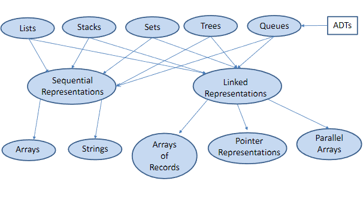


## Δείκτες (Pointers)

Ο καλύτερος τρόπος για την υλοποίηση συνδεδεμένων αναπαραστάσεων δεδομένων είναι μέσω των δεικτών (pointers).

Ένας δείκτης είναι μια μεταβλητή που αναφέρεται σε μια μονάδα αποθήκευσης.

### Γραφική Αναπαράσταση
Εάν το `α` είναι δείκτης προς το `β`, αυτό απεικονίζεται ως:


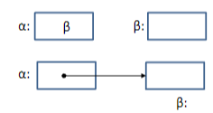


```c
typedef int *IntegerPointer;
IntegerPointer A, B;
/* the declaration int *A, *B has the same effect */

A=(IntegerPointer)malloc(sizeof(int));
B=(int *)malloc(sizeof(int));
```

Ο παραπάνω κώδικας οδηγεί στην παρακάτω κατάσταση:

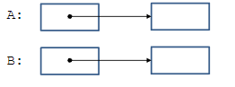


## typedef

Η γλώσσα C παρέχει τη δυνατότητα `typedef` για τη δημιουργία νέων ονομάτων τύπων δεδομένων.

### Πλεονεκτήματα των typedef:
- Βοηθούν στην καλή οργάνωση των ορισμών τύπων δεδομένων.
- Παρέχουν καλύτερη τεκμηρίωση για το πρόγραμμά μας.

---


Οι προηγούμενες δηλώσεις πρώτα ορίζουν ένα νέο όνομα τύπου δεδομένων `IntegerPointer`, το οποίο αποτελεί έναν δείκτη σε ακέραιο.

Στη συνέχεια, ορίζονται δύο μεταβλητές `A` και `B` τύπου `IntegerPointer`.

Έπειτα, δεσμεύονται δύο μπλοκ αποθήκευσης για δύο ακέραιους και αποθηκεύονται δύο δείκτες προς αυτά στα `A` και `B`.

Ο δείκτης τύπου `void` που επιστρέφεται από τη `malloc` προσαρμόζεται (casted) σε δείκτη σε μπλοκ αποθήκευσης που περιέχει ακέραιο. Μπορείς να παραλείψεις αυτή την προσαρμογή και το πρόγραμμά σου θα λειτουργήσει σωστά, γιατί η μετατροπή στον απαιτούμενο τύπο δείκτη γίνεται αυτόματα (implicitly).

---

## malloc

Η `void *malloc(size_t size)` είναι συνάρτηση της πρότυπης βιβλιοθήκης `stdlib`.

Η `malloc` επιστρέφει έναν δείκτη σε χώρο για ένα αντικείμενο μεγέθους `size`, ή `NULL` αν δεν είναι δυνατή η ικανοποίηση του αιτήματος. Ο χώρος αυτός προέρχεται από το heap και είναι μη αρχικοποιημένος.

Αυτό ονομάζεται **δυναμική δέσμευση μνήμης**.

Ο τύπος `size_t` είναι ένας ακεραίος τύπος χωρίς πρόσημο που επιστρέφεται από τον τελεστή `sizeof`.

Η μνήμη του προγράμματος

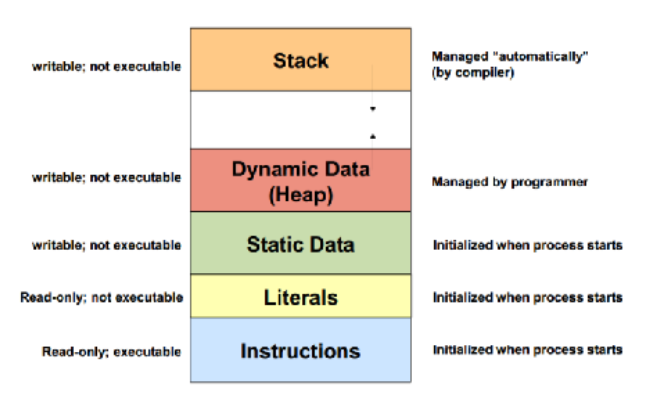

## Ο Τελεστής `*`

```c
*A = 5;
*B = 17;
```

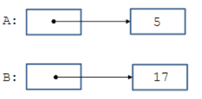


Ο μοναδιαίος τελεστής `*` (τελεστής αποαναφοράς) όταν χρησιμοποιείται στην **αριστερή πλευρά** μιας ανάθεσης, δηλώνει τη **θέση αποθήκευσης** στην οποία αναφέρεται ο δείκτης `A`.

Αυτή η διαδικασία ονομάζεται **αποαναφορά δείκτη** (*pointer dereferencing*).


## Ο Τελεστής `&` (Διεύθυνσης)

Ο μοναδιαίος τελεστής `&` (τελεστής διεύθυνσης) επιστρέφει τη **διεύθυνση μνήμης** ενός αντικειμένου.

### Παράδειγμα:

```c
int X = 3;
A = &X;
```

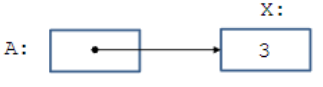

## ΚΟΥΙΖ 1

Ας ξαναδούμε τις παρακάτω δηλώσεις:

```c
int *A, *B;
*A = 5;
*B = 17;
```

## Δείκτες στη C - Κουίζ (συνέχεια)

### Ερώτηση:
Τι θα συμβεί αν εκτελέσουμε την παρακάτω εντολή;

```c
B = 20;
```

# Απάντηση

Έχουμε ένα σφάλμα ασυμβατότητας τύπων, διότι το 20 είναι ένας ακέραιος, ενώ η μεταβλητή **B** κρατά έναν δείκτη σε ακέραιους.

• Ο μεταγλωττιστής **gcc** θα δώσει μια προειδοποίηση:  
“assignment makes pointer from an integer without a cast.”

## ΚΟΥΙΖ 2

έστω ότι έχουμε την παρακάτω αναπαράσταση:

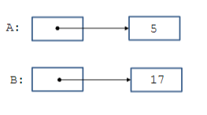

### Ερώτηση:

Εάν εκτελέσουμε την εντολή **A = B;**, ποιο από τα δύο παρακάτω διαγράμματα θα προκύψει;

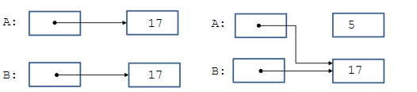

### Απάντηση:

Το σωστό διάγραμμα.


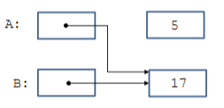

 Τώρα, οι **A** και **B** καλούνται **ψευδώνυμα** (aliases) επειδή αναφέρονται στην ίδια θέση αποθήκευσης. Σημειώστε ότι το μπλοκ αποθήκευσης που περιέχει το 5 είναι πλέον μη προσβάσιμο. 

Οι σύγχρονες γλώσσες προγραμματισμού διαθέτουν μηχανισμούς **garbage collection** για τέτοιες περιοχές αποθήκευσης.


### Ανακύκλωση Χρησιμοποιημένης Αποθήκευσης

Μπορούμε να ανακτήσουμε τον χώρο αποθήκευσης στον οποίο δείχνει το **A** χρησιμοποιώντας τη συνάρτηση ανάκτησης **free**:

```c
free(A);
```
## ΚΟΥΙΖ 3

### Dangling Pointers

Ας εξετάσουμε την παρακάτω κατάσταση:


#### Ερώτηση:
Υποθέστε ότι καλούμε **free(B)**.
 Ποια είναι η τιμή του **\*A + 3** τότε;


### Απάντηση:

Δεν ξέρουμε. Η θέση αποθήκευσης που δείχνει το **A** τώρα περιέχει έναν **dangling pointer** και δεν θα πρέπει να χρησιμοποιείται.


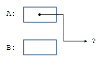


### NULL

Υπάρχει μια ειδική διεύθυνση που δηλώνεται με τη σταθερά **NULL**, η οποία δεν είναι η διεύθυνση οποιουδήποτε κόμβου. Η κατάσταση που προκύπτει μετά την εκτέλεση της εντολής **A = NULL;** φαίνεται γραφικά παρακάτω:


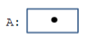

Τώρα δεν μπορούμε να προσπελάσουμε τη θέση αποθήκευσης στην οποία **A** έδειχνε προηγουμένως. Έτσι, κάτι σαν **\*A = 5;** θα προκαλέσει σφάλμα **"segmentation fault"**.

Η **NULL** θεωρείται αυτόματα τιμή οποιουδήποτε τύπου δείκτη που μπορεί να οριστεί στη γλώσσα **C**. Η **NULL** ορίζεται στη βιβλιοθήκη εισόδου/εξόδου `<stdio.h>` και έχει την τιμή 0.


---

### Δείκτες και Ορίσματα Συναρτήσεων

Ας υποθέσουμε ότι έχουμε έναν αλγόριθμο ταξινόμησης που λειτουργεί ανταλλάσσοντας δύο εκτός σειράς στοιχεία **A** και **B** χρησιμοποιώντας μια συνάρτηση **Swap**.

#### Ερώτηση:
Μπορούμε να καλέσουμε την **Swap(A, B)** όπου η συνάρτηση **Swap** ορίζεται ως εξής;

```c
void Swap(int X, int Y)
{
    int Temp;
    Temp = X;
    X = Y;
    Y = Temp;
}
```

### Απάντηση:

Όχι!

#### Γιατί;
- Επειδή η γλώσσα **C** περνά τα ορίσματα στις συναρτήσεις **κατ’ αξία** (by value), επομένως η **Swap** δεν μπορεί να επηρεάσει τα ορίσματα **A** και **B** στη συνάρτηση που την κάλεσε.
- Η **Swap** ανταλλάσσει μόνο τις αντιγραφές των **A** και **B**.

### Η Σωστή Συνάρτηση Swap

```c
void Swap(int *P, int *Q)
{
    int Temp;
    Temp = *P;
    *P = *Q;
    *Q = Temp;
}
```

Ο τρόπος για να έχουμε το επιθυμητό αποτέλεσμα είναι η συνάρτηση που καλεί να περάσει δείκτες στις τιμές που πρέπει να αλλάξουν:

```c
Swap(&A, &B);
```

# Συνδεδεμένες Λίστες

- Μια συνδεδεμένη λίστα είναι μια ακολουθία κόμβων, στους οποίους κάθε κόμβος, εκτός του τελευταίου, συνδέεται με έναν επόμενο κόμβο.
- Συνήθως, έχουμε μια μεταβλητή δείκτη **L**, η οποία περιέχει έναν δείκτη στον πρώτο κόμβο της λίστας.
- Το πεδίο σύνδεσης του τελευταίου κόμβου περιέχει **NULL**.
- Παράδειγμα: μια λίστα που αντιπροσωπεύει μια πτήση.

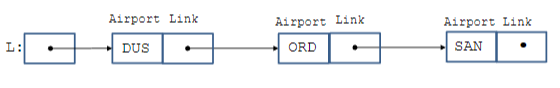

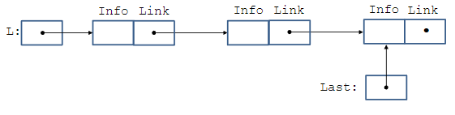

### Δήλωση Τύπων Δεδομένων για Συνδεδεμένες Λίστες

Οι παρακάτω δηλώσεις δηλώνουν τους κατάλληλους τύπους δεδομένων για τη συνδεδεμένη λίστα μας:

```c
typedef char AirportCode[4];
typedef struct NodeTag {
    AirportCode Airport;
    struct NodeTag *Link;
} NodeType;
typedef NodeType *NodePointer;
```

Τώρα μπορούμε να ορίσουμε μεταβλητές αυτών των τύπων δεδομένων:

```c
NodePointer L;
```
ή ισοδύναμα:
```c
NodeType *L;
```

### Δομές στην C

- Μια δομή (structure) είναι μια συλλογή ενός ή περισσότερων μεταβλητών, ενδεχομένως διαφορετικών τύπων, οι οποίες ομαδοποιούνται κάτω από ένα ενιαίο όνομα.
- Οι μεταβλητές που αναφέρονται σε μια δομή ονομάζονται **μέλη**.
- Στον προηγούμενο ορισμό της δομής, το όνομα **NodeTag** ονομάζεται **ετικέτα δομής** και μπορεί να χρησιμοποιηθεί μετέπειτα ως συντομογραφία για το τμήμα της δήλωσης μέσα στις αγκύλες.


---

### Ερώτηση

Δεδομένων των προηγούμενων **typedefs**, ποιο θα είναι το αποτέλεσμα του παρακάτω κομματιού κώδικα;

```c


```c
typedef char AirportCode[4];
typedef struct NodeTag {
    AirportCode Airport;
    struct NodeTag *Link;
} NodeType;
typedef NodeType *NodePointer;


AirportCode C;
NodePointer L;
strcpy(C, "BRU");
printf("%s\n", C);
L = (NodePointer)malloc(sizeof(NodeType));
strcpy(L->Airport, C);
printf("%s\n", L->Airport);
```

## Απάνττηση

BRU
BRU

### Η Συνάρτηση `strcpy`

- Η συνάρτηση `strcpy(s, ct)` αντιγράφει τη συμβολοσειρά **ct** στη συμβολοσειρά **s**, συμπεριλαμβανομένου του χαρακτήρα τερματισμού `'\0'`.
- Η συνάρτηση επιστρέφει το **s**.
- Ορίζεται στο αρχείο κεφαλίδας:

```c
#include <string.h>
```

### Πρόσβαση σε Μέλη Δομής

- Για να αποκτήσουμε πρόσβαση σε ένα μέλος μιας δομής, χρησιμοποιούμε τη σημειογραφία τελείας (dot notation):

```c
structure-name.member
```
Για να αποκτήσουμε πρόσβαση σε μέλος μιας δομής μέσω δείκτη P, μπορούμε να χρησιμοποιήσουμε:

```c
(*P).member
```
ή την ισοδύναμη και πιο συνηθισμένη σημειογραφία με βελάκι:

```c
P->member
```


### Ερώτηση

Γιατί δεν έγραψα:

```c
C = "BRU";
L->Airport = "BRU";
```
στο προηγούμενο κομμάτι κώδικα;


## Απάντηση
Η ανάθεση:
```c
C = "BRU";
```

προσπαθεί να εκχωρήσει στη μεταβλητή C έναν δείκτη στον πίνακα χαρακτήρων "BRU". Αυτό οδηγεί σε σφάλμα τύπου (type mismatch), επειδή η C είναι τύπου AirportCode, δηλαδή στατικός πίνακας χαρακτήρων, και όχι δείκτης.

Το ίδιο ισχύει και για την ανάθεση:

```c
L->Airport = "BRU";
```
που επίσης προκαλεί σφάλμα τύπου για τον ίδιο λόγο.

## Ερώτηση 

Τι κάνει το ακόλουθο τμήμα προγράμματος;
```c
NodePointer L, M;
L=(NodePointer)malloc(sizeof(NodeType));
strcpy(L->Airport, “DUS”);
M=(NodePointer)malloc(sizeof(NodeType));
strcpy(M->Airport, “ORD”);
L->Link=M;
M->Link=NULL;
```

Αυτό το κομμάτι κώδικα σε γλώσσα C δημιουργεί μια απλή συνδεδεμένη λίστα (linked list) με δύο κόμβους, όπου κάθε κόμβος περιέχει το όνομα ενός αεροδρομίου. Αρχικά, δημιουργούνται δύο δείκτες, L και M, τύπου NodePointer, που είναι δείκτες σε μια δομή NodeType. Η δομή αυτή υποθέτουμε ότι έχει οριστεί κάπως έτσι:

```c
typedef struct node {
    char Airport[4];
    struct node* Link;
} NodeType;

typedef NodeType* NodePointer;
```
Στη συνέχεια, δεσμεύεται δυναμικά μνήμη για έναν κόμβο και ο δείκτης L δείχνει σε αυτόν. Στον κόμβο αυτόν αντιγράφεται η συμβολοσειρά "DUS" στο πεδίο Airport. Μετά, δεσμεύεται μνήμη για έναν δεύτερο κόμβο, στον οποίο αντιγράφεται η συμβολοσειρά "ORD". Ο πρώτος κόμβος (στον οποίο δείχνει ο L) συνδέεται με τον δεύτερο κόμβο (στον οποίο δείχνει ο M) μέσω του δείκτη Link, δηλαδή το L->Link δείχνει στον M. Τέλος, ο δείκτης Link του δεύτερου κόμβου παίρνει την τιμή NULL, υποδεικνύοντας το τέλος της λίστας.

Με απλά λόγια, το πρόγραμμα φτιάχνει μια μικρή συνδεδεμένη λίστα δύο στοιχείων. Ο πρώτος κόμβος περιέχει το αεροδρόμιο "DUS" και οδηγεί στον δεύτερο κόμβο, ο οποίος περιέχει το "ORD" και δεν οδηγεί πουθενά αλλού, καθώς είναι το τέλος της λίστας. Οπτικά η δομή έχει την εξής μορφή:

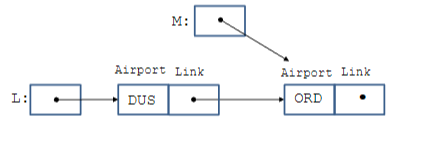

### Εισαγωγή Νέου Δεύτερου Κόμβου σε μια Λίστα

- Παράδειγμα: Μια λίστα τριών αεροδρομίων που αναπαριστά μια πτήση.

Αρχική λίστα (δύο κόμβοι):

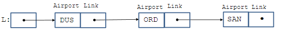

προσθέτουμε το αεροδρόμιο BRU ως δεύτερο κόμβο

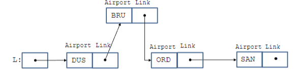

```c
void InsertNewSecondNode(void){
    NodeType *N;
    NodeType *L;
    N=(NodeType *)malloc(sizeof(NodeType));
    strcpy(N->Airport,"BRU");
    N->Link=L->Link;
    L->Link=N;
}

```

### Εκτέλεση της Συνάρτησης Βήμα προς Βήμα

Ας εκτελέσουμε την προηγούμενη λειτουργία εισαγωγής βήμα προς βήμα:

#### Βήμα 1:
```c
N = (NodeType *)malloc(sizeof(NodeType));
```
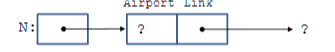

#### Βήμα 2
```c
strcpy(N->Airport,”BRU”)
```

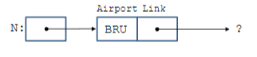

#### Βήμα 3ο
```c
N->Link=L->Link;
```

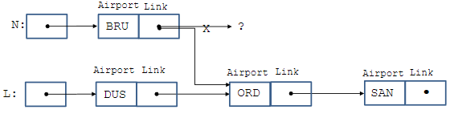

#### Βήμα 4ο 
```c
L->Link=N;
```
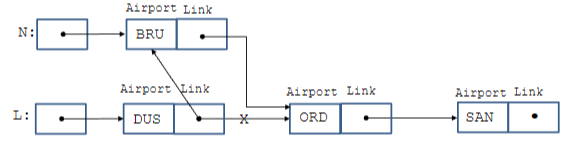

### Σχόλια

- Στη συνάρτηση `InsertNewSecondNode`, η μεταβλητή **N** είναι **τοπική**.
- Αυτό σημαίνει ότι **εξαφανίζεται** μετά το τέλος της εκτέλεσης της συνάρτησης.
- Όμως, ο **κόμβος** που δεσμεύτηκε δυναμικά μέσω `malloc` **παραμένει στη μνήμη** ακόμα και μετά την επιστροφή από τη συνάρτηση.
- Η λίστα εξακολουθεί να έχει πρόσβαση στον κόμβο μέσω άλλων δεικτών.

**Δομές Δεδομένων και Προγραμματισμός**
Techniques 45

---

### Αναζήτηση Στοιχείου σε Λίστα

Θα ορίσουμε τώρα μια συνάρτηση που:

- Δέχεται ως είσοδο έναν **κωδικό αεροδρομίου** `A` και έναν **δείκτη** σε λίστα `L`.
- Επιστρέφει έναν δείκτη στον **πρώτο κόμβο της λίστας** που έχει τον κωδικό αυτόν.
- Αν δεν βρεθεί κόμβος με αυτόν τον κωδικό, επιστρέφεται **NULL**.

Αυτή η συνάρτηση επιτρέπει την αναζήτηση στοιχείων μέσα σε μια συνδεδεμένη λίστα.


### Συνάρτηση Αναζήτησης Στοιχείου σε Λίστα

Η συνάρτηση **`ListSearch`** δέχεται ως είσοδο έναν **κωδικό αεροδρομίου** `A` και έναν **δείκτη σε λίστα** `L`, και επιστρέφει έναν **δείκτη στον πρώτο κόμβο** της λίστας που έχει αυτόν τον κωδικό. Αν δεν βρει τον κωδικό, επιστρέφει **NULL**.

```c
NodeType *ListSearch(char *A, NodeType *L)
{
    NodeType *N;
    N = L;
    while (N != NULL) {
        if (strcmp(N->Airport, A) == 0) {
            return N;
        } else {
            N = N->Link;
        }
    }
    return NULL;
}
```

### Σχόλια

Η συνάρτηση **`strcmp(cs, ct)`** συγκρίνει τις συμβολοσειρές **cs** και **ct** και επιστρέφει:

- **Αρνητικό αριθμό** αν η **cs** προηγείται αλφαβητικά της **ct**.
- **0** αν οι δύο συμβολοσειρές είναι ίδιες.
- **Θετικό αριθμό** αν η **cs** ακολουθεί αλφαβητικά την **ct**.

Η σύγκριση γίνεται χρησιμοποιώντας τους κωδικούς ASCII των χαρακτήρων στις δύο συμβολοσειρές.

Αυτή η λειτουργία είναι χρήσιμη όταν θέλουμε να συγκρίνουμε συμβολοσειρές και να καθορίσουμε ποια προηγείται ή ακολουθεί στην αλφαβητική σειρά.

### Υπόθεση: Αναζήτηση του Στοιχείου "ORD"

Ας υποθέσουμε ότι έχουμε την παρακάτω λίστα και ψάχνουμε για το στοιχείο **"ORD"**. Όταν εκτελούμε τη δήλωση **`N = L`**, η κατάσταση που δημιουργείται είναι η εξής:

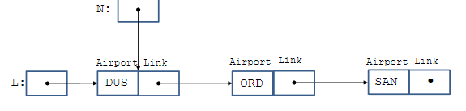


### Επόμενο Βήμα στην Αναζήτηση Στοιχείου

Αργότερα, μέσα στον βρόχο **while**, όταν εκτελείται η δήλωση **`N = N->Link`**, η κατάσταση γίνεται η εξής:

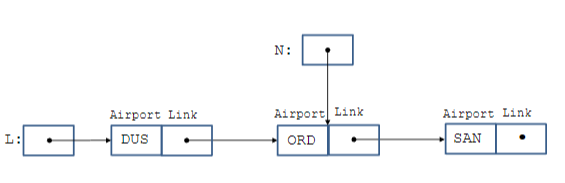


### Επόμενο Βήμα στην Αναζήτηση Στοιχείου

Στη συνέχεια, η **δήλωση `if`** μέσα στον βρόχο **while** εκτελείται και η τιμή του **N** επιστρέφεται. Υποθέτοντας ότι δεν βρήκαμε το **"ORD"** στο προηγούμενο βήμα, η δήλωση **`N = N->Link`** εκτελείται ξανά και η κατάσταση γίνεται η εξής:

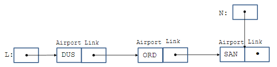


Στη συνέχεια, ο βρόχος **`while`** εκτελείται μία ακόμα φορά και η δήλωση **`N = N->Link`** οδηγεί στην εξής κατάσταση:

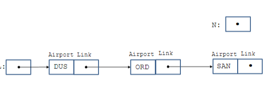


Στη συνέχεια, βγαίνουμε από τον βρόχο **`while`** και η δήλωση **`return N`** επιστρέφει **NULL**.


### Διαγραφή του Τελευταίου Κόμβου Μιας Λίστας

Ας γράψουμε τώρα μια συνάρτηση για να διαγράψουμε τον τελευταίο κόμβο μιας λίστας **L**.

1. **Εάν η λίστα L είναι κενή**, δεν υπάρχει τίποτα να κάνουμε.
2. **Εάν η λίστα L έχει μόνο έναν κόμβο**, τότε πρέπει να απαλλαγούμε από τον αποθηκευτικό χώρο του κόμβου και στη συνέχεια να ορίσουμε τη λίστα **L** ως κενή λίστα.
3. **Εάν η λίστα L έχει δύο ή περισσότερους κόμβους**, τότε μπορούμε να χρησιμοποιήσουμε ένα ζευγάρι δεικτών για να υλοποιήσουμε την απαιτούμενη λειτουργικότητα, όπως θα δούμε στις επόμενες διαφάνειες.

### Διαγραφή του Τελευταίου Κόμβου (Επεξήγηση Βήμα προς Βήμα)
- Χρησιμοποιούμε δύο δείκτες: έναν που δείχνει στον πρώτο κόμβο της λίστας και έναν δεύτερο που περνά από τους κόμβους για να εντοπίσει τον προτελευταίο κόμβο.
- Όταν φτάσουμε στον προτελευταίο κόμβο, ο **`Link`** του προτελευταίου κόμβου ορίζεται ως **NULL**, διαγράφοντας έτσι τον τελευταίο κόμβο.

### Ερώτηση

Είναι ο παρακάτω ορισμός της συνάρτησης κατάλληλος;

```c
void DeleteLastNode(NodeType *L)
```

### Όχι!

Ας υποθέσουμε ότι στο κύριο πρόγραμμα έχουμε μια λίστα και το **L1** είναι ο δείκτης στον πρώτο της κόμβο.

Για να μπορέσουμε να διαγράψουμε τον τελευταίο κόμβο της λίστας, πρέπει να περάσουμε τη διεύθυνση του **L1** (δηλαδή τη διεύθυνση του δείκτη που δείχνει στον πρώτο κόμβο της λίστας) ως πραγματικό παράμετρο στην συνάρτηση **`DeleteLastNode`** με τη μορφή **`&L1`**. Αυτό μας επιτρέπει να τροποποιήσουμε το περιεχόμενο του **L1** μέσα στη συνάρτηση **`DeleteLastNode`**.

Άρα, ο αντίστοιχος επίσημος παράμετρος της συνάρτησης **`DeleteLastNode`** πρέπει να είναι ένας δείκτης προς δείκτη τύπου **`NodeType`**.

### Διόρθωση Συνάρτησης
Η σωστή δήλωση της συνάρτησης θα πρέπει να είναι:

```c
void DeleteLastNode(NodeType **L)
```

Αυτό επιτρέπει στην συνάρτηση να τροποποιεί τη λίστα στο κύριο πρόγραμμα, δηλαδή να αλλάξει το δείκτη στον πρώτο κόμβο L1 όταν διαγράφεται ο τελευταίος κόμβος.

### Συνάρτηση `DeleteLastNode`

Η συνάρτηση **`DeleteLastNode`** διαγράφει τον τελευταίο κόμβο από μια λίστα. Αν η λίστα είναι κενή ή έχει μόνο έναν κόμβο, η συνάρτηση χειρίζεται τις περιπτώσεις αυτές κατάλληλα. 

Ο κώδικας της συνάρτησης είναι ο εξής:

```c
void DeleteLastNode(NodeType **L)
{
    NodeType *PreviousNode, *CurrentNode;
    
    // Ελέγχουμε αν η λίστα δεν είναι κενή
    if (*L != NULL) {
        
        // Εάν η λίστα έχει μόνο έναν κόμβο
        if ((*L)->Link == NULL){
            free(*L);   // Απελευθερώνουμε τον κόμβο
            *L = NULL;  // Ορίζουμε τη λίστα σε NULL
        } else {
            // Εάν η λίστα έχει περισσότερους από έναν κόμβους
            PreviousNode = *L;
            CurrentNode = (*L)->Link;
            
            // Διατρέχουμε τη λίστα για να φτάσουμε στον τελευταίο κόμβο
            while (CurrentNode->Link != NULL){
                PreviousNode = CurrentNode;
                CurrentNode = CurrentNode->Link;
            }
            
            // Αφαιρούμε το τελευταίο κόμβο
            PreviousNode->Link = NULL;
            free(CurrentNode);  // Απελευθερώνουμε τη μνήμη του τελευταίου κόμβου
        }
    }
}
```
### Σχόλια

Όταν προχωράμε το ζεύγος δεικτών στην επόμενη ζεύξη κόμβων, η κατάσταση είναι η εξής:

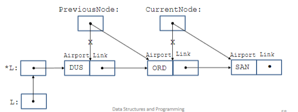

### Γιατί **`&`**;

Αυτό ισχύει για την περίπτωση που η λίστα στην κλήση της συνάρτησης περιέχει μόνο έναν κόμβο.

- Σε αυτή την περίπτωση, η τιμή του δείκτη (π.χ., **`L1`**) που δείχνει στο μοναδικό στοιχείο της λίστας πρέπει να οριστεί σε **NULL** μέσα στη συνάρτηση **`DeleteLastNode`**.
- Αυτό μπορεί να γίνει μόνο εάν περάσουμε τη διεύθυνση του **`L1`** στην κλήση της συνάρτησης **`DeleteLastNode`**, δηλαδή **`&L1`**.

Αυτό επιτρέπει στην συνάρτηση να τροποποιήσει την τιμή του δείκτη στην κλήση και να ορίσει τη λίστα ως κενή μετά τη διαγραφή του τελευταίου κόμβου.

### Συνάρτηση `InsertNewLastNode`

Η συνάρτηση **`InsertNewLastNode`** εισάγει έναν νέο κόμβο στο τέλος της λίστας. Η συνάρτηση δέχεται ως παράμετρο την αεροπορική κωδική ετικέτα **`A`** και τον δείκτη **`L`** στη λίστα (ή αλλιώς δείκτη προς δείκτη τύπου **`NodeType`**).

Ο κώδικας της συνάρτησης είναι ο εξής:

```c
void InsertNewLastNode(char *A, NodeType **L)
{
    NodeType *N, *P;
    
    // Δημιουργία νέου κόμβου
    N = (NodeType *)malloc(sizeof(NodeType));
    strcpy(N->Airport, A);
    N->Link = NULL;  // Ο τελευταίος κόμβος δείχνει σε NULL
    
    // Εάν η λίστα είναι κενή, το νέο στοιχείο γίνεται η αρχή της λίστας
    if (*L == NULL) {
        *L = N;
    } else {
        // Διατρέχουμε τη λίστα μέχρι να βρούμε τον τελευταίο κόμβο
        P = *L;
        while (P->Link != NULL) {
            P = P->Link;
        }
        
        // Εισάγουμε το νέο κόμβο στο τέλος της λίστας
        P->Link = N;
    }
}
```
### Σχόλια

- **`P`** χρησιμοποιείται για να διατρέξει τη λίστα μέχρι να βρει τον τελευταίο κόμβο.

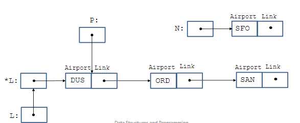

### Γιατί **`&`**;

Αυτό ισχύει για την περίπτωση που η λίστα στην κλήση της συνάρτησης είναι κενή.

- Σε αυτή την περίπτωση, η τιμή του δείκτη (π.χ., **`L1`**) που δείχνει στο πρώτο στοιχείο της λίστας πρέπει να οριστεί έτσι ώστε να δείχνει στον νέο κόμβο που δημιουργείται μέσα στη συνάρτηση **`InsertNewLastNode`**.
- Αυτό μπορεί να γίνει μόνο εάν περάσουμε τη διεύθυνση του **`L1`** στην κλήση της συνάρτησης **`InsertNewLastNode`**, δηλαδή **`&L1`**.

Αυτό επιτρέπει στην συνάρτηση να τροποποιήσει τη λίστα και να ορίσει τον πρώτο κόμβο της λίστας ως τον νέο κόμβο που προστέθηκε.

---

### Ερώτηση

- Ας υποθέσουμε ότι έχουμε έναν δείκτη **`Last`** που δείχνει στον τελευταίο κόμβο μιας συνδεδεμένης λίστας.
- Πώς θα άλλαζαν οι λειτουργίες διαγραφής του τελευταίου κόμβου ή προσθήκης ενός νέου τελευταίου κόμβου αν εκμεταλλευόμασταν τον δείκτη **`Last`**;

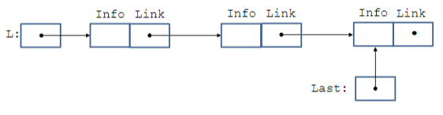

### Συνάρτηση `PrintList`

Η συνάρτηση **`PrintList`** εκτυπώνει τα στοιχεία μιας συνδεδεμένης λίστας. Η συνάρτηση δέχεται ως παράμετρο τη λίστα **`L`**, η οποία είναι τύπου **`NodeType`** και περιέχει τους κόμβους της λίστας.

Ο κώδικας της συνάρτησης είναι ο εξής:

```c
void PrintList(NodeType *L)
{
    NodeType *N;
    printf("(");
    N = L;
    while (N != NULL) {
        printf("%s", N->Airport);
        N = N->Link;
        if (N != NULL) printf(",");
    }
    printf(")\n");
}

### Κύριο Πρόγραμμα

Αυτό το πρόγραμμα δημιουργεί μια συνδεδεμένη λίστα αεροδρομίων, προσθέτει και διαγράφει κόμβους, και εκτυπώνει τα στοιχεία της λίστας. Παράλληλα, ελέγχει αν ένας συγκεκριμένος κωδικός αεροδρομίου υπάρχει στη λίστα.

#### Κώδικας του Προγράμματος:

```c
#include <stdio.h>
#include <string.h>
#include <stdlib.h>

typedef char AirportCode[4]; // Ορισμός τύπου AirportCode για την αποθήκευση 3-χαρακτηρη αεροδρομίου
typedef struct NodeTag {
    AirportCode Airport;       // Αποθηκεύει τον κωδικό του αεροδρομίου
    struct NodeTag *Link;      // Δείκτης στον επόμενο κόμβο της λίστας
} NodeType;

typedef NodeType *NodePointer; // Δείκτης σε NodeType

/* Πρωτότυπα συναρτήσεων */
void InsertNewLastNode(char *, NodeType **);
void DeleteLastNode(NodeType **);
NodeType *ListSearch(char *, NodeType *);
void PrintList(NodeType *);

int main(void)
{
    NodeType *L; // Δείκτης στη λίστα των αεροδρομίων
    L = NULL;     // Αρχικοποιούμε τη λίστα ως κενή

    PrintList(L); // Εκτυπώνουμε την κενή λίστα

    /* Εισαγωγή νέων κόμβων στη λίστα */
    InsertNewLastNode("DUS", &L);
    InsertNewLastNode("ORD", &L);
    InsertNewLastNode("SAN", &L);

    PrintList(L); // Εκτυπώνουμε τη λίστα μετά τις εισαγωγές

    /* Διαγραφή του τελευταίου κόμβου */
    DeleteLastNode(&L);

    PrintList(L); // Εκτυπώνουμε τη λίστα μετά τη διαγραφή του τελευταίου κόμβου

    /* Έλεγχος αν ο κόμβος "DUS" υπάρχει στη λίστα */
    if (ListSearch("DUS", L) != NULL) {
        printf("DUS is an element of the list\n");
    }
}

/* Ο κώδικας για τις συναρτήσεις InsertNewLastNode, PrintList, */
/* ListSearch και DeleteLastNode παρατίθεται παρακάτω. */
```