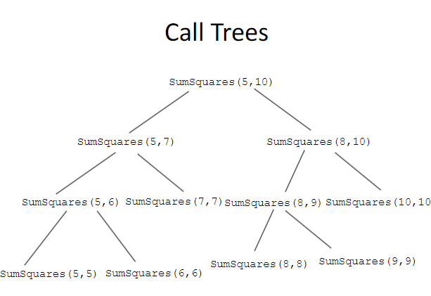

# Ανάλυση Αναδρομής (Recursion)

- Η αναδρομή είναι μία θεμελιώδης έννοια στην Επιστήμη Υπολογιστών.
- Συνήθως μας βοηθά να γράψουμε απλές και κομψές λύσεις για προβλήματα προγραμματισμού.
- Θα μάθετε να προγραμματίζετε αναδρομικά μέσω πολλών παραδειγμάτων, αναπτύσσοντας τις δεξιότητές σας.

## Δομές Δεδομένων και Τεχνικές Προγραμματισμού 2

### Αναδρομικά Προγράμματα
- Ένα αναδρομικό πρόγραμμα είναι εκείνο που καλεί τον εαυτό του για να βρει λύση σε ένα πρόβλημα.
- Ο λόγος που καλεί τον εαυτό του είναι για να υπολογίσει τη λύση σε ένα υποπρόβλημα που έχει τις εξής ιδιότητες:
  - Το υποπρόβλημα είναι μικρότερο από το πρόβλημα που πρέπει να λυθεί.
  - Το υποπρόβλημα μπορεί να λυθεί άμεσα (ως βάση) ή αναδρομικά κάνοντας μία αναδρομική κλήση.
  - Η λύση του υποπροβλήματος μπορεί να συνδυαστεί με τις λύσεις άλλων υποπροβλημάτων για να βρεθεί η λύση στο συνολικό πρόβλημα.


### Παράδειγμα
- Ας εξετάσουμε ένα απλό πρόγραμμα για να προσθέσουμε όλα τα τετράγωνα των ακεραίων από το m έως το n.
- Μία επαναληπτική συνάρτηση για να το κάνει αυτό είναι η εξής:

```c
int SumSquares(int m, int n)
{
    int i, sum;
    sum = 0;
    for (i = m; i <= n; ++i) sum += i * i;
    return sum;
}
```

# Ανάλυση Αναδρομής (Recursion) – Συνεχόμενα Παραδείγματα

## Αν η περιοχή m:n περιέχει περισσότερους από έναν αριθμούς
- Η λύση στο πρόβλημα μπορεί να βρεθεί προσθέτοντας:
  - (α) τη λύση του μικρότερου υποπροβλήματος του αθροίσματος των τετραγώνων στην περιοχή m+1:n και
  - (β) τη λύση του υποπροβλήματος που βρίσκει το τετράγωνο του m.
- (α) επιλύεται με τον ίδιο τρόπο (αναδρομή).
- Σταματάμε όταν φτάσουμε στη βάση, η οποία συμβαίνει όταν η περιοχή m:n περιέχει μόνο έναν αριθμό, οπότε m == n.
- Αυτή η αναδρομική λύση μπορεί να ονομάζεται "αναδρομή ανόδου" καθώς οι διαδοχικές περιοχές είναι m+1:n, m+2:n κ.λπ.

## Going-Down Αναδρομή

```c
int SumSquares(int m, int n)
{
    if (m < n) {
        return SumSquares(m, n-1) + n*n;
    } else {
        return n*n;
    }
}
```

## Συνδυασμός Δύο Ημικυκλίων (Recursion Combining Two Half-Solutions)
```c
int SumSquares(int m, int n)
{
    int middle;
    if (m == n) {
        return m * m;
    } else {
        middle = (m + n) / 2;
        return SumSquares(m, middle) + SumSquares(middle + 1, n);
    }
}
```
## Σχόλια

* Η αναδρομή εδώ λέει ότι το άθροισμα των τετραγώνων των ακεραίων στην περιοχή m:n μπορεί να βρεθεί προσθέτοντας το άθροισμα των τετραγώνων της αριστερής ημικυκλικής περιοχής, m:middle, με το άθροισμα των τετραγώνων της δεξιάς ημικυκλικής περιοχής, middle+1:n.

* Σταματάμε όταν φτάσουμε στη βάση, η οποία συμβαίνει όταν η περιοχή περιέχει μόνο έναν αριθμό, οπότε m == n.

* Το μέσο υπολογίζεται με ακέραια διαίρεση (χειριστής /), που κρατάει το πηλίκο και πετάει το υπόλοιπο.

# Δέντρα Κλήσεων και Ιχνηλασίες (Call Trees and Traces)

- Μπορούμε να απεικονίσουμε γραφικά τη συμπεριφορά των αναδρομικών προγραμμάτων, σχεδιάζοντας δέντρα κλήσεων ή ιχνηλασίες.





## Traces(ίχνη)

SumSquares(5,10)=SumSquares(5,7)+SumSquares(8,10)=
=SumSquares(5,6)+SumSquares(7,7)
+SumSquares(8,9)+SumSquares(10,10)
=SumSquares(5,5)+SumSquares(6,6)
+SumSquares(7,7)
+SumSquares(8,8)+SumSquares(9,9)
+SumSquares(10,10)
=((25+36)+49)+((64+81)+100)
=(61+49)+(145+100)
=(110+245)
=355

# Υπολογισμός του Παραγοντικού (Factorial)

- Ας εξετάσουμε ένα απλό πρόγραμμα για να υπολογίσουμε το παραγοντικό n! του n.
- Μία επαναληπτική συνάρτηση για να το κάνει αυτό είναι η εξής:

## Παραγοντικό με επανάληψη
```c
int Factorial(int n)
{
    int i, f;
    f = 1;
    for (i = 2; i <= n; ++i) f *= i;
    return f;
}
```

## Αναδρομικό Παραγοντικό

```c
int Factorial(int n)
{
    if (n == 1) {
        return 1;
    } else {
        return n * Factorial(n - 1);
    }
}
```

Το προηγούμενο πρόγραμμα είναι μία "αναδρομή κατηφόρας" (going-down recursion).

## Τι Συμβαίνει Αν Καλέσουμε το **Factorial(0)**;

### Άπεινη Αντίστροφη Αναδρομή (Infinite Regress)

```c
Factorial(0) = 0 * Factorial(-1)
             = 0 * (-1) * Factorial(-2)
             = 0 * (-1) * (-2) * Factorial(-3)
             και ούτω καθεξής, σε μία άπειρη αντίστροφη αναδρομή.
```

Όταν εκτελούμε αυτήν την κλήση συνάρτησης, παίρνουμε το μήνυμα:
Segmentation fault (core dumped)

**Μπορείτε να γράψετε μία "αναδρομή ανόδου" (going-up recursion) για το παραγοντικό;** 

```c
#include <stdio.h>

int factorial_up(int n, int current, int result) {
    if (current > n)
        return result;
    return factorial_up(n, current + 1, result * current);
}

int main() {
    int n = 5;
    printf("Factorial of %d: %d\n", n, factorial_up(n, 1, 1));
    return 0;
}
```

**Μπορείτε να γράψετε μία αναδρομή που συνδυάζει δύο ημικυκλικά προβλήματα (recursion combining two half-solutions);**
```c
#include <stdio.h>

int factorial_half(int start, int end) {
    if (start > end)
        return 1;
    if (start == end)
        return start;

    int mid = (start + end) / 2;
    int left_half = factorial_half(start, mid);
    int right_half = factorial_half(mid + 1, end);

    return left_half * right_half;
}

int main() {
    int n = 5;
    printf("Factorial of %d: %d\n", n, factorial_half(1, n));
    return 0;
}

```

Είναι πιο εύκολο να γράψουμε πρώτα μία συνάρτηση Product(m, n) που πολλαπλασιάζει τους αριθμούς στην περιοχή m:n.

Στη συνέχεια, το παραγοντικό μπορεί να υπολογιστεί ως Factorial(n) = Product(1, n).

# Αντιστρέφοντας μια λίστα


The code :

```c
#include <stdio.h>
#include <stdlib.h>
#include <string.h>

typedef char AirportCode[4]; // 3 χαρακτήρες + 1 για το '\0'

typedef struct NodeTag {
    AirportCode Airport;  // Κωδικός αεροδρομίου (π.χ. "JFK")
    struct NodeTag *Link; // Δείκτης στον επόμενο κόμβο
} NodeType;

// **Συνάρτηση Αντιστροφής Συνδεδεμένης Λίστας (Επαναληπτική)**
void Reverse(NodeType **Head) {
    NodeType *ReversedList = NULL;   // Η νέα αντιστραμμένη λίστα
    NodeType *CurrentNode = *Head;   // Ο τρέχων κόμβος της αρχικής λίστας
    NodeType *NextNode = NULL;       // Ο επόμενος κόμβος

    while (CurrentNode != NULL) {
        NextNode = CurrentNode->Link; // Αποθήκευση επόμενου κόμβου
        CurrentNode->Link = ReversedList; // Αντιστροφή συνδέσμου
        ReversedList = CurrentNode; // Μετακίνηση της αντιστραμμένης λίστας
        CurrentNode = NextNode; // Προχωράμε στον επόμενο κόμβο
    }
    
    *Head = ReversedList; // Ενημερώνουμε τον δείκτη της λίστας
}

// **Συνάρτηση Εισαγωγής Κόμβου στην Αρχή της Λίστας**
void Insert(NodeType **Head, char *code) {
    NodeType *NewNode = (NodeType*)malloc(sizeof(NodeType));
    if (NewNode == NULL) {
        printf("Σφάλμα κατανομής μνήμης!\n");
        exit(1);
    }
    strcpy(NewNode->Airport, code);
    NewNode->Link = *Head;
    *Head = NewNode;
}

// **Συνάρτηση Εκτύπωσης Λίστας**
void PrintList(NodeType *Head) {
    while (Head != NULL) {
        printf("%s -> ", Head->Airport);
        Head = Head->Link;
    }
    printf("NULL\n");
}

// **Κύριο Πρόγραμμα (main)**
int main() {
    NodeType *Head = NULL;

    // Προσθήκη κόμβων στη λίστα
    Insert(&Head, "JFK");  // Νέα Υόρκη
    Insert(&Head, "LAX");  // Λος Άντζελες
    Insert(&Head, "ORD");  // Σικάγο
    Insert(&Head, "ATL");  // Ατλάντα

    // Εκτύπωση αρχικής λίστας
    printf("Αρχική λίστα:\n");
    PrintList(Head);

    // Αντιστροφή λίστας
    Reverse(&Head);

    // Εκτύπωση αντιστραμμένης λίστας
    printf("Αντιστροφή λίστας:\n");
    PrintList(Head);

    return 0;
}
```


Με αναδρομή:

```c
#include <stdio.h>
#include <stdlib.h>
#include <string.h>

typedef char AirportCode[4]; // Ο κωδικός του αεροδρομίου (3 χαρακτήρες + 1 για το '\0')

typedef struct NodeTag {
    AirportCode Airport;  // Κωδικός αεροδρομίου
    struct NodeTag *Next; // Δείκτης στον επόμενο κόμβο της λίστας
} NodeType;

// **Αναδρομική Συνάρτηση Αντιστροφής Λίστας**
NodeType* ReverseRecursive(NodeType *CurrentNode, NodeType *PreviousNode) {
    if (CurrentNode == NULL) {
        return PreviousNode;  // Αν φτάσουμε στο τέλος, επιστρέφουμε τη νέα κορυφή
    }
    NodeType *NextNode = CurrentNode->Next;  // Αποθηκεύουμε τον επόμενο κόμβο
    CurrentNode->Next = PreviousNode;        // Αντιστροφή συνδέσμου
    return ReverseRecursive(NextNode, CurrentNode); // Αναδρομή με τον επόμενο κόμβο
}

// **Βοηθητική Συνάρτηση για να Καλέσουμε την Αναδρομική**
void Reverse(NodeType **Head) {
    *Head = ReverseRecursive(*Head, NULL);
}

// **Συνάρτηση για Εισαγωγή Νέου Κόμβου στην Αρχή της Λίστας**
void Insert(NodeType **Head, char *code) {
    NodeType *NewNode = (NodeType*)malloc(sizeof(NodeType));
    strcpy(NewNode->Airport, code);
    NewNode->Next = *Head;
    *Head = NewNode;
}

// **Συνάρτηση Εκτύπωσης Λίστας**
void PrintList(NodeType *Head) {
    while (Head != NULL) {
        printf("%s -> ", Head->Airport);
        Head = Head->Next;
    }
    printf("NULL\n");
}

// **Δοκιμή**
int main() {
    NodeType *Head = NULL;

    Insert(&Head, "JFK");  // Προσθήκη κόμβων
    Insert(&Head, "LAX");
    Insert(&Head, "ORD");
    Insert(&Head, "ATL");

    printf("Αρχική λίστα:\n");
    PrintList(Head);

    Reverse(&Head);
    
    printf("Αντιστροφή λίστας:\n");
    PrintList(Head);

    return 0;
}
```


# Συγχώνευση δύο λιστών

```c
#include <stdio.h>
#include <stdlib.h>

// Ορισμός του τύπου NodeType για τα στοιχεία της συνδεδεμένης λίστας
typedef struct NodeType {
    int data;            // Αποθήκευση δεδομένων
    struct NodeType *Link; // Σύνδεση με τον επόμενο κόμβο
} NodeType;

// Συνάρτηση για την εκτύπωση μιας συνδεδεμένης λίστας
void PrintList(NodeType *head) {
    NodeType *current = head;
    while (current != NULL) {
        printf("%d -> ", current->data);
        current = current->Link;
    }
    printf("NULL\n");
}

// Συνάρτηση για την προσθήκη ενός κόμβου στην αρχή της λίστας
NodeType* InsertAtHead(NodeType *head, int value) {
    NodeType *newNode = (NodeType *)malloc(sizeof(NodeType));
    newNode->data = value;
    newNode->Link = head;
    return newNode;
}

// Συνάρτηση για την συγχώνευση (σύνδεση) δύο συνδεδεμένων λιστών
NodeType* Concat(NodeType *L1, NodeType *L2) {
    NodeType *N;
    if (L1 == NULL) {
        return L2;
    } else {
        N = L1;
        while (N->Link != NULL) {
            N = N->Link; // Προχωράμε στον επόμενο κόμβο μέχρι να φτάσουμε στον τελευταίο
        }
        N->Link = L2; // Συνδέουμε τον τελευταίο κόμβο του L1 με την αρχή του L2
        return L1;
    }
}

int main() {
    NodeType *L1 = NULL, *L2 = NULL;
    
    // Δημιουργία και εισαγωγή στοιχείων στη λίστα L1
    L1 = InsertAtHead(L1, 3);
    L1 = InsertAtHead(L1, 2);
    L1 = InsertAtHead(L1, 1);
    
    // Δημιουργία και εισαγωγή στοιχείων στη λίστα L2
    L2 = InsertAtHead(L2, 6);
    L2 = InsertAtHead(L2, 5);
    L2 = InsertAtHead(L2, 4);

    printf("Λίστα 1 (L1): ");
    PrintList(L1);

    printf("Λίστα 2 (L2): ");
    PrintList(L2);

    // Σύνδεση των δύο λιστών L1 και L2
    L1 = Concat(L1, L2);

    printf("Συγχωνευμένη Λίστα (L1 + L2): ");
    PrintList(L1);

    // Ελευθέρωση της μνήμης (δεν είναι υποχρεωτική για το συγκεκριμένο παράδειγμα, αλλά καλό είναι να γίνεται στην πράξη)
    while (L1 != NULL) {
        NodeType *temp = L1;
        L1 = L1->Link;
        free(temp);
    }

    return 0;
}

```


# Οι πύργοι του Χανοι


# Πύργοι του Χάνοϊ (συνέχεια)

Για να μετακινήσουμε τους 4 δίσκους από τον Πύργο 1 στον Πύργο 3 χρησιμοποιώντας τον Πύργο 2 ως ενδιάμεσο σταθμό:

- Μετακινήστε τους 3 δίσκους από τον Πύργο 1 στον Πύργο 2 χρησιμοποιώντας τον Πύργο 3 ως ενδιάμεσο σταθμό.


- Μετακινήστε τον υπόλοιπο 1 δίσκο από τον Πύργο 1 στον Πύργο 3.


- Μετακινήστε 3 δίσκους από τον Πύργο 2 στον Πύργο 3 χρησιμοποιώντας τον Πύργο 1 ως ενδιάμεσο σταθμό.


Ανδρομική υλοποίηση:

```c
#include <stdio.h>
//χρονικη πολυπλοκοτητα Ο(2^ν)

// Συνάρτηση που επιλύει το πρόβλημα του Πύργου του Χόανι
void MoveTowers(int n, int start, int finish, int spare) {
    if (n == 1) {
        // Αν έχουμε μόνο έναν δίσκο, απλά τον μεταφέρουμε
        printf("Move a disk from peg %1d to peg %1d\n", start, finish);
    } else {
        // Μετακινούμε τους n-1 δίσκους από τον start στον spare
        MoveTowers(n-1, start, spare, finish);
        // Μετακινούμε τον τελευταίο δίσκο από τον start στον finish
        printf("Move a disk from peg %1d to peg %1d\n", start, finish);
        // Μετακινούμε τους n-1 δίσκους από τον spare στον finish
        MoveTowers(n-1, spare, finish, start);
    }
}

int main() {
    int n;

    // Ζητάμε από τον χρήστη τον αριθμό των δίσκων
    printf("Enter the number of disks: ");
    scanf("%d", &n);

    // Καλούμε τη συνάρτηση MoveTowers για να λύσουμε το πρόβλημα
    // Τα 1, 2, 3 είναι οι τρεις στύλοι (1: Αρχικός, 2: Ενδιάμεσος, 3: Τελικός)
    MoveTowers(n, 1, 3, 2);

    return 0;
}

```

# Υπολογισμός του Αριθμού Κινήσεων

Ας υπολογίσουμε τώρα τον αριθμό των κινήσεων **L(n)** που χρειάζονται ως συνάρτηση του αριθμού των δίσκων **n**:

- **L(1) = 1**
- **L(n) = L(n-1) + 1 + L(n-1) = 2 * L(n-1) + 1**, για **n > 1**

Οι παραπάνω σχέσεις ονομάζονται **αναδρομικές σχέσεις** (recurrence relations). Μπορούν να λυθούν και να δώσουν το εξής αποτέλεσμα:

- **L(n) = 2^n - 1**

- Τεχνικές για την επίλυση αναδρομικών σχέσεων διδάσκονται στο μάθημα **Αλγόριθμοι και Πολυπλοκότητα**.
- Ο χρόνος εκτέλεσης του αλγορίθμου **MoveTowers** είναι εκθετικός ως προς το μέγεθος της εισόδου.
