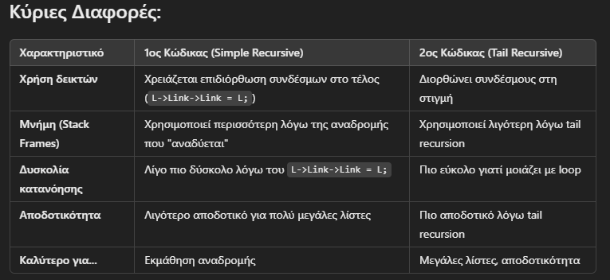

Οι δύο κώδικες κάνουν το ίδιο πράγμα: αντιστροφή μιας μονά συνδεδεμένης λίστας χρησιμοποιώντας αναδρομή, αλλά το κάνουν με διαφορετικούς τρόπους.

# 1ος Κώδικας (Simple Recursive Reverse)

NodeType* Reverse(NodeType *L) {

    if (L == NULL || L->Link == NULL) {
        return L;

    }
    NodeType *newHead = Reverse(L->Link);
    L->Link->Link = L;
    L->Link = NULL;
    return newHead;
}

Τι κάνει:

- Βάση της αναδρομής: Αν η λίστα είναι κενή ή έχει μόνο έναν κόμβο, επιστρέφεται ως έχει (return L).

- Αναδρομή: Καλεί τον εαυτό της για να φτάσει στον τελευταίο κόμβο.

- Αντιστροφή: Όταν επιστρέφει, αντιστρέφει τους συνδέσμους βήμα-βήμα.

- Νέο Head: Επιστρέφει τον νέο πρώτο κόμβο της λίστας.

**Σημαντικές Σημειώσεις:** 

- Η λειτουργία αυτή τροποποιεί απευθείας τους δείκτες Link.

- Ο τελευταίος κόμβος της αρχικής λίστας γίνεται η νέα κεφαλή (newHead).

- Χρησιμοποιεί L->Link->Link = L; για να αναστρέψει τους δείκτες.

# 2ος Κώδικας (Tail Recursive Reverse)

NodeType* ReverseRecursive(NodeType *CurrentNode, NodeType *PreviousNode) {

    if (CurrentNode == NULL) {
        return PreviousNode;
    }
    NodeType *NextNode = CurrentNode->Next;
    CurrentNode->Next = PreviousNode;
    return ReverseRecursive(NextNode, CurrentNode);
    }

Τι κάνει:

Ξεκινάει με δύο δείκτες:

- CurrentNode (τρέχων κόμβος που ελέγχουμε)

- PreviousNode (προηγούμενος κόμβος που πρέπει να δείχνει στον τρέχοντα)

- Βάση της αναδρομής: Αν ο CurrentNode γίνει NULL, ο PreviousNode είναι η νέα κεφαλή (Head).

- Αναδρομή: Μετακινείται στον επόμενο κόμβο, αλλάζει τον Next του τρέχοντος κόμβου ώστε να δείχνει προς τα πίσω.

- Τελικό αποτέλεσμα: Η λίστα έχει αντιστραφεί χωρίς να χρειάζεται πρόσθετος χειρισμός των δεικτών στο τέλος.

**Σημαντικές Σημειώσεις:**

* Αυτή η έκδοση δεν χρησιμοποιεί τον επαναληπτικό "αναδυόμενο" μηχανισμό της κλασικής αναδρομής, αλλά λειτουργεί σαν loop με αναδρομή.

* Είναι πιο αποδοτική σε μνήμη γιατί χρησιμοποιεί tail recursion.

* Είναι πιο καθαρή γιατί οι δείκτες ενημερώνονται στη στιγμή και δεν χρειάζεται ξεχωριστό βήμα "διόρθωσης" όπως η L->Link->Link = L; της πρώτης μεθόδου.

**Ποιον να διαλέξω;**

- Για απλότητα: Ο πρώτος είναι πιο διαισθητικός, αν και έχει την παγίδα του L->Link->Link = L;.

- Για αποδοτικότητα: Ο δεύτερος είναι προτιμότερος, γιατί είναι tail recursive και πιο αποδοτικός στη μνήμη.

💡 Αν δουλεύεις με μεγάλες λίστες, προτίμησε τον 2ο τρόπο (Tail Recursive).