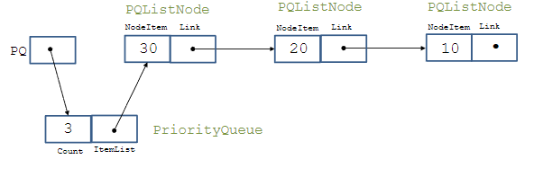
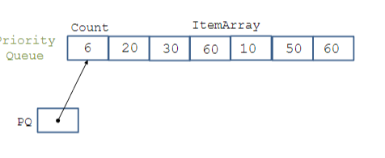
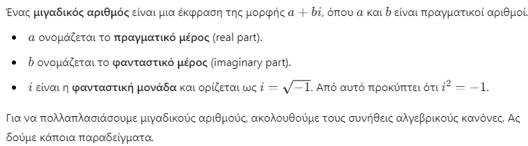
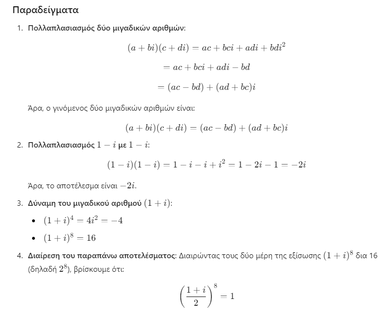
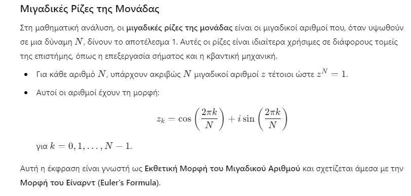

# 3.Αφαίρεση Δεδομένων  

## Διαδικαστική Αφαίρεση

- Όταν τα προγράμματα μεγαλώνουν, πρέπει να ακολουθούνται αυστηρά ορισμένες αρχές οργάνωσης. Διαφορετικά, τα προγράμματα γίνονται πολύπλοκα, μπερδεμένα και δύσκολα στον εντοπισμό σφαλμάτων (debugging).
- Στο πρώτο σας μάθημα προγραμματισμού μάθατε τα οφέλη της διαδικαστικής αφαίρεσης. Όταν οργανώνουμε μια ακολουθία εντολών μέσα σε μια συνάρτηση F(x₁, ..., xₙ), δημιουργούμε μια ονομασμένη μονάδα ενέργειας.
- Όταν αργότερα χρησιμοποιούμε αυτή τη συνάρτηση F, αρκεί να γνωρίζουμε τι κάνει, όχι πώς το κάνει.
- Ο διαχωρισμός του **τι** από το **πώς** αποτελεί πράξη αφαίρεσης. Αυτό προσφέρει δύο βασικά πλεονεκτήματα:
  - Ευκολία χρήσης
  - Ευκολία τροποποίησης

## Απόκρυψη Πληροφορίας

- Στο πρώτο σας μάθημα προγραμματισμού, μάθατε επίσης τα οφέλη της τοπικής δήλωσης μεταβλητών.
- Αυτό αποτελεί παράδειγμα της **απόκρυψης πληροφορίας**.
- Το πλεονέκτημα είναι ότι οι τοπικές μεταβλητές δεν επηρεάζουν μεταβλητές με το ίδιο όνομα που βρίσκονται εκτός της συνάρτησης.
- Η **αφαίρεση** και η **απόκρυψη πληροφορίας** σε μια γλώσσα προγραμματισμού ενισχύονται σημαντικά με την έννοια της **ενότητας (module)**.


## Ενότητες και Αφαιρετικοί Τύποι Δεδομένων

- Μια **ενότητα (module)** είναι μια μονάδα οργάνωσης ενός συστήματος λογισμικού που πακετάρει μια συλλογή οντοτήτων (όπως δεδομένα και λειτουργίες) και ελέγχει προσεκτικά τι μπορούν να δουν και να χρησιμοποιήσουν οι εξωτερικοί χρήστες της ενότητας.
- Οι ενότητες διαθέτουν μηχανισμούς απόκρυψης στο εσωτερικό τους, ώστε να αποτρέπεται η πρόσβαση από εξωτερικούς χρήστες. Αυτό ονομάζεται **απόκρυψη πληροφορίας**.
- Οι **αφαιρετικοί τύποι δεδομένων (abstract data types - ADTs)** είναι συλλογές αντικειμένων και λειτουργιών που προσφέρουν καλά ορισμένες **διεπαφές** στους χρήστες τους, ενώ ταυτόχρονα αποκρύπτουν τον τρόπο με τον οποίο υλοποιούνται σε χαμηλότερο επίπεδο.
- Οι αφαιρετικοί τύποι δεδομένων είναι θεωρητικές έννοιες. Οι ενότητες μπορούν να χρησιμοποιηθούν για την υλοποίησή τους.

- Πολλές σύγχρονες γλώσσες προγραμματισμού προσφέρουν ενότητες με τα εξής βασικά χαρακτηριστικά:
  - Προσφέρουν έναν τρόπο ομαδοποίησης σχετικών δεδομένων και λειτουργιών.
  - Παρέχουν καθαρές, καλά ορισμένες διεπαφές στους χρήστες των υπηρεσιών τους.
  - Αποκρύπτουν εσωτερικές λεπτομέρειες λειτουργίας για να αποτρέψουν παρεμβολές.
  - Μπορούν να μεταγλωττίζονται ξεχωριστά.

- Οι ενότητες είναι ένα σημαντικό εργαλείο για την εφαρμογή της στρατηγικής "διαίρει και βασίλευε" σε ένα μεγάλο έργο λογισμικού, συνδυάζοντας ξεχωριστά συστατικά που αλληλεπιδρούν καθαρά.
- Διευκολύνουν τη **συντήρηση λογισμικού**, επιτρέποντας την τοπική τροποποίηση του κώδικα.


## Ενθυλάκωση

- Όταν έχουμε χαρακτηριστικά όπως οι ενότητες σε γλώσσες προγραμματισμού, χρησιμοποιούμε τον όρο **ενθυλάκωση**.
- Η ενθυλάκωση (encapsulation) σημαίνει ότι οι τοπικές οντότητες παραμένουν κρυφές — είναι «ενθυλακωμένες» — και η ενότητα λειτουργεί σαν μια «κάψουλα».

## Ενότητες στη C

- Η γλώσσα C δεν έχει ρητή έννοια της ενότητας.
- Όμως, με προσεκτική χρήση των αρχείων επικεφαλίδας (header files), μπορούμε να οργανώσουμε ξεχωριστά μεταγλωττιζόμενα αρχεία C ώστε να έχουν τα παρακάτω τέσσερα χαρακτηριστικά των ενοτήτων:
  - Παρέχουν τρόπο ομαδοποίησης σχετικών δεδομένων και λειτουργιών.
  - Παρέχουν καθαρές, καλά ορισμένες διεπαφές στους χρήστες των υπηρεσιών τους.
  - Αποκρύπτουν εσωτερικές λεπτομέρειες λειτουργίας για αποτροπή παρεμβολών.
  - Μπορούν να μεταγλωττίζονται ξεχωριστά.

---

## Ενότητες σε Αντικειμενοστραφείς Γλώσσες

- Σε αντικειμενοστραφείς γλώσσες όπως η C++, η Java και η Python, υπάρχουν και άλλες δομές που μας βοηθούν να υλοποιούμε αφαιρετικούς τύπους δεδομένων, όπως οι **κλάσεις**, οι **διεπαφές**, τα **πακέτα** και οι **ενότητες**.
- Για παράδειγμα, στην Python, όταν γράψουμε μια ενότητα, μπορούμε να εξάγουμε (export) κλάσεις και συναρτήσεις ώστε να μπορούν να χρησιμοποιηθούν από άλλα προγράμματα που εισάγουν (import) την ενότητα.
- Ό,τι δεν εξάγουμε, παραμένει **κρυφό** για τα προγράμματα που χρησιμοποιούν την ενότητα.


## Ενότητες στη C (συνέχεια)

- Μια ενότητα στη C αποτελείται από δύο αρχεία: **MInterface.h** και **MImplementation.c**, τα οποία οργανώνονται ως εξής.

### Το αρχείο MInterface.h:

```c
/*------<η γραμμή κειμένου για το αρχείο MInterface.h ξεκινάει εδώ>---------- */

(δηλώσεις των οντοτήτων που είναι ορατές στους εξωτερικούς χρήστες της ενότητας)

/*--------------<τέλος του αρχείου MInterface.h>-------------------------*/
```

### Το Αρχείο Διεπαφής

- Το MInterface.h είναι το αρχείο διεπαφής.

- Δηλώνει όλες τις οντότητες στην ενότητα που είναι ορατές (και άρα χρήσιμες) για τους εξωτερικούς χρήστες της ενότητας.

- Τέτοιες ορατές οντότητες περιλαμβάνουν σταθερές, τύπους δεδομένων (typedefs), μεταβλητές και συναρτήσεις. Δίνεται μόνο ο πρωτότυπος ορισμός κάθε ορατής συνάρτησης (και μόνο οι τύποι των παραμέτρων, όχι τα ονόματα των παραμέτρων).

- Το βιβλίο του Standish συνιστά οι δηλώσεις συναρτήσεων στο αρχείο διεπαφής να είναι δηλώσεις extern. Αυτό δεν είναι απαραίτητο, οπότε δεν θα το ακολουθήσουμε.

### Το αρχείο MImplementation.c:

```c
/*-------<η γραμμή κειμένου για το αρχείο MImplementation.c ξεκινάει εδώ>------*/
#include <stdio.h>
#include "MInterface.h"

(δηλώσεις των οντοτήτων που είναι ιδιωτικές στην ενότητα, καθώς και οι πλήρεις δηλώσεις και υλοποιήσεις των συναρτήσεων που εκτίθενται από την ενότητα)

/*---------------<τέλος του αρχείου MImplementation.c>--------------------*/
```

### Το Αρχείο Υλοποίησης

- Το MImplementation.c είναι το αρχείο υλοποίησης.

- Περιέχει όλες τις ιδιωτικές οντότητες στην ενότητα, οι οποίες δεν είναι ορατές από έξω.

- Περιέχει τις πλήρεις δηλώσεις και υλοποιήσεις των συναρτήσεων των οποίων τα πρωτότυπα έχουν δηλωθεί στο αρχείο διεπαφής.

- Περιλαμβάνει (μέσω της εντολής #include) το αρχείο διεπαφής χρήστη.


## Το Κύριο Πρόγραμμα

- Ένα κύριο πρόγραμμα (πρόγραμμα-πελάτης) που χρησιμοποιεί δύο ενότητες A και B οργανώνεται ως εξής:

```c
#include <stdio.h>
#include "ModuleAInterface.h"
#include "ModuleBInterface.h"
(δηλώσεις οντοτήτων που χρησιμοποιούνται από το κύριο πρόγραμμα)

int main(void)
{
(εντολές που εκτελούνται στο κύριο πρόγραμμα)
}
```
## Ξεχωριστή Μεταγλώττιση
Μπορούμε να μεταγλωττίσουμε την ενότητα και το πρόγραμμα-πελάτη ξεχωριστά:

```
gcc -c MImplementation.c -o M.o
gcc -c ClientProgram.c -o ClientProgram.o
gcc M.o ClientProgram.o -o ClientProgram.exe
```

Με τις πρώτες δύο εντολές, μεταγλωττίζουμε τα αρχεία C για να παραγάγουμε τα αρχεία αντικειμένων (object files).

Στη συνέχεια, τα αρχεία αντικειμένων συνδέονται (link) για να παραχθεί το τελικό εκτελέσιμο αρχείο.

Με παρόμοιο τρόπο, μπορούμε να δημιουργήσουμε και να χρησιμοποιούμε βιβλιοθήκες στη C.


# Ουρές Προτεραιότητας – Ένας Αφαιρετικός Τύπος Δεδομένων

- Μια **ουρά προτεραιότητας** είναι ένας θάλαμος που περιέχει αντικείμενα με διαφορετική προτεραιότητα.
- Για παράδειγμα, μια λίστα εργασιών με προθεσμία για την επεξεργασία κάθε μίας από αυτές.
- Όταν αφαιρούμε ένα αντικείμενο από μια ουρά προτεραιότητας, πάντα αφαιρούμε το αντικείμενο με τη μεγαλύτερη προτεραιότητα.

---

## Ορισμός του ADT (Αφαιρετικός Τύπος Δεδομένων) Ουράς Προτεραιότητας

- Μια **ουρά προτεραιότητας** είναι μια πεπερασμένη συλλογή αντικειμένων για την οποία ορίζονται οι εξής λειτουργίες:
  - Αρχικοποίηση της ουράς προτεραιότητας, **PQ**, στην κενή ουρά προτεραιότητας.
  - Εύρεση αν η ουρά προτεραιότητας, **PQ**, είναι κενή.
  - Εύρεση αν η ουρά προτεραιότητας, **PQ**, είναι γεμάτη.
  - Εισαγωγή ενός νέου αντικειμένου, **X**, στην ουρά προτεραιότητας, **PQ**.
  - Αν η **PQ** δεν είναι κενή, αφαιρούμε από την **PQ** το αντικείμενο **X** με τη μεγαλύτερη προτεραιότητα στην **PQ**.


# Υλοποιήσεις Ουρών Προτεραιότητας
    
- Θα παρουσιάσουμε δύο υλοποιήσεις μιας ουράς προτεραιότητας:
    - Χρησιμοποιώντας ταξινομημένες συνδεδεμένες λίστες.
    - Χρησιμοποιώντας αταξινόμητους πίνακες.
    
    ---
    
## Ουρά Προτεραιότητας Υλοποιημένη με Ταξινομημένη Συνδεδεμένη Λίστα 


    
- Στην περίπτωση της ταξινομημένης συνδεδεμένης λίστας, το αρχείο **PQTypes.h** μπορεί να οριστεί ως εξής:

```c
#define MAXCOUNT 10
typedef int PQItem;

typedef struct PQNodeTag {
    PQItem NodeItem;
    struct PQNodeTag *Link;
} PQListNode;

typedef struct {
    int Count;
    PQListNode *ItemList;
} PriorityQueue;


```
* Αυτό είναι το αρχείο **PQInterface.h**
```c

#include "PQTypes.h"

void Initialize(PriorityQueue *PQ);
int Empty(PriorityQueue *PQ);
int Full(PriorityQueue *PQ);
void Insert(PQItem Item, PriorityQueue *PQ);
PQItem Remove(PriorityQueue *PQ);


```

- Αυτό είναι το αρχείο **PQImplementation.c**

```c
#include <stdio.h>
#include <stdlib.h>
#include "PQInterface.h"

// Βοηθητική συνάρτηση για ταξινομημένη εισαγωγή
static PQListNode *SortedInsert(PQItem Item, PQListNode *P) {
    PQListNode *N;
    if ((P == NULL) || (Item >= P->NodeItem)) {
        N = (PQListNode *)malloc(sizeof(PQListNode));
        if (N == NULL) {
            printf("Σφάλμα: Αποτυχία δέσμευσης μνήμης.\n");
            exit(1);
        }
        N->NodeItem = Item;
        N->Link = P;
        return N;
    } else {
        P->Link = SortedInsert(Item, P->Link);
        return P;
    }
}

void Initialize(PriorityQueue *PQ) {
    PQ->Count = 0;
    PQ->ItemList = NULL;
}

int Empty(PriorityQueue *PQ) {
    return (PQ->Count == 0);
}

int Full(PriorityQueue *PQ) {
    return (PQ->Count == MAXCOUNT);
}

void Insert(PQItem Item, PriorityQueue *PQ) {
    if (!Full(PQ)) {
        PQ->ItemList = SortedInsert(Item, PQ->ItemList);
        PQ->Count++;
    } else {
        printf("Η ουρά είναι πλήρης! Δεν μπορεί να εισαχθεί το στοιχείο %d.\n", Item);
    }
}

PQItem Remove(PriorityQueue *PQ) {
    if (!Empty(PQ)) {
        PQItem temp = PQ->ItemList->NodeItem;
        PQListNode *oldNode = PQ->ItemList;
        PQ->ItemList = PQ->ItemList->Link;
        free(oldNode);
        PQ->Count--;
        return temp;
    } else {
        printf("Η ουρά είναι άδεια. Δεν μπορεί να γίνει αφαίρεση.\n");
        return -1; // Ή άλλη ένδειξη λάθους
    }
}

```
* Αυτό είναι το **κύριο πρόγραμμα**
```c
#include <stdio.h>
#include "PQInterface.h"

int main() {
    PriorityQueue PQ;
    Initialize(&PQ);

    PQItem inputItems[] = {15, 3, 22, 7, 9};
    int n = sizeof(inputItems) / sizeof(PQItem);

    printf("Εισαγωγή στοιχείων:\n");
    for (int i = 0; i < n; ++i) {
        printf("  ➤ Εισάγεται το: %d\n", inputItems[i]);
        Insert(inputItems[i], &PQ);
    }

    printf("\n Αφαίρεση στοιχείων κατά προτεραιότητα:\n");
    while (!Empty(&PQ)) {
        PQItem item = Remove(&PQ);
        printf("  ➤ Αφαιρέθηκε το: %d\n", item);
    }

    return 0;
}
```

### Συνάρτηση Insert και Ταξινόμηση των Στοιχείων

- Η συνάρτηση **Insert** διατηρεί τα στοιχεία της λίστας σε φθίνουσα σειρά (το πρώτο στοιχείο έχει την υψηλότερη προτεραιότητα).
- Η συνάρτηση **Insert** καλεί τη συνάρτηση **SortedInsert** για να κάνει την πραγματική εισαγωγή.
- Η **SortedInsert** εξετάζει τρεις περιπτώσεις:
  - Αν η **ItemList** της **PQ** είναι άδεια.
  - Αν το νέο στοιχείο έχει προτεραιότητα μεγαλύτερη ή ίση με την προτεραιότητα του πρώτου στοιχείου στη **ItemList**.
  - Αν το νέο στοιχείο έχει προτεραιότητα μικρότερη από αυτή του πρώτου στοιχείου της **ItemList**. Σε αυτή την περίπτωση, η συνάρτηση καλείται αναδρομικά στην ουρά της λίστας.

### Συνάρτηση Remove

- Η συνάρτηση **Remove** απλώς διαγράφει το στοιχείο στον πρώτο κόμβο της συνδεδεμένης λίστας που αναπαριστά την ουρά προτεραιότητας (**PQ**)  
  (αυτό είναι το στοιχείο με την υψηλότερη προτεραιότητα)  
  και επιστρέφει την τιμή του πεδίου **NodeItem**.

### Ερώτηση

- Χρειαζόμαστε το πεδίο **Count** στη δομή **PriorityQueue** και τη σταθερά **MAXCOUNT** στο αρχείο `PQTypes.h`;

### Απάντηση

- Θα μπορούσαμε να αποφύγουμε τη χρήση του **Count** χρησιμοποιώντας τιμή **NULL** στο μέλος **ItemList** της δομής **PriorityQueue** για άδειες ουρές.
- Ωστόσο, ο έλεγχος `Count == MAXCOUNT` είναι χρήσιμος για να γνωρίζουμε πότε η ουρά προτεραιότητας είναι πλήρης — κάτι που δεν μπορούμε να ελέγξουμε αλλιώς.
- Επίσης, το **Count** μας δίνει πληροφορία για το πόσα στοιχεία περιέχει η ουρά προτεραιότητας χωρίς να χρειαστεί να την διατρέξουμε.


## Υλοποίηση με Μη Ταξινομημένο Πίνακα

Αυτό το πρόγραμμα ταξινομεί έναν πίνακα από αριθμούς χρησιμοποιώντας μια ουρά προτεραιότητας (priority queue).




- Στην περίπτωση χρήσης μη ταξινομημένου πίνακα, το αρχείο **PQTypes.h** μπορεί να οριστεί ως εξής:

```c
#define MAXCOUNT 10
typedef int PQItem;
typedef PQItem PQArray[MAXCOUNT];

typedef struct {
    int Count;
    PQArray ItemArray;
} PriorityQueue;
```

* Αυτό είναι το αρχείο **PQInterface.h**
```c
#include "PQTypes.h"
/* ορίζει τους τύπους PQItem και PriorityQueue */
void Initialize(PriorityQueue *);
int Empty(PriorityQueue *);
int Full(PriorityQueue *);
void Insert(PQItem, PriorityQueue *);
PQItem Remove(PriorityQueue *);
```

- Αυτό είναι το αρχείο **PQImplementation.c**

```c
#include <stdio.h>
#include "PQInterface.h"

/* Παρακάτω δίνονται όλες οι λεπτομέρειες των συναρτήσεων */
/* που δηλώθηκαν στο αρχείο διεπαφής, μαζί με */
/* τοπικές ιδιωτικές συναρτήσεις. */

void Initialize(PriorityQueue *PQ)
{
    PQ->Count = 0;
}
int Empty(PriorityQueue *PQ)
{
    return (PQ->Count == 0);
}
int Full(PriorityQueue *PQ)
{
    return (PQ->Count == MAXCOUNT);
}
void Insert(PQItem Item, PriorityQueue *PQ)
{
    if (!Full(PQ)) {
        PQ->ItemArray[PQ->Count] = Item;
        PQ->Count++;
    }
}
PQItem Remove(PriorityQueue *PQ)
{
    int i;
    int MaxIndex;
    PQItem MaxItem;

    if (!Empty(PQ)) {
        MaxItem = PQ->ItemArray[0];
        MaxIndex = 0;

        for (i = 1; i < PQ->Count; ++i) {
            if (PQ->ItemArray[i] > MaxItem) {
                MaxItem = PQ->ItemArray[i];
                MaxIndex = i;
            }
        }

        PQ->Count--;
        PQ->ItemArray[MaxIndex] = PQ->ItemArray[PQ->Count];
        return MaxItem;
    }
}
```
Αυτό είναι το **κύριο πρόγραμμα**
```c
#include <stdio.h>
#include "PQInterface.h"

typedef PQItem SortingArray[MAXCOUNT];  // Ορίζουμε τον τύπο για τον πίνακα

void PriorityQueueSort(SortingArray A) {
    int i;
    PriorityQueue PQ;
    Initialize(&PQ);
    
    // Εισάγουμε τα στοιχεία στην ουρά προτεραιότητας
    for (i = 0; i < MAXCOUNT; ++i) {
        Insert(A[i], &PQ);
    }
    
    // Αφαιρούμε τα στοιχεία από την ουρά και τα τοποθετούμε στον πίνακα
    for (i = MAXCOUNT - 1; i >= 0; --i) {
        A[i] = Remove(&PQ);
    }
}

int main(void) {
    int i;
    SortingArray A;

    // Γέμισμα του πίνακα με τιμές
    for (i = 0; i < 10; ++i) {
        A[i] = 3 * i - 13;
        printf("%d ", A[i]);
    }
    printf("\n");

    // Ταξινόμηση του πίνακα
    PriorityQueueSort(A);

    // Εμφάνιση των ταξινομημένων τιμών
    for (i = 0; i < 10; ++i) {
        printf("%d ", A[i]);
    }
    printf("\n");

    return 0;
}

```
### Συνάρτηση Insert

- Η συνάρτηση `Insert` απλώς προσθέτει το νέο στοιχείο στο τέλος του πίνακα `ItemArray` της δομής `PQ`.

---

### Συνάρτηση Remove

- Στη συνάρτηση `Remove`, αρχικά εντοπίζουμε το στοιχείο με τη **μεγαλύτερη προτεραιότητα**.
- Έπειτα, το αποθηκεύουμε σε μια προσωρινή μεταβλητή (`MaxItem`).
- Το διαγράφουμε από τον πίνακα `ItemArray` και στη θέση του τοποθετούμε το τελευταίο στοιχείο του πίνακα.
- Τέλος, επιστρέφουμε το στοιχείο με τη μεγαλύτερη προτεραιότητα.

## Αρχεία Επικεφαλίδων Διεπαφής (Interface Header Files)

- Παρατήρησε ότι το αρχείο επικεφαλίδας διεπαφής του module `PQInterface.h` συμπεριλαμβάνεται σε δύο σημαντικές αλλά διακριτές περιπτώσεις:
  - Στην αρχή των **αρχείων υλοποίησης**, τα οποία ορίζουν την εσωτερική (κρυφή) αναπαράσταση των λειτουργιών του module που είναι προσβάσιμες εξωτερικά.
  - Στην αρχή των **προγραμμάτων** που χρειάζονται πρόσβαση στις εξωτερικές υπηρεσίες του module, όπως ορίζονται στο αρχείο διεπαφής.

---

## Ξεχωριστή Μεταγλώττιση (Separate Compilation)

- Μπορούμε να μεταγλωττίσουμε ξεχωριστά το module και το πρόγραμμα-πελάτη:
  
```bash
gcc -c PQImplementation.c -o PQ.o
gcc -c sorting.c -o sorting.o
gcc PQ.o sorting.o -o program.exe
```

## Επανεξέταση Απόκρυψης Πληροφορίας στoν αταξινόμητο πίνακα

Ας επανεξετάσουμε το πρόγραμμα ταξινόμησης που γράψαμε νωρίτερα για τον αταξινόμητο πίνακα που χρησιμοποιεί την ουρλα προταιρεότητας,και να εξετάσουμε τη νέα δήλωση printf.

```c
#include <stdio.h>
#include "PQInterface.h"
typedef PQItem SortingArray[MAXCOUNT];
/* Σημείωση: MAXCOUNT είναι 10 */
void PriorityQueueSort(SortingArray A)
{
    int i;
    PriorityQueue PQ;
    Initialize(&PQ);
    for (i = 0; i < MAXCOUNT; ++i){
        Insert(A[i], &PQ);
    } 
    printf("Η ουρά περιέχει %d στοιχεία\n", PQ.Count);
    for (i = MAXCOUNT - 1; i >= 0; --i){
        A[i] = Remove(&PQ);
    } 
}
```

- Η δήλωση printf έχει πρόσβαση στο πεδίο Count της ουράς προτεραιότητας PQ. Επομένως, η προηγούμενη οργάνωση του module δεν έχει πετύχει την απόκρυψη της πληροφορίας με τον τρόπο που θα θέλαμε.

Μπορούμε να ζήσουμε με αυτό το ελάττωμα ή να προσπαθήσουμε να το διορθώσουμε. Πώς;

Για να διορθώσουμε το πρόβλημα της απόκρυψης πληροφορίας, πρέπει να αναδιοργανώσουμε το module έτσι ώστε να μην επιτρέπει την άμεση πρόσβαση στο πεδίο Count από το εξωτερικό. Μια λύση θα ήταν να παρέχουμε μια συνάρτηση για την επιστροφή του αριθμού των στοιχείων στην ουρά, αντί να επιτρέπουμε την απευθείας πρόσβαση στο πεδίο Count.

## Πιθανή Λύση:

Αντί να χρησιμοποιούμε απευθείας το PQ.Count, μπορούμε να προσθέσουμε μια νέα συνάρτηση στην διεπαφή του module (στο PQInterface.h), η οποία θα επιστρέφει τον αριθμό των στοιχείων στην ουρά:

```c
/* Στην διεπαφή PQInterface.h */
int GetCount(PriorityQueue *PQ);
```
Στη συνέχεια, στην υλοποίηση του module (PQImplementation.c), προσθέτουμε τη συνάρτηση:

```c
/* Στην υλοποίηση PQImplementation.c */
int GetCount(PriorityQueue *PQ) {
    return PQ->Count;
}
```
Έπειτα, στο πρόγραμμα που χρησιμοποιεί την ουρά προτεραιότητας, αντί να προσπελάσουμε το PQ.Count απευθείας, καλούμε τη συνάρτηση GetCount:
```c
printf("Η ουρά περιέχει %d στοιχεία\n", GetCount(&PQ));
```
Αυτή η προσέγγιση διασφαλίζει την απόκρυψη του πεδίου Count και επιτρέπει τη διαχείριση του αριθμού των στοιχείων μέσω μιας καθορισμένης διεπαφής, ακολουθώντας τις αρχές της απόκρυψης πληροφορίας.

## Συμπερασματικά

- η λίστα είναι το εσωτερικό "μηχανάκι" που κάνει τη δουλειά της ουράς, ενώ το άλλο πρόγραμμα τη χρησιμοποιεί για να ταξινομήσει έναν πίνακα.

**ΑΡΑ**

📌 Το παράδειγμα με τη λίστα δείχνει πώς φτιάχνουμε μια ουρά προτεραιότητας.

📌 Το παράδειγμα με τον πίνακα δείχνει πώς τη χρησιμοποιούμε για να ταξινομήσουμε έναν πίνακα αριθμών.

**Πού χρησιμοποιείται το καθένα;**

- Η πίνακας-ουρά προτεραιότητας είναι πιο απλή και γρήγορη σε σταθερό μέγεθος.

- Η λίστα-ουρά προτεραιότητας είναι πιο ευέλικτη και επιτρέπει ταξινόμηση κατά την εισαγωγή.

# Αριθμητική Μιγαδικών αριθμών





## Εφαρμογές των Μιγαδικών Αριθμών

Οι μιγαδικοί αριθμοί βρίσκουν εφαρμογή σε πολλούς τομείς των μαθηματικών και της φυσικής, καθώς και σε άλλες επιστημονικές περιοχές. Μερικές από αυτές τις εφαρμογές περιλαμβάνουν:

- Περιοχές καθαρής και εφαρμοσμένης μαθηματικής ανάλυσης

- Φυσική

- Δυναμική ρευστών

- Επεξεργασία σημάτων (όπως το μάθημα "Σήματα και Συστήματα" στο 3ο εξάμηνο)

- Θεωρία ελέγχου

- Κβαντική μηχανική

- Θεωρία της σχετικότητας



## ADT για Μιγαδικούς Αριθμούς: Η Διεπαφή (Interface)

Αυτό το αρχείο περιέχει τον τύπο δεδομένων και τις υπογραφές των συναρτήσεων που αφορούν την επεξεργασία μιγαδικών αριθμών.

## Περιεχόμενο του Αρχείου **COMPLEX.h**

```c
/* Αυτό είναι το αρχείο COMPLEX.h */
typedef struct complex *Complex;

Complex COMPLEXinit(float, float);
float Re(Complex);
float Im(Complex);
Complex COMPLEXmult(Complex, Complex);
```

## Σημειώσεις

- Η διεπαφή που παρουσιάζεται στην προηγούμενη διαφάνεια παρέχει στους πελάτες λαβές (handles) για αντικείμενα μιγαδικών αριθμών, αλλά δεν παρέχει καμία πληροφορία για την αναπαράσταση των δεδομένων.

- Η αναπαράσταση είναι μία struct η οποία δεν καθορίζεται πλήρως, εκτός από το όνομα της ετικέτας της (tag name).

- Η απόκρυψη της αναπαράστασης επιτρέπει στους χρήστες να αλληλεπιδρούν με τους μιγαδικούς αριθμούς μέσω των καθορισμένων συναρτήσεων, χωρίς να χρειάζεται να γνωρίζουν τις εσωτερικές λεπτομέρειες της αναπαράστασης.

# Handles

- Χρησιμοποιούμε τον όρο **λαβή** (handle) για να περιγράψουμε μία αναφορά σε ένα αφηρημένο αντικείμενο.
- Στόχος μας είναι να παρέχουμε στους πελάτες του προγράμματος λαβές για αφηρημένα αντικείμενα, οι οποίες θα μπορούν να χρησιμοποιηθούν σε δηλώσεις ανάθεσης (assignment statements) και ως επιχειρήματα ή τιμές επιστροφής συναρτήσεων, με τον ίδιο τρόπο όπως οι ενσωματωμένοι τύποι δεδομένων, ενώ ταυτόχρονα αποκρύπτουμε την αναπαράσταση των αντικειμένων από το πρόγραμμα του πελάτη.

---

# Υλοποίηση του ADT για Μιγαδικούς Αριθμούς

Αυτό το αρχείο δείχνει πώς υλοποιείται ο τύπος δεδομένων για τους μιγαδικούς αριθμούς.

## Περιεχόμενο του Αρχείου **CImplementation.c**

```c
/* Αυτό είναι το αρχείο CImplementation.c */
#include <stdlib.h>
#include "COMPLEX.h"

struct complex { 
    float Re; 
    float Im; 
};

Complex COMPLEXinit(float Re, float Im) {
    Complex t = malloc(sizeof *t);
    t->Re = Re;
    t->Im = Im;
    return t;
}

float Re(Complex z) {
    return z->Re;
}

float Im(Complex z) {
    return z->Im;
}

Complex COMPLEXmult(Complex a, Complex b) {
    return COMPLEXinit(Re(a) * Re(b) - Im(a) * Im(b), 
                       Re(a) * Im(b) + Im(a) * Re(b));
}
```
## Σημειώσεις

- Η υλοποίηση της διεπαφής στο προηγούμενο πρόγραμμα περιλαμβάνει τον ορισμό της δομής `complex` (η οποία είναι κρυφή από τους πελάτες) καθώς και την υλοποίηση των συναρτήσεων που παρέχονται από τη διεπαφή.
- Τα αντικείμενα είναι δείκτες σε δομές, επομένως αναφορικά με τα πεδία της δομής, αποαναφερόμαστε μέσω του δείκτη.

---

## Πρόγραμμα Πελάτη

Αυτό το πρόγραμμα υπολογίζει τις μιγαδικές ρίζες της μονάδας για ένα δοσμένο N.

## Περιεχόμενο του Αρχείου **roots-of-unity.c**

```c
/* Υπολογίζει τις N μιγαδικές ρίζες της μονάδας για το δοσμένο N */
#include <stdio.h>
#include <math.h>
#include <stdlib.h>

#include "complex.h"

#define PI 3.141592625

int main(int argc, char *argv[]) {
    int i, j, N = atoi(argv[1]);
    Complex t, x;
    printf("%dth complex roots of unity\n", N);
    for (i = 0; i < N; i++){
        float r = 2.0*PI*i/N;
        t = COMPLEXinit(cos(r), sin(r));
        printf("%2d %6.3f %6.3f ", i, Re(t), Im(t));
        for (x = t, j = 0; j < N-1; j++){
            x = COMPLEXmult(t, x);
        }

    printf("%6.3f %6.3f\n", Re(x), Im(x));
    }
}
```
**Σημειώσεις**

- Για έναν αριθμό εισόδου, το πρόγραμμα του πελάτη εκτυπώνει τις ρίζες της μονάδας μέχρι αυτόν τον αριθμό, μία προς μία, μαζί με μια επιβεβαίωση ότι πράγματι είναι τέτοιες ρίζες.

- Για να γίνει η επαλήθευση, η εκθλίψη σε δύναμη υλοποιείται με τον πολλαπλασιασμό.

## Στρατηγική Γραμμής Εντολών

-argc (argument count) είναι ο αριθμός των επιχειρημάτων της γραμμής εντολών.

-argv (argument vector) είναι ένας δείκτης σε έναν πίνακα από συμβολοσειρές χαρακτήρων που περιέχουν τα επιχειρήματα, το καθένα σε μία συμβολοσειρά.

-Σύμφωνα με τη σύμβαση, το argv[0] είναι το όνομα με το οποίο κλήθηκε το πρόγραμμα, οπότε το argc είναι τουλάχιστον 1.

Στο προηγούμενο πρόγραμμα, το argv[1] περιέχει την τιμή του N.

# Ξεχωριστή Μεταγλώττιση

- Μεταγλωττίζουμε το module και το πρόγραμμα-πελάτη ξεχωριστά:
  
```bash
gcc -c CImplementation.c -o CI.o
gcc -c roots-of-unity.c -o roots-of-unity.o
gcc CI.o roots-of-unity.o -o program.exe -lm
```

Με τις πρώτες δύο εντολές, μεταγλωττίζουμε τα αρχεία C για να παραχθούν αρχεία αντικειμένων. Στη συνέχεια, τα αρχεία αντικειμένων συνδέονται για να παραχθεί το τελικό εκτελέσιμο.

Παρατηρήστε ότι πρέπει να χρησιμοποιήσουμε την επιλογή -lm για να συνδέσουμε τη βιβλιοθήκη μαθηματικών.

### Άσκηση

Επανεξετάστε τον ADT (Τύπο Δεδομένων) της ουράς προτεραιότητας και ορίστε μια καλύτερη διεπαφή και υλοποίησή της, ώστε να πετύχουμε την απόκρυψη της πληροφορίας.