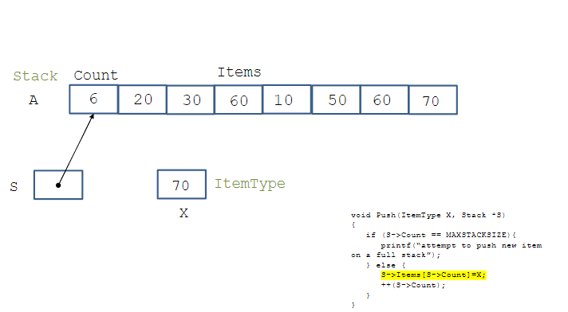

# Στοίβες και Ουρές Αναμονής

- Οι **γραμμικές δομές δεδομένων** είναι συλλογές από στοιχεία τα οποία είναι διατεταγμένα σε ευθεία γραμμή.

- Αν περιορίσουμε την ανάπτυξη μιας γραμμικής δομής δεδομένων έτσι ώστε νέα στοιχεία να μπορούν να προστεθούν και να αφαιρεθούν μόνο από το ένα άκρο, τότε έχουμε μια **στοίβα** (*stack*).

- Αν νέα στοιχεία μπορούν να προστεθούν στο ένα άκρο αλλά η αφαίρεση στοιχείων πρέπει να γίνεται από το αντίθετο άκρο, τότε έχουμε μια **ουρά αναμονής** (*queue*).


# Στοίβες στην Επιστήμη Υπολογιστών

Οι **στοίβες** χρησιμοποιούνται σε πολλούς τομείς της Επιστήμης Υπολογιστών, όπως:

- Αλγόριθμοι ανάλυσης (*Parsing algorithms*)
- Αυτόματα με στοίβα (*Pushdown automata*)
- Αλγόριθμοι υπολογισμού εκφράσεων (*Expression evaluation algorithms*)
- Αλγόριθμοι οπισθοδρόμησης (*Backtracking algorithms*)
- Εγγραφές ενεργοποίησης στη στοίβα χρόνου εκτέλεσης (*Activation records in run-time stack*)

# Στοίβες

- Οι **στοίβες** συχνά αποκαλούνται λίστες τύπου **LIFO** (*Last-In, First-Out*), που σημαίνει "τελευταίο μέσα, πρώτο έξω".
- Όταν προσθέτουμε ένα νέο αντικείμενο στην κορυφή της στοίβας, η διαδικασία αυτή ονομάζεται **ώθηση** (*pushing*).
- Όταν αφαιρούμε ένα αντικείμενο από την κορυφή της στοίβας, αυτό ονομάζεται **εξαγωγή** (*popping*).
- Η ώθηση και η εξαγωγή είναι αντίστροφες λειτουργίες.

# Ακολουθίες

- Μια **ακολουθία πεπερασμένου μήκους** \( S = (s_1, s_2, ..., s_n) \) είναι απλώς μια διατεταγμένη διάταξη από πεπερασμένο αριθμό στοιχείων \( s_1, s_2, ..., s_n \).
- Το **μήκος** μιας ακολουθίας είναι ο αριθμός των στοιχείων της.
- Υπάρχει μια ειδική ακολουθία με μήκος 0, που ονομάζεται **κενή ακολουθία**.

# Αφηρημένος Τύπος Δεδομένων για Στοίβες

Μια **στοίβα** \( S \) από αντικείμενα τύπου \( T \) είναι μια ακολουθία από στοιχεία τύπου \( T \), πάνω στην οποία μπορούν να οριστούν οι παρακάτω λειτουργίες:

1. **Αρχικοποίηση** της στοίβας \( S \) ως κενή στοίβα.
2. **Έλεγχος** αν η στοίβα \( S \) είναι κενή.
3. **Έλεγχος** αν η στοίβα \( S \) είναι πλήρης.
4. **Ώθηση (Push)** ενός νέου στοιχείου στην κορυφή της στοίβας \( S \).
5. Αν η στοίβα \( S \) δεν είναι κενή, **εξαγωγή (Pop)** ενός στοιχείου από την κορυφή της.

# Διεπαφή για Στοίβες

Χρησιμοποιώντας ξεχωριστά μεταγλωττισμένα αρχεία C, μπορούμε να ορίσουμε **μονάδες C (C modules)** που καθορίζουν την εσωτερική αναπαράσταση για τις στοίβες και υλοποιούν τις αφηρημένες λειτουργίες της στοίβας.

```c
typedef char ItemType;
#define MAX 100

typedef struct {
    ItemType items[100];
    int top;
} Stack;

void InitializeStack(Stack *);
int Empty(Stack *);
int Full(Stack *);
void Push(ItemType, Stack *);
void Pop(Stack *, ItemType *);
```

# Χρησιμοποίηση του Αφηρημένου Τύπου Δεδομένων Στοίβας για Έλεγχο Ισορροπημένων Παρενθέσεων

Η πρώτη εφαρμογή του **Αφηρημένου Τύπου Δεδομένων Στοίβα** που θα μελετήσουμε αφορά τον έλεγχο αν οι παρενθέσεις και οι αγκύλες ισορροπούν σωστά σε αλγεβρικές εκφράσεις.


Αυτή η έκφραση περιέχει παρενθέσεις, αγκύλες και άγκιστρα σε ισορροπημένα ζεύγη σύμφωνα με το μοτίβο:


# Ο Αλγόριθμος

- Μπορούμε να ξεκινήσουμε με μια κενή στοίβα και να σαρώσουμε μια αλφαβητική αλγεβρική έκφραση από αριστερά προς τα δεξιά.
- Κάθε φορά που συναντάμε μια αριστερή παρένθεση `(`, μια αριστερή αγκίστρωση `[` ή ένα αριστερό άγκιστρο `{`, την προσθέτουμε στην κορυφή της στοίβας.
- Κάθε φορά που συναντάμε μια δεξιά παρένθεση `)`, μια δεξιά αγκίστρωση `]` ή ένα δεξί άγκιστρο `}`, αφαιρούμε το στοιχείο από την κορυφή της στοίβας και ελέγχουμε αν ο τύπος του στοιχείου ταιριάζει με τον τύπο της δεξιάς παρένθεσης, αγκίστρωσης ή άγκιστρου που συναντήσαμε.
- Αν η στοίβα είναι κενή μέχρι το τέλος της έκφρασης και αν όλα τα ζεύγη των ταιριασμένων παρενθέσεων ήταν του ίδιου τύπου, τότε η έκφραση έχει σωστά ισορροπημένες παρενθέσεις. Διαφορετικά, οι παρενθέσεις δεν είναι σωστά ισορροπημένες.

```c
#include <stdio.h>
#include <stdlib.h>
#include <string.h>
#include "prot.h"


char InputExpression[100]; // Fixed-size array for

int Match(char c, char d) {
    switch (c) {
        case '(': return d == ')';
        case '[': return d == ']';
        case '{': return d == '}';
        default: return 0;
    }
}

void ParenMatch(void) {
    int n, i = 0;
    char c, d;
    Stack ParenStack;
    InitializeStack(&ParenStack);
    n = strlen(InputExpression);
    while (i < n) {
        d = InputExpression[i];
        // If opening bracket, push onto stack
        if (d == '(' || d == '[' || d == '{') {
            Push(d, &ParenStack);
        }
        // If closing bracket, check stack
        else if (d == ')' || d == ']' || d == '}') {
            if (Empty(&ParenStack)) {
            printf("More right parentheses than left parentheses\n");
                return;
            }
            Pop(&ParenStack, &c);
            if (!Match(c, d)) {
                printf("Mismatched Parentheses: %c and %c\n", c, d);
                return;
            }
        }
        ++i;
    }
    // Final stack check
    if (Empty(&ParenStack)) {
        printf("Parentheses are balanced properly\n");
    } else {
        printf("More left parentheses than right parentheses\n");
    }
}

int main(void) {
    printf("Give Input Expression without blanks: ");
    scanf("%99s", InputExpression); // Prevent buffer overflow
    ParenMatch();
    return 0;
}
```

# Ενθεματικός και Μεταθεματικός Συμβολισμός

- Οι εκφράσεις συνήθως γράφονται σε **ενθεματικό συμβολισμό** (infix notation), π.χ. \( (a+b)*2-c \). Οι παρενθέσεις χρησιμοποιούνται για να δηλώσουν τη σειρά εκτέλεσης των πράξεων.

- Ο **μεταθεματικός συμβολισμός** (postfix notation) χρησιμοποιείται για να καθορίσει αλγεβρικές πράξεις χρησιμοποιώντας έναν συμβολισμό χωρίς παρενθέσεις. Για παράδειγμα, \( ab+2*c- \).

- Ο μεταθεματικός συμβολισμός \( L R \, \text{op} \) αντιστοιχεί στον ενθεματικό συμβολισμό \( L \, \text{op} \, R \).


# Προθεματικός Συμβολισμός

- Υπάρχει επίσης ο **προθεματικός συμβολισμός** (ή Πολωνικός συμβολισμός), στον οποίο ο τελεστής προηγείται των οπεραντών.
  
- Παράδειγμα: \( + 3 * 2 5 \) είναι η προθεματική μορφή του \( (2 * 5) + 3 \).

- Ο προθεματικός και ο μεταθεματικός συμβολισμός δεν χρειάζονται παρενθέσεις για να δηλώσουν τη σειρά των πράξεων και δεν υπάρχουν κανόνες προτεραιότητας που πρέπει να μάθουμε.

- Ο μεταθεματικός συμβολισμός ονομάζεται μερικές φορές **αντίστροφος Πολωνικός** (reverse Polish) για προφανείς λόγους.

# Χρησιμοποίηση του Αφηρημένου Τύπου Δεδομένων Στοίβας για Αξιολόγηση Μεταθεματικών Εκφράσεων

- Για να αξιολογήσουμε μια μεταθεματική έκφραση \( P \), τη σαρώσουμε από αριστερά προς τα δεξιά.

- Όταν συναντάμε έναν **ορίσμα** \( X \), τον προσθέτουμε στην στοίβα αξιολόγησης \( S \).

- Όταν συναντάμε έναν **τελεστή** \( \text{op} \), αφαιρούμε το πάνω στοιχείο από την στοίβα \( S \) και το τοποθετούμε σε μια μεταβλητή \( R \) (η οποία δηλώνει τον δεξιό ορίσμα), στη συνέχεια αφαιρούμε άλλο ένα στοιχείο από την στοίβα και το τοποθετούμε σε μια μεταβλητή \( L \) (η οποία δηλώνει τον αριστερό ορίσμα).

- Τέλος, εκτελούμε την πράξη \( \text{op} \) με τα \( L \) και \( R \), υπολογίζοντας την τιμή της έκφρασης \( L \, \text{op} \, R \), και την προσθέτουμε πίσω στην στοίβα \( S \).

- Όταν ολοκληρώσουμε τη σάρωση του \( P \), η τιμή του \( P \) είναι το μόνο στοιχείο που παραμένει στην στοίβα \( S \).

```c
#include <stdio.h>
#include <stdlib.h>
#include <math.h>
#include <ctype.h>
#include <string.h>
#include "StackInterface1.h"

Stack EvalStack;
char PostfixString[20];

void InterpretPostfix(void)
{
    float LeftOperand, RightOperand, Result;
    int i;
    
    // Initialize the stack
    InitializeStack(&EvalStack);

    // Loop through the postfix expression
    for (i = 0; i < strlen(PostfixString); ++i) {
        if (isdigit(PostfixString[i])) { // Check if the character is a digit
            // If it's a digit, push the corresponding float value to the stack
            Push((float)(PostfixString[i] - '0'), &EvalStack);
        }
        else if (PostfixString[i] == '+' || PostfixString[i] == '-' || PostfixString[i] == '*' ||
                 PostfixString[i] == '/' || PostfixString[i] == '^') {
            // Handle operators, pop two operands and apply the operator
            Pop(&EvalStack, &RightOperand);
            Pop(&EvalStack, &LeftOperand);
            
            switch (PostfixString[i]) {
                case '+': Push(LeftOperand + RightOperand, &EvalStack); break;
                case '-': Push(LeftOperand - RightOperand, &EvalStack); break;
                case '*': Push(LeftOperand * RightOperand, &EvalStack); break;
                case '/': 
                    if (RightOperand != 0) {
                        Push(LeftOperand / RightOperand, &EvalStack); 
                    } else {
                        printf("Error: Division by zero!\n");
                        return;
                    }
                    break;
                case '^': Push(pow(LeftOperand, RightOperand), &EvalStack); break;
                default: break;
            }
        }
    }
    
    // The final result should be the only element in the stack
    Pop(&EvalStack, &Result);
    printf("Value of postfix expression = %f\n", Result);
}

int main() {
    // Example postfix expression
    printf("Enter postfix expression: ");
    fgets(PostfixString, sizeof(PostfixString), stdin);
    
    // Remove the trailing newline character if present
    PostfixString[strcspn(PostfixString, "\n")] = 0;
    
    // Evaluate the postfix expression
    InterpretPostfix();
    
    return 0;
}

```

# Σημειώσεις

- Η συνάρτηση **isdigit** δέχεται ως είσοδο έναν χαρακτήρα (`char`) ή έναν ακέραιο (`int`). Αν είναι χαρακτήρας, μετατρέπεται αυτόματα σε ακέραιο πριν ελεγχθεί αν είναι ψηφίο.

- Η έκφραση `PostfixString[i] - '0'` χρησιμοποιείται για να μετατρέψει έναν χαρακτήρα ('0' - '9') που βρίσκεται στην i-οστή θέση της μεταθεματικής αλφαριθμητικής έκφρασης σε ακέραια τιμή του.

## Κατανόηση Χαρακτήρων ως Τιμές ASCII

- Στη γλώσσα C, οι χαρακτήρες αποθηκεύονται ως τιμές ASCII (ακέραιοι κωδικοί).

- Για παράδειγμα, ο χαρακτήρας `'0'` αποθηκεύεται ως ακέραιος 48, ο χαρακτήρας `'1'` ως 49, ..., και ο χαρακτήρας `'9'` ως 57.

- Έτσι, για παράδειγμα:
ASCII('5') - ASCII('0') = 53 - 48 = 5

- Αυτή η διαδικασία πραγματοποιείται από την έκφραση `PostfixString[i] - '0'`.

## Σημειώσεις (συνέχεια)

- Η συνάρτηση **strlen** δέχεται ως παράμετρο έναν δείκτη σε μια συμβολοσειρά χαρακτήρων τερματισμένη με το χαρακτήρα NULL (`const char *`).

- Η συνάρτηση `strlen` δεν μπορεί να δέχεται απευθείας έναν πίνακα χαρακτήρων ως παράμετρο. Πρέπει να περάσουμε το όνομα του πίνακα, το οποίο αυτομάτως "χάνει" (decays) τη μορφή του σε δείκτη προς το πρώτο στοιχείο (τον πρώτο χαρακτήρα).

# Υλοποίηση του Αφηρημένου Τύπου Δεδομένων Στοίβας

Θα παρουσιάσουμε δύο υλοποιήσεις του **Αφηρημένου Τύπου Δεδομένων Στοίβας** βασισμένες σε:

- **Πίνακες** (σειριακή αναπαράσταση)
- **Συνδεδεμένες Λίστες** (συνδεδεμένη αναπαράσταση)

Και οι δύο υλοποιήσεις μπορούν να χρησιμοποιηθούν για να πραγματοποιήσουν τις δύο εφαρμογές που παρουσιάσαμε προηγουμένως.


```c
typedef char ItemType;
#define MAX 100

typedef struct {
    ItemType items[100];
    int top;
} Stack;
```


# Υποθέσεις για την Υλοποίηση Στοίβας

- Υποθέτουμε ότι η κορυφή της στοίβας είναι η τελευταία θέση του πίνακα.
- Η μεταβλητή **Count** μας λέει πόσα στοιχεία υπάρχουν στην στοίβα. Περιέχει επίσης τον δείκτη του στοιχείου που βρίσκεται αμέσως μετά το στοιχείο στην κορυφή της στοίβας.
- Η μεταβλητή **S** είναι ένας δείκτης σε μια στοίβα που θα χρησιμοποιηθεί ως παράμετρος στις συναρτήσεις που θα υλοποιήσουν τις λειτουργίες της στοίβας (βλ. επόμενες διαφάνειες). Η **S** θα αντιστοιχεί στο όρισμα της στοίβας που θα χρησιμοποιήσουμε όταν καλούμε αυτές τις συναρτήσεις από το κύριο πρόγραμμα μας (π.χ. η στοίβα **EvalStack** στο προηγούμενο παράδειγμα).


# Παράδειγμα
```c
#include <stdio.h>
#include "prot.h"


void InitializeStack(Stack *s) {
    s->top = -1;  // Initialize the stack as empty
}

int Empty(Stack *s) {
    return s->top == -1;  // Stack is empty if top is -1
}

int Full(Stack *s) {
    return s->top == MAX - 1;  // Stack is full if top reaches MAX-1
}


void Pop(Stack *s, ItemType *item) {
    if (Empty(s)) {
        printf("Stack Underflow\n");
        return;
    }
    *item = s->items[(s->top)--];  // Pop item and decrement top
}

```
- Ας υποθέσουμε ότι εκτελούμε την κλήση `Pop(&A, &E)`, όπου τα ορίσματα **A** και **E** αντιστοιχούν στις παραμέτρους **S** και **X** της συνάρτησης **Pop**.

- Οι επόμενες διαφάνειες δείχνουν πώς προχωρά αυτή η κλήση στη συνάρτηση **Pop**.

- Σημείωση για αυτό το παράδειγμα και τα επόμενα παραδείγματα σε αυτή τη διάλεξη: σε κάθε διαφάνεια, η δήλωση που εκτελείται θα εμφανίζεται με κίτρινο χρώμα. Η συνοδευτική εικόνα δείχνει το αποτέλεσμα της εκτέλεσης αυτής της δήλωσης.


```c
void Push(ItemType item, Stack *s) {
    if (Full(s)) {
        printf("Stack Overflow\n");
        return;
    }
    s->items[s->top] = item;  // Increment top and push item
    ++(s->top);
}

```

# Παράδειγμα

- Ας υποθέσουμε ότι εκτελούμε την κλήση `Push(70, &A)`, όπου το όρισμα **A** είναι τύπου **Stack** και τα **70** και **A** αντιστοιχούν στις παραμέτρους **X** και **S** της συνάρτησης **Push**.

- Οι επόμενες διαφάνειες δείχνουν πώς προχωρά αυτή η κλήση στη συνάρτηση **Push**.


 


# Η Υλοποίηση Βασισμένη σε Συνδεδεμένες Λίστες

```c
typedef char ItemType;

typedef struct StackNodeTag {
    ItemType Item;
    struct StackNodeTag *Link;
} StackNode;

typedef struct {
    StackNode *ItemList;
} Stack;
```


# Σημειώσεις

- Σε αυτή την υλοποίηση, διατηρούμε τη στοίβα στην αντίστροφη σειρά από την υλοποίηση με πίνακες. Από τα πιο πρόσφατα εισαγόμενα στοιχεία μέχρι τα λιγότερο πρόσφατα.
  
- Υποθέτουμε ότι η κορυφή της στοίβας είναι ο κόμβος στον οποίο δείχνει ο δείκτης **ItemList**.

- Δεν έχουμε πεδίο **Count** στη δομή της στοίβας.

- Η μεταβλητή **S** είναι ένας δείκτης σε μια στοίβα που θα χρησιμοποιηθεί ως παράμετρος στις συναρτήσεις που θα υλοποιήσουν τις λειτουργίες της στοίβας (βλ. επόμενες διαφάνειες). Η **S** θα αντιστοιχεί στο όρισμα της στοίβας που θα χρησιμοποιήσουμε όταν καλούμε αυτές τις συναρτήσεις από το κύριο πρόγραμμα μας (π.χ. η στοίβα **EvalStack** στο παραπάνω παράδειγμα).

# Σχόλιο

- Με τον προηγούμενο ορισμό του τύπου **Stack** χρησιμοποιώντας συνδεδεμένες λίστες, έχουμε ομοιομορφία με τον προηγούμενο ορισμό που χρησιμοποιεί πίνακες.
  
- Θα μπορούσαμε να ορίσουμε τον τύπο **Stack** διαφορετικά αν δεν ενδιαφερόμαστε για την ομοιομορφία: ως δείκτη σε μια δομή τύπου **StackNode**. Κάντε το ως άσκηση!

```c
#include <stdio.h>
#include <stdlib.h>
#include "StackInterface.h"

void InitializeStack(Stack *S)
{
    S->ItemList = NULL;
}

int Empty(Stack *S)
{
    return (S->ItemList == NULL);
}

int Full(Stack *S)
{
    return 0;  // Ορίζουμε το πλήθος στοιχείων ως 0 γιατί η στοίβα μπορεί να μεγαλώσει δυναμικά
}

void Push(ItemType X, Stack *S)
{
    StackNode *Temp;
    Temp = (StackNode *) malloc(sizeof(StackNode));
    
    if (Temp == NULL) {
        printf("System storage is exhausted\n");
    } else {
        Temp->Link = S->ItemList;  // Σύνδεση του νέου κόμβου με τον προηγούμενο
        Temp->Item = X;            // Αποθήκευση του στοιχείου
        S->ItemList = Temp;        // Ενημέρωση του δείκτη της κορυφής της στοίβας
    }
}
```

# Παράδειγμα

- Ας υποθέσουμε ότι εκτελούμε την κλήση `Push(35, &A)`, όπου το **A** είναι τύπου **Stack** και τα **35** και **A** αντιστοιχούν στις παραμέτρους **X** και **S** της συνάρτησης **Push**.

- Οι επόμενες διαφάνειες δείχνουν πώς προχωρά αυτή η κλήση στη συνάρτηση **Push**.


```c
void Pop(Stack *S, ItemType *X)
{
    StackNode *Temp;
    
    if (S->ItemList == NULL) {
        printf("Attempt to pop from an empty stack\n");
    } else {
        Temp = S->ItemList;
        *X = Temp->Item;            // Αποθήκευση του στοιχείου σε *X
        S->ItemList = Temp->Link;   // Ενημέρωση της κορυφής της στοίβας
        free(Temp);                 // Απελευθέρωση μνήμης του παλιού κόμβου
    }
}
```

# Παράδειγμα

- Ας υποθέσουμε ότι εκτελούμε την κλήση `Pop(&A, &E)`, όπου τα **A** και **E** είναι τύπων **Stack** και **int** αντίστοιχα, και αντιστοιχούν στις παραμέτρους **S** και **X** της συνάρτησης **Pop**.

- Οι επόμενες διαφάνειες δείχνουν πώς προχωρά αυτή η κλήση στη συνάρτηση **Pop**.


# Αναθεώρηση Απόκρυψης Πληροφοριών

- Οι δύο προηγούμενοι ορισμοί του **ADT Stack** δεν κρύβουν τις λεπτομέρειες της αναπαράστασης της στοίβας, καθώς ένα πρόγραμμα-πελάτης μπορεί να έχει πρόσβαση στη δομή δεδομένων του πίνακα ή της λίστας, επειδή περιλαμβάνει το αρχείο **StackInterface.h** και επομένως το **StackTypes.h**. (εω τα χω κανει με καλη αποκρυψη)

- Τώρα θα παρουσιάσουμε έναν άλλον ορισμό που επιτυγχάνει καλύτερη απόκρυψη της αναπαράστασης της στοίβας.

# Το Αρχείο Διεπαφής **STACK.h**

```c
void STACKinit(int);
int STACKempty();
void STACKpush(Item);
Item STACKpop();

```
Ο τύπος Item θα οριστεί σε ένα αρχείο κεφαλίδας Item.h, το οποίο θα περιλαμβάνεται στην υλοποίηση της διεπαφής και στα προγράμματα-πελάτες.
```c
#include <stdlib.h>
#include "Item.h"
#include "STACK.h"

static Item *s;  // Δείκτης στον πίνακα που θα αποθηκεύει τα στοιχεία της στοίβας
static int N;    // Μετρητής για τον αριθμό των στοιχείων στην στοίβα

void STACKinit(int maxN)
{
    s = malloc(maxN * sizeof(Item));  // Κατανομή μνήμης για το μέγεθος του πίνακα
    N = 0;  // Αρχικοποίηση της στοίβας ως κενή
}

int STACKempty()
{
    return N == 0;  // Επιστρέφει 1 αν η στοίβα είναι κενή, αλλιώς 0
}

void STACKpush(Item item)
{
    s[N++] = item;  // Προσθήκη του στοιχείου στη στοίβα και αύξηση του μετρητή N
}

Item STACKpop()
{
    return s[--N];  // Αφαίρεση του τελευταίου στοιχείου από τη στοίβα και επιστροφή του
}
```

# Η Υλοποίηση της Διεπαφής

- Όπως και προηγουμένως, θα εξετάσουμε μια υλοποίηση με πίνακες και μια υλοποίηση με συνδεδεμένες λίστες για τον **ADT Stack**.


```c
#include <stdlib.h>
#include "Item.h"

typedef struct STACKnode* link;
struct STACKnode {
    Item item;  // Το στοιχείο που αποθηκεύεται στον κόμβο
    link next;  // Δείκτης στον επόμενο κόμβο της στοίβας
};

static link head;  // Δείκτης στον πρώτο (και κορυφαίο) κόμβο της στοίβας

// Αρχικοποίηση της στοίβας (στην αρχή η στοίβα είναι κενή)
void STACKinit(int maxN)
{
    head = NULL;  // Ορίζουμε την κορυφή της στοίβας ως NULL (κενή στοίβα)
}

// Έλεγχος αν η στοίβα είναι κενή
int STACKempty()
{
    return head == NULL;  // Αν η κορυφή είναι NULL, η στοίβα είναι κενή
}

// Συνάρτηση για τη δημιουργία νέου κόμβου
link NEW(Item item, link next)
{
    link x = malloc(sizeof *x);  // Δεσμεύουμε μνήμη για έναν νέο κόμβο
    x->item = item;              // Αποθηκεύουμε το στοιχείο στον κόμβο
    x->next = next;              // Ο νέος κόμβος δείχνει στον επόμενο κόμβο
    return x;                    // Επιστρέφουμε τον νέο κόμβο
}

// Προσθήκη στοιχείου στην κορυφή της στοίβας
void STACKpush(Item item)
{
    head = NEW(item, head);  // Δημιουργούμε έναν νέο κόμβο και τον βάζουμε στην κορυφή
}

```


# Παράδειγμα (συνέχεια)

- Ας καλέσουμε τώρα τη συνάρτηση **STACKpush(40)**.
  
- Η **STACKpush** θα καλέσει την **NEW(40, head)**.

- Στις επόμενες διαφάνειες προσομοιώνουμε την εκτέλεση της **NEW(40, head)**.


```c
Item STACKpop()
{
    if (head == NULL) {
        printf("Error: Attempt to pop from an empty stack\n");
        exit(1);
    }
    Item item = head->item;
    link t = head->next;
    free(head);
    head = t;
    return item;
}

```


# Σημειώσεις

- Η υλοποίηση των στοίβων που παρουσιάστηκε στις προηγούμενες διαφάνειες χρησιμοποιεί μια βοηθητική συνάρτηση **NEW** για να δεσμεύσει μνήμη για έναν κόμβο, να ορίσει τα πεδία του από τα ορίσματα της συνάρτησης και να επιστρέψει έναν δείκτη προς τον κόμβο.

- Σε αυτή την υλοποίηση, η στοίβα διατηρείται σε αντίστροφη σειρά από αυτήν της υλοποίησης με πίνακα: από τα πιο πρόσφατα εισαχθέντα στοιχεία προς τα παλαιότερα.

- **Απόκρυψη Πληροφοριών**: Και στις δύο υλοποιήσεις (με πίνακες ή με συνδεδεμένες λίστες), η δομή δεδομένων για την αναπαράσταση της στοίβας (πίνακας ή συνδεδεμένη λίστα) ορίζεται μόνο στο αρχείο υλοποίησης και επομένως δεν είναι προσβάσιμη από τα προγράμματα-πελάτες.

---

# Μετατροπή Ενθεματικών Εκφράσεων σε Μεταθεματικές

- Ας χρησιμοποιήσουμε τώρα την τελευταία υλοποίηση του ADT στοίβας για να υλοποιήσουμε έναν μεταφραστή εντελώς παρενθετωμένων ενθεματικών αριθμητικών εκφράσεων σε μεταθεματικές.

- Ο αναδρομικός αλγόριθμος για τη μετατροπή είναι ο εξής:

  - Για να μετατρέψουμε την έκφραση **(A+B)** στη μεταθεματική μορφή **AB+**, αγνοούμε την αριστερή παρένθεση,
  - μετατρέπουμε το **A** σε μεταθεματική μορφή,
  - αποθηκεύουμε τον τελεστή **+** στη στοίβα,
  - μετατρέπουμε το **B** σε μεταθεματική μορφή,
  - και όταν συναντήσουμε τη δεξιά παρένθεση, κάνουμε **pop** τον τελεστή από τη στοίβα και τον εξάγουμε.


# Παράδειγμα

- Θέλουμε να μεταφράσουμε την ενθεματική έκφραση:

((5 * (9 + 8)) + 7)


- Ποιο είναι το αποτέλεσμα στη μεταθεματική μορφή (postfix);

---

# Παράδειγμα (συνέχεια)

- Το αποτέλεσμα είναι:

5 9 8 + * 7 +


- Δηλαδή:

1. Υπολογίζουμε πρώτα το `(9 + 8)` → `9 8 +`
2. Πολλαπλασιάζουμε με `5` → `5 9 8 + *`
3. Προσθέτουμε `7` → `5 9 8 + * 7 +`


```c
#include <stdio.h>
#include <string.h>
#include <stdlib.h>
#include "Item.h"
#include "STACK.h"

int main(int argc, char *argv[])
{
    if (argc < 2) {
        printf("Usage: %s <expression>\n", argv[0]);
        return 1;
    }

    char *a = argv[1];
    int i, N = strlen(a);
    STACKinit(N);  // Αρχικοποίηση στοίβας μεγέθους όσο το input

    for (i = 0; i < N; i++)
    {
        if (a[i] == ')') {
            printf("%c ", STACKpop());  // Όταν βλέπουμε ')', κάνουμε pop και τυπώνουμε
        }
        else if (a[i] == '+' || a[i] == '*') {
            STACKpush(a[i]);  // Όταν βλέπουμε τελεστή, τον βάζουμε στη στοίβα
        }
        else if (a[i] >= '0' && a[i] <= '9') {
            printf("%c ", a[i]);  // Όταν βλέπουμε αριθμό, τον τυπώνουμε αμέσως
        }
    }

    printf("\n");
    return 0;
}
```

# Το Αρχείο `Item.h`

- Το αρχείο `Item.h` μπορεί να περιέχει μόνο έναν `typedef` που ορίζει τον τύπο των στοιχείων της στοίβας.
- Για το προηγούμενο πρόγραμμα, αυτό μπορεί να είναι:

```c
typedef char Item;
```
Αδυναμία της 2ης Λύσης
Η δεύτερη λύση για τον ορισμό και την υλοποίηση του ADT της στοίβας είναι ασθενέστερη από την πρώτη.

Ο λόγος είναι ότι επιτρέπει σε ένα πρόγραμμα-πελάτη να δημιουργήσει και να χειριστεί μόνο μία στοίβα.

Αντίθετα, η πρώτη λύση επιτρέπει τον ορισμό πολλαπλών στοίβων στο πρόγραμμα-πελάτη.

# Άσκηση

- **Τροποποιήστε την 1η λύση** ώστε να πετυχαίνει καλύτερη απόκρυψη πληροφορίας (information hiding) **χωρίς να χάνει τη δυνατότητα** να ορίζει πολλαπλές στοίβες στο πρόγραμμα-πελάτη.

---

# Ερώτηση

- Ποια υλοποίηση του ADT στοίβας θα πρέπει να προτιμήσουμε;

---

# Απάντηση

- **Εξαρτάται από την εφαρμογή.**

### Πλεονεκτήματα/Μειονεκτήματα Υλοποιήσεων:

#### Υλοποίηση με Συνδεδεμένες Λίστες:
- Οι λειτουργίες `push` και `pop` χρειάζονται περισσότερο χρόνο λόγω δυναμικής δέσμευσης/αποδέσμευσης μνήμης.
- Κατάλληλη όταν ο αριθμός στοιχείων διαφέρει σημαντικά κατά τη διάρκεια εκτέλεσης.
- Χρησιμοποιεί μνήμη ανάλογη με τον πραγματικό αριθμό στοιχείων, αλλά προσθέτει επιπλέον χώρο για κάθε δείκτη (link).

#### Υλοποίηση με Πίνακες:
- Κάθε `push`/`pop` είναι ταχύτερο (σταθερός χρόνος) αφού δεν απαιτεί malloc/free.
- Ακατάλληλη όταν δεν γνωρίζουμε το μέγιστο μέγεθος ή αν το χρησιμοποιούμε λίγο – μπορεί να σπαταλά μνήμη.

**Σημείωση:** Και στις δύο υλοποιήσεις, ο χρόνος εκτέλεσης για `push` και `pop` είναι σταθερός (O(1)).

---

# Πώς η C Υλοποιεί Αναδρομικές Κλήσεις Χρησιμοποιώντας Στοίβες

- Όταν καλείται μια συνάρτηση `F(a1, a2, ..., an)`, η C χρησιμοποιεί μια **στοίβα χρόνου εκτέλεσης (run-time stack)**.
- Δημιουργείται μια **στοίβα ενεργοποίησης** (stack frame ή call frame ή activation record), η οποία περιλαμβάνει:
  - Τις παραμέτρους της συνάρτησης
  - Τις τοπικές μεταβλητές
  - Τη διεύθυνση επιστροφής (return address)
- Η στοίβα ενεργοποίησης τοποθετείται **στην κορυφή** της στοίβας χρόνου εκτέλεσης πάνω από τα προηγούμενα frames.

---

# Stack Frames (Πλαίσια Στοίβας)

Κατά την αναδρομική κλήση συναρτήσεων στη C, κάθε ενεργή κλήση δημιουργεί ένα **stack frame** (πλαίσιο στοίβας), το οποίο περιέχει κρίσιμες πληροφορίες για την εκτέλεση της συνάρτησης.

### Περιεχόμενα ενός Stack Frame:
- **Χώρος για την τιμή επιστροφής** της συνάρτησης.
- **Δείκτης στη βάση** του προηγούμενου stack frame στη στοίβα (χρησιμοποιείται για να επιστρέψουμε σωστά).
- **Διεύθυνση επιστροφής (return address):**
  - Η διεύθυνση της εντολής που θα εκτελεστεί μόλις η συνάρτηση ολοκληρώσει την εκτέλεσή της.
- **Αποθήκευση παραμέτρων:**
  - Επαρκής χώρος για τις παραμέτρους που περνιούνται στη συνάρτηση.
- **Αποθήκευση τοπικών μεταβλητών:**
  - Επαρκής χώρος για όλες τις μεταβλητές που δηλώνονται εντός της συνάρτησης.

### Παρατήρηση:
Το stack frame δημιουργείται αυτόματα κατά την είσοδο στη συνάρτηση και καταστρέφεται όταν η συνάρτηση επιστρέφει έλεγχο στον καλούντα.
```c
int Factorial(int n)
{
    if (n == 1) {
        return 1;
    } else {
        return n * Factorial(n - 1);
    }
}
```

χ = factorial(2)


---

## Περισσότερες Πληροφορίες για τις Στοίβες Εκτέλεσης

### Αναδρομή μέσω Επανάληψης και Στοίβας
- Η **αναδρομή** μπορεί να υλοποιηθεί χρησιμοποιώντας **επανάληψη** και **στοίβα**.
- Αυτό είναι θεμελιώδες για την κατανόηση του τρόπου λειτουργίας της αναδρομής σε χαμηλό επίπεδο.

### Που Διδάσκεται η Run-time Stack
- Η **στοίβα χρόνου εκτέλεσης (run-time stack)** αναλύεται πιο διεξοδικά στα μαθήματα:
  - **Αρχιτεκτονική Υπολογιστών (Computer Architecture)**
  - **Μεταγλωττιστές (Compilers)**

---

## Χρήση των Στοίβων στην Πράξη

Οι στοίβες είναι ιδιαίτερα χρήσιμες για τη διαχείριση **ένθετων δομών (nested structures)**.

### Διαχείριση Ένθετων Δομών
- Ξεκινάμε την επεξεργασία από το **εξωτερικό επίπεδο** της δομής.
- Όταν εντοπίσουμε μια **ένθετη υποδομή**, διακόπτουμε την τρέχουσα επεξεργασία και:
  - **Αποθηκεύουμε την κατάσταση** στοίβα (δηλ. την υποχρέωση να επιστρέψουμε αργότερα).
  - Ξεκινάμε την επεξεργασία της ένθετης δομής.

### Παράδειγμα:
Ένας parser που αναλύει **παρενθέσεις** ή **HTML tags** χρησιμοποιεί στοίβα για να αποθηκεύσει τις ανοιχτές δομές μέχρι να τις “κλείσει”.

### Συμπέρασμα:
Η στοίβα δρα ως μηχανισμός **αναβολής και επανάληψης** υποχρεώσεων, κρατώντας το "σημείο που βρισκόμασταν" πριν διακοπεί η ροή.

