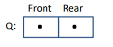

## 5.ΟΥΡΕΣ


• Μια ουρά Q με αντικείμενα τύπου T είναι μια ακολουθία αντικειμένων τύπου T, πάνω στην οποία ορίζονται οι εξής λειτουργίες:
1.	Αρχικοποίηση της ουράς ως κενή ουρά.
2.	Διαπίστωση αν η ουρά είναι κενή ή όχι.
3.	Διαπίστωση αν η ουρά είναι γεμάτη ή όχι.
4.	Εισαγωγή ενός νέου αντικειμένου στην ουρά, στο πίσω μέρος της, εφόσον η ουρά δεν είναι γεμάτη.
5.	Αφαίρεση ενός αντικειμένου από το μπροστινό μέρος της ουράς Q, εφόσον η ουρά δεν είναι κενή.

• Οι ουρές είναι επίσης γνωστές ως λίστες FIFO (πρώτος-εισέρχεται, πρώτος-βγαίνει).
________________________________________

**Αναπαραστάσεις Ουρών**

• Η ADT ουρά μπορεί να υλοποιηθεί χρησιμοποιώντας είτε σειριακές είτε συνδεδεμένες αναπαραστάσεις.

**Αναπαραστάσεις Ουρών Σειριακής Μορφής**

Μπορούμε να χρησιμοποιήσουμε έναν πίνακα όπως παρακάτω:	


 

• Αυτή η αναπαράσταση δεν είναι πολύ βολική.

• Οι θέσεις του πίνακα στα δεξιά θα γεμίσουν μέχρι να υπάρξει χώρος για να το κάνουν, ενώ οι θέσεις στα αριστερά του πίνακα θα αδειάσουν, αλλά δεν θα μπορέσουμε να χρησιμοποιήσουμε αυτόν τον ελεύθερο χώρο.

• Η αναπαράσταση με περιορισμένο χώρο που προτείνεται παρακάτω είναι καλύτερη.


**Αναπαράσταση Κυκλικής Ουράς**

   

• Εάν έχουμε έναν πίνακα Items[0:N-1] και δύο δείκτες Front και Rear, όπως στην προηγούμενη εικόνα, τότε μπορούμε να χρησιμοποιήσουμε τις εξής αναθέσεις για να αυξήσουμε τους δείκτες έτσι ώστε να περιτυλίγονται πάντα μετά την υπέρβαση του υψηλού άκρου του πίνακα.

•	Front = (Front + 1) % N

•	Rear = (Rear + 1) % N

• Ο τελεστής % υπολογίζει το υπόλοιπο της διαίρεσης κατά N, έτσι οι τιμές των Front και Rear παραμένουν πάντα στο διάστημα από 0 έως N-1.


/* This is the file QueueTypes.h */
#define MAXQUEUESIZE 100
typedef int ItemType;
/* the item type can be arbitrary */

```c
/* quetypes.h*/

typedef struct {
    int Count;
    int Front;
    int Rear;
    ItemType Items[MAXQUEUESIZE];
} Queue;

/* This is the file interface.h */

#include "queuetypes.h"
void InitializeQueue(Queue *Q);
int Empty(Queue *Q);
int Full(Queue *Q);
void Insert(ItemType R, Queue *Q);
void Remove(Queue *Q, ItemType *F);


/* This is the file implementation.c */
#include <stdio.h>
#include <stdlib.h>
#include "interface.h"

void InitializeQueue(Queue *Q){
    Q->Count=0;
    Q->Front=0;
    Q->Rear=0;
}

int Empty(Queue *Q) {
    return(Q->Count==0);
}

int Full(Queue *Q){
    return(Q->Count==MAXQUEUESIZE);
}


void Insert(ItemType R, Queue *Q) {
    if (Q->Count==MAXQUEUESIZE){
        printf("attempt to insert item into a full queue");
    } else {
    Q->Items[Q->Rear]=R;
    Q->Rear=(Q->Rear+1)%MAXQUEUESIZE;
    ++(Q->Count);
    }
}
void Remove(Queue *Q, ItemType *F) {
    if (Q->Count==0){
        printf("attempt to remove item from empty queue");
    } else {
        *F=Q->Items[Q->Front];
        Q->Front=(Q->Front+1)%MAXQUEUESIZE;
        --(Q->Count);
    }
}

/*main.c*/

#include <stdio.h>
#include "interface.h"
#include "queuetypes.h"

int main(){
    Queue q;
    InitializeQueue(&q);
    Empty(&q);
    Full(&q);
    Insert(10,&q);
    Insert(11,&q);
    Insert(12,&q);
    Insert(13,&q);
    return 0;

}

```


**Αναπαράσταση ουράς με συνδεδεμένη λίστα**

Σε αυτή την υλοποίηση, αναπαριστούμε μια ουρά με μια δομή (struct) που περιέχει δείκτες στο μπροστινό και πίσω μέρος μιας συνδεδεμένης λίστας κόμβων.

Η αναπαράσταση της ουράς φαίνεται ως εξής:


 
•	Κάθε κόμβος στη λίστα περιέχει δύο πεδία: το στοιχείο της ουράς (Item) και τον δείκτη προς τον επόμενο κόμβο (Link).

•	Ο δείκτης Front δείχνει στον πρώτο κόμβο της λίστας και ο δείκτης Rear δείχνει στον τελευταίο κόμβο.

•	Η ουρά επεκτείνεται δυναμικά καθώς προστίθενται νέα στοιχεία και απομακρύνονται από την αρχή της λίστας.

Η κενή ουρά είναι μια ειδική περίπτωση και αναπαρίσταται από μια δομή της οποίας οι δείκτες του μπροστινού και του πίσω μέρους είναι NULL.
 

•	Όταν η ουρά είναι κενή, οι δείκτες Front και Rear δεν δείχνουν σε κανέναν κόμβο, οπότε και οι δύο δείκτες είναι NULL.




•	Αυτό υποδηλώνει ότι δεν υπάρχουν στοιχεία στην ουρά.

**Ο κώδικας**

```c

/* This is the file types.h */

typedef int ItemType;
/* the item type can be arbitrary */
typedef struct QueueNodeTag {
    ItemType Item;
    struct QueueNodeTag *Link;
} QueueNode;

typedef struct {
    QueueNode *Front;
    QueueNode *Rear;
} Queue;


/* This is the file implementation.c */

#include <stdio.h>
#include <stdlib.h>
#include "types.h"

void InitializeQueue(Queue *Q){
    Q->Front=NULL;
    Q->Rear=NULL;
}
int Empty(Queue *Q) {
    return(Q->Front==NULL);
}
int Full(Queue *Q){
    return(0);
}
/* We assume an already constructed queue */
/* is not full since it can potentially grow */
/* as a linked structure. */

void Insert(ItemType R, Queue *Q){
    QueueNode *Temp;
    Temp=(QueueNode *)malloc(sizeof(QueueNode));
    if (Temp==NULL){
        printf("System storage is exhausted");
    } else {
        Temp->Item=R;
        Temp->Link=NULL;
    }
    
    if (Q->Rear==NULL){ /* this is the case when the queue is empty */
        Q->Front=Temp;
        Q->Rear=Temp;
    } else { /* this is the case when the queue is not empty */
        Q->Rear->Link=Temp;
        Q->Rear=Temp;
    }
}

void Remove(Queue *Q, ItemType *F) {
    QueueNode *Temp;
    if (Q->Front==NULL){
        printf("attempt to remove item from an empty queue");
    } else {
        *F=Q->Front->Item;
        Temp=Q->Front;
        Q->Front=Temp->Link;
        free(Temp);
        if (Q->Front==NULL){
            Q->Rear=NULL;
        }  
    }
}

/*main.c*/

#include <stdio.h>
#include <stdlib.h>
#include "types.h"

int main(void){
    int i,j;
    Queue Q;
    InitializeQueue(&Q);
    for(i=1; i<10; ++i){
        Insert(i, &Q);
    }
    while (!Empty(&Q)){
        Remove(&Q, &j);
        printf("Item %d has been removed.\n", j);
    }
return 0;
}

```

``Ασκήσεις``

1.	Δείξε οπτικά τι συμβαίνει όταν εισάγουμε ένα νέο στοιχείο στην κενή ουρά παρακάτω, εκτελώντας τη λειτουργία "Insert" βήμα προς βήμα, όπως κάναμε στην διάλεξη για τις στοίβες.
2.	Δείξε οπτικά τι συμβαίνει όταν αφαιρούμε ένα στοιχείο από την ουρά παρακάτω εκτελώντας τη λειτουργία "Remove" βήμα προς βήμα, όπως κάναμε στη διάλεξη για τις στοίβες.


_________

**Σύγκριση Αναπαραστάσεων Ουρών Συνδεδεμένων και Σειριακών**

• Η αναπαράσταση της ουράς με σειριακή μορφή είναι κατάλληλη όταν υπάρχει περιορισμός στον αριθμό των στοιχείων της ουράς ανά πάσα στιγμή.
• Η συνδεδεμένη αναπαράσταση είναι κατάλληλη όταν δεν γνωρίζουμε πόσο μεγάλη θα μεγαλώσει η ουρά.

**Ανασκόπηση Απόκρυψης Πληροφορίας**

• Οι προηγούμενοι ορισμοί και υλοποιήσεις της ADT ουράς δεν παρέχουν καλή απόκρυψη πληροφορίας, καθώς τα προγράμματα-πελάτες μπορούν να έχουν πρόσβαση στην αναπαράσταση της ουράς, επειδή το αρχείο QueueTypes.h περιλαμβάνεται στο αρχείο QueueInterface.h.

> Τώρα θα παρουσιάσουμε έναν άλλο τρόπο ορισμού της ADT ουράς, ο οποίος δεν έχει αυτήν την αδυναμία και ταυτόχρονα διατηρεί όλα τα πλεονεκτήματα του προηγούμενου κώδικα, όπως η δυνατότητα ορισμού πολλαπλών ουρών σε ένα πρόγραμμα-πελάτη.

> Στο συγκεκριμένο interface παρακάτω, η δήλωση typedef ορίζει τον τύπο QPointer, ο οποίος είναι ένας χειριστής για μια δομή, της οποίας η ονομασία είναι μόνο "queue".

> Οι λεπτομέρειες αυτής της δομής δίνονται στο αρχείο υλοποίησης και, με αυτόν τον τρόπο, είναι κρυφές από τα προγράμματα-πελάτες.
Οι συναρτήσεις του interface παίρνουν ως παραμέτρους τιμές τύπου QPointer.
________________________________________

**Η Υλοποίηση του Interface**

• Ας δούμε τώρα πώς μπορούμε να υλοποιήσουμε αυτό το interface χρησιμοποιώντας τη συνδεδεμένη αναπαράσταση ουράς που εισαγάγαμε προηγουμένως.

• Το μπροστινό και το πίσω μέρος της ουράς προσπελάζονται τώρα μέσω των μεταβλητών δείκτη head και tail.
 

 
 
 ```c
 /*interface.h*/

 typedef struct queue *QPointer;
typedef int Item;
QPointer QUEUEinit(int maxN);
int QUEUEempty(QPointer);
void QUEUEput(QPointer, Item);
Item QUEUEget(QPointer);


/*implementation.c*/

#include <stdlib.h>
#include <stdlib.h>
#include "interface.h"

typedef struct QUEUEnode* link;

struct QUEUEnode { 
    Item item; 
    link next; 
};
struct queue {
    link head;
    link tail;
};

link NEW(Item item, link next){
    link x = malloc(sizeof *x);
    x->item = item;
    x->next = next;
    return x;
}
QPointer QUEUEinit(int maxN){
    QPointer q = malloc(sizeof *q);
    q->head = NULL;
    q->tail = NULL;
    return q;
}

int QUEUEempty(QPointer q) {
    return q->head == NULL;
}

void QUEUEput(QPointer q, Item item){
    if (q->head == NULL){ 
    q->tail = NEW(item, q->head);
    q->head = q->tail;
    return;
    }
    q->tail->next = NEW(item, q->tail->next);
    q->tail = q->tail->next;
}

Item QUEUEget(QPointer q){
    Item item = q->head->item;
    link t = q->head->next;
    free(q->head);
    q->head = t;
    return item;
}


/*main.c*/

#include <stdio.h>
#include <stdlib.h>
#include "interface.h"
#define M 10

int main(int argc, char *argv[]) {
    int i, j;
    if(argc < 2){
        return 1;

    }
    int N = atoi(argv[1]);
    QPointer queues[M];
    
    // Δημιουργία των M ουρών
    for (i = 0; i < M; i++) {
        queues[i] = QUEUEinit(N);
    }

    // Τοποθέτηση N στοιχείων στις ουρές
    for (i = 0; i < N; i++) {
        QUEUEput(queues[rand() % M], i);
    }

    // Εκτύπωση και αφαίρεση των στοιχείων από τις ουρές
    for (i = 0; i < M; i++, printf("\n")) {
        printf("Queue %d: ", i);
        while (!QUEUEempty(queues[i])) {
            printf("%3d ", QUEUEget(queues[i]));
        }
    }

    return 0;
}
```


* Η υλοποίηση της ουράς που παρουσιάστηκε παραπάνω χρησιμοποιεί μια βοηθητική συνάρτηση NEW για να δεσμεύσει μνήμη για έναν κόμβο της ουράς, να ρυθμίσει τα πεδία του από τα επιχειρήματα της συνάρτησης και να επιστρέψει έναν σύνδεσμο προς τον κόμβο.

**Προσομοίωση Ουράς**

• Ας χρησιμοποιήσουμε τώρα το προηγούμενο interface και την υλοποίηση της ουράς σε ένα πρόγραμμα-πελάτη.

• Το παραπάνω πρόγραμμα-πελάτης προσομοιώνει ένα περιβάλλον με M ουρές, όπου οι πελάτες (μέλη της ουράς) ανατίθενται τυχαία σε μία από αυτές τις ουρές.

**Ανασκόπηση Απόκρυψης Πληροφορίας**

• Παρατηρήστε ότι το προηγούμενο πρόγραμμα-πελάτης δεν μπορεί να έχει πρόσβαση στη δομή που αναπαριστά την ουρά, διότι αυτή η πληροφορία δεν αποκαλύπτεται από το αρχείο του interface QUEUE.h.

• Οι λεπτομέρειες είναι κρυμμένες στην υλοποίηση, η οποία δεν είναι προσβάσιμη από τον πελάτη.
________________________________________
**Χρήση Ουρών**

• Οι ουρές εργασιών χρησιμοποιούνται πολύ σε λειτουργικά συστήματα και δίκτυα (π.χ., ουρά εκτυπωτή).

• Οι ουρές χρησιμοποιούνται επίσης στην προσομοίωση.

• Η θεωρία ουρών είναι ένας κλάδος των μαθηματικών που μελετά τη συμπεριφορά συστημάτων με ουρές.


