# Εισαγωγή στην Ανάλυση Αλγορίθμων  
**Μανώλης Κουμπαράκης**  
**Δομές Δεδομένων και Τεχνικές Προγραμματισμού 1**

---

## Περίληψη

- Πώς μπορούμε να μετρήσουμε και να συγκρίνουμε αλγορίθμους με ουσιαστικό τρόπο;
- Συμβολισμός O (Big-O)
- Ανάλυση μερικών ενδιαφερόντων αλγορίθμων

---

### Εισαγωγή

Πώς μετράμε και συγκρίνουμε αλγορίθμους με ουσιαστικό τρόπο, δεδομένου ότι ο ίδιος αλγόριθμος:

- εκτελείται με διαφορετικές ταχύτητες,  
- και απαιτεί διαφορετικές ποσότητες μνήμης,  
- όταν τρέχει σε διαφορετικούς υπολογιστές ή όταν υλοποιείται σε διαφορετικές γλώσσες προγραμματισμού;

---

### Παράδειγμα

Ας εξετάσουμε έναν αλγόριθμο ταξινόμησης για την ταξινόμηση ενός πίνακα `A[0:n-1]`.


```c

void SelectionSort(InputArray A) {
    int MinPosition, temp, i, j;
    for (i=n-1; i>0; --i){
        MinPosition=i;
        for (j=0; j<i; ++i){
            if (A[j] < A[MinPosition]){
                MinPosition=j;
            }
        }
        temp=A[i];
        A[i]=A[MinPosition];
        A[MinPosition]=temp;
    }
}

```

## Σχόλια

- Ο προηγούμενος αλγόριθμος ταξινομεί τα στοιχεία ενός πίνακα εισόδου `A` σε **φθίνουσα σειρά** χρησιμοποιώντας την τεχνική της **ταξινόμησης με επιλογή** (*selection sort*).
- Ο αλγόριθμος εκτελείται σε βήματα που ελέγχονται από τη **εξωτερική εντολή `for`**. Σε κάθε τέτοιο βήμα, το στοιχείο στη θέση `i` του πίνακα ανταλλάσσεται με το **ελάχιστο στοιχείο** ανάμεσα στα στοιχεία από τη θέση `0` έως τη θέση `i-1`.
- Το **ελάχιστο στοιχείο** υπολογίζεται μέσω της **εσωτερικής εντολής `for`**.
- Οι εντολές ανταλλαγής ξεκινούν από το **τελευταίο στοιχείο** του πίνακα και προχωρούν προς το **πρώτο στοιχείο**.

## Χρόνοι Εκτέλεσης (σε δευτερόλεπτα) για την Ταξινόμηση Πίνακα με 2000 Ακέραιους  
*(γύρω στο έτος 1995 ☺)*

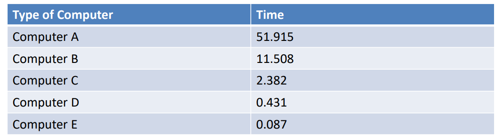

- Στη γλώσσα **C**, μπορούμε να χρησιμοποιήσουμε μια συναρτησιακή βιβλιοθήκη όπως η `clock()` από το `time.h`, για να μετρήσουμε τον **χρόνο CPU** που χρειάζεται για να εκτελεστεί κάποιο μέρος του προγράμματός μας.  
  (Δείτε σχετική συζήτηση: [stackoverflow link](https://stackoverflow.com/questions/459691/best-timing-method-in-c?noredirect=1&lq=1))
  
- Οι υπολογιστές **A, B, ... έως E** είναι προοδευτικά πιο γρήγοροι.

- Ο αλγόριθμος εκτελείται **γρηγορότερα** σε **ταχύτερους υπολογιστές**.


## Επιπλέον Μετρήσεις

- Εκτός από το να δοκιμάσουμε διαφορετικούς υπολογιστές, θα μπορούσαμε να δοκιμάσουμε και **διαφορετικές γλώσσες προγραμματισμού** και **διαφορετικούς μεταγλωττιστές (compilers)**.
- Πρέπει άραγε να βασιστούμε σε όλες αυτές τις μετρήσεις για να αποφασίσουμε αν ένας αλγόριθμος είναι **καλύτερος** από έναν άλλον;

---

## Ένα Πιο Ουσιαστικό Κριτήριο  

- Μπορούμε να παρατηρήσουμε ότι οι αλγόριθμοι συνήθως καταναλώνουν **πόρους** (π.χ. χρόνο και μνήμη) με τρόπο που εξαρτάται από το **μέγεθος του προβλήματος** που καλούνται να λύσουν.
- Συνήθως, όσο **μεγαλύτερο είναι το μέγεθος** του προβλήματος, τόσο **περισσότερους πόρους** καταναλώνει ένας αλγόριθμος.
- Χρησιμοποιούμε συνήθως το **𝑛** για να συμβολίσουμε το **μέγεθος του προβλήματος**.
- Παραδείγματα μεγεθών:
  - Το μήκος μιας λίστας που αναζητείται.
  - Ο αριθμός των στοιχείων σε έναν πίνακα που ταξινομείται.

---

## Χρόνοι Εκτέλεσης του SelectionSort (σε milliseconds)  
**σε δύο τύπους υπολογιστών (πάλι γύρω στο έτος 1995)**  
**(Δομές Δεδομένων και Τεχνικές Προγραμματισμού 8)**


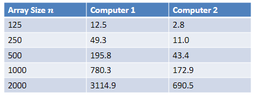


## Δύο Καμπύλες που Προσαρμόζονται στα Προηγούμενα Δεδομένα  

- Αν σχεδιάσουμε αυτά τα νούμερα σε ένα γράφημα και προσπαθήσουμε να προσαρμόσουμε καμπύλες σε αυτά, παρατηρούμε ότι βρίσκονται επάνω στις παρακάτω δύο καμπύλες:

### Καμπύλες:

- 𝑓₁(𝑛) = 0.0007772·𝑛² + 0.00305·𝑛 + 0.001  
- 𝑓₂(𝑛) = 0.0001724·𝑛² + 0.00040·𝑛 + 0.100


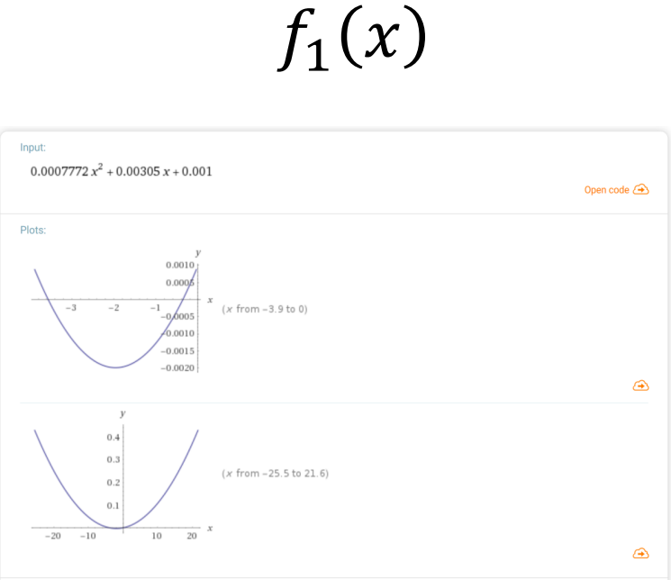

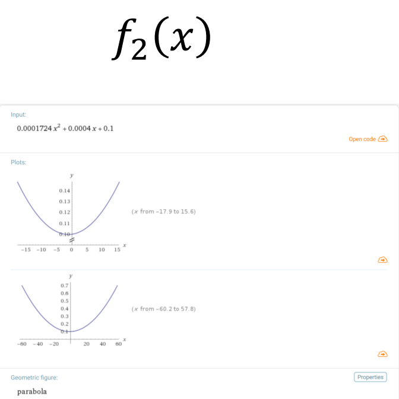

## Συζήτηση  

- Οι καμπύλες στην προηγούμενη διαφάνεια έχουν **τετραγωνική μορφή**:  
  𝑓(𝑛) = 𝑎𝑛² + 𝑏𝑛 + 𝑐.
- Η διαφορά μεταξύ των δύο καμπυλών είναι ότι έχουν **διαφορετικές σταθερές** 𝑎, 𝑏 και 𝑐.
- Ακόμα και αν υλοποιήσουμε τον SelectionSort σε **άλλον υπολογιστή**, με **άλλη γλώσσα προγραμματισμού** και **άλλον μεταγλωττιστή**, η καμπύλη που θα προκύψει θα έχει **την ίδια μορφή**.
- Άρα, παρόλο που οι **συγκεκριμένες μετρήσεις** αλλάζουν υπό διαφορετικές συνθήκες, το **σχήμα της καμπύλης** παραμένει το ίδιο.

---

## Κλάσεις Πολυπλοκότητας  

- Οι χρόνοι εκτέλεσης διαφόρων αλγορίθμων ανήκουν σε **διαφορετικές κλάσεις πολυπλοκότητας**.
- Κάθε κλάση πολυπλοκότητας χαρακτηρίζεται από μια **οικογένεια καμπυλών**.
- Όλες οι καμπύλες μιας δεδομένης κλάσης μοιράζονται το ίδιο **βασικό σχήμα**.
- Το σχήμα αυτό χαρακτηρίζεται από μια **εξίσωση** που δίνει τον χρόνο εκτέλεσης ως **συνάρτηση του μεγέθους του προβλήματος**.

---

## Συμβολισμός O (Big-O)  

- Ο συμβολισμός αυτός χρησιμοποιείται στην **Επιστήμη Υπολογιστών** για να περιγράψει την **χρονική πολυπλοκότητα** ενός αλγορίθμου.
- Για τον **SelectionSort**, η χρονική πολυπλοκότητα είναι:  
  **𝑂(𝑛²)**
- Προκύπτει παίρνοντας τον **κυρίαρχο όρο** `𝑎𝑛²` από την έκφραση `𝑎𝑛² + 𝑏𝑛 + 𝑐` και **αγνοώντας τον συντελεστή** `𝑎`.

---

- Ας εξετάσουμε την εξίσωση:  
  **𝑓(𝑛) = 𝑎𝑛² + 𝑏𝑛 + 𝑐**, με:  
  - 𝑎 = 0.0001724  
  - 𝑏 = 0.0004  
  - 𝑐 = 0.1

### Πίνακας Τιμών:

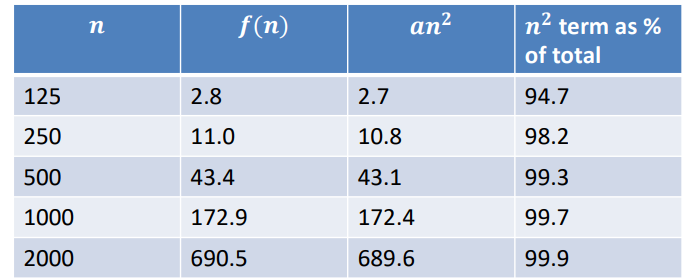


- Συμπεραίνουμε ότι ο **δευτερεύων όρος** `𝑏𝑛 + 𝑐` συμβάλλει **ελάχιστα** στην τιμή της `𝑓(𝑛)`, ακόμα και αν:
  - το `𝑐` είναι **250 φορές μεγαλύτερο** από το `𝑏`, και
  - το `𝑏` είναι **πάνω από δύο φορές μεγαλύτερο** από το `𝑎`.
- Συνεπώς, μπορούμε να **αγνοήσουμε τον δευτερεύοντα όρο**.

- Επιπλέον, αγνοούμε και τη **σταθερά αναλογίας** `𝑎` στον όρο `𝑎𝑛²`, καθώς μας ενδιαφέρει να επικεντρωθούμε στο **γενικό σχήμα της καμπύλης**.
- Η τιμή του `𝑎` θα **διαφέρει ανάλογα με την υλοποίηση** και τον **υπολογιστή** στον οποίο εκτελείται ο αλγόριθμος.


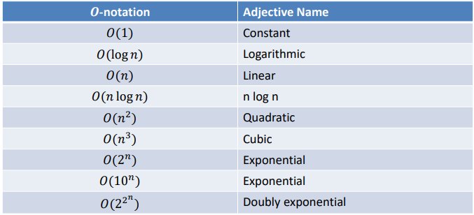


## Σύγκριση Κλάσεων Πολυπλοκότητας

- Ας υποθέσουμε ότι έχουμε έναν αλγόριθμο **Α** που εκτελείται σε έναν υπολογιστή ο οποίος εκτελεί **ένα βήμα αυτού του αλγορίθμου κάθε μικροδευτερόλεπτο**.
- Ας υποθέσουμε ότι **𝑓(𝑛)** είναι ο αριθμός των βημάτων που απαιτούνται από τον αλγόριθμο **Α** για να λύσει ένα πρόβλημα μεγέθους **𝑛**.
- Στη συνέχεια, έχουμε τον παρακάτω πίνακα:


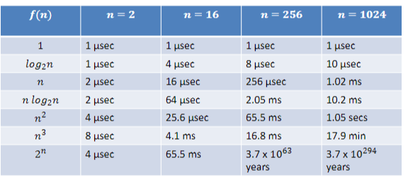

## Μέγεθος του Μεγαλύτερου Προβλήματος που Μπορεί να Λύσει ο Αλγόριθμος A σε Χρόνο 𝑇 ≤ 𝑇

- Αυτός ο πίνακας αφορά το μέγεθος του **μεγαλύτερου προβλήματος** που μπορεί να λύσει ο αλγόριθμος **A** σε **χρόνο 𝑇**, όπου ο χρόνος εκτέλεσης 𝑇 είναι μικρότερος ή ίσος από έναν προκαθορισμένο όριο 𝑇.

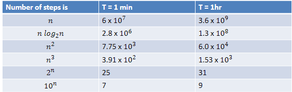


## Συζήτηση Πολυπλοκότητας Χρόνου

- **1**: Αυτή είναι η περίπτωση όταν όλες οι εντολές σε ένα πρόγραμμα εκτελούνται **σταθερό αριθμό φορών**.
  
- **log 𝑛**: Όταν η χρονική πολυπλοκότητα ενός αλγορίθμου είναι **λογαριθμική**, ο αλγόριθμος εκτελείται **λίγο πιο αργά** καθώς το 𝑛 αυξάνεται. Αυτή η πολυπλοκότητα εμφανίζεται σε αλγορίθμους που λύνουν ένα πρόβλημα **μετατρέποντάς το σε σειρά μικρότερων προβλημάτων**, μειώνοντας σε κάθε βήμα το μέγεθος του προβλήματος κατά ένα σταθερό ποσό. Κάθε φορά που το 𝑛 διπλασιάζεται, το **log 𝑛** αυξάνεται μόνο κατά μια σταθερή ποσότητα.

- **𝑛**: Όταν η χρονική πολυπλοκότητα ενός αλγορίθμου είναι **γραμμική**, συνήθως αυτό συμβαίνει όταν ένα μικρό μέρος της επεξεργασίας γίνεται για **κάθε στοιχείο της εισόδου**. Όταν το 𝑛 διπλασιάζεται, ο χρόνος εκτέλεσης του αλγορίθμου διπλασιάζεται κι αυτός. Αυτή η πολυπλοκότητα είναι **βέλτιστη** για έναν αλγόριθμο που πρέπει να επεξεργαστεί **𝑛** εισόδους ή να παραγάγει **𝑛** εξόδους.


- **𝑛 log 𝑛**: Αυτή η χρονική πολυπλοκότητα εμφανίζεται όταν ένας αλγόριθμος λύνει το πρόβλημα **διαιρώντας το σε μικρότερα προβλήματα** και συνδυάζοντας τις μερικές λύσεις. Όταν το 𝑛 διπλασιάζεται, η χρονική πολυπλοκότητα **δεν διπλασιάζεται ακριβώς**, αλλά αυξάνεται λίγο παραπάνω (όχι πολύ περισσότερο).

- **𝑛²**: Όταν η χρονική πολυπλοκότητα είναι **τετραγωνική**, ο αλγόριθμος είναι πρακτικά χρήσιμος **μόνο για μικρά προβλήματα**. Οι τετραγωνικές χρονικές πολυπλοκότητες εμφανίζονται συνήθως σε αλγορίθμους που επεξεργάζονται **ζεύγη στοιχείων του προβλήματος** (π.χ., με δύο εμφωλευμένους βρόχους). Όταν το 𝑛 διπλασιάζεται, ο χρόνος εκτέλεσης αυξάνεται **τέσσερις φορές**.

- **𝑛³**: Παρόμοια, ένας αλγόριθμος που επεξεργάζεται **τριάδες στοιχείων του προβλήματος** (π.χ., συνήθως με τρεις εμφωλευμένους βρόχους) έχει **κυβική** χρονική πολυπλοκότητα. Είναι χρήσιμος μόνο για μικρά μεγέθη προβλημάτων. Όταν το 𝑛 διπλασιάζεται, ο χρόνος εκτέλεσης αυξάνεται **οκτώ φορές**.

- **2ⁿ**: Όταν η χρονική πολυπλοκότητα ενός αλγορίθμου είναι **εκθετική**, ο αλγόριθμος μπορεί να χρησιμοποιηθεί στην πράξη μόνο για **πολύ μικρά μεγέθη προβλημάτων**. Αυτό συνήθως συμβαίνει με αλγορίθμους που λύνουν ένα πρόβλημα με **μέθοδο εξάντλησης**. Όταν το 𝑛 διπλασιάζεται, ο χρόνος εκτέλεσης του αλγορίθμου γίνεται το **τετράγωνο του προηγούμενου χρόνου**.

---

## Γραφική Αναπαράσταση Πολυπλοκότητας Χρόνου  
**Γραμμική vs. Τετραγωνική vs. Κυβική Πολυπλοκότητα Χρόνου**  
*(Διάγραμμα σε Λογαριθμική Κλίμακα)*  
  

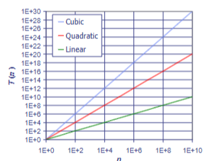

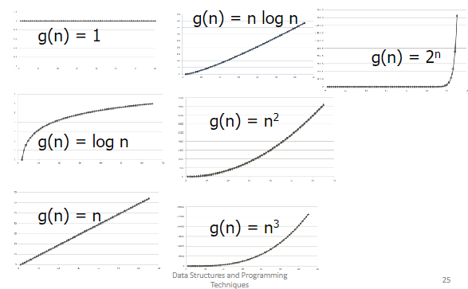

## Περίοδοι Πολυπλοκότητας Χρόνου

- Μπορούμε να εξετάσουμε τις εξής περιπτώσεις:
  - **Χειρότερη περίπτωση (Worst case)**
  - **Καλύτερη περίπτωση (Best case)**
  - **Μέση περίπτωση (Average case)**

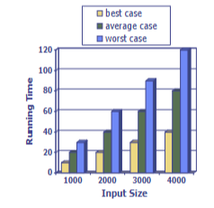

## Σχόλια

- Συνήθως μελετάμε την **χρονική πολυπλοκότητα στην χειρότερη περίπτωση** (worst case), καθώς είναι πιο εύκολο από την μέση περίπτωση και πιο σημαντική για τις εφαρμογές.

---

## Επίσημος Ορισμός του Συμβολισμού 𝑂

- Λέμε ότι **𝑓(𝑛)** είναι **𝑂(𝑔(𝑛))** αν υπάρχουν δύο **θετικές σταθερές** **𝐾** και **𝑛₀** τέτοιες ώστε:  
  **|𝑓(𝑛)| ≤ 𝐾 * 𝑔(𝑛)** για όλα τα **𝑛 ≥ 𝑛₀**.


## Γραφικά (με Κ = c)

- Όταν λέμε **𝑓(𝑛) = 𝑂(𝑔(𝑛))**, αυτό σημαίνει ότι η συνάρτηση **𝑓(𝑛)** μεγαλώνει το πολύ με τον ίδιο ρυθμό ή πιο αργά από τη συνάρτηση **𝑔(𝑛)**, όταν το **𝑛** μεγαλώνει. 
- Γραφικά, αυτό σημαίνει ότι η συνάρτηση **𝑓(𝑛)** είναι πάντα κάτω από την καμπύλη της **𝑔(𝑛)**, με μια σταθερή απόσταση, η οποία καθορίζεται από τη σταθερά **𝐾** (όπου **𝐾 = c**).

  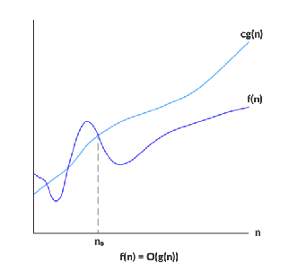

  ## Παράδειγμα Επίσημου Αποδείγματος

- Ας υποθέσουμε ότι ένας αλγόριθμος ταξινόμησης **Α** ταξινομεί μια ακολουθία **𝑛** αριθμών σε αύξουσα σειρά με αριθμό βημάτων:
  - **𝑓(𝑛) = 3 + 6 + 9 + ⋯ + 3𝑛**.
- Θα δείξουμε ότι ο αλγόριθμος εκτελείται σε **𝑂(𝑛²)** βήματα.


- Απόδειξη: Θα βρούμε πρώτα μια κλειστή μορφή για το **𝑓(𝑛)**.

- Παρατηρούμε ότι:  
  **𝑓(𝑛) = 3 + 6 + 9 + ⋯ + 3𝑛 = 3(1 + 2 + ⋯ + 𝑛) = 3 * (𝑛(𝑛+1))/2**.
- Έπειτα, επιλέγοντας **𝐾 = 3**, **𝑛₀ = 1** και **𝑔(𝑛) = 𝑛²**, μπορούμε να δείξουμε ότι για όλα τα **𝑛 ≥ 1**, η παρακάτω ανισότητα ισχύει:
  - **3𝑛(𝑛 + 1)/2 ≤ 3𝑛²**.

- Πολλαπλασιάζοντας και τις δύο πλευρές της παραπάνω ανισότητας με **2/3**, παίρνουμε:  
  **𝑛² + 𝑛 ≤ 2𝑛²**.
- Αφαιρώντας **𝑛²** και από τις δύο πλευρές:  
  **𝑛 ≤ 𝑛²**.
- Διαιρώντας αυτή την ανισότητα με **𝑛** παίρνουμε:  
  **𝑛 ≥ 1**.
- Η απόδειξη ολοκληρώθηκε.

---

## Πρακτικοί Συντομεύσεις για Χειρισμό του Συμβολισμού 𝑂

- Στην πράξη, μπορούμε να χειριστούμε τον συμβολισμό **𝑂** με έναν πιο εύκολο τρόπο, διαχωρίζοντας την έκφραση για το **𝑓(𝑛)** σε έναν **κυρίαρχο όρο** και σε **μικρότερους όρους** και παραλείποντας τους μικρότερους όρους.
- Με άλλα λόγια:  
  **𝑂(𝑓(𝑛)) = 𝑂(𝑑𝑜𝑚𝑖𝑛𝑎𝑛𝑡 𝑡𝑒𝑟𝑚) ± 𝑙𝑒𝑠𝑠𝑒𝑟 𝑡𝑒𝑟𝑚𝑠 = 𝑂(𝑑𝑜𝑚𝑖𝑛𝑎𝑛𝑡 𝑡𝑒𝑟𝑚)**.

## Κλίμακα Δύναμης για τον Συμβολισμό 𝑂

- Μπορούμε να κατατάξουμε τις συνήθεις συναρτήσεις πολυπλοκότητας στην εξής κλίμακα δύναμης, έτσι ώστε να είναι εύκολο να προσδιορίσουμε τον κυρίαρχο όρο και τους μικρότερους όρους:
  - **𝑂(1) < 𝑂(log 𝑛) < 𝑂(𝑛) < 𝑂(𝑛 log 𝑛) < 𝑂(𝑛²) < 𝑂(𝑛³) < 𝑂(2ⁿ) < 𝑂(10ⁿ)**.

---

## Παράδειγμα

- **𝑂(6𝑛³ − 15𝑛² + 3𝑛 log 𝑛) = 𝑂(6𝑛³) = 𝑂(𝑛³)**.
- Ας δούμε γιατί μπορούμε να κάνουμε το παραπάνω. Παρατηρούμε ότι:
  - **6𝑛³ − 15𝑛² + 3𝑛 log 𝑛 < 6𝑛³ + 3𝑛 log 𝑛 < 6𝑛³ + 3𝑛³ < 9𝑛³**.
- Αυτή είναι η ανισότητα που απαιτεί ο ορισμός του συμβολισμού 𝑂 με **𝐾 = 9** και **𝑛 ≥ 1**.

---

## Αγνοώντας τις Βάσεις των Λογαρίθμων

- Όταν χρησιμοποιούμε τον συμβολισμό **𝑂**, μπορούμε να αγνοήσουμε τις βάσεις των λογαρίθμων και να υποθέσουμε ότι όλοι οι λογαρίθμοι είναι με βάση το 2.
- Η αλλαγή της βάσης των λογαρίθμων περιλαμβάνει τον πολλαπλασιασμό με σταθερές, και οι σταθερές αναλογίας αγνοούνται από τον συμβολισμό **𝑂**.
- Για παράδειγμα, **log₁₀ 𝑛 = log₂ 𝑛 / log₂ 10**. Παρατηρήστε ότι το **1 / log₂ 10** είναι μια σταθερά.

---

## 𝑂(1)

- Είναι εύκολο να δούμε γιατί ο συμβολισμός **𝑂(1)** είναι ο σωστός για την πολυπλοκότητα σταθερού χρόνου.
- Υποθέστε ότι μπορούμε να αποδείξουμε ότι ένας αλγόριθμος **Α** εκτελείται σε αριθμό βημάτων **𝑓(𝑛)** που είναι πάντα μικρότερος από **𝐾** βήματα για όλα τα **𝑛**. Τότε, έχουμε:  
  **𝑓(𝑛) ≤ 𝐾 × 1** για όλα τα **𝑛 ≥ 1**. Συνεπώς, το **𝑓(𝑛)** είναι **𝑂(1)**.

---

## Ορισμένοι Αλγόριθμοι και η Πολυπλοκότητά τους

- **Αναζήτηση κατά σειρά (Sequential search)**
- **Δυαδική αναζήτηση (Binary search)**
- **Ταξινόμηση με επιλογή (Selection sort)**
- **Αναδρομική ταξινόμηση με επιλογή (Recursive selection sort)**
- **Πύργοι του Ανόι (Towers of Hanoi)**


## Ανάλυση Αναζήτησης Κατά Σειρά (Sequential Searching)

- Υποθέτουμε ότι έχουμε έναν πίνακα **𝐴[0: 𝑛 − 1]** που περιέχει διακριτά κλειδιά **𝐾𝑖** για **1 ≤ 𝑖 ≤ 𝑛**, και υποθέτουμε ότι το **𝐾𝑖** αποθηκεύεται στη θέση **𝐴[𝑖 − 1]**.
- **Πρόβλημα**: Δίνεται ένα κλειδί **𝐾** και θέλουμε να προσδιορίσουμε τη θέση του στον πίνακα **𝐴[0: 𝑛 − 1]**.


```c
#define n 100
typedef int Key;
typedef Key SearchArray[n];

int SequentialSearch(Key K, SearchArray A){
    int i;
    for (i=0; i<n; ++i){
        if (K==A[i]){
            return i;
        } 
    }
    return(-1);
}
```

## Ανάλυση Πολυπλοκότητας της Αναζήτησης Κατά Σειρά

- Η ποσότητα εργασίας που απαιτείται για να εντοπιστεί το κλειδί **𝐾** εξαρτάται από τη θέση του στον πίνακα **𝐴[0: 𝑛 − 1]**.
- Για παράδειγμα, αν το **𝐾** είναι στο **𝐴[0]**, τότε απαιτείται μόνο μία σύγκριση.
- Γενικά, αν το **𝐾** είναι στο **𝐴[𝑖 − 1]**, τότε απαιτούνται **𝑖** συγκρίσεις.

- **Καλύτερη περίπτωση**: Αυτή είναι όταν το **𝐾** είναι στο **𝐴[0]**. Η πολυπλοκότητα είναι **𝑂(1)**.
- **Χειρότερη περίπτωση**: Αυτή είναι όταν το **𝐾** είναι στο **𝐴[𝑛 − 1]**. Η ποσότητα εργασίας είναι **𝑎𝑛 + 𝑏**, όπου τα **𝑎** και **𝑏** είναι σταθερές. Επομένως, η πολυπλοκότητα είναι **𝑂(𝑛)**.
- **Μέση περίπτωση**: Αν υποθέσουμε ότι κάθε κλειδί έχει την ίδια πιθανότητα να χρησιμοποιηθεί σε μια αναζήτηση, μπορούμε να υπολογίσουμε τον μέσο όρο λαμβάνοντας το σύνολο όλης της εργασίας που απαιτείται για την εύρεση όλων των κλειδιών και διαιρώντας το με **𝑛**.

- Η εργασία που απαιτείται για να βρούμε το **𝑖**-οστό κλειδί **𝐾𝑖** είναι της μορφής **𝑎𝑖 + 𝑏** για κάποια σταθερά **𝑎** και **𝑏**.
  Επομένως:


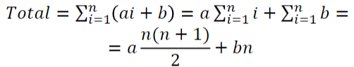

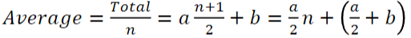

- Επομένως, ο μέσος όρος είναι **𝑂(𝑛)**.

## Ανάλυση Δυαδικής Αναζήτησης

### Προβληματική
- Το πρόβλημα που αντιμετωπίζεται στην δυαδική αναζήτηση είναι η εύρεση της θέσης ενός κλειδιού αναζήτησης **𝐾** σε έναν ταξινομημένο πίνακα **𝐴[0:n-1]** από διακριτά κλειδιά, που είναι διατεταγμένα σε αύξουσα σειρά:
  A[0] < A[1] < ... < A[n-1]


### Βήματα του Αλγορίθμου:
1. Ο αλγόριθμος επιλέγει το κλειδί στο μέσο του πίνακα **A[0:n-1]**, το οποίο βρίσκεται στη θέση **A[Middle]**, όπου:

   Middle=(0+(n-1))/2

2. Συγκρίνεται το κλειδί αναζήτησης **𝐾** με το **A[Middle]**:
   - Αν **𝐾 == A[Middle]**, η αναζήτηση τερματίζει επιτυχώς και επιστρέφει τη θέση.
   - Αν **𝐾 < A[Middle]**, συνεχίζεται η αναζήτηση στα κλειδιά που βρίσκονται αριστερά του **A[Middle]**.
   - Αν **𝐾 > A[Middle]**, συνεχίζεται η αναζήτηση στα κλειδιά που βρίσκονται δεξιά του **A[Middle]**.

## Δυαδική Αναζήτηση με Επαναληπτική Προσέγγιση

```c

int BinarySearch(Key K){
    int L, R, Midpoint;
    /* Initializations */
    L=0;
    R=n-1;
    /* While the interval L:R is non-empty, test key K against the middle key */
    while (L<=R){
        Midpoint=(L+R)/2;
        if (K==A[Midpoint]){
            return Midpoint;
        } else if (K > Midpoint) {
            L=Midpoint+1;
        } else {
            R=Midpoint-1;
        }
    }
    /* If the search interval became empty, key K was not found */
    return -1;
}
```
## Δυαδική Αναζήτηση με αναδρομή

```c

int BinarySearch (Key K, int L, int R){
/* To find the position of the search key K in the subarray
A[L:R]. Note: To search for K in A[0:n-1], the initial call
is BinarySearch(K, 0, n-1) */
    int Midpoint;
    Midpoint=(L+R)/2;
    if (L>R){
        return -1;
    } else if (K==A[Midpoint]){
        return Midpoint;
    } else if (K > A[Midpoint]){
        return BinarySearch(K, Midpoint+1, R);
    } else {
    return BinarySearch(K, L, Midpoint-1);
    }
}
```

# Ανάλυση Πολυπλοκότητας Αναδρομικής Δυαδικής Αναζήτησης

## Εισαγωγή
Ας υπολογίσουμε τον χρόνο εκτέλεσης της αναδρομικής δυαδικής αναζήτησης.

## Υποψήφιοι Στοιχεία
• Ονομάζουμε μια εγγραφή του πίνακα μας υποψήφιο, αν, στο τρέχον στάδιο του αλγορίθμου, δεν μπορούμε να αποκλείσουμε ότι αυτή η εγγραφή έχει κλειδί ίσο με Κ.

## Ανάλυση Εκτέλεσης
• Παρατηρούμε ότι εκτελούνται μια σταθερή ποσότητα πρωτογενών λειτουργιών σε κάθε αναδρομική κλήση της συνάρτησης `BinarySearch`.
• Επομένως, ο χρόνος εκτέλεσης είναι ανάλογος με τον αριθμό των αναδρομικών κλήσεων που πραγματοποιούνται.
• Επιπλέον, ο αριθμός των υποψηφίων στοιχείων μειώνεται τουλάχιστον στο μισό σε κάθε αναδρομική κλήση.

## Πολυπλοκότητα (Συνέχεια)
• Αρχικά, ο αριθμός των υποψηφίων στοιχείων είναι 𝑛. Μετά την πρώτη κλήση της `BinarySearch`, είναι το πολύ 𝑛/2. Μετά τη δεύτερη κλήση, είναι το πολύ 𝑛/4 και ούτω καθεξής.
• Γενικά, μετά την 𝑖-στη κλήση της `BinarySearch`, ο αριθμός των υποψηφίων στοιχείων είναι το πολύ 𝑛/2^𝑖.
• Στην χειρότερη περίπτωση (αποτυχία αναζήτησης), οι αναδρομικές κλήσεις σταματούν όταν δεν υπάρχουν περισσότερα υποψήφια στοιχεία.
Άρα, ο μέγιστος αριθμός των αναδρομικών κλήσεων είναι ο μικρότερος ακέραιος 𝑚 τέτοιος ώστε 𝑛/2^𝑚 < 1.

## Πολυπλοκότητα (Συνέχεια)
• Ισοδύναμα, 2^𝑚 > 𝑛.
• Παίρνοντας λογάριθμο με βάση 2, έχουμε 𝑚 > log 𝑛.
• Άρα, έχουμε 𝑚 = log 𝑛 + 1, που σημαίνει ότι η πολυπλοκότητα της αναδρομικής `BinarySearch` είναι 𝑂(log 𝑛).
• Η πολυπλοκότητα της επαναληπτικής `BinarySearch` είναι επίσης 𝑂(log 𝑛).


## Ταξινόμηση με επιλογή

```c
void SelectionSort(InputArray A) {
    int MinPosition, temp, i, j;
    for (i=n-1; i>0; --i){
        MinPosition=i;
        for (j=0; j<i; ++i){
            if (A[j] < A[MinPosition]){
                MinPosition=j;
            }
        }
        temp=A[i];
        A[i]=A[MinPosition];
        A[MinPosition]=temp;
    }
}
```

# Ανάλυση Πολυπλοκότητας του Αλγορίθμου SelectionSort

## Εισαγωγή
Ας αναλύσουμε την πολυπλοκότητα του αλγορίθμου `SelectionSort`.

## Ανάλυση Εσωτερικής Βρόχου
• Ξεκινάμε από τη δήλωση του εσωτερικού βρόχου. Η δήλωση `if` μέσα στον βρόχο παίρνει μια σταθερή ποσότητα χρόνου 𝑎. Έτσι, ο εσωτερικός βρόχος χρειάζεται 𝑖𝑎 μονάδες χρόνου.

## Ανάλυση Εξωτερικής Βρόχου
• Τώρα, ας εξετάσουμε τον εξωτερικό βρόχο. Οι δηλώσεις μέσα σε αυτόν τον βρόχο, εκτός από τον εσωτερικό βρόχο, χρειάζονται μια σταθερή ποσότητα χρόνου 𝑏. Έτσι, όλες οι δηλώσεις μέσα στον εξωτερικό βρόχο χρειάζονται χρόνο 𝑎𝑖 + 𝑏.

Η εξωτερική για,παίρνει χρόνο: 

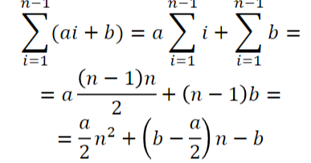

Η χρονική πολυπλοκότητα του αλγορίθμου είναι Ο(n^2)


## Αναδρομική ταξινόμηση με επιλογή

```c

/* FindMin is an auxiliary function used by the Selection sort below */
int FindMin(InputArray A, int n){
    int i,j=n;
    for (i=0; i<n; ++i){
        if (A[i]<A[j]){
            j=i;
        }
        return j;
    } 
}
void SelectionSort(InputArray A, int n){
    int MinPosition, temp;
    if (n>0){
        MinPosition=FindMin(A,n);
        temp=A[n]; A[n]=A[MinPosition]; A[MinPosition]=temp;
        SelectionSort(A, n-1)
    }
}

```
# Ανάλυση του Αναδρομικού Αλγορίθμου SelectionSort

## Εισαγωγή
• Για να χρησιμοποιήσουμε αυτήν την αναδρομική έκδοση του `SelectionSort` για την εκτέλεση της ταξινόμησης στον πίνακα A[0:n-1], καλούμε τη συνάρτηση `SelectionSort(A, n-1)`.

## Ανάλυση της Συνάρτησης `FindMin`
• Το πρώτο πράγμα που πρέπει να κάνουμε είναι να αναλύσουμε τον χρόνο εκτέλεσης της συνάρτησης `FindMin`, η οποία βρίσκει τη θέση του μικρότερου στοιχείου στον πίνακα A[0:n].
• Είναι εύκολο να δούμε ότι ο χρόνος για αυτή τη συνάρτηση είναι 𝑎𝑛 + 𝑏1 για κατάλληλους σταθερούς αριθμούς 𝑎 και 𝑏1.

## Ανάλυση του Αναδρομικού `SelectionSort`
• Τώρα ας αναλύσουμε τον χρόνο εκτέλεσης της αναδρομικής συνάρτησης `SelectionSort`.

• Έστω ότι 𝑇(𝑛) είναι το κόστος, σε μονάδες χρόνου, της κλήσης του `SelectionSort` στον πίνακα A[0:n].

• Το κόστος του `SelectionSort` είναι ως εξής:

```c
if (n>0){
    Cost 𝑎𝑛 + 𝑏1
    Cost 𝑏2
    Cost 𝑇 𝑛 − 1
}
```

# Ανάλυση Αναδρομικής Σχέσης για το SelectionSort

## Αναδρομική Σχέση
• Αν 𝑏 = 𝑏1 + 𝑏2, τότε η εξής αναδρομική σχέση ισχύει για 𝑛 > 0:

𝑇(𝑛) = 𝑎𝑛 + 𝑏 + 𝑇(n - 1)


## Βασική Περίπτωση
• Η βασική περίπτωση αυτής της αναδρομικής σχέσης είναι:

𝑇(0) = 𝑐, όπου 𝑐 είναι το κόστος εκτέλεσης του SelectionSort(A, 0).


## Επίλυση Αναδρομικών Σχέσεων
• Για να λύσουμε τέτοιες αναδρομικές σχέσεις, μπορούμε να χρησιμοποιήσουμε μια μέθοδο που ονομάζεται **ξετύλιγμα (unrolling)**.

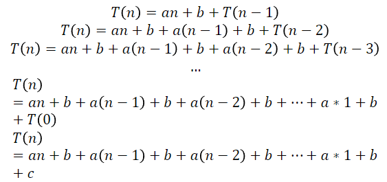

# Αναδιάταξη Όρων στην Αναδρομική Σχέση

## Αναδιάταξη Όρων
Αναδιοργανώνοντας μερικούς από τους όρους ώστε όλοι αυτοί με συντελεστές 𝑎 και 𝑏 να είναι συγκεντρωμένοι μαζί, έχουμε:

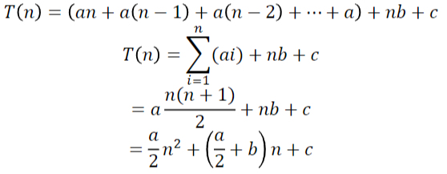

# Συμπέρασμα από την Αναδρομική Σχέση

Επομένως, 𝑇(𝑛), αλλά και 𝑇(𝑛 − 1), είναι 𝑂(𝑛²).

Αυτό δείχνει ότι το συνολικό κόστος του αναδρομικού αλγορίθμου `SelectionSort` είναι τελικά τετραγωνικό σε σχέση με το μέγεθος του πίνακα, δηλαδή 𝑂(𝑛²).

## Πύργοι του Χανοι

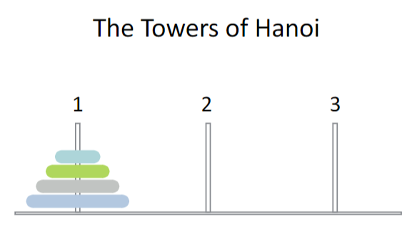

```c
void MoveTowers(int n, int start, int finish, int spare){
    if (n==1){
        printf("Move a disk from peg %ld to peg %ld\n", start,finish);
    } else {
    MoveTowers(n-1, start, spare, finish);
    printf("Move a disk from peg %ld to peg %ld\n", start,finish);
    MoveTowers(n-1, spare, finish, start);
    }
}
```

# Ανάλυση του Παιχνιδιού Πύργοι του Χανόι

## Αναδρομική Σχέση
• Έστω ότι 𝑛 είναι ο αριθμός των δίσκων που πρέπει να μετακινηθούν. Τότε, ο χρόνος εκτέλεσης 𝑇(𝑛) του αλγορίθμου δίνεται από τις εξής αναδρομικές σχέσεις:

𝑇(1) = 𝑎 𝑇(𝑛) = 𝑏 + 2𝑇(𝑛 − 1)


## Επίλυση Αναδρομικών Σχέσεων
• Θα λύσουμε αυτές τις αναδρομικές σχέσεις χρησιμοποιώντας την τεχνική του **ξετυλίγματος (unrolling)** και της **συνάθροισης**.

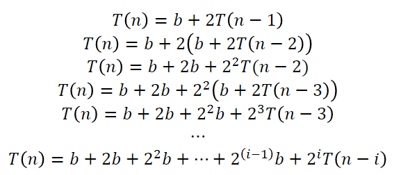

Όταν i = n - 1 τότε:

𝑇 (𝑛 − 𝑖) = 𝑇 (𝑛 − (𝑛 − 1)) = 𝑇 (𝑛 − 𝑛 + 1)= 𝑇 (1) = 𝑎

Επίσης T(n) μπορεί να εκφραστεί ως εξής:

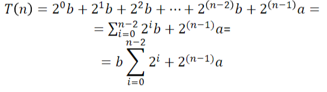


## Γεωμετρική Πρόοδος
Τώρα μπορούμε να δούμε ότι το άθροισμα είναι μια τυπική γεωμετρική πρόοδος. Έτσι, θα χρησιμοποιήσουμε το γεγονός ότι:

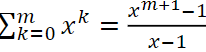

για να συμπεράνουμε το εξής:

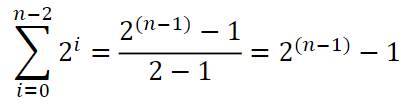

Επίσης,

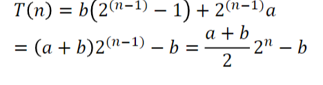

Οπότε T(n) = O(2^n)

# Τι Δεν Μας Λέει η Σημειογραφία 𝑂

## Περιορισμοί της Σημειογραφίας 𝑂
• Η σημειογραφία 𝑂 δεν ισχύει για μικρά μεγέθη προβλημάτων, διότι σε αυτή την περίπτωση οι σταθερές μπορεί να κυριαρχούν στους άλλους όρους.

• Σε αυτή την περίπτωση, μπορεί κανείς να χρησιμοποιήσει πειραματική δοκιμή για να επιλέξει τον καλύτερο αλγόριθμο.

• Η πειραματική δοκιμή είναι επίσης χρήσιμη αν θέλουμε να συγκρίνουμε αλγορίθμους που ανήκουν στην ίδια κλάση πολυπλοκότητας.


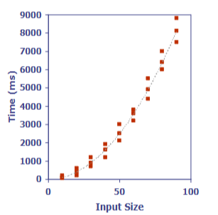

