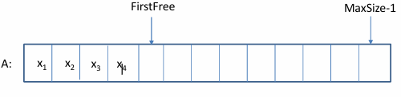
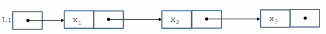
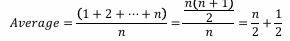
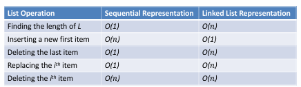
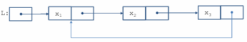
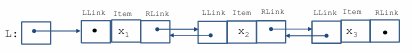
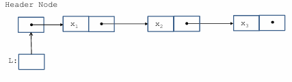
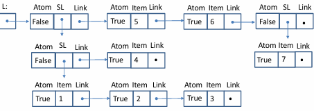
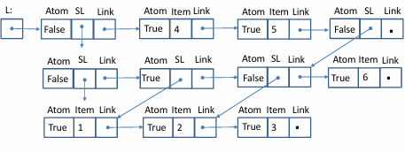

# ADT Λίστας

• Μια λίστα L από στοιχεία τύπου T είναι μια ακολουθία στοιχείων τύπου T στα οποία ορίζονται οι εξής λειτουργίες:
  - Αρχικοποίηση της λίστας L ως κενή λίστα.
  - Έλεγχος αν η λίστα L είναι κενή ή όχι.
  - Εύρεση του μήκους μιας λίστας L (όπου το μήκος της L είναι ο αριθμός των στοιχείων στη λίστα και το μήκος της κενής λίστας είναι 0).
  - Επιλογή του 𝑖-οστού στοιχείου μιας λίστας L, όπου 1 ≤ 𝑖 ≤ μήκος(L).
  - Αντικατάσταση του 𝑖-οστού στοιχείου X μιας λίστας L με ένα νέο στοιχείο Y όπου 1 ≤ 𝑖 ≤ μήκος(L).
  - Διαγραφή οποιουδήποτε στοιχείου X από μια μη κενή λίστα L.
  - Εισαγωγή ενός νέου στοιχείου X σε μια λίστα L σε οποιαδήποτε αυθαίρετη θέση (όπως πριν από το πρώτο στοιχείο της L, μετά το τελευταίο στοιχείο της L ή ανάμεσα σε οποιαδήποτε δύο στοιχεία της L).

## Λίστες

• Οι λίστες είναι πιο γενικοί τύποι κοντέινερ από τις στοίβες και τις ουρές.

• Οι λίστες μπορούν να αναπαριστώνται με σειριακές αναπαραστάσεις και συνδεδεμένες αναπαραστάσεις.

# Σειριακές Αναπαραστάσεις Λίστας

• Μπορούμε να χρησιμοποιήσουμε έναν πίνακα A[0:MaxSize-1] όπως φαίνεται γραφικά (τα στοιχεία αποθηκεύονται συνεχόμενα).




# Πλεονεκτήματα και Μειονεκτήματα

## Πλεονεκτήματα:
- Γρήγορη πρόσβαση στο 𝑖-οστό στοιχείο της λίστας σε χρόνο O(1).

## Μειονεκτήματα:
- Οι εισαγωγές και οι διαγραφές μπορεί να απαιτούν μετακίνηση όλων των στοιχείων, δηλαδή, ένα κόστος O(n) κατά μέσο όρο.
- Το μέγεθος του πίνακα πρέπει να είναι γνωστό εκ των προτέρων. Έτσι, αν έχουμε μικρό μέγεθος, διατρέχουμε τον κίνδυνο υπερχείλισης και αν έχουμε μεγάλο μέγεθος, θα σπαταλάμε χώρο.

# Αναπαράσταση Μονοκατευθυνόμενων Συνδεδεμένων Λιστών

• Μπορούμε να χρησιμοποιήσουμε αλυσίδες συνδεδεμένων κόμβων όπως φαίνεται παρακάτω:



# Υπολογιστική Πολυπλοκότητα

• Υποθέτουμε ότι η λίστα L έχει 𝑛 στοιχεία.

• Η πολυπλοκότητα του χρόνου στην χειρότερη περίπτωση για τον προηγούμενο αλγόριθμο είναι 𝑂(𝑛). Αυτό συμβαίνει όταν προσπαθούμε να προσπελάσουμε το τελευταίο στοιχείο της λίστας ή όταν το στοιχείο δεν βρίσκεται στη λίστα.

• Εάν είναι εξίσου πιθανό να προσπελαστεί οποιοδήποτε από τα 𝑛 στοιχεία της λίστας, τότε ο μέσος αριθμός δεικτών που ακολουθούμε για να προσπελάσουμε το 𝑖-οστό στοιχείο είναι:





• Επομένως, η μέση πολυπλοκότητα χρόνου για να προσπελάσουμε το 𝑖-οστό στοιχείο είναι επίσης 𝑂(𝑛).

• Αυτοί οι περιορισμοί πολυπλοκότητας ισχύουν επίσης για την εισαγωγή πριν ή μετά το 𝑖-οστό στοιχείο, ή για τη διαγραφή ή την αντικατάστασή του.



O παραπάνω πίνακας δίνει την πολυπλοκότητα χρόνου στην χειρότερη περίπτωση. Η μέση περίπτωση είναι η ίδια.

## Άλλες Αναπαραστάσεις Συνδεδεμένων Λιστών

• Κυκλικές συνδεδεμένες λίστες  
• Διπλής κατεύθυνσης συνδεδεμένες λίστες  
• Συνδεδεμένες λίστες με κόμβους επικεφαλίδας και ουράς

# Κυκλικές Συνδεδεμένες Λίστες

• Μια κυκλική συνδεδεμένη λίστα σχηματίζεται όταν ο σύνδεσμος στον τελευταίο κόμβο μιας μονοκατευθυνόμενης συνδεδεμένης λίστας δείχνει πίσω στον πρώτο κόμβο.

• Το πλεονέκτημα μιας κυκλικής συνδεδεμένης λίστας είναι ότι οποιοσδήποτε κόμβος σε αυτήν είναι προσπελάσιμος από οποιονδήποτε άλλο κόμβο.



Στην ουσία, δεν υπάρχει πρώτος ή τελευταίος κόμβος σε μια κυκλική λίστα. Υπάρχει μόνο ένας δείκτης που μας επιτρέπει να προσπελάσουμε τα στοιχεία της λίστας, ο οποίος ονομάζεται κέρσορας (δείκτης L παραπάνω).

# Διπλής Κατεύθυνσης Συνδεδεμένες Λίστες

• Οι διπλής κατεύθυνσης συνδεδεμένες λίστες σχηματίζονται από κόμβους που έχουν δείκτες προς τους δεξιούς και αριστερούς γείτονές τους στη λίστα.




• Δεδομένου ενός δείκτη σε έναν κόμβο N σε μια διπλής κατεύθυνσης συνδεδεμένη λίστα, μπορούμε να ακολουθήσουμε τους συνδέσμους σε οποιαδήποτε κατεύθυνση για να προσπελάσουμε άλλους κόμβους.

# Συνδεδεμένες Λίστες με Κόμβους Επικεφαλίδας

• Κάποιες φορές είναι βολικό να έχουμε έναν ειδικό κόμβο επικεφαλίδας που δείχνει στον πρώτο κόμβο μιας συνδεδεμένης λίστας που περιέχει κόμβους δεδομένων.




• Οι κόμβοι επικεφαλίδας μπορούν να χρησιμοποιηθούν για να κρατούν πληροφορίες, όπως τον αριθμό των κόμβων στη λίστα κ.λπ.  
• Μπορούμε επίσης να έχουμε έναν κόμβο ουράς.

# Γενικευμένες Λίστες

• Μια γενικευμένη λίστα είναι μια λίστα στην οποία τα μεμονωμένα στοιχεία της λίστας επιτρέπεται να είναι υπολίστες.  
• Παράδειγμα: (a1, a2, (b1, (c1, c2), b3), a4, (d1, d2), a6)  
• Εάν ένα στοιχείο της λίστας δεν είναι υπολίστα, λέγεται ότι είναι ατομικό.  
• Οι γενικευμένες λίστες μπορούν να αναπαριστώνται με σειριακές ή συνδεδεμένες αναπαραστάσεις.

Η γενικευμένη λίστα L=(((1, 2, 3), 4), 5, 6, (7)) μπορεί να αναπαρασταθεί χωρίς κοινές υπολίστες ως εξής:



 Η γενικευμένη λίστα L=(((1, 2, 3), (1, 2, 3), (2, 3), 6), 4, 5, ((2, 3), 6)) μπορεί να αναπαρασταθεί με κοινές υπολίστες ως εξής:




# Ερώτηση
• Ποιον τύπο δεδομένων C μπορούμε να χρησιμοποιήσουμε για να αναπαραστήσουμε μια γενικευμένη λίστα;

```c
 typedef struct GenListTag {
    GenListTag *Link;
    int Atom;
    union SubNodeTag {
        ItemType Item;
        struct GenListTag *Sublist;
    } SubNode;
} GenListNode;

void PrintList(GenListNode *L){   
    GenListNode *G;
    printf("(");
    G=L;
    while (G != NULL){
        if (G->Atom){
            printf("%d", G->SubNode.Item);
        } else {
            printList(G->SubNode.SubList);
        }
        if (G->Link != NULL)printf(",");
            G=G->Link;
    }
    printf("");
}

```
# Εφαρμογές Γενικευμένων Λιστών

• Οι ιστορικές γλώσσες προγραμματισμού Τεχνητής Νοημοσύνης LISP και Prolog προσφέρουν τις γενικευμένες λίστες ως κατασκευή της γλώσσας.

• Οι γενικευμένες λίστες χρησιμοποιούνται συχνά σε εφαρμογές Τεχνητής Νοημοσύνης.

• Η Python προσφέρει επίσης τις γενικευμένες λίστες ως κατασκευή της γλώσσας.

• Περισσότερα στις μαθήματα “Τεχνητή Νοημοσύνη” και “Λογικός Προγραμματισμός”.
