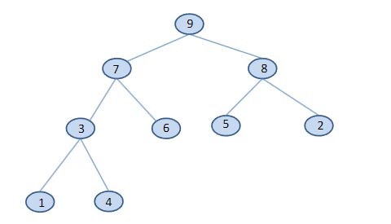
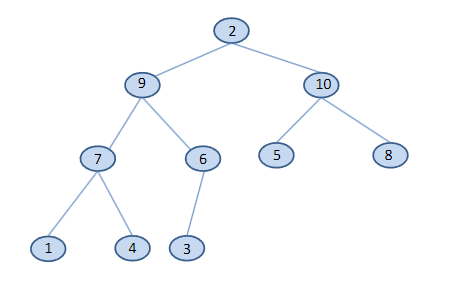
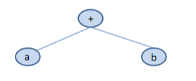

---

# Επίσημος Ορισμός Δένδρου

- Ένα (ριζωμένο) δένδρο **Τ** είναι ένα σύνολο κόμβων που αποθηκεύουν στοιχεία σε σχέση γονέα-παιδιού, με τις εξής ιδιότητες:
  - Αν **Τ** δεν είναι κενό, τότε έχει έναν ειδικό κόμβο, που ονομάζεται **ρίζα** του **Τ**, ο οποίος δεν έχει γονέα.
  - Κάθε κόμβος **v** του **Τ**, διαφορετικός από τη ρίζα, έχει έναν μοναδικό γονέα **w**. Κάθε κόμβος με γονέα **w** είναι παιδί του **w**.

- Το κενό δένδρο είναι αυτό που δεν έχει καθόλου κόμβους.
- Μία ακμή (edge) του δένδρου **Τ** είναι ένα ζεύγος κόμβων (**u**, **v**) τέτοιο ώστε **u** είναι γονέας του **v**, ή το αντίστροφο.
- Μία ακολουθία κόμβων που συνδέονται με ακμές ονομάζεται **μονοπάτι**. Το μήκος του μονοπατιού είναι ο αριθμός των ακμών του.

---


### Σχέσεις Κόμβων

- Αν κατεβούμε κατά μήκος των ακμών που ξεκινούν από έναν κόμβο (π.χ. **R**), φτάνουμε στα παιδιά του (**S** και **T**).
- Δύο κόμβοι που έχουν τον ίδιο γονέα λέγονται **αδέλφια**.
- **Απόγονοι** ενός κόμβου είναι όλοι οι κόμβοι που μπορούμε να φτάσουμε κατεβαίνοντας μονοπάτια από αυτόν.
- Αν ανεβούμε από έναν κόμβο (π.χ. **S**), βρίσκουμε τον γονέα του (**R**).
- **Πρόγονοι** ενός κόμβου είναι όλοι οι κόμβοι που μπορούμε να φτάσουμε ανεβαίνοντας προς τη ρίζα.
- Κάθε κόμβος είναι **πρόγονος και απόγονος του εαυτού του**.
- Κόμβος χωρίς παιδιά ονομάζεται **φύλλο** ή **εξωτερικός κόμβος**.
- Κόμβος με παιδιά ονομάζεται **εσωτερικός κόμβος**.
- Η ρίζα μπορεί να είναι εσωτερικός ή εξωτερικός κόμβος, ανάλογα αν έχει παιδιά ή όχι.

---

# Ορολογία (συνέχεια)

- Οι κόμβοι ενός δένδρου μπορούν να οργανωθούν σε **επίπεδα**:
  - Η ρίζα βρίσκεται στο επίπεδο 0.
  - Τα παιδιά της ρίζας στο επίπεδο 1.
  - Τα παιδιά αυτών στο επίπεδο 2, και ούτω καθεξής.
- Συχνά χρησιμοποιείται η λέξη **βάθος** (depth) αντί για επίπεδο.
- Σε ένα δένδρο υπάρχει **ακριβώς ένα μονοπάτι** από τη ρίζα **R** προς κάθε απόγονό της.
- Το μήκος του μονοπατιού από τη ρίζα μέχρι έναν κόμβο είναι ίσο με το βάθος του κόμβου.
- Το **ύψος** του δένδρου είναι το μεγαλύτερο βάθος που έχει οποιοσδήποτε κόμβος.

---

## Χωρική Ορολογία

- Μπορούμε να χρησιμοποιούμε χωρικούς όρους όπως:
  - **αριστερό παιδί**, **δεξί παιδί**, ή **μεσαίο παιδί** για να αναφερθούμε στη θέση των παιδιών.

---

## Υποδένδρα και Ταξινόμηση

- Το **υποδένδρο** του **Τ** που έχει ρίζα έναν κόμβο **v** είναι το δένδρο που αποτελείται από όλους τους απογόνους του **v**, συμπεριλαμβανομένου του ίδιου του **v**.
- Ένα δένδρο λέγεται **ταξινομημένο (ordered)** αν υπάρχει γραμμική διάταξη των παιδιών κάθε κόμβου (π.χ. πρώτο παιδί, δεύτερο παιδί κ.λπ.).
- Ταξινομημένα δένδρα συνήθως σχεδιάζονται με τα αδέλφια τοποθετημένα από αριστερά προς τα δεξιά, σύμφωνα με τη σειρά τους.

---

# Πρόταση

- Έστω **Τ** ένα δένδρο με **n** κόμβους, και έστω **cp** ο αριθμός των παιδιών ενός κόμβου **p** του **T**.
- Τότε ισχύει:  
  
  


---

## Απόδειξη

- Κάθε κόμβος του **Τ**, εκτός από τη ρίζα, είναι παιδί κάποιου άλλου κόμβου και συνεπώς συνεισφέρει **μία μονάδα** στο άθροισμα παραπάνω.
- Εφόσον υπάρχουν **n - 1** τέτοιοι κόμβοι (όλοι εκτός από τη ρίζα), το συνολικό άθροισμα των παιδιών είναι **n − 1**.

---

# Δυαδικά Δένδρα

- Ένα **δυαδικό δένδρο** είναι ένα δένδρο στο οποίο:
  - Κάθε κόμβος έχει **το πολύ δύο παιδιά** και αποθηκεύει ένα αντικείμενο.
  - Κάθε παιδί χαρακτηρίζεται ως είτε **αριστερό παιδί** είτε **δεξί παιδί**.
  - Το **αριστερό παιδί προηγείται** του δεξιού στην διάταξη των παιδιών του κόμβου.

---

## Αναδρομικός Ορισμός

- Ένα δυαδικό δένδρο είναι είτε:
  - Το **κενό δένδρο**, είτε
  - Αποτελείται από:
    - Έναν κόμβο **r**, που ονομάζεται **ρίζα** του **T** και αποθηκεύει ένα αντικείμενο.
    - Ένα δυαδικό δένδρο, που ονομάζεται **αριστερό υποδένδρο** του **T**.
    - Ένα δυαδικό δένδρο, που ονομάζεται **δεξί υποδένδρο** του **T**.


# Πλήρη Δυαδικά Δένδρα

- Ένα δυαδικό δένδρο ύψους **h** είναι **πλήρες δυαδικό δένδρο** (complete binary tree) αν τα επίπεδα **0, 1, 2, ..., h − 1** έχουν **τον μέγιστο δυνατό αριθμό κόμβων**.
  - Δηλαδή, το επίπεδο **i** έχει **2^i** κόμβους, για **0 ≤ i ≤ h − 1**.
  - Οι κόμβοι στο επίπεδο **h** (το τελευταίο επίπεδο) το γεμίζουν **από αριστερά προς τα δεξιά**.

---

## Περιγραφή

- Με άλλα λόγια, σε ένα πλήρες δυαδικό δένδρο:
  - Τα φύλλα βρίσκονται είτε **σε ένα μόνο επίπεδο**, είτε σε **δύο διαδοχικά επίπεδα**.
  - Τα φύλλα στο **χαμηλότερο επίπεδο** τοποθετούνται όσο πιο **αριστερά γίνεται**.
  - Όλα τα επίπεδα, **εκτός πιθανώς του τελευταίου**, είναι **πλήρως συμπληρωμένα** με κόμβους.


# Γνήσια Δυαδικά Δένδρα

- Ένα δυαδικό δένδρο ονομάζεται **γνήσιο** ή **πλήρες** (proper or full binary tree) αν **κάθε κόμβος έχει είτε μηδέν είτε δύο παιδιά**.
- Ένα δυαδικό δένδρο που **δεν είναι γνήσιο** ονομάζεται **μη γνήσιο** (improper).
- Σε ένα γνήσιο δυαδικό δένδρο, **κάθε εσωτερικός κόμβος** έχει **ακριβώς δύο παιδιά**.


# Επεκταμένα Δυαδικά Δένδρα

- Συχνά, βλέπουμε ένα δυαδικό δένδρο ως **μη κενό γνήσιο δυαδικό δένδρο**. Σε αυτή την περίπτωση, σχεδιάζουμε κάθε εσωτερικό κόμβο ενός δυαδικού δένδρου με **ακριβώς δύο παιδιά**. Κάθε εξωτερικός κόμβος είναι ειδικός: δεν έχει παιδιά και αναπαριστάται με **σύμβολο τετραγώνου**.
- Στη βιβλιογραφία, ο όρος **επέκταμένο δυαδικό δένδρο** (extended binary tree) χρησιμοποιείται για αυτή την περίπτωση.
- Αυτή η άποψη των δυαδικών δένδρων απλοποιεί τον προγραμματισμό των λειτουργιών αναζήτησης και ενημέρωσης (σε μια συνδεδεμένη αναπαράσταση του δένδρου, οι εξωτερικοί κόμβοι αναπαρίστανται από **null συνδέσμους**), καθώς και τη διατύπωση σχετικών θεωρητικών αποτελεσμάτων.
- Αυτή η άποψη διευκρινίζει επίσης περιπτώσεις όπου ένας κόμβος έχει **ένα παιδί**, όσον αφορά το αν είναι αριστερό ή δεξί.


# Διάταξη Επιπέδου των Κόμβων σε Δένδρο

- Αν αριθμήσουμε τους κόμβους ενός δένδρου επίπεδο προς επίπεδο και, σε κάθε επίπεδο, κινούμενοι από **αριστερά προς τα δεξιά**, τότε έχουμε την **διάταξη επιπέδου** (level order) των κόμβων του δένδρου.


# Κόμβοι σε Πλήρη Δυαδικά Δένδρα

- **Ερώτηση**: Πόσους κόμβους έχει ένα πλήρες δυαδικό δένδρο σε κάθε επίπεδο;

---

## Απάντηση:

- Ακριβώς **2^0 = 1** στο επίπεδο 0.
- Ακριβώς **2^1 = 2** στο επίπεδο 1.
- Ακριβώς **2^2 = 4** στο επίπεδο 2.
- ...
- Ακριβώς **2^(h−1)** στο επίπεδο **h − 1**.
- Τουλάχιστον 1 και το πολύ **2^h** στο επίπεδο **h**, όπου **h** είναι το ύψος του δένδρου.

---

# Ιδιότητες Δυαδικών Δένδρων

- Έστω **T** ένα μη κενό δυαδικό δένδρο, και έστω **n**, **n_I**, **n_E** και **h** ο αριθμός των κόμβων, ο αριθμός των εσωτερικών κόμβων, ο αριθμός των εξωτερικών κόμβων και το ύψος του δένδρου, αντίστοιχα.
- Τότε το **T** έχει τις εξής ιδιότητες:


# Απόδειξη

- Ας αποδείξουμε πρώτα την **(2)**.
  - Ο κάτω φράκτης είναι εύκολο να φανεί, καθώς το πιο απλό μη κενό δυαδικό δένδρο έχει **έναν μόνο κόμβο**, τη ρίζα.
  - Ο άνω φράκτης επιτυγχάνεται όταν κάθε κόμβος σε κάθε επίπεδο του δένδρου έχει **ακριβώς δύο παιδιά**.

- Ας αποδείξουμε τώρα την **(3)**. 

    - Η περίπτωση που μας δίνει τον κάτω φράκτη είναι ένα δένδρο όπως το εξής, όπου οι εσωτερικοί κόμβοι είναι **h** στον αριθμό:


# Απόδειξη (συνέχεια)

- Το δένδρο που μας δίνει τον άνω φράκτη είναι όταν κάθε κόμβος σε κάθε επίπεδο του δένδρου έχει **ακριβώς δύο παιδιά**. Σε αυτή την περίπτωση, ο αριθμός των **εσωτερικών κόμβων** είναι:


- Για να αποδείξουμε την **(1)**, απλώς προσθέτουμε τις ανισότητες της **(2)** και **(3)**.

- Για να αποδείξουμε την **(4)**, αναδιατυπώνουμε την **(1)** και στη συνέχεια παίρνουμε τους **λογαρίθμους** κάθε όρου.

# Ιδιότητες Δυαδικών Δένδρων (συνέχεια)

- Επίσης, αν το **T** είναι **γνήσιο** (proper), τότε έχει τις εξής ιδιότητες:


# Απόδειξη (συνέχεια)

- Οι κάτω φράκτες των **(2)** και **(3)** φαίνονται από το εξής δένδρο το οποίο έχει **h** εσωτερικούς κόμβους και **h + 1** εξωτερικούς κόμβους:


---

- Οι άνω φράκτες για **(2)** και **(3)** φαίνονται από την προηγούμενη πρόταση, καθώς τα δένδρα που χρησιμοποιούνται στις αποδείξεις εκεί είναι **γνήσια**.
- Οι **(1)** και **(4)** μπορούν να αποδειχθούν όπως στην προηγούμενη πρόταση.

---

- Μπορούμε να αποδείξουμε την **(5)** χρησιμοποιώντας **μαθηματική επαγωγή**.

---

### Βασική περίπτωση:
- Θεωρούμε ένα δένδρο που αποτελείται από έναν μόνο κόμβο ρίζας.
- Σε αυτή την περίπτωση έχουμε **1 εξωτερικό κόμβο** και **0 εσωτερικούς κόμβους**, επομένως η σχέση ισχύει.

---

### Βήμα επαγωγής:
- Ας υποθέσουμε ότι έχουμε ένα δένδρο με δύο ή περισσότερους κόμβους.
- Στη συνέχεια, η ρίζα έχει **δύο υποδένδρα**. Δεδομένου ότι αυτά τα υποδένδρα είναι μικρότερα από το αρχικό δένδρο, μπορούμε να υποθέσουμε ότι ικανοποιούν τη σχέση.
- Έτσι, κάθε υποδένδρο έχει **ένα εξωτερικό κόμβο παραπάνω από τους εσωτερικούς κόμβους**.
- Μεταξύ των δύο αυτών υποδένδρων, υπάρχουν **δύο περισσότερα εξωτερικά κόμβοι από τους εσωτερικούς κόμβους**.
- Όμως η ρίζα είναι **εσωτερικός κόμβος**.
- Έτσι, συνολικά, έχουμε **ένα εξωτερικό κόμβο παραπάνω από τους εσωτερικούς κόμβους**.


# Πώς μπορώ να αναπαραστήσω ένα δυαδικό δένδρο


# Αναπαράσταση Δυαδικού Δένδρου σε Ακολουθιακή Μορφή

- Αν ένα πλήρες δυαδικό δένδρο έχει **n** κόμβους, τότε η **συνεχόμενη ακολουθιακή αναπαράστασή** του είναι ένας πίνακας **A[0:n]** ως εξής (για το προηγούμενο παράδειγμα, **n=12**).
- Σημειώστε ότι ο πίνακας αποθηκεύει τις πληροφορίες για τους κόμβους του δένδρου χρησιμοποιώντας τη **διάταξη επιπέδου**.


- Η ακολουθιακή αναπαράσταση μπορεί να χρησιμοποιηθεί και στην περίπτωση που ένα δυαδικό δένδρο δεν είναι πλήρες.
- Σε αυτή την περίπτωση, θα υπάρχουν κενά κελιά στον αντίστοιχο πίνακα, οπότε τέτοιου είδους αναπαράσταση μπορεί να είναι σπατάλη χώρου.

---

# Πώς να βρω τους κόμβους


# Σωροί (Heaps)

- Ένας **σωρός** (heap) είναι ένα πλήρες δυαδικό δένδρο με τιμές αποθηκευμένες στους κόμβους του, έτσι ώστε κανένα παιδί να μην έχει τιμή μεγαλύτερη από την τιμή του γονέα του (δηλαδή, η τιμή του γονέα κάθε κόμβου είναι μεγαλύτερη ή ίση από την τιμή του κόμβου αυτού).
- Κάποιοι συγγραφείς αναφέρουν αυτόν τον σωρό ως **σωρό μεγίστων** (max-heap).
- Μπορούμε επίσης να ορίσουμε έναν **σωρό ελαχίστων** (min-heap) όταν η σχέση μεταξύ της τιμής του γονέα και της τιμής του παιδιού του είναι "μικρότερη ή ίση".


# Σωροί και Ουρές Προτεραιότητας

- Ένας **σωρός** παρέχει μια αναπαράσταση για μια **ουρά προτεραιότητας**.
- Υπενθύμιση: Μια **ουρά προτεραιότητας** είναι ένας **ADT** (Abstract Data Type) με την ιδιότητα ότι τα στοιχεία αφαιρούνται με τη σειρά από τη μεγαλύτερη προς τη μικρότερη προτεραιότητα, ανεξαρτήτως της σειράς με την οποία εισήχθησαν.
- Αν χρησιμοποιείται ένας σωρός για να αναπαραστήσει μια ουρά προτεραιότητας, είναι εύκολο να βρούμε το στοιχείο με τη μεγαλύτερη προτεραιότητα, καθώς βρίσκεται στη ρίζα του δένδρου.
- Αν αφαιρέσουμε την τιμή από τη ρίζα, πρέπει να αναδομήσουμε το δένδρο έτσι ώστε να είναι πάλι σωρός.

---

# Αναδιάρθρωση του Δένδρου

- Ο αλγόριθμος για την αναδιάρθρωση του δένδρου είναι ο εξής:

  1. Διαγράφουμε το δεξιότερο φύλλο στη χαμηλότερη γραμμή (δηλαδή, το τελευταίο φύλλο στην διάταξη επιπέδου).
  2. Τοποθετούμε την τιμή του διαγραμμένου κόμβου στο κόμβο της ρίζας.
  3. Αποκαθιστούμε την ιδιότητα του σωρού στο δένδρο ξεκινώντας από τον κόμβο της ρίζας και επαναλαμβάνοντας την ανταλλαγή της τιμής του με τη μεγαλύτερη τιμή των παιδιών του, μέχρι να μην είναι δυνατές άλλες ανταλλαγές.


**Παράδειγμα**


Ας αποκαταστήσουμε την ιδιότητα του σωρού στο παρακάτω δένδρο.


Διαγράφουμε τον κόμβο με τιμή **3** και εισάγουμε αυτή την τιμή στη ρίζα.


**Ανταλλαγή 3 με 9**.

 


 **Ανταλλαγή 3 με 7**.

  


 **Ανταλλαγή 3 με 4**.


 Το παραπάνω δένδρο έχει αποκατασταθεί με την ιδιότητα του σωρού.


# Στοίβαξη ενός Πλήρους Δυαδικού Δένδρου (Heapifying)

Για να οργανώσουμε τις τιμές στους κόμβους ενός αρχικά ακατάστατου πλήρους δυαδικού δένδρου **H** σε σωρό, ακολουθούμε τα εξής βήματα (αλγόριθμος στοίβαξης) για κάθε εσωτερικό κόμβο του **H** σε αντίστροφη διάταξη επιπέδου.

1. Έστω **Ν** ένας κόμβος με τιμή **V**.
2. Αν ο **Ν** δεν έχει παιδιά, τότε δεν κάνουμε τίποτα.
3. Αν ο **Ν** έχει παιδιά, τότε επιλέγουμε το παιδί **M** με τη μεγαλύτερη τιμή **V1**.
4. Αν **V ≥ V1**, τότε δεν κάνουμε τίποτα. 
5. Αν **V < V1**, τότε ανταλλάσσουμε τις τιμές **V1** και **V**.
6. Επαναλαμβάνουμε τη διαδικασία με τον κόμβο **M**.


Η σειρά με την οποία επεξεργάζονται οι κόμβοι εγγυάται ότι τα υποδένδρα που είναι ριζωμένα στα παιδιά του κόμβου 𝒊 είναι σωροί πριν εκτελεστεί ο αλγόριθμος στοίβαξης για αυτόν τον κόμβο.


Ας στοιβάξουμε το παρακάτω δένδρο σύμφωνα με τον αλγόριθμο heapifying, λαμβάνοντας υπόψη ότι οι εσωτερικοί κόμβοι στην αντίστροφη διάταξη επιπέδου είναι οι 3, 7, 5, 4 και 2.


Ας στοιβάξουμε το παρακάτω δένδρο ξεκινώντας από τον κόμβο με τιμή 3 και ανταλλάσσοντας την τιμή του με την τιμή 6.


Στη συνέχεια, παρατηρούμε ότι ο κόμβος με τιμή 3 δεν έχει παιδιά και δεν χρειάζεται περαιτέρω ενέργειες.

Ας συνεχίσουμε με το υποδένδρο που έχει ρίζα τον κόμβο με τιμή 7 και ανταλλάξουμε την τιμή 7 με την τιμή 9.


Δεν έχουμε να κάνουμε κάτι άλλο σε αυτό το υποδένδρο

Ας συνεχίσουμε με το υποδένδρο που έχει ρίζα τον κόμβο με τιμή 5 και ανταλλάξουμε την τιμή 5 με την τιμή 10.


Ας συνεχίσουμε με το υποδένδρο που έχει ρίζα τον κόμβο με τιμή 4 και ανταλλάξουμε την τιμή 4 με την τιμή 9.


Τώρα ανταλλάσουμε το 4 με το 7



Ας συνεχίσουμε με τη ρίζα του δένδρου που έχει τιμή 2 και προχωρήσουμε στην επεξεργασία της.
Ανταλάσσουμε το 2 με το 10


Ανταλλάσσουμε το 2 με το 8


Δεν υπάρχει τίποτα περισσότερο να κάνουμε σε αυτό το υποδένδρο. Το δένδρο έχει τώρα μετατραπεί σε σωρό.

# Εισαγωγή Νέου Στοιχείου σε Σωρό

Ας δούμε τώρα πώς να προσθέσουμε ένα νέο στοιχείο σε έναν σωρό.

1. Ξεκινάμε προσθέτοντας έναν νέο κενό κόμβο ως φύλλο στην πρώτη διαθέσιμη θέση στο κάτω επίπεδο του δένδρου.
2. Στη συνέχεια, επαναστοιβάζουμε το δένδρο ξεκινώντας από τον γονικό κόμβο αυτού του κενό κόμβου και προσπαθούμε να βρούμε τη σωστή θέση για το νέο στοιχείο.
   
---

### Συνοψίζοντας:

Η διαδικασία εισαγωγής σε σωρό περιλαμβάνει την τοποθέτηση του νέου στοιχείου στο κάτω επίπεδο του δένδρου και την επαναστοίβαξή του, προκειμένου να διατηρηθεί η ιδιότητα του σωρού, δηλαδή κάθε γονέας να είναι μεγαλύτερος ή ίσος από τα παιδιά του (σε περίπτωση ενός max-heap).

# Ας εισάγουμε τον αριθμό 15 στον σωρό παρακάτω 

Αρχικός σωρός: 


Ένα νέο φύλλο προστίθεται στο δένδρο στην πρώτη διαθέσιμη θέση στο κάτω επίπεδο.
Οι τιμές στον δρόμο από το νέο φύλλο προς τη ρίζα αντιγράφονται προς τα κάτω μέχρι να βρεθεί η σωστή θέση για την τιμή 15.


Η τιμή 6 αντιγράφεται προς τα κάτω.


Η τιμή 9 αντιγράφεται προς τα κάτω.


Η τιμή 10 αντιγράφεται προς τα κάτω.Τώρα υπάρχει θέση για το 15.


 


Εισαγωγή του 15


# Ας εισάγωγουμε τον αριθμό 12 στον παρακάτω σωρό


Ένα νέο κενό φύλλο προστίθεται στο δένδρο στην πρώτη διαθέσιμη θέση στο κάτω επίπεδο.

 

Το 5 αντιγράφεται προς τα κάτω


Το 8 αντιγράφεται προς τα κάτω


Τώρα έχει βρεθεί μια θέση για τον αριθμό 12


# Υλοποίηση Ουρών Προτεραιότητας Χρησιμοποιώντας Σωρούς

Ας αναπτύξουμε τώρα μία τρίτη υλοποίηση του ADT Ουρά Προτεραιότητας χρησιμοποιώντας σωρούς, οι οποίοι υλοποιούνται μέσω της ακολουθιακής αναπαράστασης δυαδικών δένδρων.

---

## Ο ADT Ουρά Προτεραιότητας

Μια ουρά προτεραιότητας είναι μια πεπερασμένη συλλογή αντικειμένων για τα οποία ορίζονται οι εξής λειτουργίες:

- **Αρχικοποίηση της ουράς προτεραιότητας**: Η ουρά προτεραιότητας, PQ, αρχικοποιείται ως η κενή ουρά προτεραιότητας.
- **Έλεγχος αν η ουρά προτεραιότητας είναι κενή**: Προσδιορίζεται αν η ουρά προτεραιότητας, PQ, είναι κενή.
- **Έλεγχος αν η ουρά προτεραιότητας είναι γεμάτη**: Προσδιορίζεται αν η ουρά προτεραιότητας, PQ, είναι γεμάτη.
- **Εισαγωγή νέου αντικειμένου**: Εισάγεται ένα νέο αντικείμενο, X, στην ουρά προτεραιότητας, PQ.
- **Αφαίρεση αντικειμένου υψηλότερης προτεραιότητας**: Αν η PQ δεν είναι κενή, αφαιρείται από την PQ το αντικείμενο X με την υψηλότερη προτεραιότητα στην PQ.

---

### Συνοψίζοντας:

Η ουρά προτεραιότητας επιτρέπει την εκτέλεση λειτουργιών όπως η εισαγωγή νέων αντικειμένων και η αφαίρεση αντικειμένων με τη μεγαλύτερη προτεραιότητα, χρησιμοποιώντας σωρούς για την αποτελεσματική υλοποίησή της.


```c

/* This is the file “PQTypes.h” */
#define MAXCOUNT 10
typedef int PQItem;
typedef PQItem PQArray[MAXCOUNT+1];
typedef struct {
    int Count;
    PQArray ItemArray;
} PriorityQueue;

/* this is the file “PQInterface.h” */
#include "PQTypes.h"
/* defines types PQItem and PriorityQueue */
void Initialize (PriorityQueue *);
int Empty (PriorityQueue *);
int Full (PriorityQueue *);
void Insert (PQItem, PriorityQueue *);
PQItem Remove (PriorityQueue *);

/* This is the file “PQImplementation.c” */
#include "PQInterface.h"

void Initialize(PriorityQueue *PQ)
{
    PQ->Count = 0;
}

int Empty(PriorityQueue *PQ)
{
    return (PQ->Count == 0);
}

int Full(PriorityQueue *PQ)
{
    return (PQ->Count == MAXCOUNT);
}

void Insert(PQItem Item, PriorityQueue *PQ)
{
    int ChildLoc;
    int ParentLoc;
    (PQ->Count)++;
    ChildLoc = PQ->Count;
    ParentLoc = ChildLoc / 2;

    while (ParentLoc != 0) {
        if (Item <= PQ->ItemArray[ParentLoc]) {
            PQ->ItemArray[ChildLoc] = Item;
            return;
        } else {
            PQ->ItemArray[ChildLoc] = PQ->ItemArray[ParentLoc];
            ChildLoc = ParentLoc;
            ParentLoc = ParentLoc / 2;
        }
    }
    PQ->ItemArray[ChildLoc] = Item;
}

PQItem Remove(PriorityQueue *PQ)
{
    int CurrentLoc;
    int ChildLoc;
    PQItem ItemToPlace;
    PQItem ItemToReturn;

    if (Empty(PQ)) {
        return;  // Here you should probably return a default or error value, but for now we just return.
    }

    ItemToReturn = PQ->ItemArray[1];
    ItemToPlace = PQ->ItemArray[PQ->Count];
    (PQ->Count)--;

    CurrentLoc = 1;
    ChildLoc = 2 * CurrentLoc;

    while (ChildLoc <= PQ->Count) {
        if (ChildLoc < PQ->Count) {
            if (PQ->ItemArray[ChildLoc + 1] > PQ->ItemArray[ChildLoc]) {
                ChildLoc++;
            }
        }

        if (PQ->ItemArray[ChildLoc] <= ItemToPlace) {
            PQ->ItemArray[CurrentLoc] = ItemToPlace;
            return ItemToReturn;
        } else {
            PQ->ItemArray[CurrentLoc] = PQ->ItemArray[ChildLoc];
            CurrentLoc = ChildLoc;
            ChildLoc = 2 * CurrentLoc;
        }
    }

    PQ->ItemArray[CurrentLoc] = ItemToPlace;
    return ItemToReturn;
}


```

# Σημειώσεις

Ο προηγούμενος αλγόριθμος πρώτα εισάγει έναν νέο κενό κόμβο στην πρώτη διαθέσιμη θέση στο πλήρες δυαδικό δένδρο. Ο δείκτης αυτού του κόμβου είναι `ChildLoc` και ο δείκτης του γονικού του κόμβου είναι `ParentLoc`.

Στη συνέχεια, ο αλγόριθμος προχωρά στην ανύψωση αυτού του κενού κόμβου κατά μήκος του μονοπατιού προς τη ρίζα, μέχρι να βρεθεί η σωστή θέση όπου μπορεί να εισαχθεί η νέα τιμή χωρίς να παραβιαστεί η ιδιότητα του σωρού.

---

### Συνοψίζοντας:

Η διαδικασία περιλαμβάνει την εισαγωγή ενός νέου κόμβου σε μια πλήρη δυαδική δομή και την επανατοποθέτηση του κόμβου προς τα πάνω μέχρι να ικανοποιηθεί η ιδιότητα του σωρού.


# Σημειώσεις: Αφαίρεση Στοιχείου από Σωρό

### Η συνάρτηση Remove
Η συνάρτηση `Remove` βελτιστοποιεί τη μέθοδο που είχαμε προηγουμένως, μετακινώντας τους κόμβους με τιμές 9, 7 και 4 προς τα πάνω για να δημιουργηθεί μια "τρύπα" όπου θα εισαχθεί η τιμή 3.

---

### Σχόλια για τη συνάρτηση Remove
- Οι μεταβλητές `ItemToReturn` και `ItemToPlace` περιέχουν αντίστοιχα το στοιχείο με την υψηλότερη προτεραιότητα που θα επιστραφεί από τη συνάρτηση και την τιμή του αφαιρεθέντος φύλλου.
- Οι μεταβλητές `ChildLoc` και `CurrentLoc` είναι οι δείκτες των κόμβων του σωρού που θα αντιστραφούν για να βρεθεί η σωστή θέση για την αφαιρεθείσα τιμή του φύλλου.
- Το `CurrentLoc` είναι ο δείκτης της κενής θέσης και είναι ο γονέας του κόμβου που έχει τον δείκτη `ChildLoc`. Η διαγραμμένη τιμή του φύλλου θα τοποθετηθεί στην θέση που υποδεικνύει το `CurrentLoc`.
- Η πρώτη `if` δήλωση μέσα στο `while` επιλέγει τον γιο του κενό κόμβου που έχει την μεγαλύτερη τιμή. Αυτή η τιμή θα αντιστραφεί με τη θέση του γονέα.
- Η δεύτερη `if` δήλωση μέσα στο `while` ελέγχει αν η τοποθεσία για την αφαιρεθείσα τιμή έχει βρεθεί. Εάν όχι, η `else` δήλωση προχωρά τους δείκτες `ChildLoc` και `ParentLoc` για να προχωρήσουμε προς τα κάτω στο δέντρο, καθώς η τοποθεσία της αφαιρεθείσας τιμής δεν έχει βρεθεί ακόμα.
- Οι δείκτες `ChildLoc` και `ParentLoc` προχωρούν χρησιμοποιώντας τους τύπους για την αναπαράσταση του πίνακα ενός πλήρους δυαδικού δέντρου που έχουμε παρουσιάσει προηγουμένως.

---

### Πολυπλοκότητα Αφαίρεσης Στοιχείου από Σωρό

- Για να αφαιρέσουμε ένα στοιχείο από τον σωρό H, πρέπει πρώτα να διαγράψουμε το τελευταίο φύλλο `L` κατά τη σειρά των επιπέδων (level order), και στη συνέχεια να αναδιοργανώσουμε τον σωρό αντικαθιστώντας την τιμή της ρίζας με την τιμή `V` του φύλλου `L`.
- Κατά την αναδιοργάνωση του σωρού, αντηλλάσσονται επανειλημμένα οι τιμές του `V` με τις μεγαλύτερες τιμές των παιδιών κατά μήκος ενός μονοπατιού από τη ρίζα προς τα κάτω, μέχρι να φτάσουμε στη σωστή θέση για την τιμή `V`.
- Το μεγαλύτερο δυνατό μονοπάτι για αυτές τις ανταλλαγές είναι ένα μονοπάτι από τη ρίζα μέχρι κάποιο φύλλο στη χαμηλότερη σειρά του H.
- Η μεγαλύτερη απόσταση από τη ρίζα μέχρι ένα φύλλο στη χαμηλότερη σειρά είναι το ύψος του H (ισοδύναμα, ο αριθμός του επιπέδου της χαμηλότερης σειράς στο H).
- Για ένα πλήρες δυαδικό δέντρο με `n` στοιχεία, το ύψος δίνεται από `log₂ n`, δηλαδή τον μεγαλύτερο ακέραιο μικρότερο ή ίσο με `log₂ n`.
- Επομένως, η αφαίρεση ενός στοιχείου από έναν σωρό απαιτεί χρόνο `O(log n)`.

---

### Πρόταση
- Ένας σωρός `T` που αποθηκεύει `n` καταχωρήσεις έχει ύψος `h = ⌊log n⌋`.
- Απόδειξη; (Αφήνεται ως άσκηση ή για συζήτηση).


# Απόδειξη για το ύψος ενός πλήρους δυαδικού δέντρου

Από το γεγονός ότι το T είναι ένα πλήρες δυαδικό δέντρο, γνωρίζουμε ότι υπάρχουν ακριβώς  2^i  κόμβοι στο επίπεδο i , για  0 <= i <= h - 1, και το επίπεδο h  έχει τουλάχιστον 1 κόμβο.

## Ελάχιστος αριθμός κόμβων
- Έτσι, ο αριθμός των κόμβων του T  είναι τουλάχιστον:

  
  
## Μέγιστος αριθμός κόμβων
- Το επίπεδο h έχει το πολύ 2^h κόμβους, και έτσι ο αριθμός των κόμβων του T  είναι το πολύ:
  

## Σχέση μεταξύ κόμβων και αριθμού στοιχείων
- Επειδή ο αριθμός των κόμβων είναι ίσος με τον αριθμό των στοιχείων n , έχουμε:
  
  * 2^h <= n 
  * n <= 2^(h+1) - 1

## Λήψη λογαρίθμων
- Εφαρμόζοντας λογάριθμους και στις δύο πλευρές των ανισοτήτων, βλέπουμε ότι:

* h <= logn
* log(n+1) - 1 <= h

## Συμπέρασμα
- Επειδή το h είναι ακέραιος αριθμός, οι δύο ανισότητες παραπάνω συνεπάγονται ότι:
  
  h = ⌊log n⌋ 

# Πολυπλοκότητα Εισαγωγής Στοιχείου σε Σωρό

- Ομοίως, μια εισαγωγή μπορεί να προκαλέσει ζευγαρωτές ανταλλαγές τιμών κόμβων κατά μήκος ενός μονοπατιού από ένα φύλλο στη χαμηλότερη σειρά, ανηφόρα μέχρι τη ρίζα.
- Σκεπτόμενοι με παρόμοιο τρόπο, μπορούμε να δούμε ότι η εισαγωγή μπορεί επίσης να γίνει σε χρόνο 𝑂(𝐥𝐨𝐠 𝒏).

# Πολυπλοκότητα Δημιουργίας Σωρού


- Υποθέτουμε ότι το δέντρο που εξετάζουμε έχει 𝑙 επίπεδα.
- Ένα στοιχείο στο επίπεδο 𝑖 μπορεί να ανταλλαγεί με τα παιδιά του κατά μήκος οποιασδήποτε καθοδικής διαδρομής το πολύ (𝑙 − 𝑖) φορές πριν έρθει σε ανάπαυση.
- Το δέντρο περιέχει 2^𝑖 κόμβους στο επίπεδο 𝑖.
- Δεδομένου ότι κάθε ένας από τους 2𝑖 κόμβους στο επίπεδο 𝑖 θα μπορούσε να ανταλλαγεί καθοδικά το πολύ (𝑙 − 𝑖) φορές, το κόστος επεξεργασίας των κόμβων στο επίπεδο 𝑖 είναι:  

  (𝑙 − 𝑖)*2^𝑖
  

- Συνεπώς, ο συνολικός αριθμός των ανταλλαγών που απαιτούνται για να εφαρμοστεί η διαδικασία heapifying σε όλους τους κόμβους σε όλα τα επίπεδα εκτός του κατώτερου δεν μπορεί να ξεπεράσει το άθροισμα Σ παρακάτω:


- Το Σ μπορεί να αποδειχθεί ότι είναι μικρότερο από 2^𝑛 (άσκηση!).
- Συνεπώς, η διαδικασία heapifying έχει πολυπλοκότητα 𝑂(𝑛).

---

## Σύγκριση Χρόνου Εκτέλεσης Λειτουργιών Ουράς προτεραιότητας για τις Τρεις Αναπαραστάσεις


# Heapsort

- Αν χρησιμοποιήσουμε την υλοποίηση του ADT (Abstract Data Type) PriorityQueue που αναπτύξαμε εδώ για να ταξινομήσουμε έναν πίνακα (όπως κάναμε στο παρελθόν με τις άλλες δύο αναπαραστάσεις), τότε έχουμε μια έκδοση του αλγορίθμου ταξινόμησης **heapsort**.
- Ενώ η ταξινόμηση χρησιμοποιώντας τις άλλες αναπαραστάσεις των ουρών προτεραιότητας χρειάζεται χρόνο \( O(n^2) \), το **heapsort** μπορεί να αποδειχθεί ότι απαιτεί χρόνο \( O(n \log n) \).

---

# Δέντρα Εκφράσεων

- Τα **δέντρα εκφράσεων** (Expression Trees) είναι δυαδικά δέντρα που χρησιμοποιούνται για να αναπαραστήσουν αλγεβρικές εκφράσεις που σχηματίζονται με δυαδικούς τελεστές.
- Παράδειγμα: το δέντρο στην επόμενη διαφάνεια είναι ένα δέντρο έκφρασης για την ακόλουθη αλγεβρική έκφραση: 
  
  


# Δέντρα Ανάλυσης

- Οι **μεταγλωττιστές** αναλύουν αλγεβρικές εκφράσεις (και γενικά δηλώσεις προγραμμάτων) και κατασκευάζουν **δέντρα συντακτικής ανάλυσης** (parse trees) όπως το δέντρο έκφρασης του προηγούμενου παραδείγματος.
- Τα δέντρα συντακτικής ανάλυσης στη συνέχεια διασχίζονται από τους **γεννήτορες κώδικα** για να παραχθεί ο κώδικας συναρμολόγησης.

---

# Διάσχιση Δυαδικών Δέντρων

- Μια **διάσχιση** (traversal) ενός δέντρου είναι μια διαδικασία που επισκέπτεται κάθε κόμβο του δέντρου ακριβώς μία φορά σε κάποια συγκεκριμένη σειρά.
- Τρεις δημοφιλείς σειρές διάσχισης για δυαδικά δέντρα είναι οι **προδιατεταγμένη** (preorder), **ενδοδιατεταγμένη** (inorder) και **μεταδιατεταγμένη** (postorder) διάσχιση.


## Παράδειγμα 1



# Διάσχιση Δέντρου

Εάν, όταν επισκεπτόμαστε έναν κόμβο, εκτυπώνουμε το χαρακτήρα που περιέχεται στον κόμβο, τότε, για το παρακάτω παράδειγμα δέντρο, έχουμε:

- **Προδιατεταγμένη (PreOrder):** `+a b`
- **Ενδοδιατεταγμένη (InOrder):** `a+b`
- **Μεταδιατεταγμένη (PostOrder):** `ab+`

## Παράδειγμα 2


# Διάσχιση Δέντρου Εκφράσεων

- **Προδιατεταγμένη (PreOrder):** `/ – ^ b 2 * * 4 a c * 2 a`
- **Ενδοδιατεταγμένη (InOrder):** `b ^ 2 – 4 * a * c / 2 * a`
- **Μεταδιατεταγμένη (PostOrder):** `b 2 ^ 4 a * c * – 2 a * /`

### Παρατηρήσεις:
- Η προδιατεταγμένη διάσχιση ενός δέντρου έκφρασης δίνει την προθεματική (prefix) αναπαράσταση της έκφρασης.
- Η μεταδιατεταγμένη διάσχιση ενός δέντρου έκφρασης δίνει την μεταθεματική (postfix) αναπαράσταση της έκφρασης.
- Η ενδοδιατεταγμένη διάσχιση ενός δέντρου έκφρασης δίνει την ενδοθεματική (infix) αναπαράσταση της έκφρασης χωρίς παρένθεση.

---

# Προθεματική Αναπαράσταση

- Η προθεματική έκφραση για έναν μόνο τελεστή A είναι το ίδιο το A.
- Η προθεματική έκφραση για E1, θ(E2) είναι P1 P2, όπου P1 και P2 είναι οι προθεματικές εκφράσεις για E1 και E2 αντίστοιχα.
- Σημειώστε ότι δεν απαιτούνται παρενθέσεις στην προθεματική έκφραση, καθώς μπορούμε να σαρώσουμε την προθεματική έκφραση 
θP1P2 και να αναγνωρίσουμε μοναδικά το P1 ως το συντομότερο (και μοναδικό) πρόθεμα του P1 P2 που είναι μια έγκυρη προθεματική έκφραση.

---

# Μεταθεματική Αναπαράσταση

- Η μεταθεματική έκφραση για έναν μόνο τελεστή A είναι το ίδιο το A.
- Η μεταθεματική έκφραση για E1, θ(E2) είναι P1 P2 θ, όπου P1 και P2 είναι οι μεταθεματικές εκφράσεις για E1 και E2 αντίστοιχα.
- Σημειώστε ότι δεν απαιτούνται παρενθέσεις στην μεταθεματική έκφραση, καθώς μπορούμε να συμπεράνουμε τι είναι το P2 κοιτάζοντας το συντομότερο επίθημα του P1 P2 που είναι μια έγκυρη μεταθεματική έκφραση.

---

# Ενδοθεματική Αναπαράσταση

- **Ερώτημα:** Ποιος είναι ο αλγόριθμος για την παραγωγή μιας ενδοθεματικής αναπαράστασης μιας δοθείσας αριθμητικής έκφρασης που αναπαρίσταται από ένα δέντρο έκφρασης χωρίς παρενθέσεις;

# Διάσχιση Χρησιμοποιώντας την Συνδεδεμένη Αντιπροσώπευση Δυαδικών Δέντρων

- Μπορούμε να δηλώσουμε τον τύπο για τους κόμβους του δέντρου που θα χρησιμοποιηθούν στην συνδεδεμένη αναπαράσταση ως εξής:

```c
typedef struct NodeTag{
char Symbol;
struct NodeTag *LLink;
struct NodeTag *RLink;
} TreeNode;

```

# Παράδειγμα : Δέντρο έκφρασης


Η αναπαράστασή του με συνδεδεμένη λίστα:


# Η Συνδεδεμένη Αντιπροσώπευση

- Η συνδεδεμένη αντιπροσώπευση των δυαδικών δέντρων που παρουσιάστηκε στο προηγούμενο παράδειγμα μπορεί επίσης να χρησιμοποιηθεί όταν εξετάζουμε μη κενά σωστά δυαδικά δέντρα (επεκταμένα δέντρα).
- Σε αυτή την περίπτωση, οι σύνδεσμοι NULL αντιπροσωπεύουν τους ειδικούς εξωτερικούς κόμβους που δηλώνουμε με ένα τετράγωνο.
- Στην επόμενη διάλεξη θα δούμε επίσης την εναλλακτική αντιπροσώπευση όπου οι εξωτερικοί κόμβοι εκπροσωπούνται από έναν ειδικό κόμβο "dummy".

# Γενική Αναδρομική Συνάρτηση για Διάσχιση

Τώρα μπορούμε να γράψουμε μια γενική αναδρομική συνάρτηση για να εκτελούμε διάσχιση στα διάφορα είδη διάσχισης.


```c
#include <stdio.h>
#include <stdlib.h>

// Define a structure for a binary tree node
typedef struct NodeTag {
    char Symbol;             // Data for the node (character symbol)
    struct NodeTag *LLink;  // Pointer to the left child
    struct NodeTag *RLink;  // Pointer to the right child
} TreeNode;

// Enum to specify the type of traversal
typedef enum { PreOrder, InOrder, PostOrder } OrderOfTraversal;

// Function to visit a node and print its symbol
void Visit(TreeNode *T) {
    printf("%c\n", T->Symbol);  // Print the symbol of the node
}

// Function to traverse the tree
void Traverse(TreeNode *T, OrderOfTraversal TraversalOrder) {
    if (T != NULL) {
        // PreOrder Traversal
        if (TraversalOrder == PreOrder) {
            Visit(T);                           // Visit the node first
            Traverse(T->LLink, PreOrder);       // Traverse the left subtree
            Traverse(T->RLink, PreOrder);       // Traverse the right subtree
        }
        // InOrder Traversal
        else if (TraversalOrder == InOrder) {
            Traverse(T->LLink, InOrder);        // Traverse the left subtree
            Visit(T);                           // Visit the node
            Traverse(T->RLink, InOrder);        // Traverse the right subtree
        }
        // PostOrder Traversal
        else if (TraversalOrder == PostOrder) {
            Traverse(T->LLink, PostOrder);      // Traverse the left subtree
            Traverse(T->RLink, PostOrder);      // Traverse the right subtree
            Visit(T);                           // Visit the node last
        }
    }
}

// Function to create a new tree node
TreeNode* CreateNode(char symbol) {
    TreeNode* newNode = (TreeNode*)malloc(sizeof(TreeNode));
    newNode->Symbol = symbol;
    newNode->LLink = NULL;
    newNode->RLink = NULL;
    return newNode;
}

int main(void) {
    // Create a simple binary tree for testing
    TreeNode *T = CreateNode('A');
    T->LLink = CreateNode('B');
    T->RLink = CreateNode('C');
    T->LLink->LLink = CreateNode('D');
    T->LLink->RLink = CreateNode('E');
    T->RLink->LLink = CreateNode('F');
    T->RLink->RLink = CreateNode('G');

    // Test the different traversals
    printf("PreOrder Traversal:\n");
    Traverse(T, PreOrder);

    printf("\nInOrder Traversal:\n");
    Traverse(T, InOrder);

    printf("\nPostOrder Traversal:\n");
    Traverse(T, PostOrder);

    // Free the allocated memory for the tree nodes
    free(T->RLink->RLink);
    free(T->RLink->LLink);
    free(T->LLink->RLink);
    free(T->LLink->LLink);
    free(T->RLink);
    free(T->LLink);
    free(T);

    return 0;
}
```


# Χρησιμοποιώντας Στοίβα

- Μπορούμε να χρησιμοποιήσουμε τη συνδεδεμένη αντιπροσώπευση των δυαδικών δέντρων και το ADT της στοίβας για να γράψουμε μη αναδρομικές συναρτήσεις διάσχισης.
- Μια στοίβα χρησιμοποιείται για να κρατάει δείκτες προς υποδέντρα που αναμένουν περαιτέρω διάσχιση.

---

# Προδιατεταγμένη Διάσχιση Δέντρου Έκφρασης Χρησιμοποιώντας Στοίβα

```c
#include <stdio.h>
#include <stdlib.h>


// Define the structure of the tree node
typedef struct NodeTag {
    char Symbol;            // Data for the node (character symbol)
    struct NodeTag *LLink; // Pointer to the left child
    struct NodeTag *RLink; // Pointer to the right child
} TreeNode;

// Define a simple stack structure
typedef struct Stack {
    TreeNode *items[100]; // Stack to hold tree nodes
    int top;              // Index of the top element
} Stack;

// Stack functions (Initialize, Push, Pop, Empty)
void InitializeStack(Stack *S) {
    S->top = -1;
}

int Empty(Stack *S) {
    return S->top == -1;
}

void Push(TreeNode *N, Stack *S) {
    if (S->top < 99) {  // Check if there is space in the stack
        S->items[++(S->top)] = N;
    }
}

void Pop(Stack *S, TreeNode **N) {
    if (!Empty(S)) {
        *N = S->items[(S->top)--];
    }
}

// PreOrder traversal using a stack
void PreOrderTraversal(TreeNode *T) {
    Stack S;
    TreeNode *N;
    InitializeStack(&S);
    Push(T, &S);

    while (!Empty(&S)) {
        Pop(&S, &N);
        if (N != NULL) {
            printf("%c\n", N->Symbol);  // Visit the node
            Push(N->RLink, &S);         // Push right child
            Push(N->LLink, &S);         // Push left child
        }
    }
}

// Function to create a new tree node
TreeNode* CreateNode(char symbol) {
    TreeNode* newNode = (TreeNode*)malloc(sizeof(TreeNode));
    newNode->Symbol = symbol;
    newNode->LLink = NULL;
    newNode->RLink = NULL;
    return newNode;
}

int main(void) {
    // Create a simple binary tree for testing
    TreeNode *T = CreateNode('A');
    T->LLink = CreateNode('B');
    T->RLink = CreateNode('C');
    T->LLink->LLink = CreateNode('D');
    T->LLink->RLink = CreateNode('E');
    T->RLink->LLink = CreateNode('F');
    T->RLink->RLink = CreateNode('G');

    // Perform PreOrder traversal
    printf("PreOrder Traversal:\n");
    PreOrderTraversal(T);

    // Free the allocated memory for the tree nodes
    free(T->RLink->RLink);
    free(T->RLink->LLink);
    free(T->LLink->RLink);
    free(T->LLink->LLink);
    free(T->RLink);
    free(T->LLink);
    free(T);

    return 0;
}
```

# Σχόλια

- Σημειώστε ότι η στοίβα στην προηγούμενη συνάρτηση περιέχει δείκτες προς τους κόμβους του δέντρου (`TreeNode`).
- Επομένως, για να έχουμε ένα λειτουργικό πρόγραμμα με τις προηγούμενες υλοποιήσεις στοίβας, πρέπει να αλλάξουμε το αρχείο “StackTypes.h” όπως θα δείξουμε στην επόμενη διαφάνεια για την περίπτωση όπου η στοίβα υλοποιείται χρησιμοποιώντας έναν πίνακα.

# Χρησιμοποιώντας Ουρά

- Μπορούμε να χρησιμοποιήσουμε τη συνδεδεμένη αντιπροσώπευση των δυαδικών δέντρων και το ADT της Ουράς για να γράψουμε μια μη αναδρομική συνάρτηση που εκτυπώνει τους κόμβους του δέντρου σε διάταξη επιπέδου.


```c
#include <stdio.h>
#include <stdlib.h>

#define MAXQUEUESIZE 100

// Define the structure of the tree node
typedef struct NodeTag {
    char Symbol;            // Data for the node (character symbol)
    struct NodeTag *LLink; // Pointer to the left child
    struct NodeTag *RLink; // Pointer to the right child
} TreeNode;

// Define a Queue for storing TreeNode pointers
typedef TreeNode *ItemType;
typedef struct {
    int Count;             // Number of elements in the queue
    int Front;             // Index of the front element
    int Rear;              // Index of the rear element
    ItemType Items[MAXQUEUESIZE]; // Array to hold the items (TreeNode pointers)
} Queue;

// Queue functions

// Initialize the queue
void InitializeQueue(Queue *Q) {
    Q->Count = 0;
    Q->Front = 0;
    Q->Rear = -1;
}

// Check if the queue is empty
int IsEmpty(Queue *Q) {
    return Q->Count == 0;
}

// Check if the queue is full
int IsFull(Queue *Q) {
    return Q->Count == MAXQUEUESIZE;
}

// Add an item to the queue (enqueue operation)
void Enqueue(Queue *Q, ItemType item) {
    if (IsFull(Q)) {
        printf("Queue is full. Cannot enqueue item.\n");
        return;
    }
    Q->Rear = (Q->Rear + 1) % MAXQUEUESIZE;
    Q->Items[Q->Rear] = item;
    Q->Count++;
}

// Remove an item from the queue (dequeue operation)
void Dequeue(Queue *Q, ItemType *item) {
    if (IsEmpty(Q)) {
        printf("Queue is empty. Cannot dequeue item.\n");
        return;
    }
    *item = Q->Items[Q->Front];
    Q->Front = (Q->Front + 1) % MAXQUEUESIZE;
    Q->Count--;
}

// Function to create a new tree node
TreeNode* CreateNode(char symbol) {
    TreeNode* newNode = (TreeNode*)malloc(sizeof(TreeNode));
    newNode->Symbol = symbol;
    newNode->LLink = NULL;
    newNode->RLink = NULL;
    return newNode;
}

int main(void) {
    // Initialize the queue
    Queue q;
    InitializeQueue(&q);

    // Create tree nodes and enqueue them into the queue
    TreeNode *nodeA = CreateNode('A');
    TreeNode *nodeB = CreateNode('B');
    TreeNode *nodeC = CreateNode('C');
    
    Enqueue(&q, nodeA);
    Enqueue(&q, nodeB);
    Enqueue(&q, nodeC);

    // Dequeue and print the items
    TreeNode *item;
    while (!IsEmpty(&q)) {
        Dequeue(&q, &item);
        printf("Dequeued node with symbol: %c\n", item->Symbol);
    }

    return 0;
}
  ```


  # Ο Αφηρημένος Τύπος Δεδομένων Δυαδικό Δέντρο

- Τώρα μπορούμε να ορίσουμε τον ΑΤΔ (Αφηρημένος Τύπος Δεδομένων) Δυαδικό Δέντρο με τις εξής λειτουργίες:
  - **Create**: Δημιουργία ενός άδειου δυαδικού δέντρου.
  - **IsEmpty**: Επιστρέφει true αν το δέντρο είναι άδειο, αλλιώς επιστρέφει false.
  - **MakeTree(Root, Left, Right)**: Δημιουργία ενός δυαδικού δέντρου με τον **Root** ως ριζικό στοιχείο και τα **Left** (και αντίστοιχα **Right**) ως το αριστερό (και αντίστοιχα δεξί) υποδέντρο.
  - **Delete**: Διαγραφή του δέντρου με απελευθέρωση όλων των κόμβων του.
  - **PreOrder, InOrder, PostOrder, LevelOrder**: Διάσχιση του δέντρου και επίσκεψη των κόμβων του με την αντίστοιχη διάταξη.
  - **Print**: Εκτύπωση του δέντρου χρησιμοποιώντας μια διαισθητική αναπαράσταση.
  - **Height**: Επιστροφή του ύψους του δέντρου.
  - **Size**: Επιστροφή του αριθμού των στοιχείων στο δέντρο.

---

# Ο ΑΤΔ Δυαδικό Δέντρο (συνέχεια)

- Για ορισμένες από τις λειτουργίες, έχουμε ήδη δείξει πώς να τις υλοποιήσουμε.
- Η υλοποίηση των υπολοίπων λειτουργιών αφήνεται ως άσκηση.
