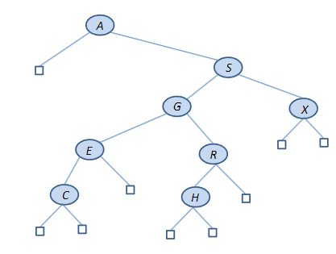
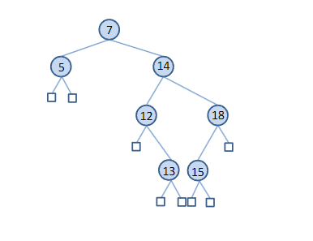

# Δυαδικά Δέντρα Αναζήτησης  

## Αναζήτηση

Η ανάκτηση μιας συγκεκριμένης πληροφορίας από μεγάλους όγκους ήδη αποθηκευμένων δεδομένων είναι μια θεμελιώδης λειτουργία, που ονομάζεται **αναζήτηση** (search).

Η αναζήτηση είναι σημαντική λειτουργία σε πολλές εφαρμογές, όπως:
- Συστήματα πληροφοριών τραπεζών
- Συστήματα πληροφοριών αεροπορικών εταιρειών
- Αναζήτηση στο Web

---

## Ο Αφηρημένος Τύπος Δεδομένων: Πίνακας Συμβόλων (ADT Symbol Table)

Ένας **πίνακας συμβόλων** (symbol table) είναι μια δομή δεδομένων με αντικείμενα που έχουν **κλειδιά**, και υποστηρίζει τις εξής λειτουργίες:

- Αρχικοποίηση του πίνακα ώστε να είναι άδειος
- Μέτρηση του πλήθους των αντικειμένων που περιέχει
- Εισαγωγή νέου αντικειμένου
- Αναζήτηση αντικειμένου (ή αντικειμένων) με δεδομένο κλειδί
- Διαγραφή ενός συγκεκριμένου αντικειμένου
- Επιλογή του 𝑘-οστού μικρότερου αντικειμένου στον πίνακα
- Ταξινόμηση του πίνακα (επίσκεψη όλων των αντικειμένων με σειρά ως προς τα κλειδιά τους)

Τα αντικείμενα μπορούν να θεωρηθούν ως **ζεύγη (κλειδί, τιμή)**.

- Αν τα κλειδιά είναι μοναδικά, ο πίνακας συμβόλων ονομάζεται και **map**
- Αν δεν είναι μοναδικά, ονομάζεται και **λεξικό (dictionary)**
## Παράδειγμα

Μπορούμε να χρησιμοποιήσουμε έναν πίνακα συμβόλων για να αναπαραστήσουμε πληροφορίες σχετικά με φοιτητές σε ένα πανεπιστήμιο.

- Το **κλειδί** μπορεί να είναι ο αριθμός μητρώου του φοιτητή.
- Το **αντικείμενο (item)** μπορεί να περιέχει και άλλες πληροφορίες για τον φοιτητή (η τιμή για το κλειδί): όνομα, διεύθυνση, έτος σπουδών, μαθήματα που έχει παρακολουθήσει κ.λπ.
- Τα κλειδιά μπορούν να χρησιμοποιηθούν για:
  - αναζήτηση πληροφοριών για έναν φοιτητή
  - ενημέρωση των πληροφοριών αυτών

Εφόσον οι αριθμοί μητρώου των φοιτητών είναι μοναδικοί, ο πίνακας συμβόλων μας είναι ένας **map**.

---

## Διεπαφή Πίνακα Συμβόλων (Symbol Table Interface)

```c
void STinit(int);              // Αρχικοποίηση πίνακα
int STcount();                 // Πλήθος αντικειμένων
void STinsert(Item);          // Εισαγωγή αντικειμένου
Item STsearch(Key);           // Αναζήτηση με βάση το κλειδί
void STdelete(Item);          // Διαγραφή αντικειμένου
Item STselect(int);           // Επιλογή του k-οστού μικρότερου αντικειμένου
void STsort(void (*visit)(Item));  // Ταξινόμηση με επίσκεψη των αντικειμένων
```

## Αναζήτηση με Δείκτες Κλειδιών (Key-Indexed Search)

- Υποθέτουμε ότι οι τιμές των κλειδιών είναι διακριτοί μικροί αριθμοί (π.χ. αριθμοί μικρότεροι από το 𝑀).
- Η πιο απλή υλοποίηση πίνακα συμβόλων σε αυτή την περίπτωση βασίζεται στην αποθήκευση των αντικειμένων σε έναν **πίνακα** που έχει **δείκτες τα κλειδιά**.
- Οι αλγόριθμοι για τις λειτουργίες της διεπαφής του πίνακα συμβόλων είναι απλοί.
- Η **εισαγωγή** και η **αναζήτηση** έχουν χρόνο εκτέλεσης **𝑂(1)**, ενώ η **επιλογή (select)** έχει χρόνο **𝑂(𝑀)**.

---

## Σειριακή Αναζήτηση (Sequential Search)

- Όταν οι τιμές των κλειδιών προέρχονται από ένα **μεγάλο εύρος**, μια απλή προσέγγιση για την υλοποίηση του πίνακα συμβόλων είναι να αποθηκεύουμε τα αντικείμενα **διαδοχικά σε έναν πίνακα**, ταξινομημένα κατά σειρά με βάση τα κλειδιά.
- Οι αλγόριθμοι για τις λειτουργίες της διεπαφής παραμένουν απλοί.
- Η **εισαγωγή** και η **αναζήτηση** έχουν χρόνο εκτέλεσης **𝑂(𝑛)**, όπου 𝑛 είναι ο αριθμός των αντικειμένων.
- Η **επιλογή (select)** έχει χρόνο **𝑂(1)**.
- Αν χρησιμοποιήσουμε **ταξινομημένη συνδεδεμένη λίστα**, τότε η εισαγωγή, η αναζήτηση και η επιλογή έχουν όλες χρόνο **𝑂(𝑛)**.

## Δυαδική Αναζήτηση (Binary Search)

- Στην υλοποίηση με πίνακα της σειριακής αναζήτησης, μπορούμε να μειώσουμε σημαντικά τον χρόνο αναζήτησης για ένα μεγάλο σύνολο αντικειμένων χρησιμοποιώντας μια διαδικασία αναζήτησης που ονομάζεται **δυαδική αναζήτηση** (binary search), η οποία βασίζεται στο πρότυπο **διαίρει και βασίλευε** (divide-and-conquer).

---

## Λεπτομέρειες Δυαδικής Αναζήτησης

Το πρόβλημα που αντιμετωπίζει η δυαδική αναζήτηση είναι να βρει τη θέση ενός κλειδιού αναζήτησης **K** σε έναν **ταξινομημένο πίνακα** `A[0:n-1]` με **διακριτές τιμές** σε αύξουσα σειρά:

A[0] < A[1] < ... < A[n-1]

Ο αλγόριθμος ακολουθεί τα εξής βήματα:

1. Επιλέγει το στοιχείο στη **μέση** του πίνακα `A[0:n-1]`, δηλαδή το `A[Middle]`, όπου:

Middle = (0 + (n - 1)) / 2


2. Συγκρίνει το κλειδί αναζήτησης **K** με το `A[Middle]`:
- Αν `K == A[Middle]`, η αναζήτηση ολοκληρώνεται επιτυχώς.
- Αν `K < A[Middle]`, συνεχίζεται η αναζήτηση στα στοιχεία **αριστερά** του `A[Middle]`.
- Αν `K > A[Middle]`, συνεχίζεται η αναζήτηση στα στοιχεία **δεξιά** του `A[Middle]`.

---

Η δυαδική αναζήτηση είναι πολύ πιο αποδοτική από τη σειριακή όταν δουλεύουμε με μεγάλα, ταξινομημένα σύνολα δεδομένων.

## Δυαδική Αναζήτηση με Επανάληψη (Iterative Binary Search)

Η παρακάτω υλοποίηση της δυαδικής αναζήτησης είναι επαναληπτική (iterative) και επιστρέφει τη θέση του κλειδιού **K** στον πίνακα **A**, αν αυτό βρεθεί. Αν όχι, επιστρέφει -1.

```c
int BinarySearch(Key K)
{
    int L, R, Midpoint;

    // Αρχικοποιήσεις
    L = 0;
    R = n - 1;

    // Όσο το διάστημα L έως R δεν είναι κενό
    while (L <= R) {
        Midpoint = (L + R) / 2;

        if (K == A[Midpoint]) {
            return Midpoint; // Το βρήκαμε!
        } else if (K > A[Midpoint]) {
            L = Midpoint + 1; // Ψάχνουμε δεξιά
        } else {
            R = Midpoint - 1; // Ψάχνουμε αριστερά
        }
    }

    // Αν το διάστημα αναζήτησης έγινε κενό, δεν βρέθηκε
    return -1;
}
```

## Δυαδική Αναζήτηση με Αναδρομή (Recursive Binary Search)

Αυτή είναι η αναδρομική υλοποίηση της δυαδικής αναζήτησης. Ξεκινάει με BinarySearch(K, 0, n-1) για να αναζητήσει το κλειδί K στο υποπίνακα A[0:n-1].

```c
int BinarySearch(Key K, int L, int R)
{
    int Midpoint;

    // Αν το υποδιάστημα είναι άδειο
    if (L > R) {
        return -1;
    }

    Midpoint = (L + R) / 2;

    if (K == A[Midpoint]) {
        return Midpoint;
    } else if (K > A[Midpoint]) {
        return BinarySearch(K, Midpoint + 1, R); // Ψάχνουμε δεξιά
    } else {
        return BinarySearch(K, L, Midpoint - 1); // Ψάχνουμε αριστερά
    }
}
```
Η επαναληπτική και η αναδρομική εκδοχή έχουν την ίδια υπολογιστική πολυπλοκότητα:
O(log n) για ταξινομημένους πίνακες με ν στοιχεία.

## Πολυπλοκότητα (Complexity)

Ας υπολογίσουμε τον χρόνο εκτέλεσης της **αναδρομικής δυαδικής αναζήτησης**.

- Ονομάζουμε μια θέση του πίνακα **υποψήφια (candidate)** αν, στο τρέχον στάδιο του αλγορίθμου, δεν μπορούμε να αποκλείσουμε το ενδεχόμενο να περιέχει το ζητούμενο κλειδί **K**.
- Σε κάθε αναδρομική κλήση της συνάρτησης `BinarySearch`, εκτελούνται **σταθερός αριθμός βασικών πράξεων**.
- Συνεπώς, ο συνολικός χρόνος εκτέλεσης είναι **αναλογικός με τον αριθμό των αναδρομικών κλήσεων**.
- Παρατηρούμε επίσης ότι σε κάθε αναδρομική κλήση, ο αριθμός των υποψηφίων στοιχείων **μειώνεται τουλάχιστον στο μισό**.

---


- Αρχικά, ο αριθμός των υποψηφίων στοιχείων είναι **𝑛**.
- Μετά την **πρώτη αναδρομική κλήση**, είναι το πολύ **𝑛/2**.
- Μετά τη **δεύτερη**, το πολύ **𝑛/4**, και ούτω καθεξής.
- Σε γενική μορφή, μετά την **𝑖-οστή κλήση**, οι υποψήφιοι είναι το πολύ:n / 2^i


- Στη **χειρότερη περίπτωση** (ανεπιτυχής αναζήτηση), οι αναδρομικές κλήσεις σταματούν όταν **δεν υπάρχουν πια υποψήφιοι**.
- Άρα, το πλήθος των αναδρομικών κλήσεων είναι το **μικρότερο ακέραιο m** για το οποίο ισχύει: n / 2^m < 1

Δηλαδή, ο αριθμός των κλήσεων (και ο χρόνος εκτέλεσης) είναι:

O(log n)

- Ισοδύναμα, η συνθήκη `n / 2^m < 1` σημαίνει ότι:

2^m > n

- Παίρνοντας **λογαρίθμους βάσης 2** και στα δύο μέρη, προκύπτει:

m > log₂(n)


- Άρα:
m = log₂(n) + 1


- Αυτό σημαίνει ότι η πολυπλοκότητα της **αναδρομικής δυαδικής αναζήτησης** είναι: O(log n)


- Η πολυπλοκότητα της **επαναληπτικής δυαδικής αναζήτησης** είναι επίσης:

O(log n)


---

## Δυαδικά Δέντρα Αναζήτησης (Binary Search Trees)

Για να ξεπεράσουμε το πρόβλημα ότι οι **εισαγωγές είναι ακριβές (χρονικά)** σε πίνακες, χρησιμοποιούμε μια **ρητή δενδρική δομή** ως βάση για την υλοποίηση του πίνακα συμβόλων.

- Τα **δυαδικά δέντρα αναζήτησης** (Binary Search Trees ή BSTs) είναι **εξαιρετική δομή δεδομένων** για την αναπαράσταση συνόλων των οποίων τα στοιχεία **έχουν κάποια γραμμική διάταξη**.

### Γραμμική Διάταξη (Linear Order)

Μια γραμμική διάταξη `<` σε ένα σύνολο **S** ικανοποιεί τις εξής ιδιότητες:

1. Για οποιαδήποτε **a, b ∈ S**, ισχύει ακριβώς μία από τις περιπτώσεις:  
 `a < b`, `a = b`, ή `a > b`

2. Για όλα τα **a, b, c ∈ S**, αν `a < b` και `b < c` τότε `a < c` (**μεταβατικότητα**)

📌 Παραδείγματα συνόλων με φυσική γραμμική διάταξη:  
ακέραιοι, δεκαδικοί αριθμοί, χαρακτήρες και συμβολοσειρές στη γλώσσα C.

---

## Ορισμός Δυαδικού Δέντρου Αναζήτησης (Definition)

Ένα **δυαδικό δέντρο αναζήτησης (BST)** είναι ένα **δυαδικό δέντρο**, στο οποίο κάθε **εσωτερικός κόμβος** έχει ένα **κλειδί**, και ικανοποιεί την εξής ιδιότητα:

Για κάθε κόμβο **N**:  
* τα κλειδιά στο αριστερό υποδέντρο του **N** ≤ κλειδί στον κόμβο **N** ≤ κλειδιά στο δεξί υποδέντρο του **N**

Αυτή η συνθήκη ονομάζεται **ιδιότητα δυαδικού δέντρου αναζήτησης (BST property)**.

---

## Διπλά Κλειδιά (Duplicate Keys)

- Ο παραπάνω ορισμός **επιτρέπει την ύπαρξη διπλών κλειδιών**.
- Αυτή η εκδοχή BST μπορεί να χρησιμοποιηθεί για την υλοποίηση **λεξικών (dictionaries)**.
- Αν θέλουμε να υλοποιήσουμε **maps** (όπου τα κλειδιά είναι μοναδικά), τότε αλλάζουμε την συνθήκη από:≤ → < ώστε να μην επιτρέπεται η εισαγωγή στοιχείων με **ίδια κλειδιά**.


## Ορισμοί Τύπων για Δυαδικά Δέντρα Αναζήτησης (BSTs)

Οι παρακάτω δηλώσεις ορίζουν τη δομή δεδομένων για ένα **δυαδικό δέντρο αναζήτησης (BST)**:

```c
typedef struct STnode* link;

struct STnode {
    Item item;
    link l, r;
    int N;
};
```

Κάθε κόμβος σε ένα δυαδικό δέντρο αναζήτησης (BST) περιέχει:

- Ένα αντικείμενο (item) με ένα κλειδί,

- Ένα αριστερό σύνδεσμο l,

- Ένα δεξιό σύνδεσμο r,

- Και έναν ακέραιο N, που μετρά πόσοι κόμβοι υπάρχουν στο δέντρο (ή στο υποδέντρο).

## Το Αρχείο Διεπαφής Item.h

Ορισμός του αρχείου διεπαφής Item.h:

```c

typedef int Item;
typedef int Key;

#define NULLitem -1  /* Το NULLitem είναι μία σταθερά */
#define key(A) (A)
#define less(A, B) (key(A) < key(B))
#define eq(A, B) (!less(A, B) && !less(B, A))

Item ITEMrand(void);
int ITEMscan(Item *);
void ITEMshow(Item);
```
- Item και Key είναι τύποι δεδομένων του ακέραιου (int).

- NULLitem είναι μία σταθερά που επιστρέφεται όταν το BST δεν περιέχει το ζητούμενο κλειδί.

- Η μακροεντολή key(A) επιστρέφει το κλειδί του αντικειμένου A.

- Η μακροεντολή less(A, B) επιστρέφει true αν το κλειδί του A είναι μικρότερο από του B.

- Η μακροεντολή eq(A, B) επιστρέφει true αν τα κλειδιά των A και B είναι ίσα.

**Οι συναρτήσεις που χρησιμοποιούνται είναι**

- ITEMrand: Επιστρέφει ένα τυχαίο αντικείμενο.

- ITEMscan: Διαβάζει ένα αντικείμενο από την τυπική είσοδο.

- ITEMshow: Εκτυπώνει ένα αντικείμενο στην τυπική έξοδο.

### Σημειώσεις

Το προηγούμενο αρχείο διεπαφής υποθέτει ότι τα αντικείμενα αποτελούνται μόνο από κλειδιά. Αυτή η υπόθεση μπορεί να αλλάξει αν απαιτείται.

NULLitem επιστρέφεται όταν το BST δεν περιέχει το κλειδί που αναζητείται.

Οι μακροεντολές less και eq χρησιμοποιούνται στον κώδικα για σύγκριση των κλειδιών, αν και θα μπορούσαν να οριστούν και ως συναρτήσεις.

## Εξωτερικοί Κόμβοι (External Nodes)

- Στις παραστάσεις μας, οι **εξωτερικοί κόμβοι** αναπαρίστανται με μικρούς **ορθογώνιους παραλληλόγραμους**.
- Στον κώδικα, οι εξωτερικοί κόμβοι υλοποιούνται με δομές τύπου **STnode** με τα στοιχεία που φαίνονται παρακάτω:


- Ο εξωτερικός κόμβος είναι ουσιαστικά ένας κόμβος με μηδενικά παιδιά και μπορεί να θεωρηθεί ως "κενό" σε ένα δυαδικό δέντρο αναζήτησης.

- Οι εξωτερικοί κόμβοι χρησιμοποιούνται για να καθορίσουν τα όρια του δέντρου και να βοηθήσουν στην αναζήτηση και εισαγωγή στοιχείων.

## Η Μεταβλητή Δείκτης `z`

- Υπάρχει μόνο **ένας ψευδής (εξωτερικός) κόμβος** στην υλοποίηση, αν και στις παραστάσεις μας θα εμφανίζονται πολλοί τέτοιοι κόμβοι.
- Η μεταβλητή δείκτης **z** δείχνει σε αυτόν τον κόμβο.


## Το Αποτέλεσμα της `STinit()`

 

## Σημαντικό

- Αν δεν είχαμε αυτούς τους ψευδείς κόμβους για να δηλώσουμε τους **εξωτερικούς κόμβους**, τόσο οι θεωρητικές συζητήσεις όσο και οι υλοποιήσεις μας θα ήταν πιο περίπλοκες.

---

## Αναζήτηση για ένα Κλειδί Αναδρομικά

Για να αναζητήσουμε ένα κλειδί **K** σε ένα **BST T**, συγκρίνουμε το **K** με το κλειδί **Kr** της ρίζας του **T**.

- Αν **K == Kr**, η αναζήτηση ολοκληρώνεται επιτυχώς.
- Αν **K < Kr**, η αναζήτηση συνεχίζεται αναδρομικά στο **αριστερό υποδέντρο** του **T**.
- Αν **K > Kr**, η αναζήτηση συνεχίζεται αναδρομικά στο **δεξί υποδέντρο** του **T**.
- Αν το **T** είναι το άδειο δέντρο, έχουμε **αποτυχία αναζήτησης** και επιστρέφουμε **NULLitem** (το οποίο ορίσαμε ως -1).

---

## Η Συνάρτηση `STsearch`

```c
Item searchR(link h, Key v) {
    Key t = key(h->item);
    if (h == z) return NULLitem;
    if (eq(v, t)) return h->item;
    if (less(v, t)) return searchR(h->l, v);
    else return searchR(h->r, v);
}

Item STsearch(Key v) {
    return searchR(head, v);
}
```

- Η συνάρτηση STsearch καλεί μια αναδρομική συνάρτηση searchR που πραγματοποιεί τη δουλειά.

- Σε κάθε βήμα της searchR, διασφαλίζεται ότι μόνο το τρέχον υποδέντρο μπορεί να περιέχει στοιχεία με το ζητούμενο κλειδί.

- Όπως και στο δυαδικό ψαχτήρι (binary search), το μέγεθος της περιοχής μειώνεται κατά λίγο περισσότερο από το μισό σε κάθε επανάληψη, με το τρέχον υποδέντρο να είναι μικρότερο από το προηγούμενο (κατά περίπου το μισό, ιδανικά).
## Εισαγωγή Κλειδιού

- Ένα βασικό χαρακτηριστικό των **BSTs** είναι ότι η **εισαγωγή** ενός κλειδιού είναι εξίσου εύκολη στην υλοποίηση με την **αναζήτηση**.

---

## Εισαγωγή Κλειδιού Αναδρομικά

Για να εισάγουμε ένα στοιχείο με κλειδί **K** σε ένα **BST T**, συγκρίνουμε το **K** με το κλειδί **Kr** της ρίζας του **T**.

- Αν **K < Kr**, ο αλγόριθμος συνεχίζει αναδρομικά στο **αριστερό υποδέντρο** του **T**.
- Αν **K ≥ Kr**, ο αλγόριθμος συνεχίζει αναδρομικά στο **δεξί υποδέντρο** του **T**.
- Αν το **T** είναι το άδειο δέντρο, το στοιχείο με κλειδί **K** εισάγεται εκεί.

---

- Αν δεν επιτρέπουμε **διπλότυπα κλειδιά**, ο αλγόριθμος εισαγωγής είναι ως εξής:
  - Αν **K = Kr**, το κλειδί υπάρχει ήδη στο **T** και ο αλγόριθμος σταματά.
  - Αν **K < Kr**, ο αλγόριθμος συνεχίζει αναδρομικά στο **αριστερό υποδέντρο** του **T**.
  - Αν **K > Kr**, ο αλγόριθμος συνεχίζει αναδρομικά στο **δεξί υποδέντρο** του **T**.
  - Αν το **T** είναι το άδειο δέντρο, το στοιχείο με κλειδί **K** εισάγεται εκεί.

---

Θες να συνεχίσουμε με την επόμενη ενότητα ή να ετοιμάσουμε το τελικό αρχείο `README.md` με όλα τα τμήματα που έχουμε μεταφράσει μέχρι τώρα;

## Παράδειγμα

- Ας εισάγουμε τα κλειδιά **e, b, d, f, a, g, c** σε ένα αρχικά κενό δέντρο με τη σειρά που δίνονται.

---

## Αρχικό Κενό Δέντρο


## Αφού βάλαμε ένα στοιχείο e


## Αφού βάλαμε το b


## Αφού βάλαμε το d


## Αφού βάλαμε το f


## Αφού βάλαμε το α


## Αφού βάλαμε το g

 

## Αφού βάλαμε το c


## Αφού βάλαμε ένα στοιχείο e


## Αφού βάλαμε το b


## Αφού βάλαμε το d


## Αφού βάλαμε το e


## Αφού βάλαμε το f


## Αφού βάλαμε το e


## Σχόλια

- Βλέπουμε ότι στην περίπτωση των **διπλότυπων κλειδιών**, αυτά τα κλειδιά εμφανίζονται διάσπαρτα σε όλο το **BST**.
- Ωστόσο, τα διπλότυπα κλειδιά εμφανίζονται σε όλα τα κατάλληλα μονοπάτια αναζήτησης από τη ρίζα μέχρι τον εξωτερικό κόμβο, έτσι μπορούν να βρεθούν από τον αλγόριθμο αναζήτησης.
- Ο αλγόριθμος αναζήτησης που υλοποιείται από τη **STsearch** θα επιστρέψει το στοιχείο που αντιστοιχεί στο πρώτο διπλότυπο κλειδί σε αυτό το μονοπάτι.

---

## Η Συνάρτηση `STinsert`

```c
link insertR(link h, Item item) {
    Key v = key(item), t = key(h->item);
    if (h == z) return NEW(item, z, z, 1);
    if (less(v, t))
        h->l = insertR(h->l, item);
    else
        h->r = insertR(h->r, item);
    (h->N)++; 
    return h;
}

void STinsert(Item item) {
    head = insertR(head, item);
}
```

Η συνάρτηση STinsert καλεί τη αναδρομική συνάρτηση insertR που πραγματοποιεί την εισαγωγή.

## Εισαγωγή στην Φυσική Σειρά

Ας επανεξετάσουμε το προηγούμενο παράδειγμα και ας εισάγουμε τα ίδια κλειδιά στη φυσική τους σειρά: a, b, c, d, e, f, g.

Το δέντρο που θα κατασκευαστεί είναι μια αλυσίδα.


- Όπως θα δούμε παρακάτω, οι αλυσίδες οδηγούν σε **αναποτελεσματική αναζήτηση**. Γι' αυτό δεν πρέπει ποτέ να εισάγουμε τα κλειδιά στη φυσική τους σειρά σε ένα **BST**.
- Παρόμοια προβλήματα υπάρχουν αν τα κλειδιά είναι σε αντίστροφη σειρά ή αν είναι σχεδόν ταξινομημένα.

---


## Ας διασχίσουμε αυτό το BST με την εντολή **inorder**. Τι παρατηρούμε;

- Όταν διασχίζουμε ένα **BST** με την εντολή **inorder**, οι τιμές των κόμβων εμφανίζονται σε **αύξουσα σειρά**.
- Αυτό σημαίνει ότι, αν τα κλειδιά εισαχθούν σε φυσική σειρά (ή σε αντίστροφη σειρά), το δέντρο θα είναι ουσιαστικά μια **αλυσίδα** (και όχι ένα ισχυρό δέντρο ισχύος), και η αναζήτηση θα απαιτεί χρόνο **O(n)**, αντί για **O(log n)**.

## Εντολή **Inorder** για την Περιήγηση σε BSTs

- Αν διασχίσουμε ένα **BST** χρησιμοποιώντας την εντολή **inorder**, τα κλειδιά των κόμβων θα εμφανιστούν ταξινομημένα στην φυσική τους σειρά.
- Αυτό δίνει την ευκαιρία για μια αλγοριθμική διαδικασία ταξινόμησης που ονομάζεται **TreeSort**: εισάγουμε τα κλειδιά ένα-ένα σε ένα **BST**, και μετά διασχίζουμε το δέντρο με την εντολή **inorder**.

---

## Η Συνάρτηση `STsort`

```c
void sortR(link h, void (*visit)(Item)) {
    if (h == z) return;
    sortR(h->l, visit);
    visit(h->item);
    sortR(h->r, visit);
}

void STsort(void (*visit)(Item)) {
    sortR(head, visit);
}
```

Η δεύτερη παράμετρος της sortR είναι η visit, η οποία είναι δείκτης σε μια συνάρτηση με τύπο επιστροφής void, που δηλώνεται ως void (*visit)(Item).

Η sortR μπορεί να κληθεί με το όνομα μιας συνάρτησης ως δεύτερο όρισμα. Αυτή η συνάρτηση εφαρμόζεται σε κάθε κόμβο του δέντρου όταν τον επισκεπτόμαστε.

## Παράδειγμα Πελάτη Πίνακα Συμβόλων (Symbol Table Client)

```c
#include <stdio.h>
#include <stdlib.h>
#include "Item.h"
#include "ST.h"

void main(int argc, char *argv[]) {
    int N, maxN = atoi(argv[1]), sw = atoi(argv[2]);
    Key v;
    Item item;
    STinit(maxN);

    for (N = 0; N < maxN; N++) {
        if (sw) v = ITEMrand();
        else if (ITEMscan(&v) == EOF) break;

        if (STsearch(v) != NULLitem) continue;

        key(item) = v;
        printf("Inserting item %d\n", item);
        STinsert(item);
    }

    STsort(ITEMshow);
    printf("\n");
    printf("%d keys\n", N);
    printf("%d distinct keys\n", STcount());
}
```

Το προηγούμενο πρόγραμμα πελάτη παράγει τυχαία ή διαβάζει από την τυπική είσοδο το πολύ MaxN ακέραιους αριθμούς, τους εισάγει σε ένα BST έναν-έναν, και στη συνέχεια τους εκτυπώνει σε ταξινομημένη σειρά χρησιμοποιώντας την εντολή inorder για την περιήγηση του δέντρου.

Επίσης, εκτυπώνει τον αριθμό των κλειδιών που δόθηκαν και τον αριθμό των διακριτών κλειδιών που συναντήθηκαν.

# Περιστροφές (Rotations)

* Η περιστροφή είναι μια θεμελιώδης λειτουργία σε δέντρα.

* Η περιστροφή μας επιτρέπει να ανταλλάξουμε τον ρόλο του κόμβου ρίζας της περιστροφής με έναν από τους παιδικούς κόμβους της ρίζας σε ένα δέντρο, διατηρώντας παράλληλα τη σειρά των κλειδιών στους κόμβους του BST.

* Η περιστροφή είναι σημαντική γιατί μας βοηθά να κάνουμε τα δέντρα μας ισχυρά (balanced), όπως θα δούμε σε επόμενες διαλέξεις.

Θα ορίσουμε τη δεξιά περιστροφή και την αριστερή περιστροφή.

## Παράδειγμα: Δεξιά Περιστροφή στον Κόμβο S

Η **δεξιά περιστροφή** σε έναν κόμβο S εκτελείται ως εξής:

Ας υποθέσουμε ότι έχουμε το παρακάτω δέντρο και θέλουμε να εκτελέσουμε μια δεξιά περιστροφή στον κόμβο S:

### Βήματα Δεξιάς Περιστροφής

1. **Αλλαγή θέσης του κόμβου S και του αριστερού του παιδιού (T):** Ο κόμβος T θα γίνει η νέα ρίζα της υποδέντρος και ο κόμβος S θα γίνει δεξιός παιδί του T.
2. **Ανακατεύθυνση των υποδέντρων:** Ο αριστερός παιδί του κόμβου T (A) παραμένει το ίδιο, αλλά ο δεξιός παιδί του T (B) θα ανατεθεί ως αριστερός παιδί του κόμβου S.


### Δεξιά Περιστροφή (Right Rotation)

- Μια **δεξιά περιστροφή** αφορά τον κόμβο ρίζας της περιστροφής και το αριστερό παιδί του.
- Η περιστροφή τοποθετεί την ρίζα δεξιά, αντιστρέφοντας ουσιαστικά την κατεύθυνση του αριστερού συνδέσμου της ρίζας.
- Πριν από την περιστροφή, ο αριστερός σύνδεσμος της ρίζας δείχνει από τη ρίζα προς το αριστερό παιδί. Μετά την περιστροφή, δείχνει από το παλιό αριστερό παιδί (τη νέα ρίζα) προς την παλιά ρίζα (το δεξί παιδί της νέας ρίζας).
- Το δύσκολο μέρος, που κάνει την περιστροφή να λειτουργεί, είναι η αντιγραφή του δεξιού συνδέσμου του αριστερού παιδιού έτσι ώστε να γίνει ο αριστερός σύνδεσμος της παλιάς ρίζας. Αυτός ο σύνδεσμος δείχνει σε όλα τα κόμβους που έχουν κλειδιά μεταξύ των δύο κόμβων που εμπλέκονται στην περιστροφή.
- Τέλος, ο σύνδεσμος προς την παλιά ρίζα πρέπει να αλλάξει ώστε να δείχνει στη νέα ρίζα.

### Αριστερή Περιστροφή (Left Rotation)

- Μια **αριστερή περιστροφή** αφορά τον κόμβο ρίζας της περιστροφής και το δεξί του παιδί.
- Η περιγραφή της αριστερής περιστροφής είναι ταυτόσημη με την περιγραφή της δεξιάς περιστροφής, με την αλλαγή των λέξεων **"δεξιά"** και **"αριστερά"** παντού.

### Παράδειγμα: Περιστροφή Αριστερά στον Κόμβο B


### Συναρτήσεις για Περιστροφή

```c
link rotR(link h) {
    link x = h->l;
    h->l = x->r;
    x->r = h;
    return x;
}

link rotL(link h) {
    link x = h->r;
    h->r = x->l;
    x->l = h;
    return x;
}
```

Αυτές οι συναρτήσεις υλοποιούν τις βασικές περιστροφές σε ένα δυαδικό δέντρο αναζήτησης.

rotR (περιστροφή δεξιά) ανεβάζει τον αριστερό υποκόμβο.

rotL (περιστροφή αριστερά) ανεβάζει τον δεξί υποκόμβο.

## Εισαγωγή στη Ρίζα

- Στην υλοποίηση της εισαγωγής που παρουσιάστηκε προηγουμένως, κάθε νέος κόμβος εισάγεται κάπου στο κάτω μέρος του δέντρου.

- Μπορούμε να σκεφτούμε μια εναλλακτική μέθοδο εισαγωγής, όπου επιμένουμε κάθε νέος κόμβος να εισάγεται στη ρίζα.

- Στην πράξη, το πλεονέκτημα της εισαγωγής στη ρίζα είναι ότι τα πρόσφατα εισαχθέντα κλειδιά βρίσκονται κοντά στην κορυφή. Αυτό μπορεί να είναι χρήσιμο σε ορισμένες εφαρμογές.

- Οι λειτουργίες περιστροφής προσφέρουν μια απλή υλοποίηση της εισαγωγής στη ρίζα:

- Εισάγουμε αναδρομικά το νέο στοιχείο στο κατάλληλο υποδέντρο, αφήνοντάς το, όταν ολοκληρωθεί η αναδρομή, στη ρίζα αυτού του υποδέντρου.

- Στη συνέχεια, περιστρέφουμε επανειλημμένα ώστε να το φέρουμε στη ρίζα του συνολικού δέντρου.

### Παράδειγμα: Εισαγωγή στη Ρίζα του G

Σε αυτό το παράδειγμα, εισάγουμε τον κόμβο **G** χρησιμοποιώντας τη μέθοδο **εισαγωγής στη ρίζα**.  
Αντί να προσθέσουμε τον κόμβο G στο κάτω μέρος του δέντρου, τον τοποθετούμε με τέτοιο τρόπο ώστε, μετά από μια σειρά **περιστροφών**, να καταλήξει στη **ρίζα**.

Αυτό διασφαλίζει ότι το νέο στοιχείο είναι εύκολα προσβάσιμο και βελτιώνει την απόδοση για περιπτώσεις όπου οι πρόσφατες εισαγωγές αναζητούνται συχνά.


### Παράδειγμα: Ο G Εισάγεται


### Παράδειγμα: Μετά από Περιστροφή Δεξιά στον Κόμβο H


### Παράδειγμα: Μετά από Περιστροφή Δεξιά στον Κόμβο R

### Παράδειγμα: Μετά από Περιστροφή Αριστερά στον Κόμβο E

### Παράδειγμα: Μετά από Περιστροφή Δεξιά στον Κόμβο S


### Παράδειγμα: Μετά από Περιστροφή Αριστερά στον Κόμβο A


### Συναρτήσεις για Εισαγωγή στη Ρίζα

```c
link insertT(link h, Item item) {
    Key v = key(item);
    if (h == z) return NEW(item, z, z, 1);
    if (less(v, key(h->item))) {
        h->l = insertT(h->l, item);
        h = rotR(h);
    } else {
        h->r = insertT(h->r, item);
        h = rotL(h);
    }
    return h;
}

void STinsert(Item item) {
    head = insertT(head, item);
}
```

- Αυτές οι συναρτήσεις υλοποιούν την εισαγωγή στη ρίζα για έναν δυαδικό πίνακα αναζήτησης (symbol table).

- Η συνάρτηση insertT εισάγει ένα στοιχείο item αναδρομικά στο δέντρο.

- Εάν το νέο στοιχείο είναι μικρότερο από τον τρέχοντα κόμβο, γίνεται εισαγωγή στο αριστερό υποδέντρο και ακολουθεί περιστροφή δεξιά (rotR).

- Εάν το νέο στοιχείο είναι μεγαλύτερο, η εισαγωγή γίνεται στο δεξιό υποδέντρο και εφαρμόζεται περιστροφή αριστερά (rotL).

- Η συνάρτηση STinsert απλώς καλεί την insertT για να εισάγει το στοιχείο στη ρίζα του δέντρου.

Αυτός ο τρόπος διασφαλίζει ότι οι πρόσφατοι κόμβοι εισάγονται κοντά στη ρίζα, βελτιώνοντας τη λειτουργία αναζήτησης.

### Επιλογή του 𝑘-ου Μικρότερου Κλειδιού

Για την υλοποίηση της συνάρτησης **select**, χρησιμοποιούμε μια αναδρομική διαδικασία.

- Χρησιμοποιούμε **μηδενική ευρετηρίαση**. Έτσι, όταν 𝑘 = 3, αναζητούμε το στοιχείο με το **τέταρτο μικρότερο κλειδί**.
- Για να βρούμε το στοιχείο με το 𝑘-οστό μικρότερο κλειδί, εξετάζουμε τον αριθμό των κόμβων στο αριστερό υποδέντρο.

#### Βήματα της διαδικασίας:
1. Εάν υπάρχουν **𝑘 κόμβοι** στο αριστερό υποδέντρο, επιστρέφουμε το στοιχείο στη ρίζα.
2. Εάν το αριστερό υποδέντρο έχει **περισσότερους από 𝑘 κόμβους**, αναζητούμε αναδρομικά το 𝑘-οστό μικρότερο κλειδί εκεί.
3. Εάν καμία από τις παραπάνω συνθήκες δεν ισχύει, τότε το αριστερό υποδέντρο έχει **𝑡 στοιχεία** με 𝑡 < 𝑘 και το στοιχείο με το 𝑘-οστό μικρότερο κλειδί είναι το στοιχείο με το **(𝑘 − 𝑡 − 1)-οστό μικρότερο κλειδί** στο δεξιό υποδέντρο.

Αυτή η μέθοδος επιτρέπει την αναζήτηση για το 𝑘-οστό μικρότερο στοιχείο με αναδρομή, ενώ εκμεταλλεύεται την ισορροπημένη δομή του δυαδικού δέντρου αναζήτησης.

### Συναρτήσεις για Επιλογή

```c
Item selectR(link h, int k) {
    int t;
    if (h == z) return NULLitem;
    t = (h->l == z) ? 0 : h->l->N;
    if (t > k) return selectR(h->l, k);
    if (t < k) return selectR(h->r, k - t - 1);
    return h->item;
}

Item STselect(int k) {
    return selectR(head, k);
}
```
- Η συνάρτηση selectR χρησιμοποιεί μια αναδρομική διαδικασία για να βρει το 𝑘-οστό μικρότερο στοιχείο στο δυαδικό δέντρο αναζήτησης.

- Εάν το αριστερό υποδέντρο έχει περισσότερους κόμβους από το 𝑘, η αναζήτηση συνεχίζεται στο αριστερό υποδέντρο.

- Εάν το αριστερό υποδέντρο έχει λιγότερους κόμβους από το 𝑘, η αναζήτηση συνεχίζεται στο δεξιό υποδέντρο, με adjustment για την αλλαγή του δείκτη.

- Όταν το στοιχείο βρίσκεται, επιστρέφεται το στοιχείο που αντιστοιχεί στο 𝑘-οστό μικρότερο κλειδί.

# Διαμέριση (Partition)

Μπορούμε να αλλάξουμε την υλοποίηση της λειτουργίας select σε μια λειτουργία διαμέρισης, η οποία αναδιατάσσει το δέντρο έτσι ώστε το στοιχείο με το 𝑘-οστό μικρότερο κλειδί να τοποθετηθεί στη ρίζα.

Εάν τοποθετούμε αναδρομικά τον επιθυμητό κόμβο στη ρίζα ενός από τα υποδέντρα, μπορούμε στη συνέχεια να το κάνουμε τη ρίζα του συνολικού δέντρου με μια περιστροφή.

Συναρτήσεις για Διαμέριση

```c
link partR(link h, int k) {
    int t = h->l->N;
    if (t > k) {
        h->l = partR(h->l, k);
        h = rotR(h);
    }
    if (t < k) {
        h->r = partR(h->r, k - t - 1);
        h = rotL(h);
    }
    return h;
}
```
- Η συνάρτηση partR επιτρέπει την διαμέριση ενός δέντρου έτσι ώστε το 𝑘-οστό μικρότερο κλειδί να τοποθετηθεί στη ρίζα του δέντρου.

- Η διαδικασία είναι παρόμοια με την επιλογή, αλλά με επιπλέον περιστροφές για να φέρουμε το επιθυμητό στοιχείο στη ρίζα.

# Διαγραφή από ένα Δυαδικό Δέντρο Αναζήτησης (BST)

Ένας αλγόριθμος για τη διαγραφή ενός κλειδιού K από ένα BST T είναι ο εξής:

Εάν το K βρίσκεται σε έναν εσωτερικό κόμβο με μόνο (ψευδείς) εξωτερικούς κόμβους ως παιδιά, τότε διαγράφουμε τον κόμβο και αντικαθιστούμε τη σύνδεση με έναν νέο (ψευδή) εξωτερικό κόμβο.

## Παράδειγμα διαγραφή του 7


## Αποτέλεσμα 


- Εάν το **K** είναι ένας εσωτερικός κόμβος με έναν μόνο (ψευδή) εξωτερικό κόμβο ως παιδί, τότε διαγράφουμε τον κόμβο και προσαρμόζουμε τη σύνδεση από τον γονέα του ώστε να δείχνει στον μη κενό υποκόμβο του.

- Αν ο κόμβος **K** έχει μόνο ένα παιδί, απλώς συνδέουμε τον γονέα του με το παιδί του, διατηρώντας την υπόλοιπη δομή του δέντρου ανέπαφη. Αυτός ο αλγόριθμος διασφαλίζει ότι το δέντρο παραμένει ισχυρό και λειτουργικό μετά τη διαγραφή.


## Παράδειγμα διαγραφή 5


## Αποτέλεσμα 


### Διαγραφή από ένα Δυαδικό Δέντρο Αναζήτησης (BST) (συνέχεια)

- Εάν το **K** βρίσκεται σε έναν κόμβο **N** με τόσο αριστερό όσο και δεξιό υποδέντρο μη κενό, τότε διαγράφουμε τον κόμβο **K** και συνδυάζουμε τα δύο υποδέντρα σε ένα νέο δέντρο. Αλλά πώς;

#### Επιλογές για τη Διαγραφή:

- Μία απλή επιλογή είναι να βρούμε το **χαμηλότερης αξίας κλειδί K'** στους απόγονους του δεξιού παιδιού και να αντικαταστήσουμε το **K** με το **K'**.

- Αυτό το κλειδί βρίσκεται σε έναν κόμβο **N'**, ο οποίος είναι ο **επόμενος κόμβος** του **N** κατά την αναδρομική διασχίση του δέντρου (inorder traversal).

- Ο κόμβος **N'** μπορεί να βρεθεί ξεκινώντας από το δεξιό παιδί του **N** και ακολουθώντας τους δείκτες του αριστερού παιδιού μέχρι να βρούμε έναν κόμβο που έχει αριστερό παιδί το οποίο είναι εξωτερικός κόμβος.

- Φυσικά, πρέπει επίσης να αφαιρέσουμε τον κόμβο **N'** από το δέντρο. Αυτό μπορεί να γίνει εύκολα, καθώς ο κόμβος **N'** έχει το πολύ **ένα δεξί παιδί**.

Αυτή η μέθοδος διαγραφής διατηρεί την ισορροπία του δέντρου και εξασφαλίζει ότι η δομή του παραμένει έγκυρη και αποτελεσματική.

## Παράδειγμα Διαγραφή 10


### Παράδειγμα: Διαγραφή Κλειδιού από το Δέντρο Αναζήτησης

Ας υποθέσουμε ότι το κλειδί **10** πρέπει να διαγραφεί από το δυαδικό δέντρο αναζήτησης και ότι το κλειδί **14** είναι ο κόμβος που το περιέχει.

1. Ο κόμβος **10** έχει **δεξιό και αριστερό υποδέντρο** και επομένως πρέπει να βρούμε το χαμηλότερης αξίας κλειδί στους απογόνους του δεξιού παιδιού. Σε αυτή την περίπτωση, το χαμηλότερο κλειδί είναι **12** (που βρίσκεται στα δεξιά του 10).
   
2. Το κλειδί **12** αντικαθιστά το κλειδί **10** στον κόμβο του δέντρου.

3. Στη συνέχεια, πρέπει να διαγράψουμε τον κόμβο που περιέχει το **12**. Ο κόμβος **12** έχει το πολύ ένα δεξιό παιδί, το οποίο μπορούμε εύκολα να συνδέσουμε με το γονέα του, διατηρώντας την ισορροπία του δέντρου.

Αυτός ο αλγόριθμος εξασφαλίζει ότι η δομή του δέντρου παραμένει ισχυρή και αποδοτική μετά τη διαγραφή του κόμβου.

## Αποτέλεσμα 


### Διαγραφή από ένα Δυαδικό Δέντρο Αναζήτησης (BST) (συνέχεια)

- Σημειώστε ότι το **υψηλότερης αξίας κλειδί** στους απογόνους του **αριστερού παιδιού** μπορεί επίσης να χρησιμοποιηθεί για την αντικατάσταση του διαγραφόμενου κλειδιού.

- Αυτό το κλειδί βρίσκεται σε έναν κόμβο **N''**, ο οποίος είναι ο **προκάτοχος** του **N** κατά την αναδρομική διασχίση του δέντρου (inorder traversal).

#### Διαδικασία:
1. Όπως και με το **δεξιό υποδέντρο**, αντί να χρησιμοποιήσουμε το χαμηλότερο κλειδί του δεξιού παιδιού, μπορούμε να βρούμε το **υψηλότερο κλειδί** στους απογόνους του αριστερού παιδιού του κόμβου **N**.

2. Το **υψηλότερο κλειδί** στους απόγονους του αριστερού παιδιού είναι το **προκάτοχο** του κόμβου **N** στην inorder διαδρομή του δέντρου.

3. Αυτό το κλειδί μπορεί να αντικαταστήσει το κλειδί που διαγράφεται από τον κόμβο **N**.

4. Στη συνέχεια, θα πρέπει να αφαιρέσουμε το κόμβο που περιέχει αυτό το **υψηλότερο κλειδί**, το οποίο έχει το πολύ **ένα αριστερό παιδί** (που είναι το μέγιστο κλειδί στο αριστερό υποδέντρο).

Αυτή η διαδικασία είναι παρόμοια με την αντικατάσταση του κλειδιού με το χαμηλότερο κλειδί του δεξιού υποδέντρου, με τη διαφορά ότι τώρα εργαζόμαστε με το **υψηλότερο κλειδί** του αριστερού υποδέντρου.


## Διάγραφη 10


## Εναλλακτική λύση



### Συναρτήσεις για Διαγραφή από το Δυαδικό Δέντρο Αναζήτησης (BST)

#### joinLR

```c
link joinLR(link a, link b) {
    if (b == z) return a;
    b = partR(b, 0);  // Χρησιμοποιούμε την partition για να βρούμε το μικρότερο κλειδί στο δεξιό υποδέντρο.
    b->l = a;  // Τοποθετούμε το αριστερό υποδέντρο στη θέση του αριστερού παιδιού του b.
    return b;
}
```

Η συνάρτηση joinLR συνδυάζει δύο υποδέντρα σε ένα νέο δέντρο. Χρησιμοποιεί τη συνάρτηση partR για να βρει το μικρότερο κλειδί στο δεξιό υποδέντρο και να το κάνει τη ρίζα του νέου δέντρου.

deleteR

```c
link deleteR(link h, Key v) {
    link x;
    Key t = key(h->item);
    if (h == z) return z;
    if (less(v, t)) h->l = deleteR(h->l, v);  // Αν το κλειδί v είναι μικρότερο από το τρέχον, συνεχίζουμε στο αριστερό υποδέντρο.
    if (less(t, v)) h->r = deleteR(h->r, v);  // Αν το κλειδί v είναι μεγαλύτερο, συνεχίζουμε στο δεξιό υποδέντρο.
    if (eq(v, t)) { 
        x = h; 
        h = joinLR(h->l, h->r);  // Ενώνουμε τα υποδέντρα του κόμβου που διαγράφεται.
        free(x);  // Διαγράφουμε τον κόμβο.
    }
    return h;
}
```
Η συνάρτηση deleteR εφαρμόζει την αναδρομική διαδικασία για τη διαγραφή ενός κόμβου v από το δέντρο. Αν βρει το στοιχείο, το αντικαθιστά με την ένωση των αριστερού και δεξιού υποδέντρων, χρησιμοποιώντας τη συνάρτηση joinLR.

STdelete

```c
void STdelete(Key v) {
    head = deleteR(head, v);  // Ξεκινάμε τη διαδικασία διαγραφής από την κορυφή του δέντρου.
}
```
- Η συνάρτηση STdelete καλεί την deleteR για να διαγράψει το στοιχείο v από το δέντρο αναζήτησης.

## Σημειώσεις

- Η συνάρτηση deleteR υλοποιεί τον αλγόριθμο που συζητήσαμε νωρίτερα, με αναδρομή.

- Η συνάρτηση joinLR συνδυάζει τα δύο υποδέντρα σε ένα νέο δέντρο, χρησιμοποιώντας τη συνάρτηση partR που παρουσιάσαμε νωρίτερα για να τοποθετήσουμε το μικρότερο κλειδί του δεξιού υποδέντρου ως τη νέα ρίζα.

- Η συνάρτηση joinLR αναζητά στο δεξιό υποδέντρο του διαγραμμένου κόμβου, βρίσκει το μικρότερο στοιχείο (με την partR), το τοποθετεί ως ρίζα του νέου δέντρου και στη συνέχεια συνδέει το αριστερό υποδέντρο του διαγραμμένου κόμβου ως το αριστερό παιδί του νέου κόμβου.

## Ενέργεια Ένωσης Δέντρων (Join Operation)

Παρουσιάζουμε έναν αλγόριθμο για την ένωση δύο BSTs σε ένα.

Βήματα:
Αρχικά, διαγράφουμε τη ρίζα του πρώτου BST και την εισάγουμε στο δεύτερο BST χρησιμοποιώντας την εγκατάσταση ρίζας (root insertion).

Αυτή η ενέργεια δίνει δύο υποδέντρα με κλειδιά που είναι γνωστά ότι είναι μικρότερα από αυτή τη ρίζα και δύο υποδέντρα με κλειδιά μεγαλύτερα από αυτή τη ρίζα.

Στη συνέχεια, συνδυάζουμε αναδρομικά το πρώτο ζευγάρι για να δημιουργήσουμε το αριστερό υποδέντρο και το δεύτερο ζευγάρι για το δεξιό υποδέντρο της νέας ρίζας.

Η διαδικασία αυτή δημιουργεί μια νέα ρίζα που ενώνει τα δύο δέντρα σε ένα, διατηρώντας την ιδιότητα του δυαδικού δέντρου αναζήτησης.

### Συναρτήσεις για Ένωση Δέντρων (Join)

#### STjoin

```c
link STjoin(link a, link b) {
    if (b == z) return a;  // Αν το b είναι άδειο, επιστρέφουμε το a.
    if (a == z) return b;  // Αν το a είναι άδειο, επιστρέφουμε το b.
    b = insertT(b, a->item);  // Εισάγουμε το στοιχείο της ρίζας του a στο b.
    b->l = STjoin(a->l, b->l);  // Κάνουμε αναδρομική ένωση στο αριστερό υποδέντρο.
    b->r = STjoin(a->r, b->r);  // Κάνουμε αναδρομική ένωση στο δεξιό υποδέντρο.
    free(a);  // Διαγράφουμε τον κόμβο a.
    return b;  // Επιστρέφουμε το νέο δέντρο.
}
```

Η συνάρτηση STjoin ενώνει δύο BSTs, το a και το b. Η διαδικασία αυτή εισάγει κάθε στοιχείο από το δέντρο a στο δέντρο b και αναδρομικά συνδυάζει τα υποδέντρα τους. Στο τέλος, το δέντρο a διαγράφεται.

## Ανάλυση Πολυπλοκότητας

#### Αναζήτηση σε Δυαδικό Δέντρο Αναζήτησης (BST)

- Ο αλγόριθμος αναζήτησης σε ένα BST εκτελεί έναν σταθερό αριθμό στοιχειωδών πράξεων για κάθε αναδρομική κλήση.

- Η συνάρτηση SearchR καλείται στους κόμβους μιας διαδρομής που ξεκινά από τη ρίζα και κατεβαίνει ένα επίπεδο τη φορά.

Επομένως, ο αριθμός αυτών των κόμβων είναι περιορισμένος από ℎ + 1, όπου ℎ είναι το ύψος του δέντρου.

- Η καλύτερη περίπτωση για την αναζήτηση σε ένα BST είναι όταν τα φύλλα του δέντρου βρίσκονται το πολύ σε δύο συνεχόμενα επίπεδα. Αυτά τα δέντρα θα τα ονομάσουμε ισορροπημένα (ή ισοζυγισμένα).

- Σε αυτή την περίπτωση, η αναζήτηση απαιτεί χρόνο Ο(h) = Ο(log n), όπου h είναι το ύψος του BST και n είναι ο αριθμός των κόμβων.

### Απόδειξη

Για να αποδείξουμε ότι η αναζήτηση σε ένα ισορροπημένο BST έχει πολυπλοκότητα Ο(log n), αρκεί να δείξουμε ότι το ύψος του δέντρου σε αυτή την περίπτωση είναι log n. Αυτό ισχύει όταν το δέντρο είναι ισοζυγισμένο, καθώς το ύψος του ισορροπημένου δέντρου αυξάνεται πολύ πιο αργά από τον αριθμό των κόμβων.

### Παραδείγματα Καλύτερης Περίπτωσης (Best Case) για Αναζήτηση σε Δυαδικό Δέντρο Αναζήτησης (BST)


### Ανάλυση Πολυπλοκότητας (συνέχεια)

#### Χειρότερη Περίπτωση για Αναζήτηση σε Δυαδικό Δέντρο Αναζήτησης (BST)

Η χειρότερη περίπτωση για την αναζήτηση σε ένα **BST** συμβαίνει όταν το δέντρο είναι όσο πιο βαθύ και στενό μπορεί να είναι. Δηλαδή, όταν το δέντρο αποτελείται από ακριβώς έναν κόμβο ανά επίπεδο, πράγμα που οδηγεί σε μια γραμμική διάταξη των κόμβων.

#### Χειρότερη Περίπτωση: Στενό Δέντρο

Σε αυτή την περίπτωση, το δέντρο αναζήτησης έχει ύψος **h = n**, όπου **n** είναι ο αριθμός των κόμβων. Δηλαδή, κάθε κόμβος είναι συνδεδεμένος με έναν και μόνο κόμβο (είτε αριστερά είτε δεξιά), σχηματίζοντας μια αλυσίδα κόμβων.

##### Παράδειγμα:

Ας υποθέσουμε ότι έχουμε το εξής **στενό** δέντρο με 5 κόμβους:

### Χειρότερη Περίπτωση Παράδειγμα (Αριστερό-γραμμικό Δέντρο)


#### Μέση Περίπτωση για Αναζήτηση σε Δυαδικό Δέντρο Αναζήτησης (BST)

Η μέση περίπτωση για την αναζήτηση σε ένα **BST** συμβαίνει όταν το δέντρο είναι **ισορροπημένο** κατά μέσο όρο, δηλαδή όταν κάθε στοιχείο έχει την ίδια πιθανότητα να επιλεγεί για αναζήτηση. Αυτό συμβαίνει όταν το δέντρο έχει **τυχαία** κατανομή κλειδιών.

Για παράδειγμα, αν δημιουργήσουμε ένα **BST** από **n** τυχαία κλειδιά, η μέση περίπτωση αναζήτησης απαιτεί χρόνο **Ο(log n)**, όπου **n** είναι ο αριθμός των κόμβων στο δέντρο. Αυτό συμβαδίζει με την **λογαριθμική** πολυπλοκότητα, καθώς το ύψος του δέντρου είναι περίπου **log n**.

#### Παράδειγμα:

Έστω ότι έχουμε ένα **BST** με 7 τυχαία κλειδιά:


    4
   /  \
  2    6
 / \   / \
1   3 5   7


Αυτό είναι ένα **ισορροπημένο** δέντρο. Η αναζήτηση για οποιοδήποτε στοιχείο θα ολοκληρωθεί σε 3 συγκρίσεις, καθώς το ύψος του δέντρου είναι 3 (περίπου **log n**).

#### Συμπέρασμα:

Η **μέση περίπτωση** για αναζήτηση σε ένα **ισορροπημένο BST** έχει χρόνο εκτέλεσης **Ο(log n)**.

---

#### Πολυπλοκότητα Εισαγωγής και Διαγραφής σε BST

Η πολυπλοκότητα για την εισαγωγή (insert) και τη διαγραφή (delete) σε ένα **BST** είναι η ίδια με την αναζήτηση, δεδομένου ότι απαιτούν τις ίδιες συγκρίσεις και την αλλαγή λίγων δεικτών. Έτσι:

- Η **πολυπλοκότητα εισαγωγής** είναι **Ο(log n)** στην καλύτερη και μέση περίπτωση, και **Ο(n)** στη χειρότερη περίπτωση.
- Η **πολυπλοκότητα διαγραφής** είναι επίσης **Ο(log n)** στην καλύτερη και μέση περίπτωση, και **Ο(n)** στη χειρότερη περίπτωση.

---

#### Πολυπλοκότητα Ενσωμάτωσης (Join)

Η **πολυπλοκότητα του join** είναι **Ο(n)**, όπου **n** είναι ο αριθμός των κόμβων στο δέντρο. Αυτό προκύπτει από το γεγονός ότι κάθε κόμβος μπορεί να είναι ριζικός σε μία μόνο αναδρομική κλήση.

---

### Συζήτηση

- Τα **ισορροπημένα BSTs** παρέχουν πολύ καλές επιδόσεις για αναζητήσεις (**Ο(log n)**). Ωστόσο, αν το δέντρο γίνει **μη ισορροπημένο**, η απόδοσή του μπορεί να επιδεινωθεί σε **Ο(n)**.
- **Πόσο κοστίζει η διατήρηση ενός BST ισορροπημένου;**

Η διατήρηση της ισορροπίας σε ένα BST είναι σημαντική για την αποφυγή της χειρότερης περίπτωσης. Πολλές φορές χρησιμοποιούνται ειδικά δέντρα αναζήτησης όπως τα **AVL trees** ή **Red-Black trees**, τα οποία εξασφαλίζουν ότι το δέντρο παραμένει ισορροπημένο, με το κόστος να είναι συνήθως **Ο(log n)** για κάθε λειτουργία εισαγωγής και διαγραφής.

---

## Παράδειγμα


## Βάζοντας το 1


### Εξισορρόπηση (Rebalancing)


### Ερώτηση

**Ερώτηση**: Υπάρχει τρόπος να επιτευχθεί χρόνος αναζήτησης **Ο(log n)**, ενώ ταυτόχρονα να επιτευχθεί χρόνος εισαγωγής και διαγραφής **Ο(log n)** στη χειρότερη περίπτωση;

---

Στην επόμενη ενότητα, θα απαντήσουμε θετικά σε αυτή την ερώτηση, εισάγοντας ειδικούς τύπους **Δυαδικών Δέντρων Αναζήτησης (BST)** που εξασφαλίζουν αυτή την ιδιότητα. Αυτά τα δέντρα είναι:

- **AVL trees**
- **2-4 trees**
- **Red-black trees**

Αυτά τα δέντρα χρησιμοποιούν μηχανισμούς αυτο-εξισορρόπησης για να διασφαλίσουν ότι το ύψος τους παραμένει λογάριθμος, εξασφαλίζοντας έτσι αποδοτικές αναζητήσεις, εισαγωγές και διαγραφές, ακόμα και στη χειρότερη περίπτωση.

---

#### AVL Trees

Τα **AVL trees** είναι ισορροπημένα BSTs, όπου για κάθε κόμβο η διαφορά ύψους των δύο υποδέντρων δεν ξεπερνάει το 1. Αυτό διασφαλίζει ότι το ύψος του δέντρου παραμένει **Ο(log n)**, εξασφαλίζοντας **Ο(log n)** χρόνο για αναζητήσεις, εισαγωγές και διαγραφές.

#### 2-4 Trees
Τα **2-4 trees** είναι δέντρα με περισσότερους από δύο παιδιά ανά κόμβο. Αυτά τα δέντρα είναι πάντα ισορροπημένα και μπορούν να παρέχουν **Ο(log n)** χρόνο για όλες τις λειτουργίες.

#### Red-Black Trees
Τα **Red-Black trees** είναι ισορροπημένα BSTs με ειδικούς κανόνες που διασφαλίζουν ότι το δέντρο παραμένει ισορροπημένο. Παρά το γεγονός ότι είναι πιο απλά στην εφαρμογή τους σε σχέση με τα AVL trees, τα **Red-Black trees** διασφαλίζουν **Ο(log n)** χρόνο για αναζητήσεις, εισαγωγές και διαγραφές, ακόμα και στη χειρότερη περίπτωση.

---
