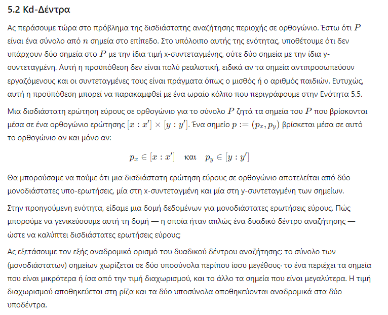
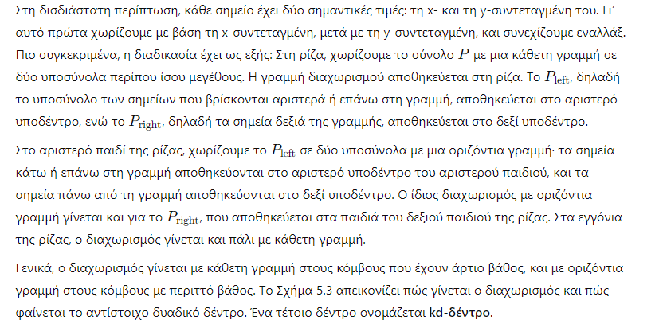
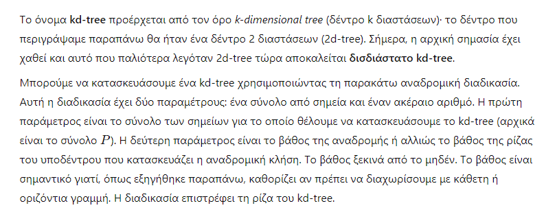
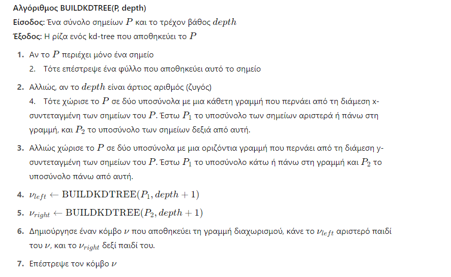
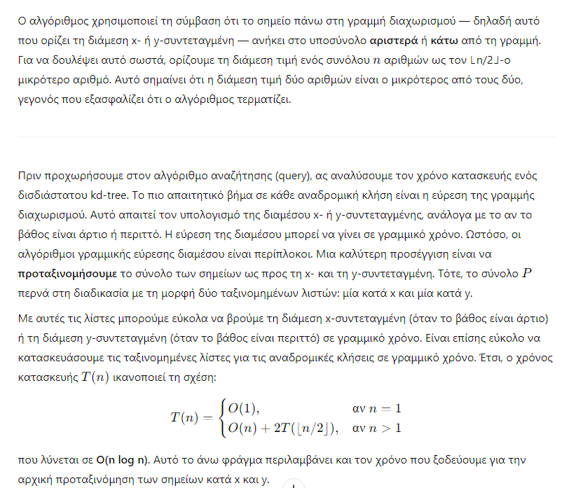
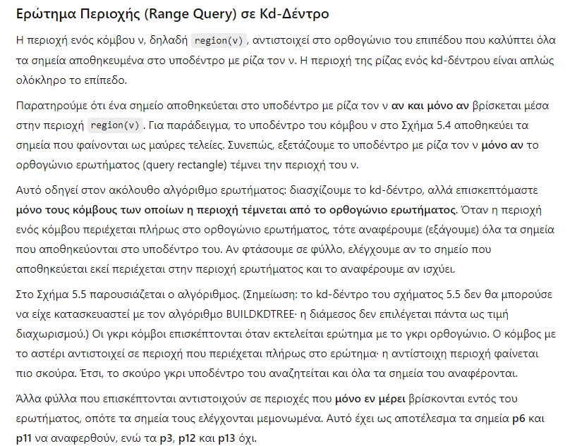
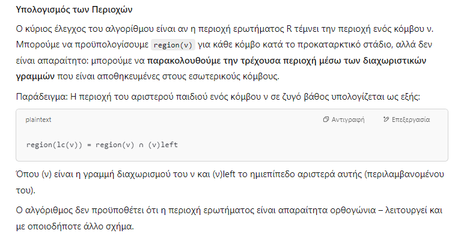
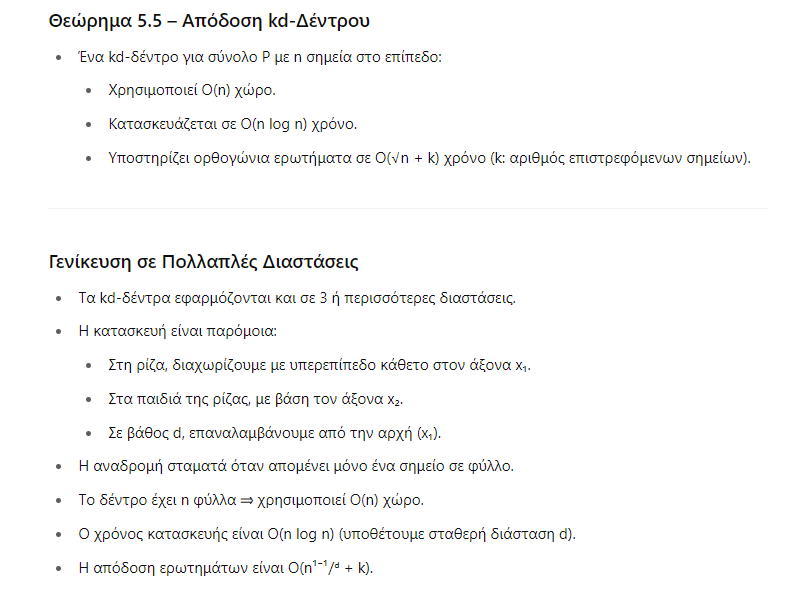

 

Αλγόριθμος SEARCHKDTREE(ν, R)
Είσοδος: Η ρίζα ενός (υπο)δέντρου kd-tree και μία περιοχή R
Έξοδος: Όλα τα σημεία κάτω από τον ν που βρίσκονται εντός της R

1. Αν ο ν είναι φύλλο

2. Αν το σημείο του ανήκει στην R, το αναφέρουμε.

3. Αλλιώς, αν region(lc(ν)) ⊆ R

4.   Τότε REPORTSUBTREE(lc(ν))

5. Αλλιώς, αν region(lc(ν)) τέμνει την R

6.   Τότε SEARCHKDTREE(lc(ν), R)

7. Αν region(rc(ν)) ⊆ R

8.   Τότε REPORTSUBTREE(rc(ν))

9. Αλλιώς, αν region(rc(ν)) τέμνει την R

10.   Τότε SEARCHKDTREE(rc(ν), R)

🔍 Τι είναι τα kd-trees;
Τα kd-trees είναι μια δομή δεδομένων που χρησιμοποιείται για να αποθηκεύουμε σημεία σε πολυδιάστατο χώρο (π.χ. 2D, 3D κ.λπ.) έτσι ώστε να μπορούμε να κάνουμε γρήγορες αναζητήσεις – κυρίως για ερωτήματα περιοχής (range queries), πλησιέστερου γείτονα, κ.λπ.

🛠️ Πώς κατασκευάζονται;
Ξεκινάς με ένα σύνολο σημείων (π.χ. σημεία στο επίπεδο με x και y).

Διαλέγεις ένα άξονα (x ή y εναλλάξ – δηλαδή εναλλάσσεται κάθε επίπεδο βάθους).

Διαχωρίζεις τα σημεία στη μέση με βάση τη διάμεσο της επιλεγμένης διάστασης.

Το σημείο της διαμέσου γίνεται κόμβος και τα υπόλοιπα πάνε σε δύο υποδέντρα (αριστερά/δεξιά ή πάνω/κάτω).

Επαναλαμβάνεις αναδρομικά για κάθε υποσύνολο, αλλάζοντας άξονα κάθε φορά.

Έτσι δημιουργείται ένα δυαδικό δέντρο, όπου κάθε κόμβος διαχωρίζει τον χώρο με μια γραμμή (σε 2D) ή υπερεπίπεδο (σε d διαστάσεις).

📦 Πώς αποθηκεύει τα σημεία;
Τα σημεία αποθηκεύονται στα φύλλα του δέντρου.

Κάθε εσωτερικός κόμβος περιέχει πληροφορία για το διαχωρισμό (σε ποια διάσταση, σε ποια τιμή).

🔎 Πώς γίνεται η αναζήτηση (range query);
Έστω ότι ψάχνεις όλα τα σημεία μέσα σε ένα ορθογώνιο ερωτήματος (π.χ. [x1, x2] × [y1, y2]):

Ξεκινάς από τη ρίζα.

Σε κάθε κόμβο:

Αν η περιοχή του κόμβου είναι τελείως εκτός του ερωτήματος → αγνοείται.

Αν η περιοχή είναι τελείως μέσα στο ερώτημα → αναφέρεις όλα τα σημεία στο υποδέντρο χωρίς άλλο έλεγχο.

Αν τέμνεται εν μέρει, συνεχίζεις αναδρομικά στα παιδιά και ελέγχεις τα σημεία.

💡 Η μαγεία εδώ είναι ότι αποφεύγεις να επισκεφτείς όλο το δέντρο, άρα εξοικονομείς χρόνο.

⏱️ Ποια είναι η απόδοση;
Κατασκευή: O(n log n)

Αναζήτηση περιοχής σε 2D: O(√n + k)
(όπου k τα σημεία που επιστρέφονται)

Γενικά σε d διαστάσεις: O(n^(1−1/d) + k)

📦 Πλεονεκτήματα:
Πολύ γρήγορο για εύρεση σημείων σε περιοχή.

Λειτουργεί σε πολλές διαστάσεις.

Χρησιμοποιεί O(n) χώρο.

⚠️ Περιορισμοί:
Δεν είναι καλό όταν τα δεδομένα αλλάζουν συχνά (π.χ. προσθήκες/διαγραφές).

Σε υψηλές διαστάσεις (π.χ. >10), η απόδοσή του χειροτερεύει (curse of dimensionality).